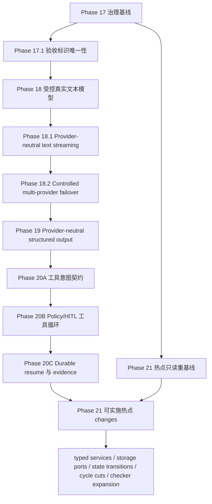

# Agent Harness Layer 架构演进长期计划

> 文档性质：living plan（持续更新的执行计划）
>
> 首次冻结：2026-07-27
>
> 当前状态：Phase 20开发前契约已获授权，三个串行关联change均为active/complete。34文件身份`d34bfef3…`先由Round 12 fresh Reviewer 1通过，再由fresh Reviewer 2/3并行独立复审；三人首末身份一致，均Stage 1/2 PASS、0 HIGH/0 MEDIUM/0 LOW。Strict 38/38、文档合同35 passed/1 skipped、diff check通过；本批次仅以一个范围化本地提交交付契约与状态记录。未进入实现、同步或归档；未push、发布、部署或调用真实provider/工具。
>
> 配套矩阵：[`architecture-evolution-change-matrix.md`](architecture-evolution-change-matrix.md)

本文是长期架构演进的执行与交接入口。它记录目标、依赖、进度、证据、风险、恢复方式和下一动作，但不把文档勾选、测试通过或 `openspec validate` 当作生产能力已经交付的证明。行为实现是否完成，仍以对应 OpenSpec 变更契约、代码、测试、fresh review 和归档状态共同判断。

## 1. Purpose

本计划把现有可运行的 P0 基线演进为可受控接入真实模型、可用既有事件通道输出 provider-neutral 增量文本、可扩展结构化输出和工具循环、且关键模块边界可以持续收窄的 Agent Harness Layer。演进遵循以下目标：

1. 不做大爆炸重构；先冻结原则和安全约束，再按窄 OpenSpec change 演进。
2. 任何真实 provider 副作用发生前，都已经形成不可由请求扩大权限的冻结路由计划，并完成预算、策略和审计前置判断。
3. 保留 fake/local profile 的离线可测试性；真实 provider 失败不得静默伪装成 fake 成功。
4. 让架构规则中可机械判断的部分进入 checker、contract test 或 CI，文档只解释意图、边界和例外审批方式。
5. 把 handoff 作为一级交付物。上下文压缩、换 Agent、换 session 或换 worktree 后，接手者能从当前磁盘事实恢复，而不是依赖聊天摘要。

## 2. Handoff Snapshot

### 2.1 当前快照

| 项目 | 当前事实 |
|---|---|
| 快照日期 | 2026-08-04 |
| 分支 | `develop` |
| 契约冻结基线 HEAD | `2f7691ba5f715b4ff42cd33ab0ea850de4936b97`；Phase 20 契约事务开始时工作树 clean，本批次交付提交的最终哈希以 Git 当前 HEAD 读取，不在自引用提交正文中固化 |
| 基线工作树 | 起点 clean；本批次只交付 Product/API/DEV/CHANGELOG、两份 living plan 与三个新 active change；不得把契约文件数冒充实现交付 |
| 当前 Git 事务 | 用户授权的一个 Phase 20 开发前契约本地提交与本状态记录原子交付；未push、发布或部署 |
| OpenSpec | 三个 active change 均已生成 proposal/specs/design/tasks 且 artifact status complete：`provider-neutral-tool-call-contract` → `policy-gated-tool-loop` → `durable-tool-loop-resume`；逐 change strict 和全量 strict 38/38 通过。fresh Reviewer 1先PASS，fresh Reviewer 2/3再并行PASS，三票均Stage 1/2、0 findings；未sync或archive |
| Phase 19契约准入审查身份 | 当前14 Requirements/74 Scenarios。身份`7754ef26b11fcba87f98f7d38a8fc869ec97c53edec057e2d4995850973c21a7`的fresh Reviewer 1/2/3均在同一内容上Stage 1/2 PASS、0 findings；旧契约身份只保留诊断历史 |
| Phase 19实现审查身份 | `phase19-freeze-v1`候选`de39eb0980f50ebae62e57f1781473a809dfd16931d3554868546802d5d1f6f6`；fresh Reviewer 1/2/3首末复算一致，均Stage 1/2 PASS、0 findings。审查后仅状态记录漂移按用户裁决豁免，不改变已审实现内容 |
| 已完成历史 | Phase 1-19 已归档；归档事实以 Git、`openspec list --json` 和归档目录为准 |
| 当前阶段 | Phase 20 开发前契约已冻结并完成`1+2`独立审查；本批次以范围化本地提交收口，生产实现为0 |
| 后两项预定生产行为 change | 20B/20C 只完成契约初稿，不构成并行实现授权；实现仍须 20A → 20B → 20C 串行，Phase 21等待20C归档后重基线 |
| 当前阻塞 | 无OpenSpec归档阻塞。`make acceptance-validate-check`因REQ-001 evidence commit/diff身份不匹配保持`BLOCKED`；真实provider授权前置缺失，completion/stream/failover均为零调用`hosted-unverified`。二者未伪造PASS，也不回滚已完成的本地同步归档 |
| 明确未做 | 未修改生产代码或测试、未执行工具循环、未运行真实provider/工具、未sync/archive、未push、发布或部署；未做structured streaming/fallback或Phase 21重构 |

`DEV-PLAN.md` 顶部保留 Phase 18.2本地提交与归档历史，并已同步Phase 19归档事实；后续 Agent 仍须按恢复顺序重新核对当前磁盘、Git 与 OpenSpec。

### 2.2 新 session 的最小恢复顺序

接手 Agent 必须按以下顺序恢复上下文；只读完成前不得创建 change 或修改实现：

1. 完整读取本文件和配套 change matrix。
2. 读取 `Product-Spec.md`，至少核对 REQ-004、REQ-012、REQ-014、REQ-022、REQ-024、REQ-025、REQ-026、非功能需求和当前 P0 完成定义；再读取 `DEV-PLAN.md` 的当前状态、阶段依赖、相关历史 Phase 和风险，并用后续 Git/OpenSpec 检查验证其时效性。
3. 执行 `git branch --show-current`、`git rev-parse HEAD`、`git status --short`，把结果与本快照比较；有漂移时先记录到“Surprises & Discoveries”。
4. 执行 `openspec list --json`。若存在 active change，完整读取其 `proposal.md`、`specs/**/*.md`、`design.md`、`tasks.md`、元数据和关联侧车文档，再对照矩阵确认依赖与文件所有权。
5. 读取当前磁盘上的相关源文件和测试；仓库存在 `.codegraph/` 时先用 CodeGraph 重建 symbol/call-path 事实，不用本计划中的旧行号代替当前源码。
6. 在本文件的 Progress、Decision Log、Surprises 与 Handoff Snapshot 中记录本 session 的起点，再开始获授权的工作。

如果以上任一步出现无法解释的差异，默认停在只读调查状态；不得为了让计划“看起来一致”而覆盖用户或其他 worktree 的改动。

## 3. 冻结基线

### 3.1 2026-07-27 基线证据

| 检查 | 结果 | 结论边界 |
|---|---|---|
| `git branch --show-current` | `develop` | 只证明核对时所在分支 |
| `git rev-parse HEAD` | `7bbbaa2407280f0e73813431510f955fb8f649fe` | 本计划的初始比较基线，不冻结未来 HEAD |
| `git status --short` | 无输出 | 只证明开始写文档前工作树 clean；并行文档写入后预期会变脏 |
| `openspec list --json` | `changes: []` | 核对时没有 active change，不代表未来 session 仍为空 |

### 3.2 当前实现事实

以下事实已在 2026-07-28 Phase 18 实现候选中重新校准；最终结论仍以本轮全量验证与 fresh review 为准：

- `packages/agent-harness/src/agent_harness/runtime/services.py::build_agent_execution_services` 始终注册显式 fake provider；只在 typed settings 存在 `openai-compatible` deployment 时注册 lazy `ControlledOpenAIClientFactory`/adapter blueprint，startup 不构造 SDK client。
- `packages/agent-harness/src/agent_harness/config/schemas.py::ModelSettings` 已能表达 deployment、credential、endpoint policy 与 model catalog；真实 route 通过 ref/version/digest 关联，secret value 排除序列化。
- `packages/agent-harness/src/agent_harness/config/settings.py::load_settings` 的实际合并顺序是 profile YAML → agent YAML → `.env` → secret file → direct process env → explicit overrides；`.env` 只消费 `AGENT_HARNESS_*`，`_FILE` 只允许来自进程环境。
- `ModelRequest.provider` 现在是可选相等断言，不能选择 provider；router 按 deployment → frozen Agent policy → request 求交集，真实 root 从完整 `budget-tree-v2` snapshot 恢复 canonical path/catalog/classifier/attempt policy。
- `AgentModelPolicy` 已增加 `deployment_id` 与 `allowed_models`，default/fallback 必须是其子集；scaffold 与五个模板 Agent 都显式使用 `fake_default`，默认离线不因未引用的真实 deployment 存在而升级路由。
- `PydanticAIModelProvider` 已使用 async `Agent.run()`、单一 total deadline、有界 retry 与 process-local Bulkhead；私有 transport 在 socket 前复核 origin/path/headers，并将不能证明完成状态的 timeout/cancel/响应归为 unknown。
- `ModelProvider` / `ModelRouter.execute` / `ModelInvocationService.complete` 当前只有一次性完整 response seam；模型生产路径只发布 request-started 与最终 usage evidence。虽然事件枚举已有 `model.output.delta` / `model.output.completed`，RUN-006 与 CLI 只读取已持久化事件，不能生产或恢复 provider stream。
- 当前 model usage operation 的 event-capacity binding 只覆盖固定 started/final prerequisite；streaming 若逐 SDK token 入 event 会突破副作用前有界预约不变量。Phase 18.1 必须先冻结最大 delta/coalescing、稳定 identity、跨 chunk 安全与 partial settlement。
- Phase 17.1 开始前，`Product-Spec.md` 与 `docs/acceptance-matrix.md` 各有两个语义不同的 `AC-070`，导致 policy 映射覆盖和 matrix validator 重号失败。当前 live 规格已保留 dependency lock `AC-070`，把 API docs 迁移为 `AC-089`，并新增全局唯一性门禁；历史归档保持不变。
- composition 仍存在字符串键 service locator，具体 `SQLAlchemyStorage` 依赖扩散，运行状态分支逐渐变厚，并已发现两个跨域语义强连通分量。这些是 Phase 21 的调查入口，不是尚未复核就可直接重构的结论。

## 4. 范围与非目标

### 4.1 长期范围

- Phase 17：治理基线与可执行架构约束。
- Phase 18：受控真实文本模型 runtime。
- Phase 18.1：provider-neutral 普通文本增量流，复用 CanonicalEvent / RUN-006 / CLI transport。
- Phase 18.2：受控跨 deployment/provider fallback，以有序 route chain、safe not-started 切换、逐候选预算/evidence 与恢复围栏扩展 Phase 18/18.1。
- Phase 19：provider-neutral structured output；不包含 structured streaming。
- Phase 20：经 `ToolRegistry`、`PolicyEngine` 与 HITL 的工具型模型循环。
- Phase 21：typed services、storage ports、显式状态转换和跨域 cycle 等热点 seam。
- 每个行为变化先形成窄 OpenSpec change；共享接口、共享验收或共享文件存在时，按关联 change 处理。

### 4.2 Phase 18.2 历史批次非目标

以下约束描述以`develop@4640217`为实现基线的 Phase 18.2 历史批次；该批次后来已完成、同步并归档，当时不做以下事项：

- 不夹带 structured output、tool loop、动态 provider discovery、健康权重、负载均衡、热重载控制面、Vault/KMS、依赖升级或无契约依据的大重构。
- 不改写任何 `openspec/changes/archive/` 历史事实，也不直接修改当时的主规格；Phase 18.2 对既有 Requirement 的兼容修订只写入 active change 的 `MODIFIED` delta，等待后来明确授权的 sync/archive。
- 不改写 `DEV-PLAN.md` 的 Phase 1-16 历史交付与证据；仅为避免历史快照冒充当前状态而补充明确的时间限定。
- 当时不commit/push、sync/archive、发布、部署或启动Phase19。由于缺双隔离真实credential/endpoint和受信not-started fixture，只运行零调用live preflight，不发起真实provider请求。

### 4.3 Phase 18 的硬性非目标

首个实现 change `controlled-real-model-runtime` 只交付受控真实文本生成。以下能力必须留在后续 change，不得以“顺手复用 SDK”为由夹带：

- structured output 或业务 schema 解析；
- model-driven tool call、tool loop、HITL resume；
- token/event streaming；该项不是无序后置，而是明确交给紧随其后的 Phase 18.1 `controlled-model-streaming`；
- 多 provider 自动故障切换；该能力已明确交给 Phase 18.2 `controlled-multi-provider-failover`，动态发现、健康权重、热重载控制面与大规模运维仍继续后置；
- Vault/KMS/完整 `SecretProvider` 平台；
- 业务 agent 直接接触 provider SDK 对象。

## 5. 冻结原则与配置边界

完整工程原则以 `docs/engineering-principles.md`、`docs/engineering-principles.zh-CN.md` 和 `CONTRIBUTING.md`、`CONTRIBUTING.zh-CN.md` 为维护入口。本计划只冻结与阶段执行直接相关的约束：

1. **请求只能缩权。** deployment policy 与 agent policy 先求交集；请求只能在交集中选择，不能添加 provider、model、capability、endpoint 或 credential。
2. **先冻结 route plan，再发生授权副作用。** route plan 至少包含 deployment identity、provider、model、capabilities、endpoint policy、price catalog identity 和超时/重试策略；随后才做预算预约、授权成功审计和 provider 调用。校验失败仍可记录去敏拒绝审计。
3. **secret 与普通配置分层。** 提交的 YAML 只允许非敏感默认、allowlist、credential reference 和安全策略；本地开发可从被忽略的 `.env` 注入秘密，服务部署使用 direct process env 或受控 `/run/secrets` 文件，三者都必须汇入同一 typed settings 与脱敏边界。
4. **`.env` 只是本地便利层。** 它必须保持 gitignored，只消费 `AGENT_HARNESS_*`，不等于 secret manager，也不允许触发 `_FILE` 读取。
5. **direct / file 冲突 fail closed。** 同一 secret 的 direct env 与对应 `_FILE` 同时存在时，在读取 provider、构造 client 或应用 overrides 前失败。
6. **endpoint 是安全边界。** `base_url` 通常不是秘密，但必须经过 HTTPS、host allowlist、credential-forwarding guard 校验；loopback 仅在显式 local policy 下例外，不能因字符串看起来像 localhost 就自动放行。
7. **timeout 必须分层。** connect、read、total timeout 分开表达；SDK/client 层负责实际 I/O 边界，线程池等待超时不能被宣传为已取消网络副作用。
8. **重试必须可解释。** 只重试被契约明确分类为安全的前置失败；调用结果未知时进入可追踪的 unknown/needs-review 路径，不能为了“提高成功率”盲目重复计费副作用。
9. **离线基线永久保留。** fake provider 是显式 profile/测试选择，不是真实 provider 失败时的静默 fallback。
10. **公开 DTO 不泄漏 SDK。** provider 原始 result、client、exception body、secret 或连接对象不得穿过 adapter、event、trace、audit、eval 或 checkpoint 边界。

## 6. 阶段 DAG



默认按图中的拓扑顺序执行。Phase 21 的只读 inventory 可以和前序实现的认知调查并行，但任何 Phase 21 写入都必须同时满足：前置行为 seam 已稳定、矩阵重新确认文件无冲突、没有共享验收、没有共享接口变更。仅仅“改的是不同函数”不构成并行证明。

## 7. 阶段计划与完成标准

### 7.1 Phase 17：治理基线与可执行架构约束

**目标**

- 把架构原则、贡献路径、长期计划、change 关系、session 更新和 handoff 规则放到仓库内。
- 将可机械判断的规则分配给后续 change 的 checker、contract test 或 CI；未实现 checker 的规则必须明确标为文档约束。
- 建立事实优先级：当前磁盘与 Git/OpenSpec 高于聊天摘要和陈旧状态块。

**交付与边界**

- 本文件与 `architecture-evolution-change-matrix.md`。
- `docs/engineering-principles.md`、`docs/engineering-principles.zh-CN.md`。
- `CONTRIBUTING.md`、`CONTRIBUTING.zh-CN.md`。
- 机械规则不单独抢占首个实现 change；由触及该边界的后续窄 change 同步补 checker/contract/CI，并在 tasks 中列出。

**退出门禁**

- 四类治理文档互相引用一致，没有把计划状态写成代码完成状态。
- 本计划与矩阵通过 Markdown 路径、结构和 `git diff --check` 自检。
- 未来第一条行为变更仍是 `controlled-real-model-runtime`。
- 对文档范围完成独立静态审查；如审查后有实质 diff，重新审查受影响内容。

**独立治理修复**

Phase 17.1 开始前的重复 `AC-070` 已由独立窄 change `acceptance-criteria-identity-uniqueness` 处理并归档，没有塞进真实模型 change，也没有改写历史归档材料。该治理修复不改变“首个生产行为实现 change 是 `controlled-real-model-runtime`”的决策；Phase 18 仍须获得用户明确授权后才能创建和实现。

**Codex 执行时间估计**

- 文档落盘、交叉核对与修订：4-8 小时；不含等待 reviewer 配额或用户裁决的时间。

### 7.2 Phase 18：`controlled-real-model-runtime`

**目标**

在保持 fake/local 离线路径的同时，让一个显式配置、显式授权的真实文本模型 deployment 通过 provider-neutral runtime 完成调用、预算结算、审计和错误收敛。

**配置契约至少包含**

- 稳定 `deployment_id` 与 `provider_kind`；
- deployment 级 allowed/default/fallback models；
- endpoint/base URL policy，包括 HTTPS、host allowlist、credential forwarding 和显式 loopback 例外；
- endpoint policy 绑定的可选 completion classifier identity；默认/官方 endpoint 未绑定时 response retry 集合为空；
- `credential_ref`，以及 direct env / `_FILE` 的受控解析；
- connect/read/total timeout；
- 有界 retry/backoff 和不可重试/结果未知分类；
- concurrency limit / bulkhead；
- 受信 model catalog reference/version/digest、request-shape、输入上界与 price source；deployment 只引用，不自证 envelope/价格；
- capability flags，首 change 只允许 text completion。

**路由与执行顺序**

1. 从 profile、agent descriptor 与 typed settings 解析 deployment。
2. 计算 deployment allowlist 与 agent allowlist 的交集。
3. 用请求进行缩权选择；任何扩大或未知值在零 provider 副作用时失败。
4. 通过受信 endpoint/model catalogs 冻结 `ModelRoutePlan`，包含 endpoint、credential ref identity、model catalog ref/version/digest、request-shape、输入上界/价格、completion classifier identity、capabilities、timeout/retry 与 model，并完成 prompt/output/strategy/price/公式等动态 hard eligibility；失败时 reservation/client/network 均为零。
5. 用 bound execution identity 执行 exact `PolicyCheck(action=model.invoke, resource=agent:<agent_id>:model)` 并由既有 `AuditService` 写 `policy.decision`。Deny 或等待既有 `policy_approval` checkpoint/ApprovalRecord 时 reservation/permit/client/mark/network 均为零；获批 continuation 必须验证全绑定、单次 lease并重新检查 hard route/catalog/current owner balance。
6. Policy 允许或有效审批 continuation 通过后，建立共享预算/settlement reservation，再取得 deployment Bulkhead permit；此时仍未构造真实 client、未写 durable mark、未联网。Policy audit 只证明原始 decision，不证明 provider 已开始。
7. 从 composition 注入的 lazy factory 获取或构造绑定 frozen route 的 client lease；构造不得联网，失败按 not-started 回滚 reservation/permit，mark/network delta 均为零。
8. Client lease 成功后提交 durable `side_effect_started`，最后 adapter send；重试复用同一 reservation/permit/client lease/mark。只有 endpoint policy/version 绑定受信 completion classifier 且 exact signal 为 not-started 时才允许 429/5xx response retry，否则 unknown/no-retry。
9. 归一化 text、usage、cost、latency、attempt 和错误 evidence，完成结算；原始 SDK 对象不外泄。

**关键兼容要求**

- 现有 fake tests、eval 和 local smoke 不需要真实 credential。
- 真实 provider 配置无效时 application startup fail closed；不能到第一次 run 才隐式猜配置。
- 真实 provider 失败不能自动切 fake。配置的 fallback 只能来自冻结 allowlist，并重新走预算/策略判断。
- provider smoke 必须显式 opt-in；缺本会话授权、opt-in、隔离 credential 或受信 endpoint 时记录 `hosted-unverified` 并保持零调用；仅在已授权且本地条件完整后发生外部网络/provider 阻断时记录 `external-blocked`。两者都不能伪造 PASS，默认离线 CI 以 skipped evidence 记录 hosted-unverified。
- 如果 total timeout 到达但 SDK 调用无法确认取消，状态必须表达副作用未知，并禁止自动重试。

**预计核心文件面**

- `packages/agent-harness/src/agent_harness/config/{schemas.py,settings.py,secret_files.py}`
- `packages/agent-harness/src/agent_harness/models/{providers.py,router.py,invocation.py}`
- `packages/agent-harness/src/agent_harness/adapters/models/pydantic_ai.py`
- `packages/agent-harness/src/agent_harness/runtime/services.py`
- `packages/agent-harness/src/agent_harness/registry/{descriptor.py,_loader.py,registry.py}`
- `packages/agent-harness/src/agent_harness/{scaffold_templates.py,_scaffold_support.py}` 与 `tests/contracts/test_agent_scaffold_validation_atomicity_contracts.py`
- `templates/service-app/configs/profiles/**`、`templates/service-app/agents/**/config.yaml`、`.env.example`
- 对应 contract/integration/smoke tests 与维护文档

**退出门禁**

- OpenSpec proposal/spec/design/tasks 严格校验通过，并经 fresh code-reviewer Stage 1/2 PASS 后才开始实现。
- 先有失败的配置、越权、endpoint、timeout/retry、预算和 adapter regression，再实现。
- `make quality`、相关 contract/integration tests、`make smoke-local` 通过；如果触及 service composition，再跑 `make smoke-service`。
- 至少一个真实 provider opt-in smoke 在四项前置齐全且另行授权时有去敏证据；任一前置缺失时唯一保持 hosted-unverified/CI skipped，条件齐全后发生外部阻断才记 external-blocked，均不据此宣称真实端到端已验证。
- 代码审查确认首 change 没有夹带 structured output、tool loop、streaming 或多 provider 运维。

**Codex 执行时间估计**

- 契约、实现、离线验证、修复与文档：20-32 小时。
- 真实 provider smoke：额外 1-3 小时墙钟时间，受 credential、网络、配额和 provider 服务状态影响；等待不计入 Codex 主动执行时间。

### 7.3 Phase 18.1：`controlled-model-streaming`

**目标**

在 Phase 18 已冻结的 deployment、route、budget、cancel 与 provider 生命周期上，增加 provider-neutral 普通文本增量 producer；所有客户端仍从 committed CanonicalEvent 读取，不新增 provider cursor、SDK resume token 或第二套 stream endpoint。

**冻结契约至少包含**

- 异步、可取消的 provider-neutral text stream protocol，以及 Pydantic AI / fake adapter 的 append-only fragment 与 final result 归一化；
- provider 副作用前固定的 stream operation kind、最大 delta 数、单片 envelope、chunk/coalescing 与 event-capacity reservation；
- 稳定 operation/attempt/chunk identity，以及 `started → delta* → output completed → usage updated → run terminal` 的 durable 顺序；
- `model.output.completed` 的最终长度、checksum 或 artifact reference，使 committed prefix 可验证；
- 跨 chunk 有状态的脱敏与输出安全；完整结果才能判断时，不得先公开 speculative delta；
- SSE/CLI reader 断线只停止读取；显式 run cancel/deadline 才传播 provider cancel；调用结果未知时保留 prefix/reservation、禁止 retry/fallback、零成本结算、假 completed 与提前 terminal；
- provider iterator、event commit 与 capacity consumption 的有界背压，以及 SQLite/PostgreSQL crash recovery；
- SSE 已有事件首 frame、provider 首 delta、首个 committed delta 和客户端收到 delta 的独立时延证据。

**非目标**

- structured streaming、reasoning 暴露、tool-call streaming、tool loop；
- WS、AG-UI / Vercel AI adapter、retention、provider failover、多订阅控制面；
- 让慢 SSE subscriber 直接拥有或取消 provider 生命周期。

**预计核心文件面**

- `models/{providers.py,router.py,invocation.py,_invocation_settlement.py,usage_events.py}`；
- `adapters/models/{pydantic_ai.py,fake.py}`；
- `events/{capacity.py,bus.py}`、`storage/{event_capacity_repositories.py,usage_evidence_repositories.py,evidence_repositories.py}`；
- local/PostgreSQL event sinks、runtime/service composition、`API-Contract.md` 与 model/capacity/recovery/SSE/CLI tests；
- 若现有 outbox 无法表达 stream progress，需先在 design 中证明 migration、并发、恢复和旧 binary 行为，不能暗中扩大 schema。

**退出门禁**

- Phase 17.1 与 Phase 18 均已验证、fresh review、同步并归档；`controlled-model-streaming` 的中文 proposal/spec/design/tasks 与先行 API/event contract 通过 strict + fresh Stage 1/2 review。
- AC-085 至 AC-088 先有 local/真实 PostgreSQL red contracts，再实现；未修复 AC identity 唯一性前不得写入假 acceptance mapping。
- 正常、跨 chunk secret、容量耗尽、storage 慢、显式取消/deadline、unknown、reader 断线/重连、crash recovery 与终态 fencing 全部有证据。
- 默认 fake/local/CI 不触网；真实 streaming smoke 也继承 Phase 18 的四前置状态机：缺本会话授权、opt-in、隔离 credential 或受信 endpoint 任一项时保持零调用并记录 hosted-unverified/CI skipped；仅在前置完整且已授权后发生网络、配额或 provider 故障时记录 external-blocked。
- fresh 实现审查确认没有夹带任何非目标；实质修订后重新从 Stage 1 审查。

**Codex 执行时间估计**

- 契约、实现、SQLite/PostgreSQL recovery、离线验证和 review/fix：20-30 小时。
- 若需要新 migration，冻结 design 后重新估算，当前保守区间 24-36 小时；真实 provider streaming smoke 另 1-3 小时墙钟，不含外部等待。

### 7.4 Phase 18.2：`controlled-multi-provider-failover`

**目标**

把 Phase 18 的同 deployment/provider 多模型候选扩展为有序 `(deployment_id, model_id)` route chain。每个候选独立绑定 provider kind、endpoint、credential、catalog、capability、timeout/retry、Bulkhead 和预算；只有当前候选从首次到末次的每个实际 attempt各自满足 `client_not_started`，或在保留 started/request/response历史下完整证明 `trusted_business_not_started`，且 proof已在下一同 route retry前按全局 attempt不可覆盖地耐久追加、没有悬空项时才推进；同候选内两类 proof可混合。调用级 claim、候选聚合状态与逐 attempt事实分层，支持同候选 retry及三候选的两类 proof任意先后顺序，不回退高水位、不重放已耐久记录的 provider attempt。无受信证明的 timeout/response、unknown、response identity、usage、文本或 delta都停止 failover。

**冻结契约至少包含**

- Agent policy 的 route refs schema、deployment∩Agent∩request 交集与不可变候选顺序；request 只能删减，不能新增或重排 provider/endpoint/credential/model。
- 全链 chain identity、候选 ordinal、每个候选的 endpoint/catalog/credential identity 与执行上界；reload 只影响新 root run。
- Composition root 的窄 provider factory/adapter registry 与 lazy client lease，候选之间不共享 secret、client、permit、Bulkhead、catalog 或 SDK 对象。
- 封闭的逐 attempt `client_not_started|trusted_business_not_started` proof records；后者必须由 endpoint-bound classifier、deployment显式状态白名单与零生成/计量事实共同证明，并保留 started/request/response单调历史。每次下一同 route retry前先耐久追加 proof；403默认不启用，同 route retry先于跨 provider；无受信证明的 response、异常字符串/body、write/read timeout/cancel和 unknown都不能授权跨 provider切换。
- 调用级 claim高水位、逐候选聚合 side-effect state与逐 attempt事实的分层，以及 proof append、逐候选 reservation耐久 release/transfer与下一 reservation原子建立；unknown、悬空或缺失/冲突 proof保留原 reservation，恢复不重放已耐久记录的 provider attempt。
- Route-chain/candidate proof records/逐 attempt request-response-usage-cost-latency/failover-reason evidence，以及 streaming首 delta后禁止 failover的共同围栏。

**非目标**

- 动态 discovery、健康权重、负载均衡、成本套利、热重载控制面、多区域运维和跨 provider 账单对账。
- Structured output/tool-call failover；分别由 Phase 19/20 的契约决定。
- Fake 作为真实 provider 失败后的静默尾项。

**退出门禁**

- Phase 18.1 已验证、fresh review、同步并归档；Phase 18.2 proposal/spec/design/tasks 与先行 API/config/evidence contract 通过 strict 和 fresh Stage 1/2 review。
- AC-090 至 AC-095 从公共 seam 建立红灯；两 provider doubles、SQLite/PostgreSQL recovery、预算竞争、streaming 首 delta 围栏和默认离线回归全部转绿。
- `make quality`、聚焦 contract/integration、`make test`、`make eval`、`make smoke-local`、触及 service composition 时的 `make smoke-service`、build/license/strict/diff checks 与 fresh 实现 `1+2` review 完整。
- 双真实 deployment smoke 只在用户另行授权、opt-in、两个隔离 credential refs 和受信 endpoints 齐全时运行；否则保持 hosted-unverified/external-blocked，不伪造 PASS。

**Codex 执行时间估计**

- 24-40 小时；若新增 provider-specific dependency 或 migration，design 冻结后重新估算。双真实 deployment smoke 另需 2-4 小时墙钟。

### 7.5 Phase 19：provider-neutral structured output

**目标**

在 Phase 18.2 已稳定的 deployment/route-chain/provider/invocation/result seam 上，增加 provider-neutral 的输出 schema、验证、失败分类和 evidence；业务 schema 不依赖 Pydantic AI result 类型。

**范围**

- 用稳定 schema reference / version 表达期望输出。
- 区分文本、结构化成功、schema invalid、provider capability unsupported 和结果未知。
- 把 provider-native structured output 适配到统一 DTO；必要的修复尝试有严格次数和成本边界。
- 保持 text-only 调用兼容，不能为了结构化输出重写 Phase 18 的安全路由顺序。

**非目标**

- 不执行工具；不把 tool call 当结构化业务输出。
- 不引入 streaming 增量 schema 拼装。

**退出门禁**

- change 只依赖 Phase 18.2 已归档的公开 seam；Phase 18.1 仅交付普通文本流、Phase 18.2 只交付普通文本 route-chain failover，不代表 structured streaming/failover 已存在。
- 多个 adapter 替身 contract tests 证明公共 DTO 不泄漏 SDK 类型。
- schema mismatch、repair exhaustion、预算不足和 unsupported capability 均在可追踪状态结束。

**Codex 执行时间估计**

- 16-28 小时。

### 7.6 Phase 20：受策略控制的工具型模型循环

Phase 20 不做成一个巨型 change，默认拆为三个串行 change：

1. **工具意图契约**：模型只能产生 provider-neutral tool intent；参数先做 schema 和来源校验，不执行工具。
2. **Policy/HITL 工具循环**：tool intent 必须经 `ToolRegistry` allowlist、`PolicyEngine`、审计和 HITL；危险动作在批准前无工具副作用。
3. **Durable resume 与 evidence**：冻结 loop/turn/tool-call identity，覆盖 checkpoint、resume、exact replay、未知执行、最大 turn/cost/token 边界和 terminal fencing。

**硬性顺序**

`model output → tool intent DTO → ToolRegistry resolve → policy/audit → optional approval/checkpoint → tool execution → result sanitization/truncation → context assembly → next model turn`

任何 adapter 都不能直接调用工具；任何恢复路径都不能跳过 registry/policy/HITL。工具结果按不可信输入重新进入 context assembly。

**退出门禁**

- 三个 change 各自 strict validation 和独立 review；因为共享 loop DTO、事件和验收，还需在实现前后做关联 change 联合审查。
- approval 前零工具副作用；exact replay 不重复执行工具或模型调用；unknown 不能自动伪装为可重试。
- turn、token、cost、工具输出大小和 wall-clock 均有显式上界。
- local fake/tool stub、contract、integration、checkpoint/resume 和 service smoke 证据完整。

**Codex 执行时间估计**

- 三个 change 合计 28-45 小时；真实 provider + 真实外部 tool 的可选 smoke 另计外部等待。

### 7.7 Phase 21：架构热点 seam

**目标**

在前序行为稳定后，用可回归验证的小 change 收窄结构热点，不把“更好看”当成验收：

- 用 typed execution services 替代字符串键 service locator，明确 executor 可见能力。
- 把核心用例对具体 `SQLAlchemyStorage` 的依赖收敛到最小 storage ports / UoW seam。
- 把变厚的 run state 分支收敛为显式、可穷举、可审计的状态转换。
- 对最新 CodeGraph 和源码确认的跨域语义 SCC 逐个切断；每次只切一个稳定 seam。
- 把已经稳定且可机械判断的层依赖、public/internal seam、vendor/ORM/config 规则按规则族逐步接入 checker、contract test 或 CI。

**执行约束**

- 先做只读重基线，记录 symbol、call path、测试覆盖和文件集；历史图只作线索。
- 结构 change 必须有行为等价 contract，不能借重构修改公开语义。
- typed services、storage ports、state transitions 默认串行，因为它们很可能共享 composition/runtime 文件。
- 两个 cycle cut 只有在最新证据证明无共享接口、验收、文件和顺序依赖时才可分 worktree 并行。

**退出门禁**

- 每个 change 的 blast radius、public seam、回滚点和等价性测试在 proposal/design 中明确。
- 机械 checker 能验证的新规则进入 `scripts/`、contract test 或 CI；规则尚不能可靠机械判断时保留为 review checklist，不写脆弱文本扫描冒充约束。
- 全量质量、contract/integration 与受影响 smoke 通过，fresh review 对架构收益和行为等价均 PASS。

**Codex 执行时间估计**

- 只读重基线 2-4 小时；首批五项窄 change 合计 50-90 小时。若最新依赖图与当前发现差异较大，先更新本计划再重新估算。

## 8. Progress

勾选只表示对应计划动作有证据完成，不表示其后的生产能力自动完成。每条完成项必须带日期；跨 session 更新时保留历史，不把旧项重写成新结论。

### Phase 17

- [x] 2026-07-27：用户通过 `/goal` 明确授权 Phase 17.1；在 `develop@4922784d0057`、clean worktree、无 active change 的基线上开始单 owner 串行治理。
- [x] 2026-07-27：完成 live/历史 `AC-070` inventory 与 Git 引入顺序核对；保留先出现的 dependency lock `AC-070`，将后出现的 API docs identity 迁移到未占用的 `AC-089`，归档材料保持不可变。
- [x] 2026-07-27：创建 `acceptance-criteria-identity-uniqueness`，完成中文 proposal/spec/design/tasks，并通过 `openspec validate acceptance-criteria-identity-uniqueness --type change --strict`。
- [x] 2026-07-27：首轮 fresh artifact review 完成；行为契约本身覆盖完整，但因 living plan、change matrix 与 `DEV-PLAN.md` 的授权、active change、strict 状态和唯一下一动作冲突，Stage 1 以 1 HIGH FAIL；未进入实现。
- [x] 2026-07-27：修复首轮状态真相冲突并重新 strict validation；第二轮 fresh artifact review 确认该 HIGH 已闭合，但发现 `test_dev_plan_reports_archived_uv_change` 的陈旧全局 active 状态断言未纳入 tasks，Stage 1 以 1 MEDIUM FAIL；未进入实现。
- [x] 2026-07-27：把 dependency 状态合同的 red-first 修订纳入 proposal/design/tasks/所有权并重新 strict validation；第三轮 fresh artifact review 确认任务闭环，但发现文档仍把已完成的修订和 strict 写成下一动作，Stage 1 以 1 MEDIUM FAIL；未进入实现。
- [x] 2026-07-27：将 Phase 16 的“无 active change”限定为当时归档快照，并把当前状态统一为修订与 strict 已完成。
- [x] 2026-07-27：第四轮 fresh artifact review 确认前三轮 findings 均闭合，但发现 change matrix 的 Phase 17 历史行仍保留“final review 后 amend”的陈旧待办，Stage 1 以 1 MEDIUM FAIL；未进入实现。
- [x] 2026-07-27：把 Phase 17 矩阵行改为已落入 `4922784d` 的历史终态，删除陈旧待办。
- [x] 2026-07-27：第五轮 fresh artifact review 完成，Stage 1/2 与 Spec/Standards 双轴 PASS，0 HIGH / 0 MEDIUM / 0 LOW；允许进入 TDD 红灯。
- [x] 2026-07-27：用户明确要求先提交文档再继续开发；提交范围仅含当前 Phase 17.1 状态文档与 OpenSpec artifacts，不 push。
- [x] 2026-07-27：用户授权后的范围/权限状态补丁使第五轮 verdict 失效；后续审查继续发现并修复 commit 权限冲突、Phase 17 旧范围、实现状态虚报和两处 DEV-PLAN 陈旧状态，未据旧 verdict 提交。
- [x] 2026-07-27：用户明确裁决状态类 artifact review finding 不再阻断开发；以 `owner-waived` 进入 TDD，不把该裁决写成 reviewer PASS，也未提交文档候选。
- [x] 2026-07-27：完成 tasks 1.1-1.3 红灯；同 REQ/跨 REQ 重号、`AC-089` producer/test/live 迁移共 5 项按预期红，陈旧 uv change 状态合同先红后收窄为只约束自身归档。
- [x] 2026-07-27：在分组前增加 Product Spec live AC 全局计数；保留 dependency lock `AC-070`，把 API docs 迁移为 `AC-089`，同步矩阵、required policy、changelog，并证明 archive 零 diff。
- [x] 2026-07-27：聚焦合同 PASS；`make quality` PASS；`make test` 为 `1352 passed, 223 skipped`。随后仅修订不合规注释并把 `AC-065/066` 原文移回矩阵已声明的 `REQ-022`，按用户要求不重跑全量，受影响 Ruff 与 validator 合同 PASS。
- [x] 2026-07-27：fresh 实现 review 对冻结代码与契约给出 Stage 1/2 PASS，0 HIGH、0 MEDIUM；唯一 LOW 为三处陈旧状态措辞，按用户授权只修状态文档，不重跑测试、不重开 review。
- [x] 2026-07-27：用户明确授权按正式门禁重生实现冻结 evidence；identity `8789075d…42d15` 下 18 个 CI producer gate 全部 PASS，`test-aggregate` 为 `1352 passed, 223 skipped`，direct validator 为 `98/98`，strict validation 与 `git diff --check` PASS。
- [x] 2026-07-27：随后只勾选 tasks 并同步 ready-to-archive 状态；owner 纠正“只改状态没必要再跑证据”，已停止第二轮刷新。被取消的刷新不作为证据，ready-to-archive 结论复用前述冻结结果。
- [x] 2026-07-28：用户明确选择同步并归档；将 delta 智能合并到 `dual-ci-acceptance-evidence` 主规格，逐段比较无差异后执行归档，目标为 `openspec/changes/archive/2026-07-28-acceptance-criteria-identity-uniqueness/`。
- [x] 2026-07-27：核对分支、HEAD、初始工作树和 OpenSpec active list。
- [x] 2026-07-27：读取当前 Product Spec、DEV-PLAN 相关范围及模型/config/runtime 关键源码。
- [x] 2026-07-27：创建长期计划与 change matrix，并写入 handoff 规则。
- [x] 2026-07-27：核对工程原则与贡献指南四份文件的最终路径、互链和语义一致性。
- [x] 2026-07-27：完成 Phase 17 文档 fresh 独立静态审查；首轮 3 MEDIUM + 1 LOW 已修订，冻结后 Stage 1/2 PASS。
- [x] 2026-07-27：完成无对话 fresh handoff 复原测试；修复陈旧 Phase 13 风险状态和 fake fallback/change identity 歧义后 PASS。
- [x] 2026-07-27：在主控独占范围内按当前 Git/OpenSpec 事实同步 `DEV-PLAN.md` 顶部状态与 Phase 17-21 索引，不改写 Phase 1-16 历史证据。
- [x] 按用户 `owner-waived` 的 artifact 状态门禁裁决，用 TDD 修复重复 `AC-070` 的规格/验收 identity；不把 waiver 记成 reviewer PASS。

### Phase 18

- [x] 2026-07-28：用户通过 `/goal` 明确授权 Phase 18；在 `develop@2502fe7b7d10`、clean worktree、无 active change 的基线上开始单 owner 串行恢复与契约起草。
- [x] 2026-07-28：创建 active change `controlled-real-model-runtime`，完成中文 proposal/spec/design/tasks 并通过 strict validation；这只证明契约可解析，不代表契约 review 或实现完成。
- [x] 2026-07-28：修复上一轮状态真相、live smoke 状态与 retry status 的 3 项 MEDIUM并重新 strict；随后 fresh Reviewer 1 发现 reservation/provider cap、provider identity、Phase 18.1 smoke 状态和 handoff 真相 1 HIGH / 3 MEDIUM，未进入 Stage 2。
- [x] 2026-07-28：补齐输入上界、output cap 强制、token/cost 公式、唯一 provider identity 和后继 smoke 状态，并同步当前 handoff；修订候选重新 strict validation PASS。
- [x] 2026-07-28：下一轮 fresh Reviewer 1 发现锁定 OpenAI SDK 仍检查 ambient identity/header env，且动态预算拒绝早于 client 构造与 startup 预构造 client 相冲突；Stage 1 以 2 HIGH FAIL，未进入 Stage 2。
- [x] 2026-07-28：改为不修改进程环境的私有 lazy client factory + 出站 header/origin allowlist transport；动态 hard eligibility 失败固定 reservation/client/network 三类计数为零，合法 route 在 reservation/permit 后才获取 client lease；修订候选重新 strict validation PASS。
- [x] 2026-07-28：下一轮 fresh Reviewer 1 发现跨 artifacts 未完整固定 client lease → 当时拟引入的独立授权记录顺序、`completion_observed=false` 缺少可信生产来源，且 change matrix 漏列 CLI/CI/lifecycle ownership；Stage 1 以 2 HIGH / 1 MEDIUM FAIL，未进入 Stage 2。
- [x] 2026-07-28：补入 endpoint policy 绑定的 `trusted_response_header_not_started/v1`、原始单值 header 判定与默认 endpoint 禁止 response retry；同步逐边界顺序、snapshot/evidence identity、冻结测试节点及 CLI/CI/lifecycle 所有权，修订候选重新 strict validation PASS。
- [x] 2026-07-28：下一轮 fresh Reviewer 1 确认行为契约已闭合，但发现矩阵/proposal 未精确列出 shared-budget、settlement helper、公共 exports 与独立 live-smoke 脚本；Stage 1 以 1 MEDIUM FAIL，未进入 Stage 2。
- [x] 2026-07-28：补齐 `runtime/shared_budget.py`、`models/_invocation_settlement.py`、config/model exports 与 `scripts/smoke_live_model.py` 的独占所有权，并明确现有 API/worker/eval caller 继续复用 `RuntimeComponents.close()`；若红灯要求修改入口或 repository，必须先扩充契约并重新 review。修订候选重新 strict validation PASS。
- [x] 2026-07-28：下一轮 fresh Reviewer 1 确认其余契约与所有权闭合，但 `adapters/models/fake.py` 未精确纳入 async provider 迁移范围；Stage 1 以 1 MEDIUM FAIL，未进入 Stage 2。
- [x] 2026-07-28：在 proposal/design/tasks/change matrix 与长期所有权规则中逐字补入 `adapters/models/fake.py`；修订候选重新 strict validation PASS。
- [x] 2026-07-28：下一轮 fresh Reviewer 1 发现 `openai` 尚未进入公共 banned vendor 集合，且 `contracts/boundaries.py`、`scripts/import_boundary_check.py` 与 checker regression 未纳入冻结所有权；Stage 1 以 1 HIGH FAIL，未进入 Stage 2。
- [x] 2026-07-28：把 vendor boundary 声明、通用 import checker 与 `test_vendor_boundary_doctor_contracts.py` 纳入 proposal/design/tasks/change matrix 和长期所有权，并要求先建立 `openai` 越界导入红灯；修订候选重新 strict validation PASS。
- [x] 2026-07-28：下一轮 fresh Reviewer 1 发现现有 boundary 按任意 `adapters`/`integrations` 路径片段放行，模板 app 或业务 Agent 可用误导性同名子目录绕过；Stage 1 以 1 HIGH FAIL，未进入 Stage 2。
- [x] 2026-07-28：把允许范围冻结为仓库相对前缀 `packages/agent-harness/src/agent_harness/adapters/`，明确当前没有额外 integration root，并在 spec/design/tasks 中要求模板 Agent `adapters` 与 template app `integrations` 伪造路径负向回归；修订候选重新 strict validation PASS。
- [x] 2026-07-28：下一轮 fresh Reviewer 1 发现生产 adapter 直接构造 `AsyncOpenAI`，但 `openai` 只作为传递依赖存在，且直接 dependency、lock 关系、license policy 与 build/license 验证未冻结；Stage 1 以 1 MEDIUM FAIL，未进入 Stage 2。
- [x] 2026-07-28：选择把当前 lock 已有 `openai==2.44.0` 提升为核心 `openai>=2.44.0,<3` 直接依赖，不改变 207 项 package identity；纳入 core pyproject、uv.lock、Apache-2.0 third-party policy、dependency/license contracts、`uv lock --check`、build 与 license gate。修订候选重新 strict validation PASS。
- [x] 2026-07-28：下一轮 fresh Reviewer 1 发现 ready-to-archive 验证未显式运行独立 `make eval`，且 durable mark 前取消的确定性回滚、`model.invocation_cancelled` 与 source link 未完整进入 OpenSpec；Stage 1 以 2 MEDIUM FAIL，未进入 Stage 2，Reviewer 2/3 未派发。
- [x] 补齐上述两项契约并重新 strict validation PASS，随后从新的 fresh Reviewer 1 重启全员通过的 `1+2` 门禁。
- [x] 2026-07-28：新一轮 Reviewer 1 Stage 1/2 PASS 后才并行派 Reviewer 2/3；Reviewer 3 Stage 1/2 PASS，但 Reviewer 2 因本 change 新增的 `API-Contract.md` 正文以 `Phase 18/18.1` 限定长期语义而以 1 MEDIUM Stage 2 FAIL，因此三人全员门禁未通过，未进入红灯或实现。
- [x] 将上述四处开发阶段标签改为稳定的受控真实非流式文本能力、`MOD-002` seam 与受控增量文本流契约措辞，并重新 strict validation PASS。
- [x] 2026-07-28：下一轮 fresh Reviewer 1 确认 API Contract 新增行已清除开发阶段叙事，但发现 `typed-config` 两处与 `agent-registry-model-context` 一处拟同步 requirement 仍用 `Phase 18` 限定稳定 strategy/classifier/provider identity；Stage 1 PASS、Stage 2 以 1 MEDIUM FAIL，Reviewer 2/3 未派发。
- [x] 将三处 delta requirement 改为受控真实非流式文本能力或 `MOD-002` seam 措辞，并重新 strict validation PASS。
- [x] 2026-07-28：下一轮 fresh Reviewer 1 在 Stage 1 PASS 后发现拟同步 budget snapshot requirement 仍写 `P0 delegation targets`；该优先级标签不是稳定协议/领域标识，Stage 2 以 1 MEDIUM FAIL，Reviewer 2/3 未派发。
- [x] 将 `P0 delegation targets` 改为稳定的单层 delegation targets 能力措辞；三份 delta 的 `P0/P1/Phase N` 扫描为空，重新 strict validation PASS。
- [x] 2026-07-28：下一轮 fresh Reviewer 1 发现每个 Agent config 新增必填 `deployment_id`/`allowed_models` 后，现有 `scaffold_templates.py` 仍生成旧字段，且 `_scaffold_support.py`、正式 Registry/离线运行回归及文件所有权未进入契约；Stage 1 以 1 MEDIUM FAIL，Reviewer 2/3 未派发。
- [x] 纳入 scaffold 生产生成器、验证支持与聚焦 contract，冻结 `fake_default`/`fake-scaffold`、正式 Registry 和离线 runtime 行为，并重新 strict validation PASS。
- [x] 2026-07-28：下一轮 fresh Reviewer 1 发现 `API-Contract.md` 的 `examples.basic` descriptor 仍使用 `fake_local`，与 canonical `fake_default` 冲突；同时 `DEV-PLAN.md` Phase 18 章节状态仍停在更早 `openai` 直接依赖审查轮次。Stage 1 以 2 MEDIUM FAIL，Reviewer 2/3 未派发。
- [x] 统一 API descriptor 为 `fake_default`，同步 DEV-PLAN Phase 18 章节状态，并重新 strict validation PASS。
- [x] 2026-07-28：尝试为上述冻结候选创建新的 fresh Reviewer 1，首次派发及三次 10 秒间隔重试均返回 `agent thread limit reached`；按容量门禁停止，不复用旧 reviewer、不派 Reviewer 2/3、不进入红灯或实现。
- [x] 2026-07-28：同一容量阻塞连续三个目标轮次复现；每轮均在首次失败后只做三次 10 秒间隔重试。按目标门禁将本目标标记为阻塞，保留当前契约候选，不把用户关于审查全票规则的纠正写入进化信号。
- [x] 2026-07-28：在新 session 重新核对 `develop@2502fe7b7d10`、唯一 active change、空进化队列、完整上游/契约原文与 CodeGraph 当前源码；上一 session 的容量阻塞仅保留为历史状态，本 session 从重冻结与 fresh Reviewer 1 重新开始。
- [x] 2026-07-28：fresh Reviewer 1 Stage 1 以 2 HIGH / 1 MEDIUM FAIL：执行顺序漏掉 reservation 前的 soft policy/fallback/approval、受信 endpoint policy/default catalog 来源未定义、`budget-tree-v2` 共用 storage validator 未纳入所有权；Stage 2 未执行，Reviewer 2/3 未派发，未进入红灯或实现。
- [x] 2026-07-28：按上游 REQ-012/BGT-001 修正 hard eligibility → soft policy/fallback/approval → reservation 顺序并新增零副作用红灯；新增 typed endpoint policy mapping、版本化只读 default catalog 与 unknown/mismatch fail-closed 节点；把 `_shared_budget_repository_records.py` 和共用 validator contract 纳入串行所有权。
- [x] 2026-07-28：第二轮 fresh Reviewer 1 Stage 1 以 2 HIGH / 2 MEDIUM FAIL：deployment 仍能自证模型输入上界/价格；approval 只有顺序文字而没有复用既有耐久 continuation 的正向合同；当时拟引入的独立授权记录无权威定义；change matrix 未逐文件列出全部冻结红灯。Stage 2 未执行，Reviewer 2/3 未派发。
- [x] 2026-07-28：新增受信 typed model catalog、canonical digest、cost-disabled null 语义与 `config/model_catalog.py` owner；把 exact PolicyCheck、`policy.decision` audit、既有 checkpoint/ApprovalRecord/resolution lease/ApprovalGrant/approved continuation 的完整绑定、hard balance 重检、单次调用与 replay fail-closed 写入 API/OpenSpec；删除执行链中的独立 provider authorization evidence，并逐项列明冻结测试文件。
- [x] 2026-07-28：第三轮 fresh Reviewer 1 Stage 1 以 1 HIGH / 2 MEDIUM FAIL：契约误写不存在的 `approval.requested`、client factory 场景标题仍暗示独立授权步骤、change matrix 当前下一动作停在第一轮。Stage 2 未执行，Reviewer 2/3 未派发。
- [x] 2026-07-28：将审批证据统一为现有 `approval.required|resolved`，把场景标题改为“不伪造 provider started”，同步矩阵下一动作；用户将本会话范围收窄为契约全员 review 后创建一次本地提交，TDD 红灯与生产实现移交新会话。
- [x] 2026-07-28：第四轮 fresh Reviewer 1 确认全部行为契约映射 PASS，但因 proposal/tasks/DEV/living plan/matrix 仍有旧“本轮不 commit”文字，与用户新授权的一次审后 scoped 契约提交冲突，Stage 1 以 1 HIGH FAIL；Stage 2 未执行，Reviewer 2/3 未派发。
- [x] 2026-07-28：统一授权边界：仅在契约严格 `1+2` 全员 Stage 1/2 PASS 后创建一次 scoped 本地契约提交；不授权红灯、生产实现、其他 commit、push、sync/archive、部署或真实 provider。
- [x] 2026-07-28：第五轮 fresh Reviewer 1 按用户裁决忽略不影响实现的旧提交状态措辞，只以 1 HIGH 指出 API Contract 把 route ref/version 概括为必填，却未为 cost-disabled 的 `price_source_ref/version=null` 声明例外；Stage 2 未执行，Reviewer 2/3 未派发。
- [x] 2026-07-28：统一 API/OpenSpec/design/tasks：cost enabled 时价格与非空 price-source identity 成组存在；cost disabled 时两项价格、price-source identity、静态/动态 cost bounds 与 cost reservation 成组为 null，token 维度继续执行。
- [x] 2026-07-28：第六轮 fresh Reviewer 1 确认第五轮 cost-disabled finding 已闭合，但以 1 HIGH 指出 async provider 协议迁移必然影响的 16 个既有同步 provider doubles / 直接 adapter callers 未进入精确测试文件所有权；Stage 2 未执行，Reviewer 2/3 未派发。
- [x] 2026-07-28：把 16 个既有测试逐文件纳入 proposal/design/tasks/change matrix 的单一 owner，固定 red-first 的 coroutine/await 迁移与原断言不得弱化；发现第 17 个必须修改文件时必须先补契约并重审。
- [x] 2026-07-28：第七轮 fresh Reviewer 1 发现现有同步 `ModelRouter.route()` 直接调用将迁为 async 的 `execute()`，且 `tests/contracts/test_agent_registry_router_model_contracts.py` 同步消费 route 返回值；这是已冻结 16 个文件之外的第 17 个确定性 caller，Stage 1 以 1 HIGH FAIL，Reviewer 2/3 未派发。
- [x] 2026-07-28：明确 `ModelRouter.route()` 一并成为只做 plan 后 `await execute()` 的 async wrapper，不允许同步桥接；把该 route caller 测试纳入第 17 个精确 owner 文件，发现第 18 个必须先补契约并重审。
- [x] 2026-07-28：新的 Reviewer 1 与随后单独完成的 Reviewer 2 均在冻结哈希上 Stage 1/2 PASS；Reviewer 3 因容量未能与 Reviewer 2 并行启动，首次派发及三次 10 秒重试均返回 `agent thread limit reached`，因此未提交。
- [x] 2026-07-28：用户重启且确认文件未改后，主 Agent 核对 branch/HEAD/worktree/OpenSpec 与 10 个哈希无漂移并直接派 fresh Reviewer 3；Reviewer 3 Stage 1 以 1 HIGH 发现 `tests/contracts/test_model_usage_provider_adapter_contracts.py` 依赖将删除的 `run_sync/_run_sync_with_timeout` seam，却未在 17 文件清单中，Stage 2 未执行。
- [x] 2026-07-28：用同步 adapter seam 静态扫描建立 red-capable ownership 回路，确认当前三份 Pydantic AI 同步 seam 测试中只有该文件漏列；补为第 18 个 owner，并冻结 async `Agent.run()`/deadline 迁移不得弱化 timeout secret 脱敏、成功 usage 持久化与 missing-usage 断言。实质 diff 后旧 reviewer verdict 失效。
- [x] 2026-07-28：契约后续严格 `1+2` review 全员 Stage 1/2 PASS，并以 `5d7c018` 独立冻结；本轮用户确认可直接 `openspec apply`，不重复契约审查。
- [x] 2026-07-28：新实现 session 完整读取长期计划、矩阵、Product Spec、DEV-PLAN、API Contract、工程原则、贡献规范与全部 change artifacts；校准 `develop@5d7c018`、clean worktree、唯一 active change、32 项待办和 strict 退出 0，先纠正滞后状态再写实现。
- [x] 2026-07-28：建立首组 config 公共 seam 红灯；`uv run pytest -q tests/contracts/test_controlled_real_model_config_contracts.py` 退出 2，因 `agent_harness.config.model_catalog` 尚不存在而在收集阶段失败，证明 typed model catalog/endpoint resolver 尚未交付。
- [x] 2026-07-28：完成 typed deployment/credential/endpoint/model catalog 与 direct/`_FILE` 冲突、ambient provider env 忽略和 secret 脱敏实现；同一 config 合同由收集红灯转为 6 项通过，后续补充的可执行配置片段合同同样通过。
- [x] 2026-07-28：建立 scaffold 公共 seam 红灯，正式 Registry/运行时因 fake catalog 路由缺失失败；补齐 `fake_default`/`fake-scaffold` 显式缩权与 `_scaffold_support.py` 验证后同一节点转绿。
- [x] 2026-07-28：建立 v2 恢复红灯；`test_controlled_real_model_budget_snapshot_contracts.py` 以缺 `canonical_base_url` 和 `plan_from_snapshot` 失败。随后完整冻结 canonical path、endpoint/catalog/classifier/attempt policy，并证明 reload 后旧 run 只从旧快照恢复。
- [x] 2026-07-28：建立可信 classifier transport 红灯；精确单值、重复、逗号合并、缺失和响应已有业务 evidence 五组均因 transport 尚无 classifier seam 失败。实现私有原始 header 分类、Retry-After/backoff/deadline 后同一五组转绿。
- [x] 2026-07-28：完成 async provider、immutable route、既有 Policy/HITL、共享预算/usage settlement、lazy Pydantic AI client、受控出站 transport、composition/lifecycle、默认离线与 CI live-smoke producer 的最小纵向闭环；新增完整 orchestrator 合同证明 v2 snapshot、policy audit、预算预约、evidence 和旧 path 恢复处于同一路径。
- [x] 2026-07-28：复核授权 live smoke 时发现原候选直接调用 router/adapter；已改为临时隔离的完整 `RunOrchestrator → policy audit → shared budget → invocation/evidence → provider` 路径。当前未授权，实际 `make smoke-live-model` 仍只允许零调用 `hosted-unverified`。
- [x] 2026-07-28：首次全量测试暴露 CI 新 producer 断言、durable mark 异常窗口、Python 3.14 `Literal` 缓存身份和 provider 失败兼容消息 5 项红灯；逐项修复后同节点转绿，完整 `make test` 为 `1394 passed, 224 skipped`、退出 0。
- [x] 2026-07-28：Phase 18 聚焦合同与关键回归为 `124 passed, 1 skipped`；`uv lock --check`、`make quality`、`make eval`、`make smoke-local`、`make build`、`make license-check`、live-smoke hosted-unverified、strict 与 diff 检查均退出 0。`make smoke-service` 已运行，但本机 Docker 凭据助手卡住，隔离配置重试仍在 image-build 失败，随后 daemon 只读查询无响应；按外部阻塞记录，不复用旧 service artifact。
- [x] 2026-07-28：AC-077/078/079/080/082/084 已按精确 production/test producer 证据勾选；AC-081/083 因未建立真实 provider completion 保持 `hosted-unverified`，没有用 double 或 skip 伪造外部 PASS。最终 fresh review 后 OpenSpec tasks 为 32/32。
- [x] 2026-07-28：首轮 fresh 实现 reviewer 在 Stage 1 以 HIGH 发现受控真实路径没有消费 Agent/deployment fallback，现有真实 fixtures 均为空 fallback；Stage 2 未执行，旧冻结 evidence/verdict 失效。
- [x] 2026-07-28：先增加 5 个受控 fallback 公共 seam 合同，原实现稳定复现 `5 failed`：默认 route 不切换、cost 阈值字段缺失、v2 target hard budget 不参与选择、无候选仍 `call`、损坏 fallback 公式被忽略。实现 Agent/deployment/request 交集、候选目录/价格/attempt bound 重算、hard/soft/approval 边界与安全 decision 后扩展为 `10 passed`；Phase 18 聚焦集、共享预算回归和 `make quality` 已再次退出 0。
- [x] 2026-07-28：Docker daemon 恢复后，`make smoke-service` 先后暴露 `postgres-budget-race` 与 `postgres-budget-topology`。前者先以公共 repository seam 复现 late `BudgetReservationRejected` 泄漏红灯并映射为稳定 `DelegationBudgetExceeded`；两个 service producer 的自定义 snapshot 标签则由静态合同锁定并改为仓储认可的 `budget-tree-v1:` 身份。聚焦回归 14 项通过，完整 `make smoke-service` 退出 0并输出 `workspace-outside=ok wheel-only=ok secret-cleanup=ok`。
- [x] 2026-07-28：用户选择 Phase 18 保持单 deployment/provider、跨 provider 后置，并提供 MiMo endpoint/primary/fallback/海外价格。live smoke wiring 的 fallback 空列表与显式 primary、非默认 secret root、授权控制键污染 typed settings、terminal failure 丢失已观察 provider evidence 四项均先形成红灯再修复。零网络 typed preflight 以 `$0.00001` hard limit 从 `mimo-v2.5-pro` 选择 `mimo-v2.5`，cost-aware 离线完整 orchestrator 同样 PASS。
- [x] 2026-07-28：授权真实入口第一次因控制键污染返回 `hosted-unverified` 且明确零调用；修复后的第二次在 terminal budget fencing 返回 fail，但旧异常分支无条件写 `provider_called=false`，无法证明是否已发 provider 请求。按证据边界把该次副作用记为 unknown，不记 PASS、不继续重试；修复后的 evidence 合同已转绿，真实成功仍需用户再次授权。
- [x] 修复 Pyright 指出的已收窄 Optional 冗余判断；首轮全量测试以静态合同仍匹配旧表达式复现 `1 failed, 1410 passed, 224 skipped`，把断言限定到同一 observed-response 分支并同时禁止 `provider_called=false` 后，目标合同、quality 与第二轮全量均转绿。
- [x] 重新运行当前 diff 的 Phase 18 聚焦集（`55 passed, 1 skipped`）、quality、全量 test（`1411 passed, 224 skipped`）、eval 11/11、local/service smoke、build、license、207 包 lock、strict 与 diff check，均退出 0；默认 live smoke 保持零调用 `hosted-unverified`。
- [x] 按 producer 依赖补齐实现冻结树的 CI evidence：先后纠正 install/build/integration、`ci-contract`、静态子 gate、unit-contract 的 hosted 隔离语义、release dry-run、local trace 与 license/service-log 顺序，最终 `acceptance-matrix: ok 107/107`。其后只同步状态和说明，按 D-028 不重跑全部 producer，也不把旧 artifact identity 冒充为当前 dirty diff 的新 identity。
- [x] 用户裁决：生产代码、测试断言、配置契约、CI/checker 逻辑等实质变更继续使受影响证据与 review 失效；纯状态记录、注释、docstring 或说明性文档只做 strict/diff/相关静态合同，复用最近一次冻结行为证据，不再为 dirty-diff 字节变化重跑十分钟级门禁。
- [x] 首轮最终 fresh review 发现 HTTP response attempt 状态、API 5.29 attempts/charge、total deadline 与 `.env` 动态冲突 2 HIGH/2 MEDIUM；按公共 seam 建立 12 个红灯并修复。后续 fresh review 指出的 retry durable settlement、completed/failed-without-usage 与 approval 当前余额测试真实性缺口也已补齐，受影响测试文件与相邻合同均转绿。
- [x] 修订后的 fresh reviewer 对完整冻结候选 Stage 1/2 PASS、0 findings；首次最终 `make test` 随后如实暴露 CFG-001 field path 与旧 partial-usage 断言 6 项兼容回归（`6 failed, 1412 passed, 224 skipped`），未把该轮写成 PASS。修复后 32 项受影响回归与 35 项相邻 Phase 18 合同通过，新的 fresh reviewer Stage 1/2 PASS、0 findings。
- [x] 真正冻结树的 `make quality`、`make test`（`1418 passed, 224 skipped in 640.41s`）与 `make smoke-service`（`workspace-outside=ok wheel-only=ok secret-cleanup=ok`）均退出 0；按 D-028，后续纯状态同步不重跑长门禁。
- [x] 同步 AC/tasks/living plan/matrix 为 `ready-to-archive`；不自动 sync/archive 或提交。
- [x] 用户复核发现上述状态把“单个 reviewer 的 Stage 1/2”误写成实现 `1+2` 全票；最终实质修订后实际只有 Reviewer 1 有效 PASS，因此撤回 `ready-to-archive`，任务回到 31/32，补派 Reviewer 2/3 前保持 `review-pending`。
- [x] 补派的 Reviewer 2 Stage 1 以 2 HIGH FAIL，Reviewer 3 Stage 1 以 3 HIGH/1 MEDIUM FAIL，均按门禁未进入 Stage 2：共同发现 service profile 可自行放行明文 loopback、ApprovalGrant 未绑定 durable approval/lease；Reviewer 3 另发现 transport 安全分类会被锁定 OpenAI/Pydantic AI 组合链包装为普通连接错误。任一 FAIL 使旧 reviewer verdict 全部失效。
- [x] 三个 HIGH 均先从公开 seam 复现红灯再修复：service loopback 原本不抛错；伪造 approval/lease、bound service 与 bool 旁路原本可到达 provider；真实 SDK 429 原本变成 `ModelAPIError: Connection error`。修复后配置合同 12 项、审批/伪造合同 16 项、完整受影响集合 56 项与 `make quality` 均退出 0；API Contract 状态漂移同时纠正。当前等待新的 Reviewer 1，不把修订前全量证据冒充当前冻结结论。
- [x] 新 Reviewer 1 又发现公开 Router 仍接受 `approved`、锁定 SDK `ReadTimeout` 丢失 unknown、任务 5.4 缺 invocation/router/provider 生命周期链和状态漂移。Router 签名先稳定红灯；真实 SDK read-timeout 先复现 `ModelAPIError: Request timed out`；lifecycle 先复现 `ModelInvocationService` 无 `aclose()`。修复后 durable approval 只在 invocation 内升级明确 soft gate、含糊 `RequestError` 保持 unknown 且 durable reservation/terminal fencing 成立、组合根通过 provider-neutral `aclose()` 关闭 client，并移除 executor map 中的 SDK factory。四个受影响合同文件 `44 passed`，quality、文档合同、strict 与 diff check 均退出 0；旧长门禁与旧 review 不复用。
- [x] 2026-07-28：重派 Reviewer 1 确认上述 Router/read-timeout/核心 lifecycle 已关闭，但 Stage 1 以 1 HIGH/1 MEDIUM FAIL：CLI 在一次 `asyncio.run(_run())` 创建/使用 async client 后，又在两个新 event loop 中关闭 execution services/storage，可能以 `Event loop is closed` 改写成功；另有 30/32、两次 MiMo 授权历史和最新窄证据的状态漂移。Stage 2 按门禁未执行，最终长门禁未运行。
- [x] CLI 生命周期先以公共命令源码合同稳定复现 `asyncio.run(` 计数 3 的红灯，再把执行抽为 `_execute()`，由唯一 `_run()` 顶层协程的 `finally` 在同一 event loop 中依次关闭 model services 与 storage；CLI/lifecycle 精确合同 2 项转绿。状态真相已统一为 30/32、一次零调用、一次 side-effect unknown；受影响合同 45 项、聚焦冻结合同 25 项、quality、OpenSpec strict 与 diff check 均退出 0，当前等待新的 Reviewer 1。
- [x] 2026-07-28：CLI 修订后的 fresh Reviewer 1 Stage 1 以 1 HIGH/2 MEDIUM FAIL：factory 只有完整构造后才登记 lease，SDK/provider/model/Agent 中途异常会泄漏 HTTP/SDK 资源；connect-before-send 缺锁定 SDK 测试；OpenSpec design 与主验收矩阵精确 producer 漂移。Stage 2 未执行，最终长门禁未运行。
- [x] factory 失败路径先在公开 `acquire()/aclose()` seam 复现两个 transport close 计数为 0 的红灯，再按构造进度把临时所有权封闭到 transport→HTTP client→AsyncOpenAI→完整 lease；四个构造阶段失败现在均关闭恰好一次、无 registry 残留、零 HTTP、零 secret 泄漏。ConnectError/ConnectTimeout 锁定 SDK 合同直接证明 not_started 有界重试；OpenSpec design 与主矩阵逐节点统一。受影响/文档映射 54 项、quality、strict 与 diff check 均退出 0，当前等待新的 Reviewer 1。
- [x] 2026-07-28：factory 修订后的 fresh Reviewer 1 Stage 1 以 1 HIGH FAIL：取消发生在 durable mark commit 已生效但 await 尚未返回的窗口时，`send_started=False` 会把它误判为 pre-mark 取消，按零用量释放 reservation；Stage 2 未执行，最终长门禁未运行。
- [x] 先用真实 storage 的公共 invocation seam 复现错误码为 `model.invocation_cancelled` 的红灯；首次把全部 `mark_in_progress` 都升级 unknown 会破坏真正 pre-mark 取消合同，因此改为由 settlement 层只在事务/commit await 内抛出 typed `DurableMarkStateUnknown`。两侧精确合同现同时通过：普通 pre-mark 取消回滚，事务内取消保留 reservation、ledger/claim needs_review、terminal fence 且 provider 不重放；AC-082 producer 已同步。
- [x] 2026-07-28：上述修订后的 fresh Reviewer 1 Stage 1/2 PASS、0 findings；按约定随后运行最终长门禁。`make test` 退出 2，仅 `test_approved_continuation_rechecks_current_parent_balance` 失败，其余 `1436 passed, 224 skipped`；失败发生在生产 durable approval/lease 校验处，证明旧测试手工构造的 grant 已不可达预算重检，而不是生产安全回归。
- [x] 仅修正该测试夹具：经 repository 公共 UoW 创建 waiting approval、领取 active resolution lease，再消费竞争预算；同一精确节点由红转绿，shared-budget 与 durable approval 相邻合同 `15 passed`。未放宽生产校验，按 D-028 不重跑 12 分 50 秒全量；测试实质修订使上一 Reviewer 1 verdict 失效，严格 `1+2` 从新的 Reviewer 1 重启。
- [x] 2026-07-28：新的 fresh Reviewer 1 对完整当前内容独立完成 Stage 1/2，结论 PASS、0 findings；确认授权夹具保持 soft waiting 零占额、真实 active lease、等待期竞争消费、approved hard balance 重检与零 provider 副作用，并放行剩余长门禁及并行 Reviewer 2/3。
- [x] Reviewer 1 放行后的 `uv lock --check`、`make eval`、`make smoke-local`、`make build`、`make license-check` 均退出 0：207 packages、11/11 approved eval、显式 fake 离线 1.779 秒、wheel/sdist/checksum 与 license policy 均通过。`make smoke-service` 首轮在 `shared-budget-crash-windows-not_started` 入口瞬态退出 2；daemon 与依赖健康且失败尚未进入 crash marker/claim 断言，热缓存后完整重跑退出 0并覆盖 not_started/started/result_committed 与后续恢复场景。两轮结果均保留，不抹去首轮失败。
- [x] 并行最终审查派发时 Reviewer 2 成功启动；Reviewer 3 首次派发及三次 10 秒间隔重试均返回 `agent thread limit reached`，按容量门禁停止，不复用旧 Reviewer 3。Reviewer 2 随后 Stage 1 以 1 HIGH FAIL：transport 会转发 SDK 已合并的 `Idempotency-Key`，而 ambient 测试使用无效 JSON，没有覆盖 openai 2.44.0 的换行 `Header: value` 解析；Stage 2 未执行。
- [x] 使用锁定 SDK 真实 `OPENAI_CUSTOM_HEADERS` 格式先复现 `ambient-fixed` 幂等头实际出站的红灯；当前 non-stream attempt seam 不产生 stable identity，故只删除 SDK/env 同名头，不引入投机身份。精确节点转绿，config/composition/offline 三组 29 项通过；typed Authorization、organization/project/custom/idempotency 隔离同时成立。生产与测试实质修订使此前 Reviewer 1 verdict 和剩余长门禁的当前性失效，审查链从 fresh Reviewer 1 重启。
- [x] ambient header 修复后的 `make quality` 首次只因新增测试格式退出 2；机械格式化同一文件、不改断言后重跑为 661 files、Ruff、Pyright 0、import boundary 全绿。`make smoke-local` 显式 fake 离线退出 0、1.795 秒；strict、双语文档合同与 diff check 均退出 0。按 D-028 不重跑未受该 header allowlist 影响的全量、eval、service、build 或 license 门禁。
- [x] ambient header 修复后的 fresh Reviewer 1 Stage 1 以 1 HIGH / 1 MEDIUM FAIL，Stage 2 未执行：`load_secret_file_env()` direct helper 的冲突异常 frame 仍保留 `raw_value/previous`，live smoke 对 429/5xx/read-timeout/unknown 等 provider 异常只保存 error code，导致 `provider_called=false`、`attempt_count=0` 的错误机器证据。
- [x] secret helper 先以冲突发生在其他 secret 前后两组 traceback frame 红灯证明原值可见，再在规范化循环结束后清除临时值；同节点 2 项及完整 safe-failure/offline/retry 相关 28 项通过。provider 失败继续封闭 raw exception，只新增校验后的安全 `provider_called/attempt_count/latency_ms`；公共 invocation 与 live-smoke `run()` 对重试后 429、retry exhausted、read-timeout/unknown 的动态合同均转绿。实质修订后旧 review 全部失效。
- [x] 五组受影响 config/composition/retry/offline 合同退出 0；`make quality` 先后如实暴露三个未格式化文件、一个 import order 和 public test seam/类型注解问题，机械格式化并将 smoke executor 命名为公开 `LiveSmokeExecutor` 后最终为 661 files、Ruff、Pyright 0、import boundary 全绿。双语/验收矩阵合同 `13 passed, 1 skipped`，fake `make smoke-local` 3.317 秒，change strict 与 `git diff --check` 均退出 0。按 D-028 不重跑未受影响的全量、eval、service、build、license，也不把旧全量写成 PASS。
- [x] 最新 fresh Reviewer 1 Stage 1 以 1 HIGH / 2 MEDIUM / 1 LOW FAIL，Stage 2 未执行：失败 settlement replay 只为 `model.provider_failed` 构造零值摘要并把其他稳定 provider error 改成 replay error；最后一次 429/503/connect 仍抛原始 provider failure；真实 provider 成功仍未建立；living plan/矩阵时间与下一动作漂移。
- [x] 先在公共 invocation/settlement seam 建立 6 个红灯，再让 durable failure 保存并恢复稳定 `error_code/provider_called/attempt_count/latency_ms`，相同 `usage_call_id` 不重放 provider；可重试 429/503/connect 达到 attempt 上限统一为 `model.provider_retry_exhausted`。同 6 项转绿，相邻 recovery/provider/invocation/invalid-result 27 项通过，六个聚焦合同文件整体退出 0。
- [x] 最新修订后的 `make quality` 首轮因 Pyright 发现 durable failure mapping 的 unknown 类型退出 2；窄化为 `dict[str, object]`/`list[object]` 后最终 661 files、Ruff、Pyright 0、import boundary 全绿。并行负载下首次 `make smoke-local` 因 fake 6.543 秒超过 5 秒退出 2，隔离重跑为 3.070 秒、退出 0；两次结果都保留。双语/验收矩阵合同 `13 passed, 1 skipped`，change strict 与 diff check 在状态同步后重跑。
- [x] 2026-07-28：上述修订后的 fresh Reviewer 1 静态 Stage 1 以 2 HIGH / 1 MEDIUM FAIL，Stage 2 未执行：bulkhead saturation 未纳入 durable failure replay 且矛盾 summary 会泄漏普通校验异常；`ModelRoutePlan` 的 decision/retry/bulkhead 仍可变；真实 MiMo completion 仍未建立。Reviewer 2/3 按门禁未启动。
- [x] 先从公共 route/invocation seam 建立 4 个红灯：decision 浅冻结、真实 queue saturation 第二次重放变 replay error、两种 `provider_called/attempt_count` 矛盾摘要分别泄漏 `ValueError` 或被接受。修复后同 4 项转绿；`ModelDecision`、`ModelRetryPolicy`、`ModelBulkheadPolicy` 深冻结，bulkhead 进入单一稳定失败集合，矛盾摘要统一 `UsageInvocationReplayError`，provider 零重放。
- [x] 7 个受影响 routing/retry/recovery/provider/invocation/invalid-result/offline 合同文件共 78 项退出 0。`make quality` 首轮因新增测试格式退出 2，格式化后第二轮因 5 处 typed policy 构造 Pyright 错误退出 2；显式构造 typed DTO 后最终 661 files、Ruff、Pyright 0、import boundary 全绿。状态文档、OpenSpec 与 AC 映射随后同步，长全量不按 D-028 重跑。
- [x] 2026-07-28：再次启动的 fresh Reviewer 1 确认 bulkhead durable replay 与 route plan 深冻结两个 HIGH 已修复，但以 1 HIGH 阻断 Stage 1、Stage 2 未执行：`_replayed_response()` 在稳定 error identity 前读取 response，使持久化冲突记录可返回伪造成功；畸形 response 还会泄漏 Pydantic `ValidationError`，failure 多余字段也未 fail closed。Reviewer 2/3 按门禁未启动。
- [x] 扩展同一公共 invocation 重放节点覆盖缺失 failure、稳定 error + 合法 response、畸形 response + 缺 failure、failure 多余字段、非法 latency 与 call/attempt 矛盾；RED 为 `3 failed, 3 passed`，GREEN 为 `6 passed`。生产重放改为稳定 error identity 先分流、failure exact 四字段、Pydantic 校验异常统一 replay error；provider 调用数保持 1。相邻重放 13 项、7 个受影响合同文件 82 项及 `make quality` 均退出 0；状态文档、OpenSpec 与 AC 映射随后同步，长全量继续按 D-028 不重跑。
- [x] 2026-07-28：上述修订后的 fresh Reviewer 1 Stage 1 以 1 HIGH FAIL，Stage 2 未执行：`_resume_existing_settlement()` 会在验证稳定 failure/response 前发布 final 并标记 `published`，`recover_pending()` 只解析 evidence/outcome，损坏结果可先发布，缺失/畸形字段则泄漏 `KeyError`/Pydantic 错误。Reviewer 2/3 按门禁未启动。
- [x] 公开 `complete()`/`recover_pending()` seam 先稳定复现 `10 failed, 2 passed`：合法稳定失败两入口可恢复，其余 conflict、missing/malformed evidence、missing/malformed outcome 均违反统一 replay error 或零发布/零状态推进断言。生产引入单一 `_validated_settlement_result()`，在 final event、telemetry 与 `mark_published` 前完整校验 evidence/outcome/failure/response；同组 GREEN `12 passed`，恢复+重试相邻合同通过，7 个受影响合同文件 `94 passed`，`make quality` 为 661 files、Ruff/Pyright/import boundary 全绿。长全量按 D-028 不重跑。
- [x] 2026-07-28：新的 fresh Reviewer 1 确认发布前 settlement HIGH 已关闭，但 Stage 1 以 1 HIGH 发现受控真实 deployment 已加载而调用方漏传 Agent policy 时，公开 `plan()`/`route()` 会落入 `_plan_legacy_fake()`；Stage 2 未执行，Reviewer 2/3 未启动。
- [x] 两个公开 Router 入口先稳定复现 RED `2 failed`，再在受控真实配置存在且 policy 缺失时统一抛出 `model.route_not_allowed`；同节点 GREEN `2 passed`，routing/offline/registry 相邻合同 `29 passed`，`make quality` 为 661 files、Ruff/Pyright/import boundary 全绿。没有受控真实配置的显式 fake legacy 回归保持通过；长全量按 D-028 不重跑。
- [x] 2026-07-28：Router 修订后的 fresh Reviewer 1 Stage 1 PASS，确认 settlement 发布边界、缺 Agent policy 的 fail-closed 路由及 AC-077 至 AC-084 行为真相闭合；Stage 2 因四个生产 façade 与三个大合同文件同时容纳多个独立变化轴，以 2 MEDIUM FAIL，Reviewer 2/3 未启动。
- [x] 按 D-039 只抽离私有 current/snapshot planner、client factory、execution/evidence、settlement validation/publication seam，并把 retry/settlement/replay/deadline/order 合同按回归族拆分；首轮聚焦回归如实暴露 mixin MRO 选择抽象实现和 monkeypatch 仍指向旧 owner 两项纯移动错误。修复后同一 8 文件共 `80 passed`、`make quality` 为 676 files且 Ruff/Pyright/import boundary 全绿；节点 producer、strict、双语/验收矩阵合同与 diff check 同步退出 0，公共 façade、DTO、错误、调用顺序和 hosted-unverified 边界不变。实质修订使旧 verdict 失效，严格 `1+2` 从新的 Reviewer 1 重启。
- [x] 2026-07-28：新的 fresh Reviewer 1 确认 Stage 1 PASS；Stage 2 以 2 MEDIUM 指出 `runtime/shared_budget.py` 同时承担快照/身份/恢复投影，以及 `test_model_usage_recovery_contracts.py` 混合耐久失败、审批隔离、发布恢复、确认丢失/容量和 unknown terminal 五类回归。Reviewer 2/3 未启动。
- [x] 以公开 façade 必须只有单一委派语句的结构合同先得到 `1 failed`，再抽离 `_shared_budget_{common,snapshot,identity,recovery}.py`，保留公开类、签名、unbound 恢复投影和旧 `_registry` 测试夹具兼容；同一结构节点转为 3 项全绿。原 749 行恢复合同拆为 324 行耐久失败文件、四个独立回归文件和共享 durable run support，18 项原节点全绿；shared-budget/Phase 18 受影响 55 项、`make quality`（685 files）、`make build`、wheel/sdist 新模块枚举与 wheel 直读导入均退出 0。实质修订后严格 `1+2` 从新的 Reviewer 1 重启。
- [x] Docker 外部应用授权恢复后，以当前 shared-budget 拆分候选重跑 `make smoke-service`；PostgreSQL/Redis/API/worker、崩溃恢复与 doctor 场景完整退出 0，根脚本输出 `workspace-outside=ok wheel-only=ok secret-cleanup=ok`，未触发真实 provider。
- [x] 2026-07-28：shared-budget/恢复合同拆分后的 fresh Reviewer 1 冻结身份一致，但 Stage 1 以 1 HIGH 发现稳定 failure 四字段只做内部校验，未与已解析 evidence 的 `provider_called/attempts/latency_ms` 交叉校验；Stage 2 未执行，Reviewer 2/3 未启动。
- [x] 在原公开 `complete()` 与 `recover_pending()` 发布前校验节点加入三类交叉矛盾，旧实现稳定得到 `6 failed, 10 passed`；单一 settlement validator 要求 failure 与 evidence 的调用标志、attempt 数和 latency 逐值相等后，同节点 `16 passed`，恢复/重放/结算相邻合同 `42 passed`。`make quality`（685 files）与 `make build` 均退出 0；实质修订后从新的 fresh Reviewer 1 重启。
- [x] 2026-07-28：职责拆分后的 fresh Reviewer 1 Stage 1 以 2 HIGH / 1 MEDIUM FAIL，按门禁未进入 Stage 2：派发的 `git diff --binary` 摘要未覆盖 28 个 untracked 候选；现存 build artifact 属于旧输入且缺少 9 个新私有模块；主验收矩阵 AC-080 至 AC-082 只列 façade、未展开真实 owner。Reviewer 2/3 未启动。
- [x] 冻结身份改为 tracked binary diff 与排序后的 untracked path/content digest 的组合摘要；`make build` 重建 wheel/sdist 后逐一确认 9 个模块都在，两类产物的 façade 直读导入通过。矩阵增加 Phase 18 私有 owner 精确展开。另从结构 seam 建立 MRO RED `1 failed`，把 evidence 作为 publication 的唯一线性基类并删除 `...`/`NotImplementedError` 同名占位后 GREEN `1 passed`；同一 8 文件行为回归继续退出 0。首次 `make quality` 如实因一个移动后未使用 `Any` import 退出 2，删除后重跑为 676 files、Ruff/Pyright/import boundary 全绿。
- [x] 2026-07-28：修复候选完成轻量门禁后派新的 fresh Reviewer 1；首次派发及随后 3 次 10 秒间隔重试均返回 `agent thread limit reached`。按容量门禁停止，不复用旧 reviewer、不派 Reviewer 2/3、不写 `.agents/.needs-review=clean`，下一会话从组合摘要复核后重派 Reviewer 1。
- [x] 2026-07-28：容量恢复后的 fresh Reviewer 1 确认 failure/evidence 的 `provider_called/attempt_count/latency_ms` 交叉校验已闭合，但 Stage 1 以 1 HIGH 指出 validator 只检查 attempts 为列表及其长度，仍会接受同数量的缺字段、ordinal/charge 矛盾和畸形 budget charge；Stage 2 未执行，Reviewer 2/3 未启动。
- [x] 在公开 `complete()`/`recover_pending()` 节点加入缺字段、ordinal、attempt charge、budget schema/status 五类损坏，先得到 `10 failed`；再补 strict boolean 两入口 `2 failed`。生产复用 `ModelAttemptEvidence`，新增私有 typed charge DTO，并校验封闭字段、连续 ordinal、side-effect/usage/cost/charge 组合、未决列表、route reservation 上界及顶层 usage/cost 对账；同 12 项转绿，四个受影响合同文件共 56 项、`make quality`（686 files）与 `make build` 均退出 0。实质修订后严格 `1+2` 从新的 Reviewer 1 重启。
- [x] 2026-07-28：新的 fresh Reviewer 1 Stage 1 以 2 HIGH / 1 MEDIUM FAIL，Stage 2 未执行：成功 settlement 没有调用嵌套校验；嵌套证据出现时 route/reservation 可缺失或伪造；验证表仍写 685 files。先在成功 `complete()`/`recover_pending()` 公共节点得到 `14 failed`，证明损坏记录越过 validator 后才在发布冲突；再引入 exact typed route DTO，并把 route/attempt/charge 校验提升到所有 outcome 的统一发布前入口。扩展 provider/model identity 后同文件 18 个损坏节点和 1 个合法 published 重放节点全绿，完整文件 30 项、settlement/recovery 受影响集合 50 项及 `make quality`（686 files）退出 0。实质修订后严格 `1+2` 从新的 Reviewer 1 重启。
- [x] 2026-07-28：下一轮 fresh Reviewer 1 Stage 1 以 2 HIGH / 1 MEDIUM FAIL，Stage 2 未执行：completed 缺失/冲突 response 仍可先发布；final route 只自洽而未绑定 durable started route，classifier 为空也可声明 response retry；living plan 顶部仍是上一轮。新增 response shape、provider/model、endpoint/catalog/deployment/credential/origin identity 与 classifier/retry 共 11 类 complete/recover 损坏，先得到 `22 failed`；生产统一解析 started/final evidence，封闭 outcome/error/failure/response 组合，要求 final route 逐字段匹配 started route并校验 classifier/retry。相同 22 项转绿，完整 replay 文件收集 52 项、usage/recovery 五文件收集 96 项的执行与 `make quality`（686 files）通过。实质修订后严格 `1+2` 从新的 Reviewer 1 重启。
- [x] 2026-07-28：下一轮 fresh Reviewer 1 Stage 1 以 1 HIGH FAIL，Stage 2 未执行：受控真实结果若把 route/attempts/budget charge 三项同时删除或置 null，会在 route/started-anchor 前误走 legacy 兼容。新增同时缺失、显式 null、provider-called 但零 attempts 的 complete/recover 场景先得到 `6 failed`；生产从可信 started route 或真实 final 调用事实识别受控记录，强制三项成组且 provider-called 至少一个 attempt。首次五文件受影响执行如实暴露 bulkhead 的 started 计划调用与 final 零调用不应逐值绑定；收窄为只绑定 route 并保留 final attempt 事实后，6 项和 bulkhead 精确节点转绿，完整 replay 收集 58 项、五文件收集 102 项的执行及 `make quality`（686 files）通过。实质修订后严格 `1+2` 从新的 Reviewer 1 重启。
- [x] 2026-07-28：旧 Reviewer 3 对修复前模块给出的 SDK 异常传播、审批伪造与 service HTTP 三项 HIGH 已由当前代码及 11 个聚焦断言证明闭合，不能充当当前 verdict；当前 Reviewer 2 另发现 percent-encoded 父级 dot-segment 可越过 startup normalizer，Stage 1 以 1 HIGH FAIL、Stage 2 未执行。`load_settings()` 公共 seam 的 4 个编码变体先得到 `4 failed`，随后拒绝编码 dot/slash/backslash 结构字符、`%25` 二次编码入口及原始 dot segment，同节点 `4 passed`，配置/组合根/retry 三文件 `37 passed`、`make quality`（686 files）均退出 0。实质修订后严格 `1+2` 从新的 Reviewer 1 重启。
- [x] 2026-07-28：编码 dot-segment 修订后的 fresh Reviewer 1、Reviewer 2、Reviewer 3 在冻结 tracked `c39614ad...`、38 个 untracked、manifest `74afe7b0...` 上分别完成 Stage 1/2 PASS，均为 0 findings；严格 `1+2` 全票闭合。状态同步为 32/32、`ready-to-archive`，AC-081/083 继续 hosted-unverified，不自动 sync/archive。
- [x] 2026-07-29：用户明确选择“先同步主规格再归档”。按 requirement title 将 3 个 MODIFIED 与 12 个 ADDED requirement 同步到 `agent-registry-model-context`、`model-usage-evidence`、`typed-config` 主规格；同步后 `openspec validate --all --strict` 为 33/33，delta/main block compare 为 missing 0、drift 0，随后归档到 `openspec/changes/archive/2026-07-29-controlled-real-model-runtime/`。该生命周期/说明文档收口不重跑十分钟级行为门禁，AC-081/083 继续 hosted-unverified。

### Phase 18.1

- [x] 2026-07-29：Phase 18 归档后用户通过 `/goal` 明确授权 Phase 18.1；已创建唯一 active change `controlled-model-streaming`，保持单一 worktree、单一写 owner。
- [x] 已先更新 `API-Contract.md` 5.9.1 MOD-004，并完成中文 proposal、六组 delta specs、design 与 tasks；`openspec validate controlled-model-streaming --type change --strict` 通过，`openspec validate --all --strict` 为 33/33。
- [x] 2026-07-29：前四轮 fresh review 的 usage identity、live evidence、zero-buffer 背压、provider-neutral close usage、路径、not-started durable 取消窗口、`ModelResponse.output_text` 与当时状态 finding 已逐项修订；旧 FAIL 只作历史证据，不构成通过。
- [x] 第五轮 fresh review 以 2 HIGH / 1 MEDIUM 阻断 Stage 1；已补齐 `build_execution_context()` → `BoundModelInvocationService.stream/stream_approved` 的可信普通/审批入口，统一 DEV-PLAN/living plan/change matrix 当前事实，并逐路径冻结生产、测试、live script、Make/双 CI 与验收 producer。修订后的 change/all strict 为 33/33，diff check PASS。
- [x] 第六轮 fresh review 以 1 HIGH 指出 `events/local_capacity.py` 与 `events/sinks/postgresql.py` 是原子 stream 绑定/容量消费的必改 owner；Stage 2 按门禁未执行，旧 strict 不能推翻 finding。
- [x] 两个 sink 已同步补入 design、AC-085/086 producer、tasks、API、DEV 与 change matrix；修订后的 change/all strict 为 33/33，diff check PASS。
- [x] 第七轮 fresh review 确认 sink owner finding 已闭合，但以 Handoff Snapshot 漏列 `DEV-PLAN.md`、strict 证据轮次陈旧的 1 MEDIUM 阻断 Stage 1；Stage 2 未执行。
- [x] 已修正 dirty 范围与第六轮证据归属；第七轮 finding 修正后的 change/all strict 为 33/33，diff check PASS。
- [x] 第八轮 fresh review 以 CI manifest/pipeline contract owner 遗漏的 1 MEDIUM 阻断 Stage 1；Stage 2 未执行。
- [x] 已补齐两个 CI owner 与 `acceptance-validate` needs/artifact；第八轮 finding 修正后的 change/all strict 为 33/33，diff check PASS。
- [x] 第九轮 fresh review 以 Handoff Snapshot 同时残留第七/第八轮当前证据的 1 MEDIUM 阻断 Stage 1；Stage 2 未执行。当前快照改用“最新 findings 修正后”的稳定状态，具体轮次只留在 Progress。
- [x] 第十轮 fresh review 以 `_router_current.py`、`_router_snapshot.py`、`_settlement_evidence_validation.py` 未纳入 `text_stream` 精确 owner 和 producer 的 1 HIGH 阻断 Stage 1；Stage 2 未执行。
- [x] 已用 CodeGraph 复核三个硬编码 `text_completion` 的真实 blast radius，并把当前路由、快照恢复、结算/重放/恢复 validator 与独立 routing contract 写回 proposal/design/tasks/DEV-PLAN/change matrix；修订后的 change/all strict 为 33/33、diff check PASS。
- [x] 第十一轮 fresh 契约 reviewer 对最新冻结 artifacts 完成 Stage 1/2 PASS、0 findings；该单一 change 的实现前门禁解除。早先 FAIL 轮次不叠加冒充 `1+2`。
- [x] 以 public provider/router/bound invocation/CanonicalEvent/repository seam 建立 red contracts，再串行实现 provider-neutral stream producer、65 槽 reservation、跨块安全、unknown/partial fencing、恢复、Pydantic AI/fake adapter 与独立 live smoke；补充缺失/重复 final、SDK context exit 失败和 SDK import boundary 回归。
- [x] 完成聚焦、相邻、quality、eval、local/service smoke、build、license、strict、SQLite 与临时真实 PostgreSQL 16 验证；全量 pytest 修复两个残缺 completed-recovery 夹具后仅保留高负载 AC-065 fake smoke 超时，隔离入口 PASS。真实 provider 未授权且零调用。
- [x] 首轮最终 Reviewer 1 对旧冻结身份完成静态 Stage 1，报告 4 HIGH / 2 MEDIUM 并判定 FAIL，未进入 Stage 2：partial/unknown 无 durable attempt audit、审批 composition/负路径不足、真实 PostgreSQL 矩阵过窄、live 已有事件指标未走真实 SSE、fake 无可控失败/慢速 seam、API 仍写 producer 未实现。
- [x] 按 public seam 先红后绿补齐 attempt-review 与共享预算同事务 needs-review、审批九字段与 replay、deterministic fake script、真实 RUN-006 ASGI SSE 首 frame 和真实 PostgreSQL 4 项合同；审批相关 21 项与 PostgreSQL 4/4 已通过，契约/owner 已同步。
- [x] 完成首轮 Reviewer 1 六项修复候选的格式、静态、聚焦、全量、真实 PostgreSQL 与所有 smoke/strict 回归：聚焦 103/103、PostgreSQL 4/4、quality 702 files、全量 `1636 passed, 229 skipped`，其余门禁均退出 0；acceptance validator 只因旧 CI artifact 身份不匹配退出 2。
- [x] 第二名 fresh Reviewer 1 初检匹配冻结身份，但末检给出主 Agent 无法复现且未保留逐文件 manifest 的聚合哈希漂移，按门禁中止、无 verdict；其对旧内容留下的 2 HIGH / 1 MEDIUM 只作为诊断线索，不冒充当前审查结论。
- [x] 对诊断线索先建立 public-seam 红灯：stopped partial 的 input/output token 同时已知会触发 attempt-review 校验失败；completed 首次公开失败只留下 completed `result_persisted`、usage 仍为 `started`。将 partial charge 固定为 unknown，并抽出 `_persist_final_in_uow`，使 completed intent、usage result、shared-budget settlement 与尾部释放同一事务提交后，两类节点转为 5/5 GREEN，恢复按 completed → usage 补投且 provider pull 保持 1。
- [x] 同步 Product/API/DEV/OpenSpec/owner，消除两处 producer 未实现状态漂移并纳入 `_settlement_publication.py`；最新聚焦 111 项收集为 106 passed / 5 skipped、真实 PostgreSQL 18.4 为 4/4、quality 702 files、eval 11/11、local smoke 2.155 秒、service/live/build/license 均退出 0。两次全量均仅 AC-065 失败：`1 failed, 1638 passed, 229 skipped`，时延 5.438/5.486 秒；隔离同一公开节点 PASS，阈值未改。
- [x] 更新 12.6 并对最终校准内容完成 change/all strict 33/33 与 diff check；acceptance validator 只因旧 CI artifact 身份不匹配退出 2，未冒充 PASS。
- [x] 第三名 fresh Reviewer 1 对逐文件 manifest 可复算身份完成 Stage 1，以 1 HIGH / 1 MEDIUM FAIL：stopped complete 只看 finality，会让 token 或启用成本维度不完整的 usage 越过 review；API Contract 两处仍写 producer 未实现。Stage 2 未执行，Reviewer 2/3 未启动。
- [x] 从 public composition seam 形成 `1 pass + 3 fail` 红灯，统一 stopped usage 可信度谓词并让不完整 complete 进入封闭 attempt-review；定点 4/4、受影响五文件 59/59、聚焦 `109 passed, 5 skipped` 与 quality 702 files 通过。用户确认重型门禁改在最终 `1+2` 后对同一身份只跑一次，已另写进化信号。
- [x] 对最新修复和状态文档重新运行 change/all strict 33/33 与 diff check，并更新 12.6 的最终身份状态。
- [x] 复算忽略目录冻结身份，固定当前 tracked diff、26 个 untracked path/content manifest 与组合身份；声明位于 ignored artifact，reviewer 必须独立复算。
- [x] 第四名 fresh Reviewer 1 在冻结身份上以 1 HIGH 判定 Stage 1 FAIL：同一 active change 的主流式规格允许 stopped 且 usage 不完整时取消 stream 占位，而 usage 规格、API、design/tasks、实现与测试要求保留全部剩余容量；Stage 2 未执行，Reviewer 2/3 未启动。
- [x] 将主流式规格的 null/partial 场景扩展到 complete 但启用 token/cost 维度不完整，并统一为同一 UoW 保留全部剩余 stream/usage 容量、reservation、outbox、预算和 lease 后进入 needs_review；该修订不改变生产代码。
- [x] 契约修订后的 change strict、all strict 33/33 与 diff check 已退出 0；生产代码未改，不重跑聚焦、quality 或重型门禁。
- [x] 重新冻结 tracked diff、26 个 untracked path/content manifest 与组合身份，并逐值复算 ignored identity artifact 一致。
- [x] 第五名 fresh Reviewer 1 对同一身份完成两阶段审查，以状态证据漂移、核心编排/测试超长、blanket Pyright 抑制与 `Any` 类型越界共 3 MEDIUM 判定 Stage 1/2 FAIL。
- [x] 校准顶部/Handoff/DEV 当前状态；把流式消费、事件持久化/发布、中断结算拆为三个内部模块，以显式 `StreamingRuntime` 视图连接既有能力，主编排 476 行且新核心无 blanket suppression/`Any`；runtime contracts 拆为成功、取消/unknown、恢复/replay、deadline/guardrail 四组。
- [x] 重构 RED 为恢复路径缺少旧 `_publish_persisted_stream` seam 的 2 FAIL；补窄委托后 runtime/approval/recovery 28/28、四组 runtime 13/13，扩大聚焦 156 项为 147 passed / 9 skipped。
- [x] owner/证据已补回 DEV、OpenSpec 和 change matrix；受影响八文件 30/30、`make quality` 709 files、change/all strict 33/33 与 diff check 退出 0；当前按 tracked diff 与 33 个 untracked path/content 重冻结。下一步从第六名 fresh Reviewer 1 重启；PASS 后并行 Reviewer 2/3，三者全 PASS 后执行一次重型门禁。
- [x] 第六名 fresh Reviewer 1 逐项匹配冻结身份，以 1 HIGH 判定 Stage 1 FAIL、Stage 2 未执行：最终文本与 delta 冲突只抛普通异常，stopped+complete 关闭证明可使其取消占位并发布 failed final usage。
- [x] 从 public bound seam 加入“已有一个 durable delta + 最终文本不一致 + stopped complete”节点，先稳定 RED 为 `model.provider_failed`；消费层改为稳定 unknown，协调层在该错误下丢弃 stopped/complete 证明后转绿，断言已发布 delta 保持 published、64 个占位与 final usage 容量未决、usage needs-review。受影响八文件 31/31、quality 709 files PASS。
- [x] 第六轮修复后的 change strict、all strict 33/33 与 diff check 退出 0；状态/owner 对账完成并按当前 tracked diff 与 33 个 untracked path/content 重新冻结，下一步从第七名 fresh Reviewer 1 重启。
- [x] 第七名 fresh Reviewer 1 逐项匹配冻结身份，以 1 HIGH 判定 Stage 1 FAIL、Stage 2 未执行：`scripts/smoke_live_model_stream.py` 在 provider response 已观察后若 orchestrator 的 terminal/capacity/shared-budget/publication 边界失败，会清空 result 并误写 `external-blocked/provider_rejected` 与 `provider_called=false`。
- [x] 从公共 smoke 分类 seam 先稳定 RED 为入口缺失，再实现 hosted-unverified/failed/external-blocked 的封闭边界：本地失败输出 `failed/contract_failure` 与退出 1，已观察 response 或 delta 保留 `provider_called=true`，稳定 provider/network 错误才输出 external-blocked。live smoke 8/8，CI/双语/验收映射相关 5 文件通过且只有 1 个既有预期 skip；`make quality` 首轮仅暴露脚本格式未冻结，机械格式化后 709 files、Ruff、Pyright 0 与 import boundary 全绿，change/all strict 33/33 与 diff check PASS。
- [x] 第八名 fresh Reviewer 1 逐项匹配冻结身份，以 1 HIGH / 1 MEDIUM 判定 Stage 1 FAIL、Stage 2 未执行：本地完整结果 guardrail 与外部 provider 共用 `model.provider_failed`，旧 classifier 仍会误报 external-blocked；12.6 当前证据表残留“从第七名重启”。
- [x] 实际 bound guardrail 节点先 RED 为缺少 `failure_domain`，实际 `LiveStreamSmokeExecutor` 节点先 RED 为构造参数不存在；当前 `ModelProviderInvocationError` 用封闭 in-process `provider|runtime` 来源，消费/中断结算逐层保留，本地 policy/guardrail/capacity/cancel/stream 安全和未知编排错误统一 runtime。两个精确节点 3/3、受影响五文件 59/59；`make quality` 首轮只报告两个文件待格式化，机械格式化后 709 files、Ruff、Pyright 0 与 import boundary 全绿。
- [x] 第九名 fresh Reviewer 1 逐项匹配冻结身份；Stage 1 以 live smoke 本地编排异常可逃逸、committed/client 时延竞态 2 MEDIUM FAIL，Stage 2 再以 595 行脚本职责过载、两个新增核心文件仍有 blanket Pyright 抑制/`Any` 2 MEDIUM FAIL。Reviewer 2/3 未启动，未运行重型全量门禁。
- [x] 完整 `run()` migration 故障、并发 committed reader 与 CLI artifact I/O 三个合同先稳定 RED：前者直接泄漏异常，时序节点记录 `client=6ms < committed=7ms`，CLI 写盘异常也直接抛出。受控执行现封闭 setup/runtime/probe/cleanup 异常为 `failed/contract_failure`；commit 时钟移到 EventBus 可见提交后的首个同步边界，reader 只在该时钟存在后记录 client；CLI I/O 失败只在 stdout 输出安全失败 JSON。脚本拆为薄 CLI、结果契约、时延探针与 composition；`models/streaming.py`、`storage/stream_evidence_repositories.py` 移除文件级抑制与新增核心 `Any`，运行时输入以 `object` 局部窄化、占位行改为 TypedDict、DML result 使用准确泛型。
- [x] 三个精确节点 3/3、live smoke 文件 12/12、Phase 18.1 定向集合 `106 passed, 5 skipped`；`make quality` 为 712 files、Ruff/Pyright/import boundary 全绿，change/all strict 33/33 与 diff check PASS。当前重冻结后从第十名 fresh Reviewer 1 重启；三名 reviewer 全 PASS 后才执行一次重型门禁。
- [x] 第十名 fresh Reviewer 1 逐项匹配冻结身份；Stage 1 以 provider-domain 错误后本地 cleanup 仍误分外部阻断、缺失前驱被空查询视为已结算、顶部/Handoff 未跟随 36 个 untracked 3 MEDIUM FAIL，Stage 2 以 consumer/adapter 每片重建全文形成二次方复制 1 MEDIUM FAIL。Reviewer 2/3 未启动，未运行重型全量门禁。
- [x] 完整 `run()` 的 provider 错误叠加 cleanup 失败、SQLite 缺失前驱、重复/非连续前缀 validator 与高碎片结构不变量先 RED；本地失败现强制 `failed/contract_failure` 并保留 provider 调用事实，SQLite/PostgreSQL 发布路径共同要求完整唯一 `1..n-1` 已结算前缀，数据库唯一约束继续拒绝重复 sequence。consumer 改为每片一次 UTF-8 byte 累计、末尾一次 join，Pydantic adapter 改为列表追加与 final 一次 join。
- [x] 新增精确节点 6/6、Phase 18.1 定向集合收集 118 项并执行为 `112 passed, 6 skipped`；5 个 skip 为未注入真实 PostgreSQL DSN，1 个为未授权真实 provider stream。`make quality` 首轮如实暴露 5 个格式与 9 个类型问题，机械格式化、改用公开 `run()` seam 并补齐准确类型后为 712 files、Ruff/Pyright/import boundary 全绿；change/all strict 33/33 与 diff check PASS。当前按 36 个 untracked 重冻结，并从第十一名 fresh Reviewer 1 重启。
- [x] 第十一名 fresh Reviewer 1 逐项匹配冻结身份；Stage 1 以非法 SDK usage 使 `result()`/`aclose()` 原始异常逃逸并跳过 durable needs-review 的 1 HIGH，以及 `start_run()` 本地异常可被 provider-domain 结果覆盖为 external-blocked 的 1 MEDIUM 判定 FAIL，Stage 2 未执行。Reviewer 2/3 未启动，未运行重型全量门禁。
- [x] public bound invocation 的非法 SDK usage 与完整 live `run()` 的 start-run/provider-domain 组合先稳定 RED；Pydantic adapter 只读一次 usage 并缓存 provider-neutral 转换，读取/校验失败时 `result()` 稳定 unknown、`aclose()` 安全返回 unknown，invocation 耐久进入 needs-review；live composition 用独立事实位保留 start-run 本地失败，即使 cleanup 成功也最终归为 failed/contract_failure。
- [x] 受影响三文件 49/49、Phase 18.1 定向集合收集 120 项并执行为 `114 passed, 6 skipped`；5 个 skip 为未注入真实 PostgreSQL DSN，1 个为未授权真实 provider stream。`make quality` 为 712 files、Ruff/Pyright/import boundary 全绿；change/all strict 33/33 与 diff check PASS。当前按 36 个 untracked 重冻结，并从第十二名 fresh Reviewer 1 重启。
- [x] 第十二名 fresh Reviewer 1 逐项匹配冻结身份；Stage 1 以 Pydantic adapter 在调用方已请求迭代、但 SDK context 创建前 deadline 耗尽时把明确 not-started 误升为 unknown 的 1 HIGH 判定 FAIL，Stage 2 未执行。Reviewer 2/3 未启动，未运行重型全量门禁。
- [x] 真实 Pydantic public bound invocation 的 context 创建前 deadline 节点先稳定 RED 为 `model.provider_side_effect_unknown`、usage needs-review 与 66 个容量槽保留；adapter 现把迭代请求与 SDK context 创建分开，context 尚未创建时 close 返回 not-started，节点转绿为零 provider 调用、65 个 stream 占位取消、usage published、容量/预算/lease 收口。
- [x] 受影响 provider/runtime 两文件 36/36、Phase 18.1 定向集合收集 121 项并执行为 `115 passed, 6 skipped`；5 个 skip 为本轮聚焦未注入真实 PostgreSQL DSN，1 个为聚焦命令仍按旧前置跳过真实 provider。`make quality` 为 712 files、Ruff/Pyright/import boundary 全绿；change/all strict 33/33 与 diff check PASS。用户随后明确授权测试期间执行真实 provider；按分层门禁在静态 `1+2` PASS 后执行，不把本轮历史 skip 改写成 PASS。当前按 36 个 untracked 重冻结，并从第十三名 fresh Reviewer 1 重启。
- [x] 第十三名 fresh Reviewer 1 逐项匹配冻结身份；Stage 1 以 prepare 完成后重新启动完整 `total_timeout_ms` 导致尾部 full-result/delta 持久化与发布可越过原 route deadline 的 1 HIGH，以及 Product Spec 仍写真实 provider 未授权的 1 MEDIUM 判定 FAIL，Stage 2 未执行。Reviewer 2/3 未启动，未运行重型全量门禁。
- [x] public bound route 节点用 0.65 秒 prepare 与 0.6 秒尾部 delta sink 在 1 秒总预算下先稳定 RED 为约 1.25 秒后成功；invocation 现于 prepare 前建立单一 monotonic absolute deadline，让 prepare、SDK consume、完整结果 guardrail、尾部分片与 delta 持久化/发布共用剩余时间，节点转绿为按原 route deadline 失败。Product Spec 同步为真实 provider 已授权、尚未运行、成功未建立并继续 `hosted-unverified`。
- [x] 受影响 guardrail/interruption 14/14、Phase 18.1 定向集合收集 122 项并执行为 `116 passed, 6 skipped`；5 个 skip 为本轮聚焦未注入真实 PostgreSQL DSN，1 个为聚焦命令本身未执行真实 provider。`make quality` 为 712 files、Ruff/Pyright/import boundary 全绿；change/all strict 33/33 与 diff check PASS。当前按 36 个 untracked 重冻结，并从第十四名 fresh Reviewer 1 重启。
- [x] 第十四名 fresh Reviewer 1 逐项匹配冻结身份；Stage 1 以 delta intent 已耐久但公开失败时本地 chunk 计数仍偏小、导致 stopped+complete 路径错误取消 `result_persisted` 槽位并泄漏内部异常，以及单个任意大 provider fragment 先进入 adapter/runtime collector并形成整块 UTF-8 bytes 后才检查总上限的 2 HIGH 判定 FAIL，Stage 2 未执行。Reviewer 2/3 未启动，未运行重型全量门禁。
- [x] delta 首次公开失败的 bound SQLite 节点先 RED 为 `model.provider_failed`/内部取消冲突，单 fragment 超过 `64*4096` 的 DTO 节点先 RED 为错误接纳；当前 intent 提交后先登记 durable chunk，未公开 durable 前缀强制 needs-review并保留 `result_persisted` 与 66 个槽位，返回稳定 runtime-domain unknown。DTO 以逐 code point 有界 UTF-8 计数在 collector 前拒绝超限，不构造同尺寸 bytes，并缓存合法字节数；adapter 在保存前核对累计上限，invocation 复用缓存值。
- [x] 两个精确节点 2/2、受影响 provider/interruption/replay/recovery/guardrail 五文件 45/45、Phase 18.1 定向集合收集 124 项并执行为 `118 passed, 6 skipped`；5 个 skip 为未注入真实 PostgreSQL DSN，1 个为聚焦命令本身未执行真实 provider。`make quality` 为 712 files、Ruff/Pyright/import boundary 全绿；当前完成契约、strict 与状态对账后按 36 个 untracked 重冻结，并从第十五名 fresh Reviewer 1 重启。
- [x] 第十五名 fresh Reviewer 1 逐项匹配冻结身份；Stage 1 以 incremental guard 给既有无左边界 `api_key|password|secret|token` 脱敏语义增加额外限制、导致内嵌配置键值进入 durable/public 链路的 1 HIGH 判定 FAIL，Stage 2 未执行。Reviewer 2/3 未启动，未运行重型全量门禁。
- [x] direct guard 与真实 bound invocation 两层用例先稳定为 8 FAIL；修复键头边界后，4 类配置键在任意单切点和逐字符 fragment 下与既有 `redact_secrets()` 逐字同义，durable outbox 与公共 delta 均无原值，8/8 GREEN。受影响七文件 `68 passed`；Phase 18.1 定向集合收集 132 项并拆分执行为 `126 passed, 6 skipped`；5 个 skip 为未注入真实 PostgreSQL DSN，1 个为聚焦命令本身未执行真实 provider。quality 712 files、change/all strict 33/33 与 diff check PASS；当前按 36 个 untracked 重冻结并从第十六名 fresh Reviewer 1 重启。
- [x] 第十六名 Reviewer 1 独立复算身份一致；Stage 1 以 commit-ack 丢失时本地零 chunk 使结算漏扫 durable delta 的 1 HIGH，以及 scheme-only authorization 与既有正则回退不同义的 1 MEDIUM 判定 FAIL，Stage 2 未执行。Reviewer 2/3 未启动，未运行重型全量门禁。
- [x] commit-ack 丢失和 scheme-only 两节点先稳定为 3 FAIL；结算改为扫描完整 durable group，authorization 的 scheme-only 流结束回退与全部既有 secret 样例逐切点对齐 `redact_secrets()` 后 3/3 GREEN。受影响七文件 `71 passed`；Phase 18.1 定向集合收集 135 项并拆分执行 `129 passed, 6 skipped`；quality 712 files、change/all strict 33/33 与 diff check PASS；当前按 36 个 untracked 重冻结并从第十七名 Reviewer 1 重启。
- [x] 第十七名 Reviewer 1 独立复算身份一致并完成 Stage 1/2；以 Product Spec AC-087 混写默认 public reader 与授权 internal reader 的事件集合判定 1 MEDIUM FAIL，除此之外 0 findings。保持 API/OpenSpec/实现的安全边界，仅校正产品验收文字，并把 local reader 的 public/internal 可见性 producer 与证据补入验收矩阵；旧 verdict 随文档修订失效，下一步校验、重冻结并从第十八名 Reviewer 1 重启。
- [x] 第十八名 Reviewer 1 独立复算身份一致并确认 AC-087 文档冲突已闭合；因 PASS 矩阵缺少同一次真实流式调用产生的 started/usage 经授权 internal reader 断线续读的精确复合节点，以 1 MEDIUM 判定 Stage 1 FAIL，Stage 2 未执行。矩阵先登记新节点并以节点不存在退出 4，再扩充 committed-reader 合同逐值证明 public `delta/completed/terminal`、internal `started/delta/completed/usage/terminal` 且两种断线续读均不增加 provider 调用；节点 1/1、相关轻量集合 38/38、quality 712 files 与 diff check PASS，生产代码未改。
- [x] 第十九名 Reviewer 1 独立复算身份一致，Stage 1 PASS；Stage 2 以 `pydantic_ai.py`、PostgreSQL sink、usage repository 及两个大测试文件超过 500 有效行默认门槛判定 1 MEDIUM FAIL。按五个高内聚职责拆分私有协作者/测试文件并同步 owner；首次聚焦执行如实暴露 5 个旧 monkeypatch/structure path 和 4 个 async marker 漂移，首次 quality 暴露 1 个 SDK final 泛型 unknown，均修正后 7 文件组 `69 passed, 5 skipped`、其余聚焦 60/60、集成/CI `15 passed, 1 skipped`、quality 717 files、Pyright 0、import boundary PASS。
- [x] 第二十名 Reviewer 1 独立复算拆分后身份一致，Stage 2 对公共导出、transaction/session/connection/UoW 所有权、文件职责与有效行门槛判定 PASS；Stage 1 发现 `docs/acceptance-matrix.md` 的 AC-086 仍引用拆分前 `runtime_interruption` 中已移动的取消合同节点，以 1 MEDIUM FAIL 阻断。旧节点现场退出 4，矩阵改为 `runtime_cancellation` 的真实节点后精确节点 `2 passed`、验收文档合同 `23 passed`，change/all strict 33/33 与 diff check PASS；生产代码和测试语义未改，下一步重冻结并从第二十一名 Reviewer 1 重启。
- [x] 第二十一名 Reviewer 1 独立复算冻结身份一致，Stage 1 发现 started 已耐久但 `_invocation_streaming.py` 在统一取消收口之外等待 telemetry；该点取消会原样泄漏 `CancelledError`，留下 65 个 started 占位、started usage 与 outstanding 66，而 provider 尚未 prepare/迭代，因而以 1 HIGH FAIL 阻断，Stage 2 未执行。新增真实 bound façade telemetry 阻塞节点先稳定 1 FAIL；只把 started 后 telemetry await 纳入既有 not-started 取消结算后转为 1 PASS，相邻 prepare/context 前取消与 stopped/unknown 节点合计 `5 passed`，生产 DTO/schema/provider/事件顺序不变。
- [x] 第二十二名 Reviewer 1 独立复算冻结身份一致，确认上一轮显式取消节点闭合，但 Stage 1 发现 route deadline 在 telemetry 前计算而 timeout context 之后才生效；慢 telemetry 后的阻塞 prepare 在 SDK context/provider 迭代前自然到期会误记 `model.provider_failed/outcome=failed`，因而以 1 HIGH FAIL 阻断，Stage 2 未执行。新增公共 bound runtime natural-timeout 节点先稳定 1 FAIL；deadline 恢复到 telemetry 后、prepare 前建立，并把 `TimeoutError + not_started` 归为 cancelled 后转为 1 PASS，runtime `25 passed`、quality 718 files、Pyright 0、import boundary PASS。
- [x] 第二十三名 Reviewer 1 对身份 `9accf651…` Stage 1/2 PASS、0 findings；fresh Reviewer 2/3 随后均以 owner 漏项与真实 Pydantic client acquisition 自然 deadline public-seam 缺口判定 Stage 1 FAIL。补齐 owner 与自然 deadline 节点后，runtime `26 passed`、验收语义合同 `34 passed, 1 skipped`、quality 718 files 与 strict/diff 全绿。
- [x] 第二十四名 Reviewer 1 对身份 `06381892…` 确认行为修复，但以 DEV 自身精确 owner 清单仍漏 `_settlement_contracts.py` 与 `Product-Spec-CHANGELOG.md` 判定 1 MEDIUM FAIL；补清单后旧 verdict 失效。
- [x] 第二十五名 Reviewer 1 对身份 `489ffe1d…` 以活动真实 Pydantic SDK context/pull/permit 未进入 composition close 链判定 1 HIGH FAIL。新的 public bound 节点先稳定 RED 为 `service.aclose()` 返回而调用任务仍挂起；provider 活动 stream 注册、取消等待、重入防死锁与 context→permit→client 关闭顺序实现后转为 GREEN，受影响 11 文件全绿，quality 719 files/Pyright 0/import boundary PASS。当前完成 strict/diff 与状态对账后重冻结，从第二十六名 Reviewer 1 重启。
- [x] 第二十六名 Reviewer 1 对身份 `102514e8…` 初末检一致，确认活动 context 修复，但以 permit/client acquisition 阶段未进入 lifecycle、close 返回后 invocation 仍活跃并误记 bulkhead failure的 1 HIGH 判定 Stage 1 FAIL，Stage 2 未执行。两个 public bound prepare-close 节点先稳定 2 FAIL；私有 lifecycle 在取得 permit 前登记 task，并以同一锁无空窗转移为 active stream，关闭按 prepare task→active stream/context/permit→client factory 排序后 3/3 GREEN。受影响 11 文件、quality 719 files/Pyright 0/import boundary、change/all strict 33/33、diff check 与验收语义/identity 22 项均 PASS；当前重冻结，从第二十七名 Reviewer 1 重启。
- [x] 第二十七名 Reviewer 1 对身份 `e220af91…` 初末检一致，确认 prepare 与 active stream 的 lifecycle 所有权闭合，但证明并发第二次 `ModelRouter.aclose()` 在首个 provider close 阻塞时直接返回，允许 `RuntimeComponents` 提前释放 storage，以 1 HIGH 判定 Stage 1 FAIL、Stage 2 未执行。public service 并发 close 节点先稳定 RED；router 共享完成事件后，并发成功、provider close 失败与首个关闭者取消三个节点均转绿，后续调用不会把失败或取消伪装成成功。composition 6/6、受影响 12 文件与 quality 719 files/Pyright 0/import boundary PASS；当前完成 strict/diff、重冻结并从第二十八名 Reviewer 1 重启。
- [x] 第二十八名 Reviewer 1 对身份 `beba0c21…` 初末检一致，逐项核对 20 个 Requirement/60 个 Scenario；确认 AC-085～087 与 router 并发关闭闭合，但证明 `authorization=&secretvalue` 因 authorization 与通用 key 共用 `&` 终止符而原样进入 public durable intent，以 1 HIGH 判定 Stage 1 FAIL、Stage 2 未执行。逐切点 guard 与 public bound SQLite 两节点先稳定 2 FAIL；独立 authorization 终止集合修复后两文件 27/27、Phase 18.1 聚焦套件、quality 719 files/Pyright 0/import boundary、change/all strict 33/33、diff check 与验收语义/identity 22 项均 PASS，通用 key/value 的 `&` 分隔语义保持不变；当前重冻结并从第二十九名 Reviewer 1 重启。
- [x] 第二十九名 Reviewer 1 对身份 `f3f48096…` 初末检一致，逐项核对 20 个 Requirement/60 个 Scenario；确认 AC-085～087 与 authorization 修复闭合，但证明 cookie 空值/分号起始过度脱敏和候选 buffer 先越过配置 hard bound，以 2 MEDIUM 判定 Stage 1/2 FAIL。首批逐切点/public/hard-bound 9 FAIL 与差分扩展 8 FAIL 已由 cookie 回溯同义状态、authorization scheme 回退和追加前 UTF-8 字节预算闭合；两文件 43/43、209 组全 split 差分 0 mismatch、Phase 18.1 聚焦套件、quality 719 files/Pyright 0/import boundary、change/all strict 33/33、diff check 与验收语义/identity 22 项均 PASS。当前重冻结并从第三十名 Reviewer 1 重启。
- [x] 第三十名 fresh Reviewer 1 对身份 `995091d7…` 初末检一致，逐项审完 20 个 Requirement/60 个 Scenario；Stage 1 证明跨 fragment 发布安全前缀后会丢失 authorization/cookie 左侧 Unicode 词字符上下文，Stage 2 证明新 `release()` 以文件级 Pyright suppression 掩盖 `int` 注解与运行时类型检查冲突、Pydantic stream protocol 新增 `Any` 返回，因而以 2 MEDIUM 判定 Stage 1/2 FAIL。Reviewer 2/3 未启动，未运行重型门禁。
- [x] 10 个 ASCII/Unicode 词字符、标点和空白边界样例及两个类型结构节点先稳定形成 9 FAIL；guard 现显式携带已发布前缀最后字符的 Unicode `\w` 状态，只对既有 authorization/cookie `\b` 规则恢复左边界并允许重叠 `set-cookie` 中的合法 `cookie` 子匹配。Event capacity release 在 `object` 仓储边界局部收窄，Pydantic stream context 使用窄 protocol。安全文件 39/39、受影响四文件全绿，1,409 条文本/31,716 次全 split 与逐字符差分 0 mismatch，Phase 18.1 聚焦收集 174 项并执行为 `168 passed, 6 skipped`；全仓 quality 719 files/Pyright 0/import boundary、change/all strict 33/33、acceptance 41 passed / 1 skipped 与 diff check 均 PASS。当前重冻结并从第三十一名 fresh Reviewer 1 重启。
- [x] 第三十一名 fresh Reviewer 1 对身份 `c21fd24…` 初末检一致并逐项审完 20 个 Requirement/60 个 Scenario；Stage 1 PASS，Stage 2 证明新结构测试只拒绝 `Any`，将注解改成 `object` 或 `dict[str, object]` 仍通过，因而以 1 MEDIUM 判定 FAIL。Reviewer 2/3 未启动，未运行重型门禁。
- [x] 宽返回类型 mutant 先稳定 RED；结构测试现精确断言 `StreamEventContext` 和公开导出，adapter 内 `TYPE_CHECKING` 赋值由 Pyright 证明锁定 SDK 返回值兼容窄 protocol，独立夹具证明本地正确 double 兼容且错误 shape 必须失败。修复同时把 protocol 的 `__aexit__` 对齐标准 async context manager 签名；聚焦收集 175 项并执行为 `169 passed, 6 skipped`，全仓 quality 720 files/Pyright 0/import boundary、change/all strict 33/33、acceptance 41 passed / 1 skipped 与 diff check 均 PASS。当前重冻结并从第三十二名 fresh Reviewer 1 重启。
- [x] 第三十二名 fresh Reviewer 1 对身份 `0d69f9f4…` 初末检一致，20/60 行为全部匹配，Reviewer31 类型修复复核 PASS，Stage 2 也以 0 findings PASS；Stage 1 仅发现新增静态类型夹具未进入 OpenSpec design、tasks 8.5 与 DEV-PLAN 精确 owner 清单，和“清单外 owner 已补回”声明矛盾，因而以 1 MEDIUM 判定 FAIL。
- [x] `tests/contracts/controlled_model_streaming_context_typecheck.py` 已逐路径补入 design 新增聚焦测试、tasks 8.5、DEV-PLAN 冻结合同与 change matrix owner；生产、测试行为和类型实现不变。strict、acceptance 与 diff 复验后重冻结，并从第三十三名 fresh Reviewer 1 重启。
- [x] 第三十三名 fresh Reviewer 1 对身份 `23698bdb…` 初末检一致，20/60、Reviewer31 类型门禁、Reviewer32 owner 补齐、Stage 1/2 全部 PASS，0 findings。随后 Reviewer 2/3 对同一身份独立完成两阶段：两者均确认行为与 Stage 2 其余质量轴通过，但共同发现 Handoff/evidence 表仍以 43 untracked、174/168+6、719 files 描述当前候选；Reviewer 3 另按 code-review 规则判定 12 个测试模块说明和一个 helper docstring 写入开发阶段标签。静态 `1+2` 因此未通过。
- [x] living plan 的当前证据已统一为 44 untracked、175 collected、169 passed / 6 skipped、quality 720 files；测试模块说明与 completion-only helper 改用稳定能力名称，`tests/**` 不再含开发阶段标签。行为不变；完成 quality、聚焦、strict/acceptance/diff 后重冻结并从第三十四名 fresh Reviewer 1 重启。
- [x] 第三十四轮候选 `6407d310…` 的 Reviewer 1/2 均 Stage 1/2 PASS、0 findings；Reviewer 3 确认 20/60 行为完整，但以 active OpenSpec tasks 仍称最新聚焦为 168/6、`API-Contract.md` 新增长期正文使用 `Phase 18.1` 标签，判定 Stage 1/2 各 1 MEDIUM。tasks 当前证据已校准为 169/6，API 长期正文改用稳定 `controlled-model-streaming` / `MOD-004` 标识；行为不变，旧 verdict 全部失效。
- [x] 修复后候选 `25cb9b53…` 由 Reviewer 1/2/3 同身份完成 Stage 1/2 PASS、0 findings。审查后重型门禁：临时 PostgreSQL 16 的 5 项合同 PASS；全量 `1712 passed, 230 skipped`，开跑 10 logical CPU/load 13.74，AC-065 同轮通过；eval 11/11、local smoke 2.251 秒、service smoke、build 与 license PASS。已授权 stream smoke 首次实际执行因 `python scripts/...` 与 `scripts.*` 包导入不兼容而失败；入口合同先 RED，Make 改为 `python -m scripts.smoke_live_model_stream` 后 GREEN。实际 stream/非流式四前置分别以 `credential_missing` / `typed_preflight_missing`、`provider_called=false` 诚实返回 hosted-unverified。实质修订使该轮 verdict 失效，当前重审。
- [x] 候选 `c67f5506…` 的 Reviewer 1 初末身份一致；Stage 1 对 20 Requirements/60 Scenarios、AC-085～088、MOD-004、owner/producer/CI/范围全部 PASS，Stage 2 发现入口断言使 `test_controlled_model_streaming_live_smoke_contracts.py` 达到 501 有效行且混合多类职责，以 1 MEDIUM FAIL。Make/manifest/双 CI/artifact 接线合同已整体迁移到职责匹配且规模较小的既有 `test_ci_pipeline_contracts.py`；两个受影响文件 20/20 PASS，实质修订后从 Reviewer 1 重启。
- [x] 修订后实现候选 `361678bf…` 由 Reviewer 1/2/3 同身份完成 Stage 1/2 PASS、0 findings；三者均独立复算 44 条 manifest，确认 live/pipeline 合同分别为 483/146 有效行、20/20 受影响测试与 20 Requirements/60 Scenarios 完整。
- [x] 静态 `1+2` 后只运行一次最终重型门禁：临时 loopback/tmpfs PostgreSQL 16 的 stream 合同 5/5；全量 `1712 passed, 230 skipped in 899.54s`，10 logical CPU、开跑 load 9.47、结束 7.82，AC-065 同轮通过且未改 5 秒阈值；eval 11/11、local fake 1.889 秒、service smoke、build 与 license PASS。已授权 stream/completion 分别诚实返回 `credential_missing` / `typed_preflight_missing`、`provider_called=false`，无网络与 token 消耗。

### Phase 18.2

- [x] 2026-07-29：用户确认把跨 provider fallback 正式补为 Phase 18.2；Product Spec、API Contract、DEV-PLAN、living plan 与 change matrix 已固定 P1 顺序、route-chain identity、safe not-started 切换、逐候选预算/evidence、streaming 首 delta 围栏、非目标与 AC-090 至 AC-095。该项只证明计划已写，不代表 OpenSpec 或实现完成。
- [x] 2026-07-30：以 `develop@eaa2e7e` clean 基线创建 `controlled-multi-provider-failover`；中文 proposal/design、六组 delta specs 与 39 项实现任务已形成，本批次只交付契约、联合审查和本地提交。
- [x] 2026-07-30：联合审查 Phase 18.2、归档 Phase 18.1、当前主规格与实现 seam 后，冻结逐候选 Policy/HITL、exact route-chain evidence、`evidence_route_ordinal`、legacy/chain 边界、全局 stream attempt、unknown 与首 delta 围栏；兼容修订只写 active delta，不直接改主规格。
- [x] 2026-07-30：首名 fresh Reviewer 1 以 Product Spec 的 started/response 围栏与 active delta 冲突、`_streaming_events.py` owner 漏项、Phase 18.1 生命周期状态漂移判定 Stage 1 FAIL（1 HIGH/2 MEDIUM），Stage 2 未执行。用户明确选择 A：只有 client/send 前 `client_not_started` 可跨 provider；任一 started 或 HTTP response 后永久禁止。旧 verdict 失效，修订后从新的 Reviewer 1 重启。
- [x] 2026-07-30：用户随后追问 403/429 与 timeout 的可用性取舍，并明确用新决策 supersede D-087：允许端点绑定 classifier、显式状态白名单和零生成/计量事实共同证明的 `trusted_business_not_started` 跨 provider；403 默认关闭且须逐 deployment 显式启用，同 route retry 先于跨 provider；含糊 write/read timeout 仍为 unknown。此前 A 方案修订与全部旧 verdict 再次失效，按新语义重新冻结并从 Reviewer 1 重启。
- [x] 2026-07-30：混合策略首名 fresh Reviewer 1 以流式场景把两类安全切换都误写成“未发送/零 charge”的 1 HIGH，以及 Product-Spec-CHANGELOG/living plan 状态漂移、`_shared_budget_repository_records.py` 映射 owner 漏项、Phase 18.1 矩阵状态过期的 3 MEDIUM 判定 Stage 1 FAIL，Stage 2 未执行。四项均已按当前事实修订；旧 verdict 失效，冻结后从新的 Reviewer 1 重启，最终三票期间不再回写文件。
- [x] 2026-07-30：下一名 fresh Reviewer 1 对身份 `21389df6…` 初末检一致，Stage 1 以单一 claim started 高水位无法表达 `trusted_business_not_started → client_not_started → 第三候选` 的 1 HIGH，以及 DEV/matrix 漏列六个 settlement/streaming/identity owner 的 1 MEDIUM 判定 FAIL，Stage 2 未执行。契约已分离调用级单调高水位与逐候选 side-effect state，补入三候选双顺序、direct/allocation、SQLite/PostgreSQL 与 crash replay 场景，并统一 owner；旧 verdict 失效，从新的 Reviewer 1 重启。
- [x] 2026-07-30：再下一名 fresh Reviewer 1 对身份 `79f6f3cd…` 初末检一致，Stage 1 以初始 waiting digest 依赖未来 approval/lease、又要求跨 approval/shared-budget UoW 原子消费的不可实现时序判定 1 HIGH，并以 DEV 把所有 response 概括为停止判定 1 MEDIUM；Stage 2 未执行。契约已改为 request/grant 两阶段 binding：ApprovalService 独立 UoW 拥有 lease claim/fencing/finalization，shared-budget 只以 digest/CAS/stable usage identity做幂等 activation handoff，并补齐 owner、crash windows 和受信 response 例外；旧 verdict 失效，从新的 Reviewer 1 重启。
- [x] 2026-07-30：两阶段 approval handoff 修订后，active change strict 与全仓 OpenSpec strict（34/34）、`git diff --check`、受影响文档/验收合同（63 passed、1 skipped）均退出 0；skip 明确要求按当前 dirty input 重新生成冻结 CI evidence，未记为 PASS。当前候选不含实现或真实 provider 调用，已冻结并从新的 Reviewer 1 重启严格契约 `1+2`。
- [x] 2026-07-30：新的 Reviewer 1 对身份 `257de419…` 初末检一致，Stage 1 发现同候选多个受信 HTTP retries 只有一个可覆盖 candidate proof，而 inherited attempts 又缺 proof canonical inputs，无法逐 attempt 证明 actual zero，判定 1 HIGH；Stage 2 未执行。契约已改为 candidate 有序不可覆盖 proof records、chain attempts 完整观察/proof 字段、每次下一 retry 前原子 append，并补齐 SQLite/PostgreSQL commit-ack/recovery 正反场景；旧 verdict 失效，从新的 Reviewer 1 重启。
- [x] 2026-07-30：逐 attempt proof 修订后，active change strict、全仓 OpenSpec strict（34/34）、`git diff --check` 与受影响文档/验收合同（63 passed、1 skipped）重新退出 0；skip 仍只表示当前 dirty input 未重建冻结 CI evidence，不是 PASS。未运行实现、数据库或真实 provider 门禁，当前重新冻结并从 Reviewer 1 开始计票。
- [x] 2026-07-30：新 Reviewer 1 对身份 `27eb5b5a…` 初末检一致，Stage 1 以审批路径把语义 `approved:<approval_id>` 错写成实际 `usage_call_id` 的 1 HIGH，以及 stream durable validator/unknown-review repository 未纳入 owner 的 1 MEDIUM 判定 FAIL，Stage 2 未执行。契约现明确该值只作为 `operation_key`，最终 ID 仍由 `stable_usage_call_id()` 生成 64 位小写 SHA-256，并把 `stream_evidence_repositories.py`、`usage_attempt_review_repository.py` 与 attempt 2/3 正反合同补入 design/tasks/DEV/matrix；旧 verdict 失效，从新的 Reviewer 1 重启。
- [x] 2026-07-30：修订后 Reviewer 1 对身份 `d6bd884e…` 初末检一致，Stage 1 对 REQ-027、AC-090～AC-095、Phase 18.1/主规格兼容和 owner 全部 PASS、0 findings；Stage 2 以 `API-Contract.md` 的 MOD-003 长期正文仍使用交付阶段标签并写 review/本地提交过程叙事判定 1 MEDIUM FAIL。MOD-003 现只保留稳定能力标题、active delta/未 sync/runtime未实现等协议事实，阶段与提交过程留在本计划；旧 verdict 失效，从新的 Reviewer 1 重启。
- [x] 2026-07-30：再修订后 Reviewer 1 对身份 `7e6da823…` 初末检一致，Stage 1 再次 PASS、0 findings；Stage 2 扩展扫描发现 API Contract 的 MOD-004/验收清单、Product Spec 完成状态与 changelog 仍夹带严格审查、最终验证、sync/archive、本地提交和阶段顺序过程叙事，判定 1 MEDIUM FAIL。相关长期正文现只保留已实现/未实现、公开行为、hosted-unverified 与零网络等产品/协议事实；交付过程继续只留 DEV/living plan。旧 verdict 失效，从新的 Reviewer 1 重启。
- [x] 2026-07-30：旧身份 `0ffd199d…` 的 fresh Reviewer 1曾 Stage 1/2 PASS、0 findings；随后按严格 `1+2` 并行派出的 Reviewer 2/3均阻断。Reviewer 2发现 approval前建立的协调行使用原始 operation key，而续跑又改用 `approved:<approval_id>` 派生新 ID，无法定位同一 claim（1 HIGH），并发现 DEV把未完成审查/提交写成已完成（1 MEDIUM）；Reviewer 3发现 active Agent/Router delta只有 ADDED，无法同时满足主规格的单 provider/deployment MUST（1 HIGH）。任何先前 PASS均已失效。
- [x] 2026-07-30：当前 active delta已为 Agent/Router两项主规格，以及 Agent与 usage中的两项模型审批 Requirement、流式可信绑定入口增加完整 MODIFIED替换：legacy保持不变，chain旧字段只作首候选兼容投影且逐候选校验；chain在 approval前从原始可信 operation key冻结 usage call id/operation digest，waiting/approval/grant/activation/settlement/stream复用原 claim，resume从私有 checkpoint重算并禁止 approval id rekey。Product/API/DEV/tasks与 recovery同步修订，旧票不计，待新 strict/hash后从 Reviewer 1重启。
- [x] 2026-07-30：上述修订后 active change strict、全仓 strict（34/34）、`git diff --check`再次退出 0；受影响文档/验收/legacy registry合同收集 64项，执行为 63 passed、1 skipped、退出 0。`make acceptance-validate-check`按当前 dirty input准确退出 2并报告 `REQ-001 evidence commit/diff identity does not match current input`，未把旧 CI artifact或 skip冒充 PASS。当前可冻结新 hash并派 Reviewer 1。
- [x] 2026-07-30：冻结身份 `362fc969…` 的 Reviewer 1完成 Stage 1/2 PASS、0 findings；随后并行 Reviewer 2/3分别 FAIL。Reviewer 2发现 `static_ineligible`被同时当reason/state却未进入 state enum、nested `state.usage_call_id`与“不扩张 public fields”措辞冲突、`chain_id` preimage缺 exact canonical schema；Reviewer 3另发现 DEV两处已归档 Phase 18/18.1仍写“待审”。当前修订把静态跳过固定为独立 state与零 attempt/proof/transition形状，明确 usage id只新增于嵌套 route-chain state，冻结版本化 chain-id preimage/serializer/golden vectors，并校准 DEV历史状态；旧三票全部失效。
- [x] 2026-07-30：新身份 `79bf72a6…` 的 fresh Reviewer 1确认REQ-027、AC-090～095、static-ineligible/usage-id/chain-id三项修订、Phase18.1与主规格兼容以及Stage2质量轴全部PASS；唯一MEDIUM只涉及DEV仍漏列Phase18.1已完成和遗留“待本地提交”。用户已预先明确同类Phase18/18.1历史状态可直接修正、忽略FAIL；DEV现统一为Phase18.1已review/sync/archive并由`395c805`提交，当前只待Phase18.2契约审查/提交。该纯状态修正不重启Reviewer1，修正后重新hash并进入并行Reviewer2/3。
- [x] 2026-07-30：历史状态校准后的身份 `a17fad25…` 进入后两票；fresh Reviewer 2以两项HIGH阻断：Agent `[A,B]`被request缩成`[B]`时，chain-id preimage的“首候选兼容投影”可能被错误改写为B；exhausted已允许`soft_budget|balance`，但candidate enum没有零attempt的合法预算状态，余额不足又只写回滚，无法原子跳过B直达C或安全耗尽。并行第三名因agent thread容量未创建，不计票；已有全部票因实质修订失效。
- [x] 2026-07-30：当前修订把 chain-id `agent_model_policy`固定为请求缩权前原始 Agent descriptor的首-route投影和完整授权，request子序列只由`candidates[]`表达，并加入A/B→B-only current/snapshot golden正反向量；candidate state加入`budget_ineligible/reason=soft_budget|balance`。Owner lock/CAS固定按序消费policy与current balance，普通A可跨过零调用B直达C或无后继时actual-zero释放并terminal；获批B的balance失败保留双binding和waiting coordination、后继重新授权，恢复先重放首次durable决定而不按新余额重选。Product/API/DEV/proposal/spec/design/tasks、streaming/usage/shared-budget与matrix同步后，待strict/hash并从fresh Reviewer 1重启。
- [x] 2026-07-30：冻结前交叉检查进一步消除“预算不可用候选零 reservation”与“获批 balance skip 保留 waiting coordination/零释放 transfer”之间的 transition 表述歧义；该候选始终不产生 reservation activation，普通 skip 不追加 transition，获批特殊形状只保留既有 coordination 并允许 `transferred/balance`。修订后 active change strict、全仓 strict（34/34）、`git diff --check` 与受影响 8 文件合同（63 passed、1 skipped）退出 0；`make acceptance-validate-check` 仍按当前 dirty input准确退出 2并报告旧 evidence identity不匹配。当前冻结新 hash并从 fresh Reviewer 1 重启，旧票均不计。
- [x] 2026-07-30：冻结身份`1f86b88f…`的fresh Reviewer 1确认AC-090～094与Phase18/18.1兼容均闭合，但发现`model-failover-live-smoke/v1`虽声明exact，仍缺candidate ordinal/count、selected→completed、usage cost组合和artifact→durable evidence机械绑定，以1 HIGH判定Stage1 FAIL并停止Stage2。当前已把artifact改为四分支exact联合：验收探针固定两个不同deployment/provider、两条`max_attempts=1` route，PASS唯一为ordinal `[1,2]`、两次attempt、selected=2、首项单proof、次项唯一completed和同一durable evidence逐值一致；非法ordinal/count/token/cost与证据漂移均关闭失败。旧票失效，strict/hash后重新从Reviewer1开始。
- [x] 2026-07-30：AC-095 exact artifact修订后，active change strict、全仓strict（34/34）、`git diff --check`与同一8文件合同（63 passed、1 skipped）再次退出0；skip仍只表示当前dirty input未重建冻结CI evidence。未执行真实provider、数据库或实现门禁，当前重新冻结hash并从fresh Reviewer1开始计票。
- [x] 2026-07-30：冻结身份`07237b4d…`的fresh Reviewer1发现两项HIGH：design/tasks在仍称`budget-operation-v1`的封闭identity上新增hash字段，却未以完整`MODIFIED` delta替换shared-parent-budget主Requirement；live exact artifact在capability/API中又把snake_case字段缩写成`chain/selected/reason`或连字符名。当前已将预算identity冻结为legacy `budget-operation-v1`与chain `budget-operation-v2`封闭联合，v2以ordinal 1兼容投影及完整chain digest/count保持余额无关，并增加主Requirement完整MODIFIED替换；live artifact所有真相源统一为`schema_version/status/provider_called/attempt_count/chain_id/selected_ordinal/candidates/usage/reason_code`。旧票失效，strict/hash后从fresh Reviewer1重启。
- [x] 2026-07-30：上述两项修订后，active change strict、全仓strict（34/34）、`git diff --check`与8文件合同（63 passed、1 skipped）退出0；`make acceptance-validate-check`按当前dirty input退出2并报告旧evidence identity不匹配。Reviewer并发运行曾把卷空间压至47MiB并使uv恢复失败；只清理当前仓库/venv约79MiB可再生`__pycache__`后，以frozen lock恢复环境并成功重跑聚焦合同，未删除源码、Git对象或证据。当前重新冻结hash并从fresh Reviewer1开始。
- [x] 2026-07-30：冻结身份`5682d3b9…`的fresh Reviewer1确认budget v1/v2 MODIFIED与live字段名修订PASS，但发现exact联合同时要求所有非hosted分支chain非空、又允许chain冻结前failed空identity，以1 HIGH阻断；当前已把failed分成唯一的pre-chain空identity与post-chain非空identity子变体并禁止混搭。Reviewer另指出当前Handoff/矩阵唯一下一动作仍引用旧`a17fad25…`；两处现同步为最新修订后从fresh Reviewer1重启。旧票失效。
- [x] 2026-07-30：pre-chain/post-chain failed联合与当前Handoff修订后，active change strict、全仓strict（34/34）、`git diff --check`与同一8文件聚焦合同（63 passed、1 skipped）退出0；`make acceptance-validate-check`继续按dirty input准确退出2并报告旧evidence identity不匹配。未把skip、旧artifact或hosted-unverified记为当前PASS，现生成新冻结身份并从fresh Reviewer1重新计票。
- [x] 2026-07-30：冻结身份`0b42f8af…`的fresh Reviewer1完成Stage 1/2 PASS、0 findings并保持起止hash一致；其报告曾误抄live字段名，经同一reviewer只读复核确认为报告文字错误，磁盘四处真相源仍统一为九个snake_case顶层字段且verdict不变。后续并行Reviewer2指出design风险说明把“后继余额不足”误写成保持当前reservation/state，与核心delta/Product AC-092已冻结的budget-ineligible→后继或exhausted原子语义冲突；该HIGH成立并已修正。主控按固定manifest复算仍为`0b42f8af…`，Reviewer2报告的结束hash漂移不成立，但finding适用于未漂移内容。所有票因实质修订失效，strict/hash后从fresh Reviewer1重启。
- [x] 2026-07-30：余额拒绝风险说明修订后的冻结身份`5174ed4f…`先由fresh Reviewer1完成Stage 1/2 PASS、0 findings，再由fresh Reviewer2独立完成Stage 1/2 PASS、0 findings；两者起止hash均一致。并行Reviewer3在Reviewer2启动后由root直派、Reviewer2子派、旧reviewer调度器子派和清退重试均因`agent thread limit reached`未创建，因此Reviewer2不能单独充当后两票组合，严格`1+2`未完成。本状态写入后旧票仅作历史证据；不提交，清理thread容量后对新hash重启完整`1+2`。
- [x] 2026-07-30：状态写入后的冻结身份`826fdcc7…`由fresh Reviewer1/Reviewer2各自完成Stage 1/2 PASS、0 findings，但Reviewer3始终无法与Reviewer2同时创建；Reviewer2结束后启动的额外Reviewer3独立发现两项MEDIUM：可勾选tasks 8.2只写单reviewer，弱于DEV/living plan的最终实现`1+2`；live exact artifact的`reason_code`封闭枚举只在design，API与可同步delta未冻结字符串集合。当前tasks 8.2已明确先1名、再2名并行、三票同hash且实质修订全失效；hosted/external/failed/passed的reason集合与错配关闭失败已同步API、核心delta、typed-config delta和producer任务。旧票全部失效，strict/hash后重启。
- [x] 2026-07-31：修订后冻结身份`319eed60…`由fresh Reviewer1联合核对主规格、Phase18.1归档与runtime seam，发现live smoke强制两个不同provider kind，但Router封闭集合只有`fake|openai-compatible`且真实链不能使用fake，AC-095 PASS因此不可达，以1 HIGH判Stage1 FAIL并停止Stage2。Product/API/DEV、design、核心/typed-config delta与tasks现统一要求两个不同真实deployment/credential/endpoint，允许相同provider kind，并加入同kind双deployment正合同和隔离维度复用负合同；旧票失效，strict/hash后重启。
- [x] 2026-07-31：D-097修订后，active change strict、全仓strict（34/34）、`git diff --check`与同一8文件合同（63 passed、1 skipped）退出0；`make acceptance-validate-check`继续按dirty input准确退出2并报告`REQ-001 evidence commit/diff identity does not match current input`。skip、旧artifact与hosted-unverified均未记PASS，现生成新hash并从fresh Reviewer1重启。
- [x] 2026-07-31：冻结身份`69bc8fe9…`的fresh Reviewer1完成Stage1/2 PASS、0 findings；其后Reviewer2与Reviewer3在同一时间窗口真实并行。Reviewer3 Stage1/2 PASS、0 findings；Reviewer2发现`transitions[]`宣称exact且审批成功要求`state=approved`，但reason enum和from/to/released/reserved组合未冻结，SQLite/PostgreSQL activation commit-ack无唯一oracle，以1 HIGH判Stage1 FAIL并停止Stage2。当前D-098增加封闭transition table：成功approval只允许同ordinal`approved/approval_granted`、released=`0/null`、reserved=目标bound并直接waiting→active，禁止重复activated；balance不足禁止approved/activated，只按balance transfer或exhausted terminal收口。旧三票全部失效。
- [x] 2026-07-31：D-098修订后，active change strict、全仓strict（34/34）、`git diff --check`与同一8文件合同（63 passed、1 skipped）退出0；`make acceptance-validate-check`继续按dirty input准确退出2并报告`REQ-001 evidence commit/diff identity does not match current input`。skip、旧artifact与hosted-unverified均未记PASS，现生成新hash并从fresh Reviewer1重启。
- [x] 2026-07-31：冻结身份`5d57a79b…`的fresh Reviewer1发现D-098 canonical table只覆盖获批balance anchor→eligible active或exhausted，未覆盖后继独立policy返回require-approval/deny；waiting/policy-denied行又假定current reservation，无法表示零impact source。初始前导skip后非首ordinal approval/deny也缺唯一表达，以1 HIGH判Stage1 FAIL并停止Stage2。D-099现固定source anchor和四分支：初始前导skip仍为null source，balance anchor跨普通skip保持原ordinal；allow/waiting/deny/exhausted分别映射唯一tuple，初始deny零transition。旧票失效。
- [x] 2026-07-31：D-099修订后，active change strict、全仓strict（34/34）、`git diff --check`与同一8文件合同（63 passed、1 skipped）退出0；`make acceptance-validate-check`继续按dirty input准确退出2并报告`REQ-001 evidence commit/diff identity does not match current input`。skip、旧artifact与hosted-unverified均未记PASS，现生成新hash并从fresh Reviewer1重启。
- [x] 2026-07-31：冻结身份`1818f307…`的fresh Reviewer1发现同候选第二次及后续retry没有独立耐久attempt-start identity；attempt 1 proof已提交后，attempt 2已发送但proof未提交的崩溃状态与attempt 2尚未开始不可区分，可能恢复重发，以1 HIGH判Stage1 FAIL并停止Stage2。D-100现增加全局连续不可覆盖的`attempt_lifecycle[]`和`model-route-attempt-identity-v1`：每次client/send/provider边界前先写started，proof/unknown/settlement原子关闭；任何started悬空或commit-ack未知均保留reservation/needs-review，不重发、不建下一attempt、不切provider。Completion/streaming、direct/allocation与SQLite/PostgreSQL两个崩溃窗口正反合同同步补齐；旧票失效。
- [x] 2026-07-31：D-100修订后，active change strict、全仓strict（34/34）与`git diff --check`退出0；当前文档/验收/registry聚焦集合以系统uv 0.11.31执行为`71 passed、1 skipped`、退出0。先前仓库内`.artifacts/tools/uv-0.11.29/bin/uv`路径当前不存在，直接调用退出127，未伪装为测试失败或PASS。`make acceptance-validate-check`仍按dirty input准确退出2并报告`REQ-001 evidence commit/diff identity does not match current input`；旧CI evidence与skip未记当前PASS。现生成新hash并从fresh Reviewer1重启。
- [x] 2026-07-31：冻结身份`93446d29…`的fresh Reviewer1发现D-100把attempt-start提前到client/send前，但active runtime composition与stream prepare主Requirement仍保留`reservation → permit → client → durable mark → send`，形成不可同时实现的顺序冲突，以1 HIGH判Stage1 FAIL并停止Stage2；当前状态停在D-099另记1 MEDIUM。D-101现以active完整`MODIFIED` requirements分流：legacy顺序不变，显式chain在reservation后、permit/client/prepare/send前写attempt-start；permit/client/prepare失败以proof原子关闭同一lifecycle，崩溃或commit-ack未知保留identity/reservation并needs-review。旧票失效，修订后门禁待复验。
- [x] 2026-07-31：D-101修订后，active change strict、全仓strict（34/34）、`git diff --check`与文档/验收/registry聚焦合同`71 passed、1 skipped`均退出0。`make acceptance-validate-check`按dirty input准确退出2并报告`REQ-001 evidence commit/diff identity does not match current input`；skip、旧CI evidence与hosted-unverified均未记为当前failover PASS。状态回写后对最终候选原样复验并生成新hash。
- [x] 2026-07-31：冻结身份`c30bb145…`的fresh Reviewer1发现design第7节共享候选控制器摘要仍写`prepare → durable request-started`，与同一design D-101、Product/API及active完整`MODIFIED` requirements的chain顺序相反，以1 HIGH判Stage1 FAIL并停止Stage2；起止身份一致，其他AC匹配。D-102已把摘要改为`budget claim/transfer → durable attempt started identity → permit → isolated client/prepare → send/iterate`并明确legacy不变；旧票失效。
- [x] 2026-07-31：D-102修订后，active change strict、全仓strict（34/34）、`git diff --check`与聚焦合同`71 passed、1 skipped`均退出0；`make acceptance-validate-check`按dirty input准确退出2并报告`REQ-001 evidence commit/diff identity does not match current input`。状态回写后对最终候选原样复验并生成新hash。
- [x] 2026-07-31：冻结身份`e025fc82…`的fresh Reviewer1发现主`Provider-neutral permit 固定 Bulkhead 与耐久副作用顺序`仍无模式限定地要求permit/client早于mark且retry复用同一mark，而active `model-usage-evidence`只在ADDED段写chain顺序，未完整`MODIFIED`主Requirement，以1 HIGH判Stage1 FAIL并停止Stage2；起止身份一致。D-103已在active delta以同名完整Requirement保留legacy场景并新增chain逐attempt顺序、失败关闭及crash needs-review场景；旧票失效。
- [x] 2026-07-31：D-103修订后，active change strict、全仓strict（34/34）、`git diff --check`与聚焦合同`71 passed、1 skipped`均退出0；`make acceptance-validate-check`按dirty input准确退出2并报告`REQ-001 evidence commit/diff identity does not match current input`。状态回写后对最终候选原样复验并生成新hash。
- [x] 2026-07-31：冻结身份`6c75cecb…`的fresh Reviewer1发现Phase18.1 `流式 provider 关闭结果必须可分类`、`副作用前的双容量预留`、`中断、unknown 与恢复`均以无模式MUST关闭当前调用/禁止recovery调用provider，与chain内部client-not-started保留容量并transfer、durable transfer后恢复后继冲突，以1 HIGH判Stage1 FAIL并停止Stage2；起止身份一致。D-104已在active delta逐个同名完整`MODIFIED`：legacy逐字保留；chain显式取消不fallback，candidate准备失败保留调用级容量并proof-close/transfer，只有durable transfer已提交且后继identity不存在时恢复才启动冻结后继一次。旧票失效。
- [x] 2026-07-31：D-104修订后，active change strict、全仓strict（34/34）、`git diff --check`与聚焦合同`71 passed、1 skipped`均退出0；`make acceptance-validate-check`按dirty input准确退出2。状态回写后对最终候选原样复验并生成新hash。
- [x] 2026-07-31：冻结身份`e9be8107…`的fresh Reviewer1发现D-104 `中断、unknown 与恢复`完整替换漏掉delta result-persisted补投、durable delta公开失败保留65槽与单一绝对deadline三个legacy场景；同时主`重试只基于显式完成状态并受同一 deadline 约束`仍无模式限定地要求retry耗尽后terminal，与chain安全proof后transfer冲突，以同根因1 HIGH判Stage1 FAIL并停止Stage2。D-105已补回三场景并新增同名完整retry Requirement：legacy行为不变，chain同route retry逐attempt、deadline未耗尽且全部proof-close才可transfer，无后继route-exhausted，unknown/deadline零fallback。旧票失效。
- [x] 2026-07-31：D-105修订后，active change strict、全仓strict（34/34）、`git diff --check`与聚焦合同`71 passed、1 skipped`均退出0；`make acceptance-validate-check`按dirty input准确退出2。状态回写后对最终候选原样复验并生成新hash。
- [x] 2026-07-31：冻结身份`0cc04bf0…`的fresh Reviewer1在结束时误报聚合hash漂移，主控按固定16文件算法复算仍为`0cc04bf0…`，故该票作为无效票不计入门禁；但其独立发现D-105的完整retry Requirement虽在正文保留legacy耗尽语义，却漏掉主规格独立`可重试失败耗尽 attempt 上限`Scenario。D-106已逐字恢复其`model.provider_retry_exhausted`与禁止透出内部`model.provider_failed`验收，旧票失效。
- [x] 2026-07-31：D-106修订后，active change strict、全仓strict（34/34）、`git diff --check`与聚焦合同`71 passed、1 skipped`均退出0；`make acceptance-validate-check`继续按dirty input准确退出2并报告`REQ-001 evidence commit/diff identity does not match current input`。状态回写后的完整候选须再原样复验、生成新hash并从fresh Reviewer1重启。
- [x] 2026-07-31：冻结身份`425275c8…`的fresh Reviewer1以1 HIGH判Stage1 FAIL并停止Stage2：attempt、两类not-started proof与approval request/grant binding虽列出字段，却没有共用唯一JSON bytes规则和逐字节golden vectors，current/snapshot、direct/allocation及SQLite/PostgreSQL可能对同一事实生成不同SHA-256。D-107已统一为`model-route-canonical-json-v1`，冻结四类exact object、nullable不省略规则、五组exact bytes/hash及跨producer/validator正反合同；旧票失效。
- [x] 2026-07-31：D-107修订后，五组golden bytes现场SHA-256复算5/5、active change strict、全仓strict（34/34）、`git diff --check`与聚焦合同`71 passed、1 skipped`均退出0；`make acceptance-validate-check`仍按dirty input准确退出2。状态回写后的完整候选须再原样复验、生成新hash并从fresh Reviewer1重启。
- [x] 2026-07-31：冻结身份`c78b9c68…`的fresh Reviewer1以1 HIGH判Stage1 FAIL并停止Stage2：D-107五组vectors全为ASCII，错误`ensure_ascii=true`实现仍可全部通过，无法机械证明UTF-8原文规则。D-108已增加合法`arguments_ref`含`参数`的第六组exact UTF-8 request vector，冻结正确`20dfca2b…`与错误转义`bc72de9d…`，并要求所有serializer消费方共用该判别向量；旧票失效。
- [x] 2026-07-31：D-108修订后，六组golden bytes现场SHA-256复算6/6且Unicode错误转义判别通过；active change strict、全仓strict（34/34）、`git diff --check`与聚焦合同`71 passed、1 skipped`均退出0，dirty acceptance继续准确退出2。状态回写后的完整候选须再原样复验、生成新hash并从fresh Reviewer1重启。
- [x] 2026-07-31：冻结身份`c82d8f1e…`先由fresh Reviewer1完成Stage1/2 PASS、0 findings；其后Reviewer2与Reviewer3真实并行，功能契约、D-100～D-108及Stage2均通过，但分别发现当前Handoff/矩阵仍停在D-105，以及design列出的公共模型导出面`models/__init__.py`漏出DEV/矩阵/tasks精确owner，各以1 MEDIUM判Stage1 FAIL、Stage2 PASS。两项均不属于Phase18/18.1历史措辞例外，全部旧票失效。
- [x] 2026-07-31：D-109已把顶部状态、Handoff Snapshot、change matrix当前状态与唯一下一动作同步到`c82d8f1e…`审查事实，并将`models/__init__.py`补入DEV、矩阵和tasks精确owner/最终manifest要求；未改变REQ-027或AC-090～AC-095行为。修订后须重跑门禁、生成新hash并从fresh Reviewer1重启完整`1+2`。
- [x] 2026-07-31：D-109修订后的冻结行为契约身份`c4146abc…`先由Reviewer1完成Stage1/2 PASS、0 findings；其PASS后Reviewer2与Reviewer3在同一时间窗口真实并行，二者也均为Stage1/2 PASS、0 findings。三票起止HEAD=`eaa2e7e…`、16文件聚合hash=`c4146abc…`一致；六向量6/6及Unicode判别、change/all strict 34/34、diff check和聚焦合同`71 passed、1 skipped`均退出0，dirty acceptance准确退出2。该`1+2`解除契约实现门禁，但不代表0/39实现任务、数据库/live smoke或AC-090～AC-095已交付。
- [x] 2026-07-31：从`develop@4640217`在单worktree、单owner内完成Phase18.2实现候选：typed route refs与current/snapshot chain、六组canonical identity向量、v2 direct/allocation state与0017迁移、completion/streaming候选控制器、两阶段approval binding、逐attempt started/proof/unknown/settled、首delta围栏、live四分支validator/producer及CI接线。完整Phase18.2公共seam矩阵到100%，Phase18/18.1相邻glob到100%；临时隔离PostgreSQL 18.4上的direct/allocation、0017双向迁移、stream transfer及send前/后崩溃围栏6项PASS，容器已删除。全仓Pyright为0 error/0 warning，Ruff、import boundary、change/all strict与diff check通过；CI生产者依赖漂移已由契约测试暴露并同步修复。当前34/39，剩余最终质量/重型门禁、实现`1+2`审查、零调用preflight与终态写回。
- [x] 2026-07-31：首个冻结实现身份`0455e5ef…`的fresh Reviewer 1在Stage 1确认DEV关键验收与风险表仍把AC-090～095写成全部未实现/仅规划，以1项MEDIUM阻断；该票立即失效并停止，不进入计票。DEV现已区分AC-090～094的实现与数据库/公共seam证据、AC-095的零调用`hosted-unverified`以及仍待实现审查/最终门禁的交付状态；修订后重新验证并从全新Reviewer 1开始。
- [x] 2026-07-31：按 code-review 的有效行职责门槛，把1845行候选控制器拆成薄聚合入口与routing/approval/completion/stream/evidence协作者，把999行route state变换拆为initial/approval/attempts，把604行shared-budget仓储的纯单调性校验抽离；所有本轮新增生产Python文件均低于500有效行。两个超过500原始行的新增合同又按completion策略/预算和allocation仓储职责拆分，既有验收节点留在原文件。拆分过程静态门禁先暴露丢失的`@staticmethod`、仅类型检查导入和测试装饰器边界，修正后相关Ruff/Pyright为0，Phase18.2聚焦公共合同与shared-budget回归全部通过；design/tasks/DEV/change matrix已同步内部owner，行为契约、公共DTO、错误码、事务边界和冻结顺序不变。当前仍为34/39，待重建身份并从全新Reviewer1启动审查。
- [x] 2026-07-31：冻结身份`0201a2ed…`的全新 Reviewer 1 以两个 HIGH 阻断 Stage 1并停止 Stage 2：最后一次 not-started proof 与后继 transfer/terminal 分属两个UoW，会暴露“proof已提交但旧候选仍active”的可恢复窗口；已提交A→B transfer后，聚合`side_effect_state=started`又会让恢复路径把尚无attempt identity的B误判为unknown。旧身份和票据立即失效。按bug-fixer先建立completion/streaming共4个稳定RED，再增加单UoW `prove_and_transfer_model_route_reservation`、精确active-candidate恢复谓词与不可变started evidence重放；4/4 GREEN，direct/allocation公共仓储合同11/11、Phase18.2完整聚焦矩阵及Phase18/18.1相邻globs均通过。当前仍为34/39，须更新100路径manifest并从全新Reviewer1重新开始。
- [x] 2026-07-31：冻结身份`db947c6a…`的全新 Reviewer 1确认上一轮两个HIGH已闭合，但以1项HIGH指出恢复只检查state引用自洽、未从冻结chain canonical bytes重算历史attempt/proof digest，形状合法的同步篡改仍会调用B；另以1项MEDIUM指出send前悬空started identity被硬编码为`provider_called=true/attempt_count=1`。Stage 1 FAIL，Stage 2未执行，旧身份与票据立即失效。按bug-fixer先把completion/streaming的attempt/proof篡改和悬空summary共6个节点稳定为RED，再实现冻结chain canonical重算门禁和按观察事实推导provider_called；恢复合同由4个既有节点加6个回归统一转为10/10 GREEN。当前仍为34/39，须扩大聚焦验证并从全新Reviewer1重新开始。
- [x] 2026-07-31：冻结身份`fd986ef7…`的全新 Reviewer 1完成101路径、六组delta、Phase18.1兼容与四项旧finding复核后，以1项HIGH发现真实受控transport的connect/client失败携带`side_effect_state=not_started, completion_observed=false`，chain分类虽接受，却原样传给要求`client_not_started.completion_observed=null`的canonical proof，导致completion/streaming都在次选前抛ValidationError。Stage 1 FAIL，Stage 2未执行，旧身份与票据立即失效。按bug-fixer以真实`PydanticAIModelProvider`和公共bound façade先形成completion/streaming 2个稳定RED，再仅在route-chain proof边界把client-not-started内部判别值归一为null；2/2 GREEN且不修改legacy同route retry语义。当前仍为34/39，须扩大聚焦验证并从全新Reviewer1重新开始。
- [x] 2026-07-31：冻结身份`c16f2a98…`的全新 Reviewer 1确认此前五项finding均闭合后，以1项HIGH发现新增adapter回归只在agent run/stream iterator抛安全异常，未覆盖真正`ControlledOpenAIClientFactory.acquire()`阶段：transport/client/agent构造在零send时抛普通异常，completion会关闭为unknown并误报`provider_called=true`，streaming原样泄漏RuntimeError，两者均无proof且不进次选。Stage 1 FAIL，Stage 2未执行，旧身份与票据立即失效。按bug-fixer以真实factory A构造失败、B离线成功lease和公共bound completion/streaming先形成2个稳定RED；`PydanticAIModelProvider.prepare()`现保留已有ModelProviderError与BaseException取消，只把普通构造异常封闭为`model.provider_failed/not_started/completion=false`，由共用chain分类归一canonical proof，2/2与composition9/9、相关legacy18/18 GREEN。当前仍为34/39，须扩大聚焦验证并从全新Reviewer1重新开始。
- [x] 2026-07-31：冻结身份`c2b006070…`的全新 Reviewer 1确认此前六项finding均闭合后，以1项HIGH发现completion/streaming候选循环只捕获`Exception`：attempt started identity耐久后，prepare/send窗口的外部`asyncio.CancelledError`会原样逃逸，留下`started` lifecycle、`reserved` claim和active ledger，既未关闭unknown也未提升needs-review。Stage 1 FAIL，Stage 2未执行，旧身份与票据立即失效。按bug-fixer以公共bound completion/streaming在prepare内零request取消先形成2个稳定RED；共享取消收口现按`prepared`与耐久观察事实设置request/provider-called，原子关闭当前attempt为unknown、保留reservation并提升claim/ledger needs-review，不调用后继。2/2及recovery/invocation/streaming/composition四文件42/42 GREEN；当前仍为34/39，须扩大复验并从全新Reviewer1重新开始。
- [x] 2026-07-31：冻结身份`6cb06ee1…`的全新 Reviewer 1以1项HIGH阻断Stage 1并停止Stage 2：`prepared is not None`不是request-sent事实，completion/streaming在send/首次iterate取消且零正向观察时误报`provider_called=true`；streaming又在取得`aclose()`分类前关闭unknown，丢弃`not_started|stopped|unknown`和可信完整usage，cleanup失败还能覆盖稳定安全错误。按bug-fixer新增9个公共bound参数化节点，当前3个不完整关闭分支保持既有保守行为、6个关键节点稳定RED。进一步只读契约澄清确认`stopped+complete`应为`lifecycle=settled/attempt outcome=cancelled/actual charge`，但active exact candidate enum、state graph与repository终态只有completed→selected或unknown→active，无法在不伪造成功输出、也不保留错误reservation的情况下表达取消actual终态；须先由用户决定是否允许补充`cancelled/invocation_cancelled`契约并重新执行变更契约1+2审查，不能私自沿用旧票进入实现。
- [x] 2026-07-31：用户明确同意最小契约修订。Product Spec/CHANGELOG、API Contract、DEV-PLAN、active proposal/design/tasks与五组受影响delta、living plan/matrix统一加入`cancelled/invocation_cancelled`可信actual终态：仅`stopped + complete usage`且无durable delta不确定性可按actual结算，selected为空、不发布completed、不fallback；prepared不构成调用事实，close失败、partial/null/unknown/not-started仍保留needs-review，稳定分类后的本地cleanup异常不得覆盖既有稳定错误。当前进入strict与fresh契约Reviewer 1→并行Reviewer 2/3，PASS前不修改生产实现。
- [x] 2026-07-31：最小契约补丁完成机械校验：`openspec validate controlled-multi-provider-failover --type change --strict`退出0，`openspec validate --all --strict`为34/34，owned contract `git diff --check`退出0，唯一active change仍为34/39。该结果只证明可解析与补丁格式，当前冻结完整契约集合并派fresh Reviewer 1，不把strict当作语义review。
- [x] 2026-07-31：冻结契约身份`52756aa3…`的fresh Reviewer 1在Stage 1以2项HIGH阻断：shared-budget候选侧效应枚举漏列取消终态需要的`result_committed`，且proposal/DEV/living plan把无法分类的close failure与稳定分类形成后的本地cleanup异常混写为needs-review。已按同一最小范围补齐封闭枚举，并统一为“close失败等无法分类事实进入needs-review；后置本地cleanup异常不覆盖稳定取消或unknown错误”；旧身份和票据失效，须重新strict并从全新Reviewer 1开始。
- [x] 2026-07-31：修正后16个契约文件聚合身份`690501a120fffc2d4cd9899da6bfecd1a1c05120f58b59dfebfb5f158fec327c`重新通过change strict、all strict 34/34和diff check；全新Reviewer 1、随后真正并行的Reviewer 2/3均完成Stage 1/2 PASS、0 findings。用户授权先固定更新后契约，已将其amend为本地提交`6c5f256dacf16162f96355900fdd566f93aa566f`，提交只包含16个契约文件，生产实现未纳入。
- [x] 2026-07-31：在契约准入后完成取消收口实现。原6个关键RED转绿，9项取消矩阵为9/9 GREEN；完整recovery为21/21，state为20/20，allocation为4/4，migration为6/6，相邻Phase 18/18.1契约集退出0，文档/acceptance/CI集退出0且仅1项预期dirty-evidence跳过，`make quality`通过且Pyright 0 errors/0 warnings。临时PostgreSQL 18.4中7/7通过并已删除容器；当前进入最终实现冻结与`1+2`审查。
- [x] 2026-07-31：最终实现身份`93889f37738ab4a3444d6f10e8d29c74f59c0c9ad392576a0c88daf2a80ecd32`的fresh Reviewer 1完成两阶段审查，以3项MEDIUM判定FAIL：0017 downgrade未精确返回`storage.route_chain_state_present`，`_router_current.py`等5个修改生产文件超过500有效行，5处测试说明携带开发阶段标签。按TDD先把SQLite精确错误码形成5个RED，再实现稳定码；按D-113把current-chain、snapshot-chain、invocation planning、chain settlement、evidence DTO和chain validator拆为6个私有模块，公共façade、DTO、事务和顺序不变；测试说明改用稳定能力名。修复后SQLite migration 6/6、相关公共seam 54项、Ruff/Pyright/import boundary与`make quality`均通过，旧票失效，须生成新身份重启Reviewer 1。
- [x] 2026-07-31：审查修复扩大复验完成：Phase 18.2完整路径矩阵退出0且7项无DSN条件跳过，相邻Phase 18/18.1路径矩阵退出0，文档/acceptance/CI/live/packaging 9文件退出0且1项预期dirty-evidence跳过；临时PostgreSQL 18.4中7/7通过精确`storage.route_chain_state_present`断言并删除容器。change/all strict 34/34、112路径manifest与diff check通过；当前冻结新实现身份并从全新Reviewer 1重启。
- [x] 2026-07-31：第二个实现身份`11105cd0b54b845a1b14371f97fcdbcafc0af8e057897f2951fcae572b0ae142`的fresh Reviewer 1确认Stage 1 PASS、首轮3项发现闭合；Stage 2仍发现`phase18-secondary-secret-fixture`、`phase18-tertiary-secret-fixture`与`phase18-2-fingerprint-key`三个当前夹具值耦合开发阶段标签，以1项MEDIUM判定FAIL。三者已改用`controlled-failover-*`稳定能力名，泄漏断言同步更新；当前Phase 18.2范围阶段标签扫描为0，直接合同15项和完整路径矩阵退出0且7项无DSN条件跳过，`make quality`为760 files、Pyright 0 errors/0 warnings、import boundary通过。历史Phase 18真实模型夹具不属本轮owner且未改写；旧票失效，冻结第三个身份后从全新Reviewer 1重启。
- [x] 2026-07-31：身份`f13bd420…`的fresh Reviewer 1确认Spec与代码质量均无其他finding，但change matrix当前操作指令把三票后直接写成`ready-to-archive`，会跳过任务8.3重型/PostgreSQL、8.4零调用preflight和8.5最终校准，以1项MEDIUM判定FAIL。该指令现与tasks/DEV/living plan统一为8.2→8.3→8.4→8.5，旧票失效。
- [x] 2026-07-31：修正流程后的身份`7d093852a3d7e9a912e428d82f2c644d7ccf84c95753f55cb516a75e8c15b115`被fresh Reviewer 1以2项HIGH阻断Stage 1：completion/stream普通provider异常已耐久分类为unknown后，通用`finally`仍让`aclose()` raw异常覆盖稳定错误；职责拆分又把执行façade改成三直接基类，打红既有单一线性evidence owner合同。两条cleanup公共seam与原MRO节点现场为2 pass/3 fail；普通unknown现先做受保护cleanup再抛稳定错误，执行façade恢复只直接继承`_ModelSettlementMixin`，planning/route-chain/settlement只在内部owner层组合。精确5/5、受影响56项、完整Phase18.2路径矩阵、相邻Phase18/18.1与`make quality`均退出0；旧票失效，冻结新身份后从全新Reviewer 1重启。
- [x] 2026-07-31：修复后身份`d6403c45267cef8ff9540a6526a329b0f58996ba25f7cc312fe109054172ae69`被fresh Reviewer 1以2项HIGH阻断Stage 1：completion/stream在chain入口只建立一个最短候选绝对deadline，A的安全收口时间会侵占B；prepare尚无request/response/result/usage/text/delta观察的超时又因默认值被记录为`request_sent=true/provider_called=true`。公共bound completion/stream的逐候选deadline与零观察prepare-timeout共4个节点先稳定4 FAIL；控制器现于每个active候选进入时独立冻结其deadline，同候选retry不重启预算，异常观察从provider-neutral事实与durable delta推导，prepare本身不升级调用摘要。扩大回归同时锁住本地delta持久化异常不被provider unknown吞掉。4/4、受影响56项、完整Phase18.2退出0且7项无DSN条件跳过、相邻Phase18/18.1退出0且5项条件跳过，`make quality`为760 files、Pyright 0 errors/0 warnings、import boundary通过；旧票失效，冻结新身份后从全新Reviewer 1重启。
- [x] 2026-07-31：下一冻结身份以`HEAD=6c5f256`、112路径、path-set `d62d8470…`与content `b9cf5331…`交给fresh Reviewer 1；其以1项HIGH阻断Stage 1：`attempt_started`、not-started proof、delta与unknown close可夹带降低后的`current_reservation`，repository会据此把direct/allocation owner impact从20降到0。公共UoW seam的SQLite direct/allocation × 四类mutation共8个节点先稳定8 FAIL；validator现要求这四类非终态mutation逐值保留既有reservation，`close_model_route_attempt`只拥有unknown收口，可信settled/cancelled final仍由结算路径独占。SQLite 8/8、临时loopback/tmpfs PostgreSQL 8/8、完整Phase18.2与相邻Phase18/18.1均退出0；一次性容器已删除。旧票失效，完成当前quality/strict/manifest后从全新Reviewer 1重启。
- [x] 2026-07-31：修复后身份`47e5c03a…`的fresh Reviewer 1继续以1项HIGH阻断Stage 1：validator允许attempt 1仍started时追加attempt 2；随后只检查提交后末项unknown的公共close可让attempt 2保持unknown，同时把attempt 1伪造为settled/completed并把direct/allocation owner impact从20释放为0。双owner“未proof不得追加”与“terminal不得夹带unknown sibling”共3个节点先稳定3 FAIL；当前追加前要求全部前序proof-close，proof/delta/unknown/final只修改唯一末尾started，unknown与settled分别由公共unknown-close和可信结算路径独占。3/3、受影响六文件、完整Phase18.2与相邻Phase18/18.1均退出0；临时PostgreSQL旧8项reservation加新2项顺序为10/10并已删除容器，`make quality`为760 files、Pyright 0/0、import boundary通过。旧票失效，strict/manifest复核后从全新Reviewer 1重启。
- [x] 2026-07-31：平台首次派发在无verdict前因内容过滤中止，不计票；同身份`d6d410e4…`重新派发的fresh Reviewer 1以1项HIGH阻断Stage 1：正常同route retry会先独立提交attempt 1 proof，再在下一循环创建attempt 2 identity；若此时恢复，`route_chain_can_start_active_candidate()`用`candidate_ordinal >= active_ordinal`错误拒绝当前active候选的matching proof，进而升级needs-review。公共恢复谓词先稳定1 FAIL；当前只拒绝future ordinal，当前/前序候选仍必须全部matching proof-close，因此合法同route窗口可继续而unknown/settled/delta仍关闭失败。精确节点、完整Phase18.2、相邻Phase18/18.1与`make quality`均退出0；旧票失效，strict/manifest复核后从全新Reviewer 1重启。
- [x] 2026-07-31：冻结身份`5f25371c…`的fresh Reviewer 1完成两阶段审查；Stage 1对39 Requirements/202 Scenarios、AC-090～095及三组近期恢复修复判定PASS，Stage 2发现首delta事务回调、route plan canonical identity和proof facts仍有4处`Any`，以1项MEDIUM判定FAIL，未启动Reviewer 2/3。新增静态类型边界合同先准确列出4文件并FAIL；实现复用`SQLAlchemyUnitOfWork`窄mutation protocol、只读route plan序列化protocol和冻结`RouteAttemptNotStartedFacts` dataclass后转绿。定向51项、完整Phase18.2路径矩阵及`make quality`均退出0，Pyright 0 errors/0 warnings、import boundary通过；旧票失效，strict/manifest复核后从全新Reviewer 1重启。
- [x] 2026-07-31：冻结身份`1f019657…`的fresh Reviewer 1再次确认Stage 1对39 Requirements/202 Scenarios与此前CQ-01修复PASS；Stage 2继续发现snapshot chain selector把`ModelRouteRef`降为`list[Any]`、invocation planning把共享预算协作者降为`Any`，以1项MEDIUM判定FAIL，未启动Reviewer 2/3。静态边界合同扩展后先准确列出两个边界并FAIL；selector复用current路径的`ModelRouteRef`，planning复用既有`IdentityRuntime`后转绿。snapshot/invocation/identity 45项、完整Phase18.2路径矩阵与`make quality`均退出0，Pyright 0 errors/0 warnings、import boundary通过；旧票失效，strict/manifest复核后从全新Reviewer 1重启。
- [x] 2026-07-31：冻结身份`dff6b43e…`的fresh Reviewer 1核对D-128/D-129、恢复与stream主链后，在Stage 1只读复现transfer transition可写`released=999/99.0`、`reserved=777/77.0`而current reservation仍为`80/0.02`，repository按current值改账并原样保存冲突evidence，恢复谓词仍授权后继，以1项HIGH判定FAIL并停止Stage 2。SQLite direct/allocation公共transfer seam先稳定2 FAIL；mutation校验现逐值绑定transition released与前态reservation、reserved与后态reservation，并绑定transferred/waiting/terminated目标ordinal。SQLite 2/2、临时PostgreSQL完整文件19/19、完整Phase18.2、相邻Phase18/18.1与`make quality`均退出0；临时容器已自动删除，旧票失效，strict/manifest复核后从全新Reviewer 1重启。
- [x] 2026-07-31：冻结身份`6efe1665…`的fresh Reviewer 1确认D-130闭合，但以1项HIGH阻断Stage 1：公开direct/allocation创建仍接受`activated/initial`冲突bounds，审批入口仍接受`approved/approval_granted`冲突bounds，账本按current reservation记账却持久化另一组transition evidence，恢复仍授权provider。四象限SQLite公共seam先稳定4 FAIL；创建边界现只接受规范初态，审批mutation逐值绑定前后reservation与ordinal/lifecycle，恢复谓词再次绑定最后transition与当前reservation。SQLite 4/4、恢复负例、临时PostgreSQL完整文件23/23、完整Phase18.2、相邻Phase18/18.1与`make quality`均退出0；新增139有效行独立transition合同，审批与PostgreSQL合同分别保持416/494有效行。旧票失效，strict/113路径manifest复核后从全新Reviewer 1重启。
- [x] 2026-07-31：冻结身份`8e34c443…`的fresh Reviewer 1独立复算113/113身份一致，在Stage 1以2项HIGH阻断：审批激活可缺少grant binding或改写request binding，初始激活可跨过仍为pending的前序候选，两类坏状态恢复谓词仍授权provider。Direct/allocation的pending前缀、缺grant与request rebound共6个SQLite节点先稳定6 FAIL；初态validator现只跨`static_ineligible|budget_ineligible`前缀且目标后保持pending，approval mutation保留request binding并要求新grant，恢复只接受activated/transferred/approved三类且校验候选有序前缀和approved双binding。新旧合计SQLite 10/10、临时PostgreSQL完整文件29/29、相关73项、完整Phase18.2、相邻Phase18/18.1与`make quality`均退出0；一次性容器已删除。旧票失效，strict/113路径manifest复核后从全新Reviewer 1重启。
- [x] 2026-07-31：冻结身份`9eff2e9e…`的fresh Reviewer 1在Stage 1以1项HIGH阻断：真实A proof-close→B transfer状态的transition数组若被同步替换为单条shape合法的`activated/initial null→B`，DTO与既有identity/proof校验仍接受，恢复谓词会重放B。审查复现提供RED证据；独立最小合同固定同一伪造形状。恢复门禁现要求每个已越过的`not_started`候选都存在以其为source的`transferred|waiting_approval`边，并禁止`activated`历史携带非当前候选lifecycle；精确合同11/11转绿。完整Phase18.2、相邻Phase18/18.1、真实PostgreSQL 29/29、文档/验收合同与`make quality`均退出0；change/all strict 34/34、diff check及113路径manifest一致，一次性容器已删除。旧票失效，冻结新身份后从全新Reviewer 1重启。
- [x] 2026-07-31：冻结身份`4f8057a9…`的fresh Reviewer 1独立复算113/113并在Stage 1以1项HIGH阻断：删除初始`activated null→A`、改成两条sequence连续但内容重复的`transferred A→B`后，DTO与D-133局部存在性检查仍接受，真实bound completion/streaming均调用B。公共恢复谓词合同先稳定1 FAIL；D-134现从`null` source anchor逐条要求transition.from等于前一transition.to，使每次ordinal推进只有连续来源链。修复后完整Phase18.2、相邻Phase18/18.1、真实PostgreSQL 29/29、文档/验收合同与`make quality`均退出0；change/all strict 34/34和diff check通过，一次性容器已删除。旧票失效，manifest复核后从全新Reviewer 1重启。
- [x] 2026-07-31：冻结身份`63af81f3…`的fresh Reviewer 1独立复算113/113后在Stage 1以1项HIGH阻断：D-134只保证边相接，shape合法的`null→1→2→1`仍可回跳并恢复active A，`activated→terminated→waiting→approved`又可在终态后从null重启B。两个公共恢复谓词节点先稳定2 FAIL；D-135现要求所有非null source/target ordinal单调不回退，并把任一terminated视为吸收终态。修复后精确transition 14/14、完整Phase18.2、相邻Phase18/18.1、真实PostgreSQL 29/29、文档/验收合同与`make quality`均退出0；change/all strict 34/34和diff check通过，一次性容器已删除。旧票失效，manifest复核后从全新Reviewer 1重启。
- [x] 2026-07-31：D-135扩大冻结后、下一名Reviewer 1派发前，主控沿canonical transition轴继续枚举并现场形成3个RED：`approved`可直接跟在activated后、同ordinal approved可重复、waiting可在同一source自环后获批。D-136现要求每个approved ordinal只出现一次且其直接前驱必须是同ordinal waiting；waiting从非null source只能前进到更大ordinal。三个公共恢复谓词节点转绿；完整Phase18.2、相邻Phase18/18.1、真实PostgreSQL 29/29、文档/验收合同与`make quality`均退出0，change/all strict 34/34和diff check通过，一次性容器已删除。该实质修订使D-135后的未审身份失效，manifest复核后再派全新Reviewer 1。
- [x] 2026-07-31：冻结身份`95359533…`的fresh Reviewer 1独立复算113/113后在Stage 1以1项HIGH阻断四类同源漏洞：waiting可转入无审批binding的普通未开始transfer，waiting→balance可缺request/grant binding，已激活source可被改写为static skip再伪造client-not-started transfer，transition还接受契约表外`soft_budget` reason。四个公共恢复谓词节点先稳定4 FAIL；D-137现逐边重放source candidate状态、reason、审批binding与proof，`soft_budget`只保留为零transition candidate skip，不再是transfer reason。D-138将恢复授权、typed设置支撑与stream取消合同按职责拆分，所有涉及文件低于500有效行。116/116 manifest一致；Phase18.2为196 passed/29 skipped，相邻Phase18/18.1为321 passed/5 skipped，文档/验收126 passed/1 skipped，真实PostgreSQL18.4为29/29，quality 764文件、Ruff/Pyright/import、change/all strict与diff check均退出0，一次性容器已删除。旧票失效，当前冻结新身份并从全新Reviewer 1重启。
- [x] 2026-07-31：冻结身份`d107ae83…`的Reviewer 1以1项HIGH阻断Stage 1：候选聚合高水位可与空lifecycle、skip状态或审批history矛盾，公开direct/allocation写入与恢复仍授权provider。四类矛盾状态的DTO、SQLite direct/allocation共12个节点先稳定12 FAIL；D-139现由权威lifecycle逐值推导candidate side-effect、request/response/status/result/usage/text/delta/completion与reason，零副作用状态禁止attempt事实，approval-bound balance必须来自唯一waiting history，初始写入和恢复oracle同步关闭失败。额外4个观察位漂移节点先RED后GREEN；当前Phase18.2为212 passed/37 no-DSN skipped，相邻Phase18/18.1为321 passed/5 skipped，文档/验收123 passed/1 skipped，真实PostgreSQL两文件37/37，临时容器已删除；quality检查766文件、Ruff/Pyright/import、change/all strict 34/34、diff check与118/118 manifest均退出0。旧票失效，当前冻结新身份并从Reviewer 1重启。
- [x] 2026-07-31：冻结身份`11a69346…`的Reviewer 1以1项HIGH阻断Stage 1：前一attempt已有受信429聚合高水位时，公共`attempt_started` mutation可让下一started lifecycle在创建时直接继承request/response/status事实，candidate无需变化，随后proof/transfer与恢复仍可继续。SQLite direct/allocation公共seam先稳定2 FAIL；D-140现要求每个新started identity固定为`not_started`、全观察false、status/completion/proof digest为null，provider事实只能由后续proof/delta/close mutation单调提升。相关59项、Phase18.2的214 passed/39 no-DSN skipped、相邻321 passed/5 skipped、文档/验收123 passed/1 skipped与真实PostgreSQL两文件39/39均通过，临时容器已删除；quality检查766文件、Ruff/Pyright/import、change/all strict 34/34、diff check与118/118 manifest均退出0。旧票失效，当前再次冻结Reviewer 1身份。
- [x] 2026-07-31：D-140后冻结候选的Reviewer 1确认新started初态修复通过，但以1项HIGH阻断Stage 1：failover live producer丢弃`ModelProviderInvocationError.failure_domain`，并把所有未完成冻结链一律映射为`external-blocked`，使本地runtime/预算/恢复/发布失败伪装为外部provider阻断。共享executor失败域透传与冻结链三分支分类共4个节点先稳定4 FAIL；D-141现只允许显式`failure_domain=provider`且命中封闭provider错误码时返回external-blocked/退出2，runtime或缺失失败域统一返回failed/contract_failure/退出1，并保留chain、candidate、attempt及request/response高水位。4/4已转绿；`scripts/smoke_live_model.py`及其既有offline替身合同作为共享producer seam纳入Phase 18.2单一owner，旧票失效，扩大门禁与120路径manifest待复验。
- [x] 2026-07-31：D-141扩大回归稳定暴露2个D-139相邻缺口：unknown收口会把同一lifecycle已观察的request/text事实覆盖回false，而candidate仍保留高水位；同route proof后恢复合同又把active candidate reason清空但保留proof。两个节点复跑仍2 FAIL；D-142现要求`close_route_attempt`对request/response/result/usage/text/delta/completion事实单调合并，已观察事实不可降级，并要求同route active候选继续保留最后proof reason。相关48项、Phase18.2的218 passed/39 no-DSN skipped、相邻321 passed/5 skipped、文档/acceptance/CI/live/packaging 106 passed/1 skipped与真实PostgreSQL两文件39/39均通过；quality检查766文件、Ruff/Pyright 0/0/import、change/all strict 34/34、diff check及120/120 manifest均退出0，临时容器已删除。当前可冻结新身份并从Reviewer 1重启。
- [x] 2026-08-01：D-142 后的 Reviewer 1 发现 `complete_approved()` / `stream_approved()` 仍接受调用方 operation key，reload 后可偏离 approval 前冻结的 usage call、operation、chain 或 waiting ordinal。D-143 新增 `_invocation_approval_identity.py`，只从 durable approval metadata/checkpoint 恢复原身份并与 route-chain state 逐值校验；current fallback policy 不参与恢复，legacy 单路由仍精确使用 `approved:<approval_id>`。Direct/allocation、checkpoint/reload、伪造 key 与 legacy 对称合同共 43 项通过，旧 Reviewer 1 票失效。
- [x] 2026-08-01：扩大 migration 回归发现 `0017 -> 0015` 在 Alembic 逐 revision 降级时会先删除 0017 列，再由 0016 evidence gate 拒绝，留下半降级 schema。D-144 让 0017 downgrade 读取最终 target：只到 0016 时允许保留 v1 shared-budget evidence；继续到 0015 以下时先执行 0016 opt-in/evidence 预检，再删除 0017 schema。聚焦 migration 20/20，Phase 18.2 `224 passed, 39 skipped`，相邻 `349 passed, 5 skipped`，migration/docs/acceptance/CI `146 passed, 2 skipped`，quality 检查 768 文件、Pyright 0、change/all strict 34/34 与 diff check 均通过；122 路径 manifest 待冻结后从全新 Reviewer 1 重启。
- [x] 2026-08-01：冻结身份 `dcd02328…` 的 Reviewer 1 Stage 1/2 PASS，但 Reviewer 2 以 kind-only approval continuation 可绕过 waiting-chain fence、rekey 并调用 provider 的 1 项 HIGH 阻断；Reviewer 3 以 live PASS producer 未读取 durable usage outbox 的 1 项 HIGH 和 Alembic `-1|head-1` 误触 0016 evidence gate 的 1 项 MEDIUM 阻断。三票起止身份一致，但任一实质 finding 已使全部票据失效，任务 8.2 未通过，Stage 2 失败票未执行。
- [x] 2026-08-01：三个 finding 均按公共 seam 先 RED 后 GREEN：checkpoint 合同新增 kind-only 损坏形状并在完整 chain continuation 不可恢复且 durable waiting 存在时关闭失败，真正无 waiting 的 legacy 路径保持；live producer 新增 SQLite route-chain/usage outbox 联合 reader，逐值校验 outbox 内嵌 final chain state并把 durable usage与内存response分开交叉；0017 migration 复用当前 Alembic 1.18.5 与 `command.downgrade()` 相同的 step resolver，显式 0016、`-1`、`head-1` 三种等价目标均保留 v1 evidence。受影响五文件 67/67、live/migration 41/41、Phase 18.2 268 collected 退出0且39项无DSN跳过、相邻controlled globs 326 collected退出0且5项条件跳过；15个历史兼容文件首次同进程因前序PATH污染出现5项环境失败，隔离后example eval 10/10、其余14文件退出0。`make quality`为768文件、Pyright 0/0、import boundary通过，change/all strict 34/34、diff check和122/122 manifest均退出0。
- [x] 2026-08-01：冻结身份`a9c6f847…`的fresh Reviewer 1以1项HIGH阻断Stage 1：live PASS producer虽然读取usage outbox，却只比较内嵌与独立chain state，篡改`decision.route_chain.identity`仍会被接受，且route、attempt、proof与budget charge的正式settlement交叉不变量没有复用。7类公开producer篡改节点先稳定7 FAIL；D-148新增公开durable settlement validator复用正式发布前校验器，producer在同一UoW复制outbox字段后完整校验started/final identity、route、attempt、proof、usage与charge，再比较独立chain row。精确8节点、完整live-smoke、settlement/evidence及recovery三组回归、Phase18.2 268 collected均退出0，39项无DSN跳过；`make quality`为768文件、Ruff、Pyright 0/0、import boundary全绿。旧票和身份失效，122路径owner不变，当前重冻后从全新Reviewer 1重启。
- [x] 2026-08-01：D-148 后续 fresh Reviewer 1 以1项HIGH阻断：成功 completion/stream 已取得响应但后置 `aclose()` 失败时，首次公共调用泄漏 raw cleanup 异常，durable usage、claim、owner ledger/allocation 也要到相同请求重放才进入`needs_review`。Completion/stream × global attempt 1/2四个公共bound节点和allocation对称节点先RED；D-149现以实际attempt构造unknown lifecycle与单一`attempt_review`，禁止伪造`http_status=200`或response identity，并在首次调用同一owner UoW同步提升usage、claim、ledger/allocation，稳定抛出`model.provider_side_effect_unknown`；重放逐值返回同一review且provider调用数不增加。精确4节点、allocation 1节点、受影响八文件、stream/recovery 35节点与Phase18.2 `280 collected / 241 passed / 39 skipped`均退出0；`make quality`检查768文件、Ruff、Pyright 0/0与import boundary通过。旧票失效，owner manifest因补入实际修改的`usage_attempt_review_repository.py`校准为123路径，当前从全新Reviewer 1重启。
- [x] 2026-08-01：D-149后的fresh Reviewer 1完成Stage 1并PASS；Stage 2发现`storage/model_route_chain_state.py`、`models/_route_chain_state_attempts.py`、`models/_invocation_chain_stream.py`及allocation/repository两份合同超过500有效行且职责混杂，以`0 HIGH / 1 MEDIUM / 0 LOW`判定FAIL。D-150新增stream support/terminal、state completion、candidate validation、allocation cleanup与repository guardrail六个职责文件，原五文件有效行降为498、400、476、462、483；测试仅移动到新文件，节点逻辑与断言不变。受影响state/transition/candidate/repository/allocation/stream/cancellation/recovery合同均退出0，精确验收矩阵保持`280 collected / 241 passed / 39 skipped`，聚焦超集为`294 collected / 255 passed / 39 skipped`；`make quality`检查774文件、Ruff、Pyright 0/0与import boundary通过。Owner manifest校准为129路径，当前从全新Reviewer 1重启。
- [x] 2026-08-01：D-150身份的Reviewer 1/2均Stage 1/2 PASS，Reviewer 3以live producer在provider settlement已提交、`start_run()`因terminal发布失败而未返回时仍输出空chain/零调用的1项MEDIUM阻断Stage 1/2，全部旧票失效。公共`run_authorized()`节点先稳定RED为`provider_called=false`；D-151让共享`LiveSmokeExecutor`在正式执行入口保存run identity，failover producer异常分支只用该identity重算usage call并回读同一storage的durable state，不从response或current config猜链。节点与live/orchestration/offline受影响集`54 passed`，quality检查775文件、Ruff、Pyright 0/0、import boundary全绿；新增独立orchestration合同后owner manifest为130路径，当前从全新Reviewer 1重启。
- [x] 2026-08-01：D-151冻结身份`11c1844e…`的fresh Reviewer 1判定Stage 1 PASS、Stage 2以`scripts/smoke_live_model_failover.py`达到513有效行且混合durable evidence、正式composition与CLI职责的1项MEDIUM阻断。D-152新增`scripts/live_model_failover_evidence.py`承载durable chain/usage读取与artifact投影，原模块保留`run_authorized()`、monkeypatch seam与CLI；两文件有效行降为427/108。live/orchestration/offline受影响集`54 passed`，quality检查776文件、Ruff、Pyright 0/0、import boundary全绿；owner manifest为131路径，当前从全新Reviewer 1重启。
- [x] 2026-08-01：D-152冻结身份`860c981c…`的fresh Reviewer 1判定Stage 1 PASS、Stage 2以`_controlled_model_route(descriptor: Any)`位于已解析Agent descriptor安全边界、绕过Pyright字段漂移检查的1项MEDIUM阻断。静态合同先RED为`'Any' != 'AgentDescriptor'`；D-153将TYPE_CHECKING import与参数收窄为真实`AgentDescriptor`，snapshot payload和运行行为不变。组合合同`10 passed`，当前静态节点与quality检查776文件、Ruff、Pyright 0/0、import boundary全绿；owner manifest仍为131路径，当前从全新Reviewer 1重启。
- [x] 2026-08-01：D-153冻结身份`72aefdf4…`的fresh Reviewer 1判定Stage 1/2 PASS、0 findings；Reviewer 3以任务6.4/7.3的交付映射不真实为1项MEDIUM阻断Stage 1：AC-095漏列`scripts/live_model_failover_evidence.py`与terminal后置编排失败恢复精确节点，DEV关键文件也漏列helper。Reviewer 2已中断，全部旧票失效。D-154仅补上述映射与状态事实，不改变生产、测试或契约语义，owner manifest仍为131路径；当前机械校验并重冻后从fresh Reviewer 1重启。
- [x] 2026-08-01：用户确认D-154更新Spec须先按同一冻结补丁完成fresh Reviewer 1→并行Reviewer 2/3的Stage 1/2 PASS、0 findings，再单独amend到原契约提交；只有amend完成后才以新HEAD重冻当前实现。该顺序不授权提交生产实现，也不改变8.2～8.5的验收边界。
- [x] 2026-08-01：D-154/D-155更新Spec首名fresh Reviewer 1以Handoff Snapshot预先宣称amend已完成、会让接手者跳过Spec审查与提交顺序的1项HIGH阻断Stage 1。D-156将该行校准为事务尚未完成、amend后才重冻实现；其余AC-095、owner、tasks与131路径对账均已由该票确认，旧票失效并从新的Reviewer 1重启。
- [x] 2026-08-01：D-156冻结补丁`c5b30079…`的fresh Reviewer 1/2/3初末身份一致，均Stage 1/2 PASS、0 findings；六份更新Spec/计划文档随后单独amend为`5e48883`，staged归零且生产实现仍全部留在dirty。post-amend只回写提交与下一动作状态，不改变行为契约、验收映射、任务完成数或131路径owner集合；当前以新HEAD重冻最终实现。
- [x] 2026-08-01：D-157后的实现审查中，Reviewer 2发现成功响应后的cleanup unknown缺少`failure_domain=runtime`，会被live层误报为`external-blocked/provider_result_unknown`；Reviewer 3发现`cross_provider_failover_http_statuses`错误接受全部400～599，而契约只允许403、429和5xx。D-158先以非法400/401/402/404/499、合法白名单排序去重和真实bound cleanup→LiveSmokeExecutor公共seam锁定回归，再收紧配置校验并显式保留runtime失败域。受影响routing/composition/recovery/live/orchestration/offline超集`103 passed`，`make quality`检查776文件、Ruff、Pyright 0/0与import boundary通过，change strict、all strict 34/34及diff check退出0；全部旧实现票失效，当前重冻后从全新Reviewer 1重启任务8.2。
- [x] 2026-08-01：D-158冻结身份`8c6eaa58…`的Reviewer 1/3均Stage 1/2 PASS、0 findings；Reviewer 2以endpoint policy与deployment允许任意classifier identity、而runtime只实现`trusted_response_header_not_started/v1`的1项HIGH阻断Stage 1，全部票失效。D-159先在deployment DTO与完整`load_settings` seam稳定复现`3 failed`，再以Literal typed fields同时封闭policy/deployment identity；精确节点`3 passed`，配置/路由/composition超集`58 passed`，quality检查776文件且Ruff、Pyright 0/0、import boundary通过。用户决定`tasks.md`审查流水与review checkbox最后清理，当前先重冻实现并从Reviewer 1重启。
- [x] 2026-08-01：D-159冻结实现身份`a1fa3fa2…`的fresh Reviewer 1/2/3初末身份一致，均Stage 1/2 PASS、0 findings。按用户决定随后只清理`tasks.md`历史review叙事，并在全量测试暴露旧Agent列表合同未声明新增`fallback_routes: []`后补齐一行期望；生产实现未再修改，用户明确不追加review。最终`make test`为`1964 passed / 269 skipped`，eval 11/11、local/service smoke、build、license、quality、change/all strict与diff check通过；临时PostgreSQL两文件39/39通过且容器删除。零调用live preflight为`hosted-unverified/authorization_missing/provider_called=false`；acceptance语义合同54通过、1项因当前输入缺冻结CI evidence跳过，direct validator据此拒绝旧evidence。任务39/39、owner 132/132，终态`ready-to-archive`。
- [x] 2026-08-01：用户通过`$opsx:archive`明确选择先同步主规格再归档。OpenSpec将六组delta的22条新增、17条修改同步到主规格，并把change移动到`openspec/changes/archive/2026-08-01-controlled-multi-provider-failover/`；归档后无active change，all strict与引用/目录核对待本轮机械收口。
- [x] 对修复后的完整候选重新冻结身份，先取得 1 名 fresh reviewer Stage 1/2 PASS，再冻结同一内容由 2 名 fresh reviewer 并行 Stage 1/2 PASS；三者必须 0 findings，任一实质修订从第一名重启。
- [x] 从公共 seam 建立 AC-090 至 AC-095 red contracts并完成实现与聚焦验证；AC-090～AC-094按离线及数据库证据通过，AC-095因缺双隔离真实前置保持零调用`hosted-unverified`。本批次只做到`ready-to-archive`，不同步、不归档、不启动Phase19。

### Phase 19

- [x] 2026-08-02以`develop@8bac0345e50a6000872e43b2b20fd13e5c0f38f7`、clean worktree、无active change重新冻结范围；确认Phase18.2已归档，Pydantic AI本机版本为2.5.0，仓库固定uv路径已不存在而系统uv为0.11.31，后续验证按当前仓库允许的`>=0.11.29,<0.12`实际版本记录。
- [x] 选择单一纵向`provider-neutral-structured-output` change：schema catalog、bound invocation、adapter、usage/shared-budget、durable response/replay与验收共享identity、接口、验收和文件，拆分会制造关联change而非独立交付；当前矩阵已冻结单worktree/单owner。
- [x] 首轮契约身份`e9892713…`的fresh Reviewer 1以API模块编号碰撞、Agent public descriptor identity与主规格冲突、typed capability与主规格冲突、Handoff伪报准入事实及两个状态遗漏，判Stage 1 FAIL（4 HIGH/2 MEDIUM）、Stage 2未执行；旧身份与票已作废，未启动Reviewer 2/3，也未写生产代码。
- [x] 修订后契约身份`54c7a50d…`的fresh Reviewer 1确认首轮六项全部闭合，但以Handoff和矩阵仍把已完成修订写成唯一下一动作判Stage 1 FAIL（0 HIGH/1 MEDIUM）、Stage 2未执行；旧身份与票再次作废，仍未启动Reviewer 2/3或生产实现。
- [x] 状态机修订后身份`96309b47…`的fresh Reviewer 1发现`DEV-PLAN.md`顶部仍把当前Phase/OpenSpec写成Phase 18.2/无active change，判Stage 1 FAIL（0 HIGH/1 MEDIUM）、Stage 2未执行；已全段校准为Phase 19、唯一active change `0/44`、生产实现0与稳定审查状态机，旧身份/票作废。
- [x] 全文件状态扫描后身份`ae13de33…`的fresh Reviewer 1发现`_settlement_validation.py`与`_settlement_evidence_validation.py`已被耐久交叉校验要求证明必改却漏出精确owner（1 HIGH），以及矩阵把Phase 18.2历史39项写成“本阶段”（1 MEDIUM）；Stage 2未执行。两文件已补入所有清单，CodeGraph再证明相邻`_settlement_contracts.py`和`_settlement_evidence_models.py`分别持有稳定错误、capability/reservation形状，四文件一并纳入owner；历史指代已校准，旧身份/票作废。
- [x] owner扩展后身份`28d7df9c…`的fresh Reviewer 1确认前四轮finding均闭合，但发现design/matrix已列出的`models/__init__.py`未同步进入DEV与tasks精确owner（0 HIGH/1 MEDIUM）；Stage 2未执行。已把公共模型出口补入DEV清单与任务2.1，旧身份/票作废。
- [x] 公共出口补齐后身份`5d3fd2e6…`的fresh Reviewer 1发现provider-neutral主capability的两个exact DTO分别漏列`schema_version`（2 HIGH），且DEV与living plan三处仍残留“四轮”状态（1 MEDIUM）；Stage 2未执行。已把identity/result exact字段与API/design统一，并把当前状态校准为六轮失败，旧身份/票作废。
- [x] exact DTO统一后身份`43cf381b…`的fresh Reviewer 1实测`examples.dev_assistant`的`dict[str, object]`生成嵌套`additionalProperties=true`，严格全量Registry会确定性拒绝，但该兼容迁移未进入owner（1 HIGH）；Stage 2未执行。已冻结公共seam稳定后将其迁移为仅覆盖现有read/write/shell完成载荷的严格DTO，并把生产、五个测试owner与兼容语义同步到change/DEV/matrix，旧身份/票作废。
- [x] Dev Assistant兼容owner补齐后身份`3c8f1cc2…`的fresh Reviewer 1发现任务仍要求迁移ticket triage，却未列生产owner，也未解决provider调用前生成schema与调用后才形成的`model_trace_ref`最终输出schema冲突（1 HIGH）；Stage 2未执行。已把ticket triage迁移明确排除出Phase19，专用eval fixture直接走公共seam，不创建第二套schema控制面，旧身份/票作废。
- [x] ticket triage移出范围后身份`2ec9d10b…`的fresh Reviewer 1发现`structured-output-replay-v1`和`decision.structured_output`仍只有概念字段，无法形成唯一golden/validator（2 HIGH），另有六份双语adapter/extension/building-agent文档漏出精确owner（1 MEDIUM）；Stage2未执行。已冻结replay exact preimage/serializer/golden、usage摘要exact字段/终态union/validation issue词汇与排序，并补齐文档owner，旧身份/票作废。
- [x] exact replay/evidence补齐后身份`1671531c…`的fresh Reviewer 1发现完整provider prompt及其预算reservation仍无法机械实现、`repair_limit=0`与repair exhausted存在双终态、validation issue path/混合错误优先级不稳定（3 HIGH），以及Product/API/living plan仍把已归档Phase 18.2写成当前状态（1 MEDIUM）；Stage 2未执行。现已冻结`structured-provider-prompt-v1`、完整prompt cap与联合reservation、limit0唯一终态、RFC6901/required/extra/overflow映射及历史状态，旧身份/票作废。
- [x] prompt/validation修订后身份`699970d0…`的fresh Reviewer 1确认前轮finding闭合，但发现`format`是否启用、组合器是否展开`ValidationError.context`及schema位置允许关键字集合仍有多种合法实现（1 HIGH）；Stage 2未执行。现已拒绝format/条件/unevaluated等本阶段未支持关键字，冻结位置感知allowlist及只消费`iter_errors()`直接错误、不递归context的唯一规则，旧身份/票作废。
- [x] schema错误树修订后身份`bad60c7b…`的fresh Reviewer 1在Stage 1确认0 findings并PASS；Stage 2发现`invocation.py`已超规模且structured repair/controller无精确私有owner，若塞入既有文件或临场新增文件都会破坏冻结职责，以1 MEDIUM判FAIL。现已新增`models/_invocation_structured.py`为唯一协调owner，并固定`invocation.py`仅公共bound façade/窄委托、`structured.py`仅纯逻辑，旧身份/票作废。
- [x] 协调owner修订后身份`57064e5e…`的fresh Reviewer 1发现durable claim建立后的client/prepare确定失败、not-started transport retry耗尽、确定provider failure/cancel无法落入`valid|invalid|extra_fields|repair_exhausted|needs_review`封闭union，以1 HIGH阻断Stage 1。现已新增`failed` exact replay/evidence终态、既有三类稳定错误、0或正provider request count、not-started proof与预算结算边界；缺proof/usage仍唯一进入needs-review，旧身份/票作废。
- [x] 确定failed修订后身份`658db52e…`的fresh Reviewer 1发现legacy durable started→send崩溃窗口必须needs-review，但该状态又被要求使用正provider request count；真实request基数无法证明时写0或1都会伪造事实，以1 HIGH阻断Stage 1。现已把needs-review的repair/request count分别冻结为可证明exact整数或显式null，attempts保留已知下界，direct/allocation/owner ledger继续围栏，旧身份/票作废。
- [x] Nullable count修订后身份`5788e00c…`的fresh Reviewer 1发现通用attempt只有global ordinal与usage，无法机械证明每个repair轮次的transport上限、repair触发原因，也没有structured非chain not-started proof承载零request retry exhausted退款，以1 HIGH阻断Stage 1。现已冻结不改变text形状的判别式`StructuredModelAttemptEvidence`、repair/transport ordinal、prompt/trigger/validation codes和可复算proof，旧身份/票作废。
- [x] Structured attempt修订后身份`1a457d5e…`的fresh Reviewer 1确认union与text形状可实现，但发现not-started proof的`classifier_identity`未冻结string/digest/ref-version编码，无法跨producer/SQLite/PostgreSQL唯一复算，以1 HIGH阻断Stage 1。现已改为exact nullable `classifier_ref/classifier_version`，trusted transport逐值匹配route、其他kind双null，旧身份/票作废。
- [x] Proof ref/version修订后身份`af7d6c64…`的fresh Reviewer 1发现active delta把收到HTTP response后的trusted classifier误作`side_effect_state=not_started`，会破坏Phase 18 legacy started/needs-review及计费语义（1 HIGH）；同时DEV阻塞行仍使用旧finding（1 MEDIUM），Stage 2未执行。现已删除transport/classifier proof，只允许核心在prepared send前构造`client_prepare_not_started|cancelled_before_send`；HTTP response始终计入provider request，启用的usage/cost不完整时即使后续retry成功也仍needs-review。旧身份/票作废。
- [x] Legacy HTTP修订后身份`f648b210…`的fresh Reviewer 1确认Round 17 finding与14 Requirements/60 Scenarios其他语义均已闭合，但发现`examples.rag_assistant.RagOutput.assembly_truncation: dict[str, int]`生成schema-valued `additionalProperties`，严格compiler会让全量Registry原子失败，而RAG生产/测试owner漏出（1 HIGH），Stage 2未执行。现已冻结`RagAssemblyTruncation`六个非bool非负整数字段、RAG schemas/agent与精确回归owner，不放宽compiler或改动Context Assembly耐久schema。旧身份/票作废。
- [x] RAG owner修订后身份`c5e4c2bc…`的fresh Reviewer 1确认Round 18 finding与其余59个场景均已闭合，但发现既有无来源分支在不创建Context Assembly时精确输出`assembly_truncation={}`，与当时要求所有结果都具备六个字段的契约矛盾（1 HIGH），Stage 2未执行。现已冻结`no_source + {}` / `completed + 六字段`两个互斥exact object、跨字段不变量与producer边界，不伪造零计数或assembly记录。旧身份/票作废。
- [x] RAG closed-union修订后身份`894bcf44…`的fresh Reviewer 1完成Stage 1/2 PASS、0 findings；Reviewer 2独立发现typed-config通用`model.capability_unsupported`与structured专用错误冲突，repair-policy越权也无唯一错误（1 MEDIUM）；Reviewer 3独立发现adapter→core未验证候选DTO/protocol签名未冻结，以及必填descriptor identity的直接构造/shape合同漏出owner（2 HIGH），Stage 2按HIGH停止。现已冻结`StructuredProviderCandidate` exact DTO与async协议签名、structured preflight唯一错误映射，并把全部直接descriptor owner纳入清单。整轮票作废。
- [x] Round 21身份`abe2d25c…`的fresh Reviewer 1发现显式单项route-chain在design与Product/API/delta间存在拒绝/允许双重解释，Stage 1 FAIL。现已统一为Agent只要声明任意非空`fallback_routes`，即使request缩权后只剩一个candidate也在usage claim/reservation/attempt/client/send前以`model.structured_route_not_allowed`拒绝，不降级为legacy。旧身份作废。
- [x] Round 22身份`e17c71c…`的fresh Reviewer 1发现prepared call每repair ordinal只send一次且内部执行全部transport retries时，核心无法在每个client/prepare发送前失败点形成独立ordinal/proof，零request retry exhausted不可实现，Stage 1 FAIL。现已把transport循环、deadline、backoff与分类上提核心，每对repair/transport ordinal fresh prepare/close，send只执行一次外部request并只返回一个provider-local attempt；旧身份作废。
- [x] Round 23身份`125a3af3…`的fresh Reviewer 1完整覆盖14 Requirements/60 Scenarios/44 tasks后，以HTTP classifier retry与usage unknown冲突、candidate重复计量、send取消/close生命周期未封闭给出3 HIGH，并以adapter私有错误作为structured公共异常出口给出1 MEDIUM，Stage 1 FAIL、Stage 2未执行。现已让structured只在显式retryable prepare错误后推进、send后零retry，删除candidate顶层计量，冻结send前/中/后取消与close失败优先级，并新增核心vendor-neutral prepare/call错误；旧身份作废。
- [x] 完成Product/API/DEV/OpenSpec中文为主契约与前二十三轮finding修订；Round 24身份`30b89a1e…`的change/all strict与语言自检通过。
- [x] 同一冻结契约先取得fresh Reviewer 1 Stage1/2 PASS，再由fresh Reviewer 2/3独立PASS；三者均0 findings，契约准入与实现审查分离。
- [x] 从公开bound seam保存red证据后完成生产、contract/integration/eval与维护文档：稳定schema catalog/identity、provider-neutral DTO、有限repair/transport、联合预算、耐久evidence/replay/recovery、两个provider doubles、SQLite与真实PostgreSQL路径均已闭合；生产与测试文件分开列账。
- [x] 2026-08-02：公开CLI五秒合同在全量运行中两次暴露5.620/5.584秒稳定失败；profile证明5.1秒来自fake路径无条件导入Pydantic AI/OpenAI SDK。`runtime.services`现仅在typed配置确有`openai-compatible` deployment时加载真实adapter，原5秒阈值未调整；公开CLI合同2/2、真实composition与structured adapter超集18/18通过。
- [x] 2026-08-02：首个实现冻结身份`9d813677…`的fresh Reviewer 1在Stage 1以2 HIGH/2 MEDIUM判定FAIL，Stage 2与Reviewer 2/3均未启动。HIGH分别为nullable object联合类型未递归关闭、prepared后durable send mark期间取消被误报replay冲突；MEDIUM分别为Decision ID重复及tasks/matrix提前宣称完成。三个公开边界先稳定RED：nullable object、mark前取消、mark commit ack/timeout未知；compiler现识别包含`object`的类型数组，mark写入纳入总deadline，mark前取消形成`cancelled_before_send`零请求proof，commit ack或deadline未知则保守记一次可能请求并保持needs-review。聚焦9项转绿，Decision ID与状态台账也已校准；旧身份及门禁证据失效。
- [x] 2026-08-02：修复后最终门禁在同一内容上闭合：Phase19聚焦107 passed/1 no-DSN skipped、真实PostgreSQL 1/1、全量2035 passed/270 skipped、eval 11/11、local fake 1.038秒、service workspace/wheel/secret三项、build/license/quality、change/all strict 35/35与diff check均退出0；acceptance direct validator因旧CI evidence身份退出2并保持BLOCKED，三个live入口均零调用hosted-unverified。83个实质路径冻结为`b585d323…`，当前从fresh Reviewer 1重启实现审查。
- [x] 2026-08-02：冻结身份`b585d323…`的fresh Reviewer 1以2 HIGH/1 MEDIUM判定Stage 1 FAIL，Stage 2与Reviewer 2/3均未启动：真实shared-budget mark内取消会把send未调用伪记为provider request 1；prepared cleanup可越过总deadline永久阻塞；AC-098引用不存在的旧测试名。真实direct shared-budget提交前/后取消、永久close与Phase19验收行逐节点合同先稳定RED；协调器现把mark状态与provider send事实分离，send前始终保存零请求proof，cleanup在同一绝对deadline内返回unknown并取消遗留task；AC-098与防漂移合同已转绿。旧身份与全部重型证据再次失效，当前须完整复验后重冻。
- [x] 2026-08-02：Reviewer 1修复后的完整复验闭合：Phase19聚焦111 passed/1 no-DSN skipped、真实PostgreSQL 1/1、全量2039 passed/270 skipped、eval 11/11、local fake 1.153秒、service workspace/wheel/secret三项、build/license/quality、change/all strict 35/35与diff check均退出0；acceptance direct validator因旧CI evidence身份退出2并保持BLOCKED，三个live入口均零调用hosted-unverified。83个实质路径冻结为`65416f58600c465abb66bf288b55aab1afdd4be295d8471391e6e283138e863e`，当前从fresh Reviewer 1重启实现审查。
- [x] 2026-08-02：`65416f58…`的fresh Reviewer 1以连续外部取消可遗留prepared cleanup task的1 HIGH，以及Product Spec当前状态与living plan/matrix顶部/Handoff陈旧的2 MEDIUM阻断Stage 1，Stage 2与Reviewer 2/3未启动。公开bound连续取消节点先稳定1 FAIL；cleanup回收现对后续取消持续cancel/drain内部task并与单次取消、deadline相邻节点合计3 PASS，Product Spec与四份执行ledger已同步当前事实。旧身份与门禁证据失效，完整复验后须重冻并从新的Reviewer 1重启。
- [x] 2026-08-02：连续取消修复后的完整复验闭合：受影响33/33、Phase19聚焦112 passed/1 no-DSN skipped、真实PostgreSQL 1/1、全量2040 passed/270 skipped、eval 11/11、local fake 1.135秒、service workspace/wheel/secret三项、build/license/quality、change/all strict 35/35与diff check均退出0；acceptance direct validator因旧CI evidence身份退出2并保持BLOCKED，三个live入口均零调用hosted-unverified。83个实质路径冻结为`52896ff38c2f0e20a7ce152ba0e0fac7e1280e8350f4d113c3ecd953586fed56`，当前从fresh Reviewer 1重启实现审查。
- [x] 2026-08-02：`52896ff3…`的fresh Reviewer 1以structured `route_digest`未按完整`route_plan_identity_payload(plan)`计算的1 HIGH和Product Spec仍写cleanup“正在修复”的1 MEDIUM阻断Stage 1，Stage 2与Reviewer 2/3未启动。公开bound仅改变`allowed_models`时旧实现先稳定复现1 FAIL且错误命中旧replay；生产现复用唯一完整脱敏route预映像，节点1 PASS且provider send不增加，Product Spec同步为缺陷已修复、待完整复验。旧身份与重型证据失效，当前须完整复验后重冻。
- [x] 2026-08-02：完整route digest初次修复后，transport/budget聚焦准确暴露producer与耐久validator仍使用两份不同预映像，形成`12 failed / 26 passed`；started/final evidence现同时持久化完整脱敏`structured_route_identity`，恢复与settlement validator解析回冻结`ModelRoutePlan`、重算canonical payload并与精简route证据关键字段逐值对账。代表节点6/6、相关集合38/38、Phase19聚焦112 passed/1 no-DSN skipped、真实PostgreSQL 1/1、全量2040 passed/270 skipped、eval 11/11、local fake 1.195秒、service workspace/wheel/secret三项、build/license/quality、change/all strict 35/35与diff check均退出0；acceptance保持BLOCKED，三个live入口保持零调用hosted-unverified。83个实质路径已重冻为第五个候选，当前从fresh Reviewer 1重启实现审查。
- [x] 2026-08-02：首次第五候选冻结脚本误用Python tuple默认顺序，实际按`(status,path)`而非计划规定的path排序，错误产生`36337b8d…`；该身份的fresh Reviewer 1独立复算发现漂移，票据立即终止且未给Stage 1/2结论。主控改为显式`key=path`后与Reviewer独立结果一致为`d092e828…`，83个实质文件内容未变化；四份ledger已更正，并从新的fresh Reviewer 1重启。
- [x] 2026-08-02：`d092e828…`的fresh Reviewer 1以candidate DTO未frozen、replay identity接受空request/trace ID、实际send前未二次断言exact prompt cap三项MEDIUM阻断Stage 1，Stage 2与Reviewer 2/3未启动。DTO赋值、两个空身份与公开bound prompt漂移共4项先稳定4 FAIL；candidate现使用frozen ConfigDict，replay nullable字段只接受非空字符串或null，执行期完整UTF-8 prompt在prepare/send前复核cap并以`model.input_too_large`零send确定失败。4/4及schema/public/failure/transport/budget相邻64/64转绿，旧身份与重型证据失效，当前须完整复验后重冻。
- [x] 2026-08-02：三项修复完成聚焦115 passed/1 no-DSN skipped、真实PostgreSQL 1/1、全量2043 passed/270 skipped、eval 11/11、local/service smoke、build/license/quality、change/all strict 35/35与diff复验后，83个实质路径冻结为`39eb06c4…`。fresh Reviewer 1以1 HIGH/1 MEDIUM阻断Stage 1：structured协调器删除bound actor，DENY下PolicyEngine调用0次而provider仍send；顶部Handoff与矩阵主行仍写旧任务/身份。Stage 2与Reviewer 2/3未启动，旧身份、票和重型证据均失效。
- [x] 2026-08-02：v4身份`878395fa…`以状态残留和Phase19核心文件规模0 HIGH/2 MEDIUM失败；v5身份`af97ae04…`已闭合行为、golden vector与职责拆分，但Reviewer 1发现API Contract仍误写tasks 28/44，以0 HIGH/1 MEDIUM判Stage 1 FAIL、Stage 2 PASS。该事实已修正，旧票失效。
- [x] 2026-08-02：v6契约身份`5cc5700a…`为14 Requirements/71 Scenarios、tasks 27/44，Reviewer 1/2/3均Stage 1/2 PASS、0 findings；平台thread limit使Reviewer 2/3使用既有code-reviewer的新独立回合，但均完整重读并独立复算同一身份。契约准入与实现交付分离。
- [x] 2026-08-02：v6准入后公开seam先因缺少exact structured approval identity producer退出2，随后Policy/HITL、批准恢复、10类篡改、tool-like JSON与五模块LOC逐层转绿。生产owner拆为`structured.py`387、`structured_schema.py`253、`_invocation_structured.py`437、support 442、execution 495有效行；扩展聚焦133/1、全仓2061/270、真实PostgreSQL 1/1、quality/eval/local+service smoke/build/license与最终strict/diff全部退出0。acceptance旧CI evidence保持BLOCKED，三个live入口保持零调用hosted-unverified；冻结前状态为43/44，只待实现`1+2`及其后的ready-to-archive核对。
- [x] 2026-08-02：首个最终实现身份`3ec3716a…`的fresh Reviewer 1独立复算64 tracked/28 untracked/92路径一致，以审批hash绑定provider canonical prompt而非原始bound request的1 HIGH及API/living plan状态漂移的2 MEDIUM阻断Stage 1，Stage 2与Reviewer 2/3未启动。公开bound审批preimage节点先稳定`1 failed`且两摘要不等；创建和批准恢复现都把原业务request交给exact identity helper，精确节点1/1、完整Policy文件17/17转绿。旧身份与全部实现票失效，重型门禁须复验。
- [x] 2026-08-02：审批preimage修复后的扩展聚焦为134 passed/1 no-DSN skipped、全仓2062 passed/270 skipped、真实PostgreSQL 1/1；quality检查794文件、Ruff、Pyright 0/0/0与import boundary通过，eval 11/11、local fake 1.794秒、service workspace/wheel/secret、build两个artifact/license均退出0。change/all strict 35/35和diff check退出0；acceptance旧CI evidence仍以唯一identity诊断退出2并保持BLOCKED，三个live入口均零调用hosted-unverified。当前43/44，待重冻后从新的Reviewer 1重启。
- [x] 2026-08-02：后继实现身份`5f13353e…`由fresh Reviewer 1复算64 tracked/28 untracked/92路径一致，Stage 1以REQ-028/AC-097未直接列出DENY、REQUIRE_APPROVAL、approved resume的1项MEDIUM失败，Stage 2又以阶段标签进入长期代码/测试和Pydantic adapter、settlement、invocation、预算、transport五个文件超500有效行为2项MEDIUM失败，总计0 HIGH/3 MEDIUM。当前已补齐验收矩阵，移除代码/测试阶段标签，把Pydantic结构化调用、structured settlement DTO、公开structured façade、预算恢复与取消/cleanup测试拆到独立职责；拆分后聚焦134 passed/1 no-DSN skipped，quality检查798文件、Ruff、Pyright 0/0/0与import boundary通过。旧身份、重型证据和票失效，8.2/8.3重新打开。
- [x] 2026-08-02：实现身份`7a760be…`由fresh Reviewer 1确认Stage 1 PASS、0 findings，Stage 2以MOD-005状态行固化Reviewer/计数过程、LOC门禁仅扫14个手工文件而漏掉streaming/repository超限、structured关键协作者使用`Any`共0 HIGH/3 MEDIUM失败；Reviewer 2/3未启动。三项均先由公开合同稳定复现为`3 failed`：LOC改为从living plan完整生产manifest自动取数，类型门禁锁定`IdentityRuntime`、`AgentModelPolicy`、`SettlementStart`、`PreparedStructuredModelCall`与窄prompt protocol，API合同门禁排除交付过程。结果/evidence/final settlement与started replay seed分别拆入私有职责，既有stream恢复直接调用已存在的event helper；旧冻结身份、实现票与重型证据失效，任务回到41/44。因active proposal/design/tasks同步了新增owner，下一步先对修订契约重新执行strict与fresh `1+2`，不得拿v6旧票替代。
- [x] 2026-08-02：修订契约身份`a581386b…`由fresh Reviewer 1以0 HIGH/3 MEDIUM/1 LOW失败：task 4.7仍残留五文件口径且未冻结五类窄协作者；result/seed与两个script owner未完整进入验收/DEV/matrix；DEV把“3 failed待转绿”和“已实现复验”混写；Decision Log存在D-203/D-204重号。当前已把design/task固定为从living plan完整生产manifest自动取数并用AST锁窄类型，把四类owner逐项映射到验收/DEV/matrix，当前态统一为3 failed→3 passed、聚焦136/1、quality PASS且重型证据待重跑，并把决策唯一化为D-203～D-206。9个追踪/门禁节点、change/all strict与diff均退出0；旧契约票失效，下一步从新契约Reviewer 1重启。
- [x] 2026-08-02：修订契约身份`2e7d66b…`由fresh Reviewer 1确认前一票四类问题均关闭，Stage 2 PASS，但Stage 1因Product Spec、CHANGELOG和living plan顶部/候选表仍把全仓`2062/270`、PostgreSQL`1/1`及eval/smoke/build/license写成当前闭合而以0 HIGH/1 MEDIUM失败。当前已把四个入口统一为：仅公开门禁`3 failed → 3 passed`、聚焦136/1、quality及本轮strict/diff有效，其他重型结果均为实质修订前历史证据；唯一下一动作仍是从新契约Reviewer 1重启，三票后才重跑重型门禁并冻结实现身份。
- [x] 2026-08-02：修订契约身份`52f5c332…`的fresh Reviewer 1确认14 Requirements/71 Scenarios、48项生产manifest、五类窄类型、四类owner映射与Stage 2均通过，但发现DEV Phase19段落仍残留“公开RED稳定为3 failed”，以0 HIGH/1 MEDIUM阻断Stage 1。该段现已同步为`3 failed → 3 passed`、聚焦136/1、quality/strict/diff当前有效、三轮修订契约失败历史和重型证据失效口径；旧票失效，从新契约Reviewer 1重启。
- [x] 2026-08-02：修订契约身份`f144c57a…`的fresh Reviewer 1确认行为契约、状态、Decision与Stage 2通过，但以task 4.5把transport×repair错误归给入口编排文件、48项生产manifest中的chain base/streaming/snapshot chain三个共享兼容owner未进入精确契约为0 HIGH/2 MEDIUM阻断Stage 1。当前已把执行循环唯一归给`_invocation_structured_execution.py`，并在proposal/design/tasks/DEV/matrix逐项补齐三个兼容owner及“不授权structured chain/streaming”的边界；旧票失效，从新契约Reviewer 1重启。
- [x] 2026-08-02：修订契约身份`46749c80…`的fresh Reviewer 1以0 HIGH/2 MEDIUM阻断Stage 1：D-173、living映射、AC-100与model-usage delta仍把执行/proof producer指给入口文件；新增`_pydantic_ai_structured.py`与`_structured_settlement_evidence_models.py`只在事后manifest/部分矩阵具名。当前已由D-208/D-209明确supersede旧owner，在delta、验收和mapping把producer改为execution，并把两个split owner及职责补入proposal/design/tasks/DEV和机械合同；旧票失效，从新契约Reviewer 1重启。
- [x] 2026-08-03：修订契约身份`afca4ead444ac64974232667c6ca6a002f963cd618e85b03064e4b111ac2bed6`固定16项输入、14 Requirements/71 Scenarios和48项生产owner反向追踪；Reviewer 1/2/3均Stage 1/2 PASS、0 findings。Reviewer 3因平台thread limit使用既有code-reviewer的新独立回合，但完整重读并独立复算身份；该票只解除修订契约门禁，不冒充实现交付。
- [x] 2026-08-03：同一生产候选完成最终重型复验：扩展聚焦`139 passed / 1 skipped`，临时PostgreSQL 16专用节点`1 passed`，全仓`2067 passed / 270 skipped`，quality检查800文件且Ruff、Pyright 0/0/0、import boundary通过，eval 11/11、local/service smoke、build、license、change/all strict 35/35与diff check均退出0。`make acceptance-validate-check`因旧CI evidence身份退出2并保持`BLOCKED`；三个live入口显式禁用授权后均零调用`hosted-unverified`。最终实现三票前不勾Product AC、不写ready-to-archive。
- [x] 2026-08-03：最终实现身份`284cfda9…`的fresh Reviewer 1确认Stage 1 PASS；用户明确裁决41/44与实际43/44仅为记录性状态漂移、稍后修正，不阻断审查。Stage 2以Policy/HITL测试文件520有效行且混合行为与机械交付守卫的0 HIGH/1 MEDIUM失败，Reviewer 2/3未启动。三个LOC/类型/API机械守卫已迁入既有配置/交付合同文件，节点30/30通过；Policy文件降为428有效行，配置/交付文件为197有效行，生产代码和公开测试节点名未改变。旧实现身份与票失效，当前复验后从新Reviewer 1重启。
- [x] 2026-08-03：实现身份`754acf6b…`的Reviewer 1已Stage 1/2 PASS、0 findings；Reviewer 2完成Stage 1且0 findings后，独立Reviewer 3在Stage 1发现`acceptance_matrix_policy.py`对AC-098/101/102仍引用测试拆分前的三个transport节点，而矩阵已使用真实cancellation节点，判1 HIGH并停止。新增策略节点存在性合同先稳定`1 failed`，三条策略映射改为真实节点后配置合同`15 passed`、扩展聚焦`140 passed / 1 skipped`；旧身份及三票全部失效，受影响门禁复验后从Reviewer 1重启。
- [x] 2026-08-03：实现身份`d2d3d028…`的Reviewer 1已Stage 1/2 PASS、0 findings；Reviewer 2发现cost关闭时冻结plan保留catalog ref/version而price值为null会被`_structured_plan`错误按四元组全有或全无拒绝，且畸形内部`ModelRouteError`可越过公开seam，判1 HIGH；Reviewer 3独立发现`DurableMarkStateUnknown`被误归为可按actual-zero退款的取消终态，违反commit ack未知必须`needs_review`并保留reservation的规则，判1 HIGH。两者均在Stage 1停止，旧三票失效。
- [x] 2026-08-03：cost关闭自然夹具与mark两个commit窗口先稳定4项行为RED，畸形价格身份公开seam另稳定`1 failed`；生产实现现分别校验price value pair与source identity pair，公开seam映射稳定`budget.reservation_rejected`，mark commit-ack未知统一形成零请求proof但`needs_review`终态，并使direct/allocation claim及owner ledger保留reservation。精确5节点、allocation对称节点、受影响六文件54项转绿；Phase 19聚焦`143 passed / 1 skipped`、临时PostgreSQL 16 `1 passed`、全仓`2071 passed / 270 skipped`、quality 800文件、eval 11/11、local/service smoke、build、license、change/all strict 35/35与diff均退出0。acceptance仍按真实旧identity保持`BLOCKED`，三个live入口保持零调用`hosted-unverified`。
- [x] 2026-08-03：修订契约身份`52412a56…`的fresh Reviewer 1确认14 Requirements/74 Scenarios与Stage 1全部通过，Stage 2以`test_provider_neutral_structured_budget_contracts.py`为636有效行且混合direct settlement、price identity、mark recovery、delegated allocation四个故障域的1 MEDIUM阻断。单一owner已拆为四个职责文件，物理行数211/171/300/136；Ruff通过，相关五文件`10 passed`，验收矩阵与`REQUIRED_TEST_MAPPINGS`同步迁移。该修复属于实质验收映射变化，旧票与重型证据失效，当前从新契约Reviewer 1重启。
- [x] 2026-08-03：修订契约身份`7754ef26…`的fresh Reviewer 1/2/3均Stage 1/2 PASS、0 findings；随后实现身份`daf115d1…`的fresh Reviewer 1在Stage 1发现mark commit ack未知叠加prepared cleanup失败会把错误码降级为`model.provider_failed`并泄漏裸`ValidationError`，判1 HIGH且Stage 2未执行。现已从公开bound seam新增组合窗口，修复前精确节点`1 failed`，保持mark未知优先级后精确节点`1 passed`、相邻六文件`31 passed`。D-218修复后的101路径候选已重跑聚焦`144 passed / 1 skipped`、临时PostgreSQL 16 `1 passed`、全仓`2072 passed / 270 skipped`、quality 803文件、eval 11/11、local/service smoke、build、license、change/all strict 35/35与diff；旧实现身份与票失效，当前重冻新实现身份。
- [x] 2026-08-03：实现身份`ddb3722a…`的fresh Reviewer 1初末身份一致，确认14 Requirements/74 Scenarios行为完整且Stage 2 PASS，但两份building guide把公开读取路径写为不存在且合同禁止的`structured_result.value`，四份双语指南把稳定错误码写为不存在的`schema_unknown`，以1 MEDIUM阻断Stage 1。四处维护说明已局部对齐为`ModelResponse.structured_output.value`、`ModelResponse.output_text`与`model.structured_schema_unknown`；禁用短名扫描零命中，公共seam、structured配置、依赖计划与双语文档合同定向复验`23 passed`。生产、测试、配置、上游契约和验收映射未改，旧实现票失效，当前重冻。
- [x] 2026-08-03：实现身份`72704c07…`的fresh Reviewer 1初末身份一致，Stage 1确认14/74与范围全部PASS；两个旧阶段identity/下一动作仅按用户裁决deferred。Stage 2以`structured.py`残留无效文件级Pyright suppression及重复死schema常量、Registry配置集合把精确`_AgentConfig`退化为`Any`的2 MEDIUM阻断。删除死常量/blanket suppression后首次quality真实报告10个Unknown/private类型错误；现用局部JSON容器`cast`封闭未知元素，并把加载记录命名为包内可引用的`AgentConfigRecord`，不恢复全文件豁免。当前quality 803 files、Pyright 0/0/0、import boundary通过，聚焦`144 passed / 1 skipped`，全仓`2072 passed / 270 skipped in 1210.45s`；旧票失效，当前重冻。
- [x] 2026-08-03：实现身份`dd3298e1…`的fresh Reviewer 1初末身份一致，Stage 1确认14 Requirements/74 Scenarios与范围全部PASS；Stage 2以`structured_schema.py`整文件关闭三类Pyright Unknown诊断，以及`validate_structured_candidate(candidate: Any)`绕过exact provider-neutral DTO为2 MEDIUM阻断。新增AST合同先稳定`1 failed`；随后删除整文件抑制，把参数固定为`StructuredProviderCandidate`，并以窄Protocol和运行时shape检查后的局部`cast`封闭jsonschema动态边界。quality依次真实暴露27→3→2项Pyright错误，最终803 files、Pyright 0/0/0与import-boundary通过；AST节点`1 passed`，Phase 19聚焦`144 passed / 1 skipped in 47.74s`。旧票与重型证据失效，当前重冻。
- [x] 2026-08-03：实现身份`7f404f32…`的fresh Reviewer 1初末身份一致；确认D-221两项类型finding已闭合，但在Stage 1证明Draft 2020-12元schema校验可抛出不继承`ValueError`的`SchemaError`，从而越过Registry稳定`RegistryLoadError`边界，判1 MEDIUM并未执行Stage 2。公开Registry seam先稳定`1 failed`；核心compiler在第三方边界归一化为稳定`ValueError`后精确节点`1 passed`、相邻schema/Registry/config合同`49 passed`。当前quality 803 files、Pyright 0/0/0、import-boundary通过，Phase 19聚焦`145 passed / 1 skipped in 46.20s`；旧票与重型证据失效，当前重冻。
- [x] 2026-08-03：实现身份`66502e6b…`的fresh Reviewer 1初末身份一致；确认D-222元schema异常已闭合，但在Stage 1证明Pydantic `model_json_schema()`可先抛出不继承`ValueError`的`PydanticInvalidForJsonSchema`，仍会越过Registry稳定错误边界，判1 MEDIUM并未执行Stage 2。第二个公开Registry seam先稳定`1 failed`；核心compiler归一化schema生成异常后精确节点`1 passed`、相邻schema/Registry/config合同`50 passed`。当前quality 803 files、Pyright 0/0/0、import-boundary通过，Phase 19聚焦`146 passed / 1 skipped in 63.03s`；旧票与重型证据失效，当前重冻。
- [x] 2026-08-03：实现身份`735afaf6…`的fresh Reviewer 1初末一致并Stage 1/2 PASS、0 findings；同身份完成PostgreSQL1/1、全仓2074/270、eval/smoke/build/license等重型门禁后，独立Reviewer 3在Stage 1证明合法schema扩展hook抛出的其他普通`Exception`仍会越过Registry稳定错误边界，判1 MEDIUM且未执行Stage 2；Reviewer 2被停止，全部票与重型证据失效。第三个公开Registry seam先稳定`1 failed`；核心compiler现封闭schema插件边界的普通`Exception`但保留`BaseException`，精确节点`1 passed`、相邻schema/Registry/config合同`51 passed`。当前quality 803 files、Pyright 0/0/0、import-boundary通过，聚焦`147 passed / 1 skipped in 49.70s`，当前重冻。
- [x] 2026-08-03：D-224后的身份`a913dd5c…`由fresh Reviewer 1完成Stage 1/2 PASS、0 findings；同身份重型门禁中PostgreSQL1/1、全仓2075/270、eval 11/11、local/service smoke、build、license与quality均退出0，service smoke前两次在镜像访问PyPI/files.pythonhosted时`ReadTimeout`、无代码改动第三次通过，定位为外部网络波动。随后fresh Reviewer 2在Stage 1证明retryable prepare失败进入backoff后取消仍保留`client_prepare_not_started` proof，耐久validator因其与`model.invocation_cancelled`冲突而使公开seam泄漏`usage.settlement_replay_blocked`，判1 MEDIUM；Stage 2质量轴无新增finding，Reviewer 3未启动，全部票与重型证据失效。D-225公共节点先稳定失败，生产改为用`cancelled_before_send`改写当前零请求attempt、不伪造下一ordinal；同一节点`1 passed`、transport/cancellation/failure合同`30 passed`、聚焦`148 passed / 1 skipped in 63.52s`，quality检查803文件、Ruff、Pyright 0/0/0、import boundary、change/all strict 35/35与diff check均通过，当前重冻。
- [x] 2026-08-03：D-225后的身份`12a7e00a…`由fresh Reviewer 1初末复算一致；Stage 1以compiler直接跳过未引用`$defs`、使其中禁用`format`与远程`$ref`被接受并静默删除，合法definition变化也不进入canonical digest的1 HIGH阻断，Stage 2未执行，Reviewer 2/3未启动。D-226公开compiler seam先稳定`3 failed`；生产移除`$defs`跳过分支，让mapping values按冻结schema位置递归校验、object层自动补`additionalProperties=false`并保留在canonical identity。修复后同组`12 passed`、schema/Registry/config相邻`62 passed`、聚焦`151 passed / 1 skipped in 71.28s`，quality检查803文件、Ruff、Pyright 0/0/0、import boundary、change/all strict 35/35与diff check均通过；旧身份、票与重型证据失效，当前重冻。
- [x] 2026-08-03：D-226后的身份`f68456f8…`由fresh Reviewer 1初末复算一致，Stage 1确认14 Requirements/74 Scenarios、D-225/D-226及范围全部PASS；Stage 2以配置合同测试docstring写入`Phase 19`开发阶段标签的1 MEDIUM阻断，Reviewer 2/3未启动。D-227只把该说明改为稳定“结构化验收”能力语言；精确节点1/1、配置合同`15 passed`、当前changed Python的注释/docstring阶段标签扫描零命中，quality检查803文件、Ruff、Pyright 0/0/0、import boundary、change/all strict 35/35与diff check均通过。旧身份、票与重型证据失效，当前重冻。
- [x] 2026-08-03：D-227后的身份`66dd671a…`由fresh Reviewer 1初末复算一致，Stage 1确认14 Requirements/74 Scenarios及D-225～D-227全部PASS；Stage 2以transport合同555物理行、510有效行且同时承担retry/backoff、proof tamper、exhaustion、send/cleanup/capability/timeout的1 MEDIUM阻断，Reviewer 2/3未启动。D-228保持节点名、断言、公开seam与验收映射不变，只把backoff取消节点移入既有cancellation合同，并导出稳定router夹具别名；transport/cancellation现为455/456有效行，精确节点`1 passed`、两文件`19 passed`、Phase 19聚焦`151 passed / 1 skipped in 71.89s`，quality检查803文件、Ruff、Pyright 0/0/0、import boundary通过。旧身份、票与重型证据失效，当前strict/diff后重冻。
- [x] 2026-08-03：D-228后的身份`7cc023eb…`由fresh Reviewer 1初末复算一致，14 Requirements/74 Scenarios、43/44 tasks、101路径五类分账和D-218～D-228均复核；Stage 1证明`StructuredProviderCallError(code=model.provider_failed)`可携带started/unknown、completion observed与完整usage，执行与settlement只检查usage便把耐久unknown attempt发布为failed，exact replay继续返回确定失败，判1 HIGH并停止Stage 2，Reviewer 2/3未启动。D-229的DTO与公开bound双路径先稳定`3 failed`；生产现要求provider_failed只携带确定failed attempt，执行器将构造后篡改提升needs-review，settlement validator拒绝unknown/cancelled attempt的确定终态。精确`3 passed`、相邻九文件`47 passed`、Phase 19聚焦`154 passed / 1 skipped in 61.57s`，failure/adapter有效行483/146，quality检查803文件、Ruff、Pyright 0/0/0、import boundary通过。旧身份、票与重型证据失效，当前strict/diff后重冻。
- [x] 2026-08-03：D-229后的身份`1d67f9cc…`由fresh Reviewer 1初末复算一致，D-229三层判别与14/74主体通过；进一步恶意adapter诊断证明构造后把`StructuredProviderCallError.attempts`清空时，执行器直接索引并泄漏`IndexError`，provider已prepare/send/close各一次而耐久usage停在started，判1 HIGH并停止Stage 2，Reviewer 2/3未启动。D-230新增清空/增项两个公开bound参数先稳定`2 failed`；错误对象现深拷贝唯一attempt为tuple快照，执行器消费前把公开属性降为object并独立重验tuple基数、元素类型与error/attempt联合体，任一替换均生成核心unknown attempt。DTO加四类恶意adapter精确`5 passed`、相邻九文件`49 passed`、Phase 19聚焦`156 passed / 1 skipped in 73.95s`，providers/execution/settlement/failure有效行417/458/466/490，quality检查803文件、Ruff、Pyright 0/0/0、import boundary通过。旧身份、票与重型证据失效，当前strict/diff后重冻。
- [x] 2026-08-03：D-230后的身份`497cc32c…`由fresh Reviewer 1初末复算一致，14/74主体与既有四类恶意adapter回归通过；进一步删除`StructuredProviderCallError.attempts`属性时，`validated_attempt()`无保护读取泄漏`AttributeError`，provider已prepare/send/close各一次而耐久usage停在started，判1 HIGH并停止Stage 2，Reviewer 2/3未启动。D-231新增删除attempt、删除code和替换code三个公开bound参数先稳定`3 failed`；错误消费边界现同时把code/attempts当不可信object，缺失属性、非法错误码、零/多基数或无效联合体一律返回无有效attempt，由执行器生成核心unknown。DTO加七类恶意adapter精确`8 passed`、Phase 19聚焦`159 passed / 1 skipped in 58.48s`，providers/execution/settlement/failure/adapter有效行425/458/466/379/272，quality检查803文件、Ruff、Pyright 0/0/0、import boundary通过。行为回归按adapter职责迁移，101路径和验收映射不变；旧身份、票与重型证据失效，当前strict/diff后重冻。
- [x] 2026-08-03：D-231后的身份`01ae98f7…`由fresh Reviewer 1初末复算一致，14/74主体与顶层属性缺失/替换回归通过；进一步删除tuple内部`ModelAttemptEvidence.outcome`时，`_validate_attempt()`仍泄漏`AttributeError`，provider已发送而耐久usage停在started，判1 HIGH并停止Stage 2，Reviewer 2/3未启动。D-232新增删除内部outcome和异常子类覆盖validator两个公开bound参数先稳定`2 failed`；错误消费现只接受核心异常/attempt精确类型，经核心类静态方法执行`model_dump → model_validate`，返回独立`(code, attempt)`快照，执行器后续不再回读adapter异常对象。DTO加九类恶意adapter精确`10 passed`、Phase 19聚焦`161 passed / 1 skipped in 66.53s`，providers/execution/settlement/failure/adapter有效行429/458/466/379/284，quality检查803文件、Ruff、Pyright 0/0/0、import boundary通过。101路径和验收映射不变；旧身份、票与重型证据失效，当前strict/diff后重冻。
- [x] 2026-08-03：D-232后的身份`4bab24…`由fresh Reviewer 1复现三类消费边界缺口：非核心duck object只要伪造合法`model_dump()`即可发布valid；精确prepare错误的`retryable`删除/错型或异常子类会裸漏或错误重试；prepared handle的`aclose`缺失、同步返回或属性访问异常会在send后裸漏并留下durable started。审查期间D-233已开始修订，该票因此INVALIDATED且只保留诊断价值，Reviewer 2/3未启动。D-233公开bound seam让前两类四节点先稳定`4 failed`、cleanup三节点再稳定`3 failed`；核心现以精确类型重建candidate快照、以核心类静态方法冻结bool retryable、并在创建cleanup task前验证可调用awaitable。修复后对应`4 passed`与`3 passed`，完整adapter合同`20 passed`、Phase 19聚焦`174 passed / 1 skipped in 94.06s`；providers/execution/support/adapter有效行447/467/460/468，生产manifest 500行门禁节点1/1通过。`make quality`依次暴露1个格式问题、Ruff B009和Pyright冗余cast，局部修正后检查803文件、Ruff、Pyright 0/0/0、import boundary通过。101路径和验收映射不变；旧身份、票与重型证据失效，当前strict/diff后重冻。
- [x] 2026-08-03：D-233后的身份`e7263e…`由fresh Reviewer 1初末复算一致；Stage 1逐14 Requirements/74 Scenarios后证明执行器在解析`prepared.send_structured`前先递增request count，属性缺失、getter异常或不可调用时实际send函数体为0次，却耐久保存provider_called=true/count1，判0 HIGH/1 MEDIUM并FAIL；Stage 2为PASS0，Reviewer 2/3未启动。D-234三个公开bound参数先稳定`3 failed`；执行器现先把不可信send属性安全解析为callable，再持久化mark并在实际越过调用边界前递增，三项转为精确零请求`3 passed`。另增callable已执行但返回非awaitable节点，稳定保守count1/needs-review；完整adapter合同`24 passed`、Phase 19聚焦`178 passed / 1 skipped in 122.01s`，providers/execution/support/adapter/support-fixture有效行447/483/460/481/134，生产manifest 500行门禁1/1。quality首次因共享夹具排版exit 2，格式化后检查803文件、Ruff、Pyright 0/0/0、import boundary通过。101路径和验收映射不变；旧身份、票与重型证据失效，当前strict/diff后重冻。
- [x] 2026-08-03：D-234后的身份`735578…`由fresh Reviewer 1初末复算一致；Stage 1证明prepared cleanup task在total deadline后被取消时若吞掉`CancelledError`继续阻塞，旧排空循环没有第二个deadline，公开调用可永久挂起，判0 HIGH/1 MEDIUM并FAIL；Stage 2为PASS0，Reviewer 2/3未启动。D-235新增cancellation-resistant cleanup公开bound节点，修复前`1 failed`且250ms后调用仍未结束；核心现于deadline取消后立即按unknown收口并返回稳定needs-review，未完成task由`ModelInvocationService`显式持有、完成后观察异常并回收，组合根关闭时再次取消。精确节点`1 passed`、取消合同`13 passed`、取消/adapter/生产LOC组合`38 passed`、Phase 19聚焦`179 passed / 1 skipped in 76.84s`；invocation/support/cancellation/transport/support-fixture有效行487/454/464/465/196，生产500行门禁1/1。quality先后真实暴露测试protected访问与Unknown set两类Pyright错误，局部运行期收窄后检查803文件、Ruff、Pyright 0/0/0、import boundary通过。101路径和验收映射不变；旧身份、票与重型证据失效，当前strict/diff后重冻。
- [x] 2026-08-03：D-235后的身份`a201af…`由fresh Reviewer 1初末复算一致；Stage 1逐14 Requirements/74 Scenarios后证明controlled deployment缺少structured capability时通用`model.capability_unsupported`越过公开structured seam，Stage 2同时判定缺少公开回归，合计0 HIGH/1 MEDIUM/0 LOW并双阶段FAIL，Reviewer 2/3未启动。D-236公开bound节点先稳定`1 failed`且provider_called=false/attempt_count0；核心现只在structured invocation边界把该通用planning错误归一化为`model.structured_capability_unsupported`，不改Router的text/stream语义。精确节点`1 passed`，旧protocol缺失、AC-099映射、dependency policy与生产LOC组合`10 passed`；测试移入config职责后structured入口/transport/config有效行480/473/308。101路径不变；旧身份、票与重型证据失效，随后完整聚焦`180 passed / 1 skipped in 79.29s`、quality、change/all strict 35/35与diff均通过，当前重冻。
- [x] 2026-08-02：从公开bound seam保存Policy DENY、REQUIRE_APPROVAL、approved resume及篡改拒绝的修复前红灯，再完成五模块职责拆分与生产修复。
- [x] 最终冻结后按Reviewer 1→Reviewer 2/3取得同一身份的实现Stage1/2 PASS、0 findings，tasks全勾且只到ready-to-archive。
- [x] 2026-08-03：D-236后的`phase19-freeze-v1`实现候选`de39eb09…`由fresh Reviewer 1先Stage 1/2 PASS0；同一身份完成PostgreSQL 1/1、quality 803 files、最终串行全量`2102 passed / 270 skipped`、eval 11/11、local/service smoke、build、license、change/all strict 35/35与diff后，fresh Reviewer 2/3再独立Stage 1/2 PASS0。Reviewer 2另以113项代表性合同全部通过补证。早期临时cache/高负载、`UV_OFFLINE=1`及首轮service smoke失败均独立记录，未包装成PASS；acceptance保持BLOCKED，live保持零调用hosted-unverified。审查后只按用户裁决回写AC/task/review/ready状态，44/44，未sync/archive或创建Git事务。
- [x] 2026-08-04：用户显式授权“合并并归档”。OpenSpec CLI将14条delta按12条新增、2条修改同步到`agent-registry-model-context`、`controlled-multi-provider-failover`、`model-usage-evidence`、`provider-neutral-structured-output`、`shared-parent-budget-ledger`、`typed-config`六份主规格，并原样归档到`openspec/changes/archive/2026-08-03-provider-neutral-structured-output/`；CLI日期按实际输出保留。归档后`openspec list --json`为空，未创建commit或启动Phase 20。
- [x] 2026-08-04：用户随后授权本地提交。107路径Phase 19生产、测试、eval、文档与OpenSpec归档事务由`0aa6608 feat: 完成 provider-neutral structured output`原子交付；因禁止amend，提交后Handoff与唯一下一动作的纯状态漂移由独立文档提交收口，不改变生产、测试、契约、归档或审查内容。未push、发布、部署或启动Phase 20。
- [x] 创建、审查、实现并归档 provider-neutral structured output change。

### Phase 20

- [x] 2026-08-04：以 `develop@2f7691ba5f715b4ff42cd33ab0ea850de4936b97` 重校准 Git/OpenSpec/源码接缝；解决 `DEV-PLAN.md` 单一 change 与 living plan 20A/20B/20C 的冲突，更新 Product/API/DEV/CHANGELOG，并创建三项串行关联 change 的 proposal/specs/design/tasks。逐 change strict 与全量 strict 38/38 通过；当前尚无 review PASS。
- [x] 2026-08-04：首轮契约身份`f3446d32…`由fresh Reviewer 1首末复算一致；Stage 1以20C状态枚举、0018迁移强制性、downgrade证据保留和trusted-not-started耐久证明4项HIGH，以及20A身份/catalog tasks、20B事件名、20C工具费用和living plan状态4项MEDIUM阻断，Stage 2与Reviewer 2/3未启动。当前按唯一`claimed→executing` lease/fence/proof边界修约，旧身份与票失效。
- [x] 2026-08-04：8项finding已逐项修约：20C统一`waiting_approval`，强制0018及不可回退schema marker，冻结`claimed→executing` lease/fence/proof/permit边界；20A/20B tasks与catalog/event对齐，移除未定义工具费用，并校准active状态和0/18 tasks。逐change strict、all strict 38/38、文档合同35 passed/1 skipped与diff check均通过，新33文件契约身份为`e6bcbf4a733f61c2fdcf29785bb4e3d1129571bfce880d0912bb459a428a173a`。
- [x] 2026-08-04：Round 2身份`e6bcbf4a…`的fresh Reviewer 1首末一致；Stage 2 PASS，但Stage 1以20B task误列AC-109/漏AC-108、20C task漏AC-109的同一项MEDIUM阻断，Reviewer 2/3未启动。两处任务追踪现分别校准为20B AC-106～108、20C AC-108～111；strict 38/38、文档合同35/1和diff通过，新身份`875a8884f967eb38459f0d749ce136f2b49648478851922a084a08fd1028a3e8`，旧票失效。
- [x] 2026-08-04：Round 3身份`875a8884…`的fresh Reviewer 1首末一致；Stage 1以DEV顶部仍停在首轮修约状态的1 MEDIUM、Stage 2以MOD-006和两份拟同步delta用20A/20B/20C等阶段标签控制长期语义的1 MEDIUM阻断。DEV现只记录三项active/任务计数/门禁规则并引用living plan当前票；长期正文改用`provider-neutral-tool-intent`、`policy-gated-tool-loop`、`durable-tool-loop-resume`等稳定capability。Strict 38/38、文档合同35/1与diff通过，新身份`cc17a433395f9d775ae0e5d0a5f692406e30cf56252548515ac3b51b264445fc`，旧票失效。
- [x] 2026-08-04：Round 4身份`cc17a433…`的fresh Reviewer 1首末一致；Stage 2 PASS，但Stage 1以DEV当前进度的已完成清单漏Phase19、剩余工作仍列历史已完成事项的1 MEDIUM阻断。DEV现将Phase19纳入已完成阶段，并把当前架构演进工作收敛为三项契约`1+2`、本次范围、后续20A→20B→20C串行及Phase21重基线。Strict 38/38、文档合同35/1与diff通过，新身份`7dd333b5dc2afafd3fa8fa073563aed49719a95a41c27039e86d0a0b4ef68b9d`，旧票失效。
- [x] 2026-08-04：Round 5身份`7dd333b5…`的fresh Reviewer 1首末一致；Stage 2 PASS，但Stage 1证明Round 4只替换前四条、仍把两条已完成Phase17/18事项留在“当前架构演进工作”，以1 MEDIUM阻断。两条历史残留现已删除，历史基线继续由下一节承载；strict 38/38、文档合同35/1与diff通过，新身份`e65d6980b54d61cba63e83e758dca10e348ae06a8c370b6ebda12dbe36900884`，旧票失效。
- [x] 2026-08-04：Round 6身份`e65d6980…`的fresh Reviewer 1首末一致；Stage 1以20A一边复用既有`model.invoke` Policy/HITL、一边无条件禁止approval resume的1 HIGH阻断，未进入Stage 2。Proposal/design/spec现只禁止工具执行approval，明确模型调用require-approval复用原checkpoint/grant/continuation且provider至多一次、工具副作用为零；新增两场景和task 1.4。Strict 38/38、文档合同35/1与diff通过，新契约为39 Requirements/102 Scenarios/40 tasks，身份`3ada3fd2010ac14c46c0214950de3b9b468416470aa836b0296c23922be353ca`，旧票失效。
- [x] 2026-08-04：Round 7身份`3ada3fd2…`的fresh Reviewer 1首末一致；Stage 1以20A缺少工具启用request shape、canonical schema bytes及可信预算/证据绑定的1 HIGH，并以DEV漏列20C强制0018、loop/marker表和两表扩展owner的1 MEDIUM阻断，未进入Stage 2。当前以D-244冻结`single-user-text-with-tool-catalog/v1`、`model-catalog/v2`、provider catalog exact bytes/golden vector、静态/动态预算公式、私有snapshot与approval/replay identity；DEV同步0018、SQLite/PostgreSQL owner和数据库规划。Strict 38/38、文档合同35/1与diff通过，新契约为42 Requirements/112 Scenarios/41 tasks，34文件身份`2e587da444d70fdfeb0051d4b885ad0c80398a166fe3d919a5005e5c7013833c`，全部旧票失效。
- [x] 2026-08-04：Round 8身份`2e587da4…`的fresh Reviewer 1首末一致，确认Round 7两项闭合；Stage 1仍以typed-config主规格只允许三种capability且所有真实catalog固定v1/no-tools的1 HIGH、20A误把配置`tool_allowlist`称为`allowed_tools`的1 MEDIUM阻断，未进入Stage 2。当前以D-245对typed-config与model-usage既有封闭Requirement做完整MODIFIED，冻结singleton `tool_intent`、单route/attempt、v1/v2 catalog判别联合及capability-specific预算；Agent配置与descriptor投影命名逐值对齐。Strict 38/38、文档合同35/1与diff通过，新契约为44 Requirements/139 Scenarios/41 tasks，34文件身份`e34becd8427977c61f5d7631edb6b6e365668bf64b781ccceb8f198aaa9bfef1`，全部旧票失效。
- [x] 2026-08-04：Round 9身份`e34becd8…`的fresh Reviewer 1首末一致；Stage 1以loop hard bounds没有权威Agent配置/schema/default/owner的1 HIGH、20A“request选择catalog子集”没有公开输入DTO和20B/API允许`final_structured`结束tool-intent loop的2 MEDIUM阻断，未进入Stage 2。当前以D-246完整MODIFIED Agent Registry requirement，冻结required-iff-tool-intent且无默认值的exact `model_tool_loop`五项maxima、只读descriptor投影和根预算交叉约束；20A/20B分别新增独立exact `ToolCatalogSelection`/`ModelToolLoopLimitOverrides`，保持`ModelRequest`不变；tool-intent loop只允许`final_text`成功终止。Strict 38/38、文档合同35/1与diff通过，新契约为46 Requirements/157 Scenarios/42 tasks，34文件身份`145ee7dd79b86c7cd9eca6da6e3df1064f36801089578ab83a786ac21671d9f4`，全部旧票失效。
- [x] 2026-08-04：Round 10 fresh Reviewer 1对身份`145ee7dd…`初末复算均为34文件且摘要一致，逐16/68/11、13/41/13、17/48/18及联合依赖/owner/验收审查后，Stage 1/2均PASS、0 HIGH/0 MEDIUM/0 LOW；Round 9三项3/3闭合。该票只允许同一身份fresh Reviewer 2/3并行复审，不代表实现、sync/archive或提交完成。
- [x] 2026-08-04：同一`145ee7dd…`身份的并行Reviewer 2以20B `final_structured`拒绝缺显式red task、20C旧binary拒绝缺Scenario/task、Handoff“尚未review”与Reviewer1 PASS冲突及拟同步spec使用`20A`阶段标签共4 MEDIUM判FAIL；fresh Reviewer 3独立以旧binary拒绝缺Scenario/task的1 HIGH判FAIL，全部票失效。修约同时发现API 5.29早期`route`规则仍把所有真实调用固定no-tools且使用无catalog公式，与MOD-006冲突；D-247一次性改为capability判别route字段/shape/预算公式，补20B任务、20C SQLite/PostgreSQL旧0017 binary零改写拒绝场景/任务，移除长期阶段标签并校准Handoff。Strict 38/38、文档合同35/1与diff通过，新契约为46 Requirements/158 Scenarios/42 tasks，34文件身份`3ed48bc7d0abf0ebccbfe563865f6786fa13d1760345263b4f7fcf7109cd138f`，全部旧票失效。
- [x] 2026-08-04：Round 11 fresh Reviewer 1对`3ed48bc7…`初末34文件身份一致；确认20B/20C及上一轮findings已闭合，但Stage 1以API MOD-006静态ceiling使用请求`output_token_cap`、API 5.29 cost文字又把静态/动态输出项反向映射，与20A typed-config/model-usage的`max_output_tokens`/`output_token_cap`分工冲突的1 HIGH阻断，未进入Stage 2。D-248现把token/cost公式统一为静态只用deployment `max_output_tokens`、动态只用request `output_token_cap`；strict 38/38、文档合同35/1与diff通过，新34文件身份`d34bfef3e02766ba0a673f24cb6e633b05684f7ed7e83969b291361ac0fa4691`，旧票失效。
- [x] 2026-08-04：Round 12 fresh Reviewer 1对`d34bfef3…`初末复算均为34文件且摘要一致，独立核对20A `16/68/11`、20B `13/41/13`、20C `17/49/18`及三change联合依赖、上游主规格、实现接缝和安全边界后，Stage 1/2均PASS、0 HIGH/0 MEDIUM/0 LOW。该票只允许在同一身份并行启动fresh Reviewer 2/3，不代表实现、sync/archive或提交完成。
- [x] 2026-08-04：同一`d34bfef3…`身份的fresh Reviewer 2/3已按用户要求并行独立审查；两者初末均为34文件且摘要一致，各自完成逐change、联合依赖、上游主规格、实现接缝、安全与测试设计核对，均Stage 1/2 PASS、0 HIGH/0 MEDIUM/0 LOW。至此`1+2`契约门禁闭合；三票不证明生产实现、sync或archive完成。
- [ ] 完成 Reviewer 1 先审、Reviewer 2/3 对同一契约身份并行复审的联合 Stage 1/2 门禁；任一 finding 都使全部票失效并从 Reviewer 1 重启。
- [ ] 按工具意图 → Policy/HITL loop → durable resume 顺序实现和归档。

### Phase 21

- [ ] 用当前 CodeGraph/源码/测试做热点重基线。
- [ ] 为每个 seam 单独证明收益、行为等价、依赖和回滚点。
- [ ] 仅对证明确实独立的 change 启用 worktree 并行。

## 9. Surprises & Discoveries

| 日期 | 发现 | 对计划的影响 |
|---|---|---|
| 2026-08-04 | `DEV-PLAN.md` 曾把 Phase 20 写成单一纵向 change，但 living plan 与 change matrix 已明确 20A/20B/20C 共享契约、串行实施；当前源码同时缺少 Registry 只读解析、普通工具调用稳定 `tool_call_id` 和循环耐久状态 | 以三项关联 change 同批冻结契约、分别 strict 并做联合审查；实施仍严格串行。20C 明确新增 `0018_model_tool_loop_state`，不把进程内状态或既有 approval id 伪装成普通循环幂等身份 |
| 2026-08-04 | 既有真实文本模型目录只允许`single-user-text-no-tools/v1`，其可信输入公式只计算业务prompt与envelope；直接把工具schema交给provider会同时破坏route准入、预算预约和恢复身份 | 20A新增独立tool-enabled request shape与model-catalog v2；canonical provider catalog actual/max bytes必须进入静态ceiling、动态reservation、私有snapshot、approval和公开evidence identity，no-tools混用与恢复漂移均零调用拒绝 |
| 2026-08-04 | 只新增tool-enabled Requirement不能解除typed-config和model-usage主规格对capability与catalog的封闭限制；同时Agent配置`tool_allowlist`与descriptor`tool_policy.allowed_tools`是投影关系，不是两个可互换的配置字段 | 对两个既有封闭Requirement使用完整MODIFIED delta；首个tool-intent deployment收窄为singleton/单route/attempt。配置字段与descriptor投影逐值区分并以未知顶层字段负例锁定，不做隐式别名或迁移 |
| 2026-08-04 | “request只能缩小catalog/loop上限”若没有独立公开DTO，会与既有`ModelRequest(extra=forbid)`冲突；只写runtime冻结五项上限又会让配置来源、默认值和owner悬空。全局判别联合允许`final_structured`也不等于tool-intent capability可接受该终态 | 20A/20B使用两个独立exact bound-seam DTO，明确缺省、null、空catalog和保序缩权语义；Agent exact `model_tool_loop`成为唯一maxima真相源且required-iff-capability；tool-intent loop只接受`final_text`成功，结构化结果保持独立seam |
| 2026-08-04 | MOD-006新增tool-enabled shape仍不足以覆盖API 5.29对所有真实route固定no-tools的早期字段规则；同时上游“旧binary拒绝”和cross-capability失败若只停留在API/design而没有Scenario/task，归档后不会形成长期可验收门禁 | API route字段与预算公式按capability判别并追加tool request identity；20B任务显式验收`final_structured`结算/失败/零工具调用；20C Scenario/task在SQLite/PostgreSQL运行冻结旧0017 catalog/binary对0018的零改写启动拒绝 |
| 2026-08-04 | Round 12 fresh Reviewer 1在`d34bfef3…`上复算provider catalog golden、静态/动态预算公式、旧0017 binary拒绝、配置投影与三change依赖，未再发现主规格冲突或遗漏 | 保持34文件契约身份冻结；只推进到同一身份的fresh Reviewer 2/3并行复审，任一finding或契约实质改动都使Round 12票失效并从Reviewer 1重启 |
| 2026-08-04 | fresh Reviewer 2/3在同一冻结身份上并行复核后均未发现新冲突；两者独立复算46 Requirements/158 Scenarios/42 tasks、catalog golden、0018旧binary拒绝与静态/动态预算分层一致 | Phase 20开发前契约门禁完成；后续任何行为、schema、owner、验收或任务实质修改仍须产生新身份并重新执行完整`1+2`，当前票不能授权实现或生命周期操作 |
| 2026-08-04 | OpenSpec CLI在上海时区2026-08-04执行归档时生成`2026-08-03-...`目录，且同步器给五份既有主规格追加了多余EOF空行 | 保留CLI真实归档名，不手工伪造本地日期；用`git diff --check`精确识别并只清理格式副作用，契约正文与归档快照不改写 |
| 2026-08-02 | 全量输出schema盘点显示，除已知Dev Assistant外，RAG Assistant的`assembly_truncation: dict[str, int]`也生成schema-valued `additionalProperties`；其producer实际固定为Context Assembly的六个计数 | 不放宽strict compiler；增加示例内严格`RagAssemblyTruncation`与RAG流/全量Registry回归owner，仅映射已有六字段，不改动Context Assembly耐久schema或RAG业务语义 |
| 2026-08-02 | RAG的本地`no_source`分支不创建Context Assembly，并依赖`assembly_truncation={}`表达“没有发生组裁”；把全部状态强制成六字段DTO会伪造六个零计数或破坏既有输出 | 使用`no_source + {}` / `completed + 六字段`封闭联合，并在输出DTO边界冻结status、assembly/model、citations/source refs与变体的跨字段不变量 |
| 2026-08-02 | Round 20的独立审查显示，只写“adapter返回JSON-compatible候选”允许`ModelResponse`、裸tuple/object或SDK wrapper等多种实现；通用与structured capability错误也会产生两套公开终态 | 冻结唯一`StructuredProviderCandidate` exact DTO和provider/prepared async协议签名；structured协调器统一preflight错误，底层通用capability错误不得逸出 |
| 2026-08-02 | `output_schema_identity`是公开descriptor必填字段，现有多个生产脚本和测试夹具直接构造`AgentDescriptor`，另有OpenAPI/exact response断言 | 将所有直接构造点与shape断言纳入冻结owner，逐fixture提供真实匹配identity；不允许default/null/伪digest把必填字段降级为可选 |
| 2026-08-02 | Round 17对照主规格发现，显式route-chain的`trusted_business_not_started`是受限特例，legacy单route收到HTTP response后即使classifier授权retry也仍是started；Phase19草案曾错误把两者合并 | Structured not-started proof收窄为仅核心prepared send前证明；HTTP response始终计数，usage/cost不完整时后继retry成功也不解除needs-review与reservation，并以D-178 supersede D-177 |
| 2026-08-02 | Phase 19启动时Registry只验证并丢弃Pydantic schema class，descriptor只有未版本化dotted ref；`ModelRequest/ModelResponse`只有文本capability/output，durable response只是通用JSON payload | 必须新增只读schema catalog与稳定identity，并让bound invocation、semantic request、durable response和replay共同绑定；不能从示例schema或current import补齐旧结果 |
| 2026-08-02 | 当前Pydantic AI adapter把`result.output`直接`str()`写入`output_text`，真实依赖2.5.0支持per-run `output_type`，但默认structured模式可能进入SDK工具输出语义 | Phase 19核心不依赖SDK structured/tool类型；adapter只消费provider-neutral canonical schema，且契约明确禁止tool call/执行。核心validator仍是最终成功oracle |
| 2026-08-02 | 将超限structured控制器行为等价拆分后，原prompt-cap测试通过monkeypatch入口模块producer验证执行期漂移；execution若静态绑定自己的producer会让该公开回归失效 | execution显式接收入口模块的`prompt_builder`，保持真实生产owner可替换点和prepare/send前二次cap断言；拆分不能悄悄改变测试所证明的公共控制边界 |
| 2026-08-02 | Phase 19全量测试首次暴露Registry先导入executor再发现schema冲突，会使本应原子失败的注册过程产生模块导入副作用 | Registry现在先构造并验证全部descriptor/schema catalog，再导入任何executor；启动原子性由公开合同固定 |
| 2026-08-02 | fake CLI计时门禁在全量负载下稳定超过5秒，profile显示绝大部分时间来自composition模块无条件加载Pydantic AI/OpenAI，而非structured校验或数据库 | 真实adapter改为按typed deployment惰性导入；fake/local仍显式零网络，真实provider配置路径继续由composition合同覆盖，不能通过放宽5秒阈值掩盖回归 |
| 2026-08-02 | 首轮change/all strict均通过，但fresh Reviewer 1仍发现两个active delta用`ADDED`与主规格封闭Requirement互斥、API模块编号复用，以及Handoff混入旧身份PASS事实 | strict只证明可解析；扩展封闭Requirement必须用完整`MODIFIED`替换，稳定契约编号必须全局唯一，Snapshot只能描述当前Git/OpenSpec/审查身份，三者继续由独立语义审查把关 |
| 2026-08-03 | 运行时与公共seam合同都已使用`ModelResponse.structured_output`和`model.structured_schema_unknown`，但双语维护指南仍能独立写出不存在的短名；全量行为测试不会证明文档引导可复制 | 面向调用方的示例字段与稳定错误码必须逐字引用API Contract并做定向扫描；维护指南是本阶段交付物，错误引导不按纯状态漂移放行 |
| 2026-08-03 | `make quality`在文件级Unknown suppression存在时会显示Pyright 0；删除无关抑制后立即暴露递归JSON容器9项Unknown及跨模块私有类型1项，证明旧绿灯未检查这些位置 | 禁止用整文件抑制封闭局部第三方/动态边界；递归容器在分支内cast为`list[object]`/`dict[object, object]`，Registry配置保持命名窄类型，让Pyright实际证明字段投影 |
| 2026-08-02 | 当前route reservation只覆盖transport `max_attempts`，semantic request也未包含schema/repair identity；若直接加入repair会低估预算并让不同schema命中同一replay claim | Route/snapshot/operation identity必须冻结`transport_attempt_limit * (1+repair_limit)`联合上界，semantic request包含schema与repair policy，全部actual requests进入attempt/usage/cost/evidence |
| 2026-08-02 | 仓库记忆中的固定`.artifacts/tools/uv-0.11.29/bin/uv`在当前checkout不存在；系统uv为0.11.31且满足仓库`>=0.11.29,<0.12` | 后续命令如实记录实际uv 0.11.31，不伪造固定工具路径；release/CI精确版本边界仍按仓库现有门禁，不在Phase19改依赖治理 |
| 2026-07-27 | `DEV-PLAN.md` 顶部状态最初落后于 Git/OpenSpec 已归档事实，本轮已在主控独占范围内同步 | handoff 仍强制先查当前 Git/OpenSpec；文档同步不能替代新 session 的事实复核 |
| 2026-07-27 | runtime composition 在 schema/provider seam 已存在时仍硬编码 fake 并拒绝其他 provider | Phase 18 必须从 composition、配置和路由一起收口，不能只“注册一个 adapter” |
| 2026-07-27 | `ModelRequest.provider` 默认 fake，router 又信任请求 provider | 在注册真实 provider 前先实现 deployment/agent 两级 allowlist 与请求缩权，否则新增能力会扩大越权面 |
| 2026-07-27 | Pydantic AI adapter 的线程池 timeout 不能取消已开始的 I/O | Phase 18 必须定义 SDK/client I/O timeout 与 unknown side-effect 语义，不能只改超时数值 |
| 2026-07-27 | 当前 loader 已有明确六层优先级和 direct/file fail-closed 语义 | 新配置必须扩展同一 typed boundary，不能在 provider composition 旁路读取环境变量 |
| 2026-07-27 | RUN-006 / CLI 已能恢复 committed CanonicalEvent，但 model provider/router/invocation 只有完整 completion，事件枚举中的 `model.output.delta` 没有真实 producer | 不重做 SSE；新增 Phase 18.1 只建设 provider-neutral producer、durable ordering/capacity/settlement，并复用现有 reader |
| 2026-07-27 | 当前 model usage operation 只预约固定 started/final events；SDK delta 数不定，逐 token 入 event 会破坏副作用前容量预约 | Phase 18.1 必须在调用前冻结最大 chunk/coalescing 与 stream operation capacity，必要 migration 先在 design 证明 |
| 2026-07-27 | EventBus 的逐 payload 脱敏不能证明跨 chunk secret 安全，公开 delta 一旦提交无法撤回 | 增量公开需要有状态输出安全；只能完整判断的结果不得提前公开 speculative delta |
| 2026-07-27 | Product Spec 与验收矩阵各自重复使用 `AC-070`；以 ID 为键的 policy 映射只能承载一套语义，validator 又会拒绝矩阵重复行 | 规格 identity 已不唯一，当前验收证据可能被覆盖或无法通过唯一性校验；必须独立窄 change 盘点引用并迁移，不能顺手重编号 |
| 2026-07-27 | Git 历史证明 dependency lock `AC-070` 于 `fa5ad90c` 先出现，API docs 同号验收于 `3aedac83` 后加入；当前 `requirement_groups` 又用 `set` 吞掉跨 REQ 重号 | 保留先出现的 dependency identity；只迁移后加入的 API docs identity，并新增 Product Spec 全局唯一性失败合同，避免依赖矩阵重复行才偶然发现问题 |
| 2026-07-27 | service locator、具体 storage 扩散、状态分支和语义 SCC 同时存在 | 不在真实模型 change 中顺手重构；延后到 Phase 21，以当前依赖图逐项切 seam |
| 2026-07-28 | 新 session 的 CodeGraph 当前源码仍显示 `build_agent_execution_services()` 拒绝非 `fake` provider，router/invocation blast radius 跨 runtime 与大量合同测试 | Phase 18 仍是未实现状态且必须单 owner 串行；先完成契约全票审查，再从公共 seam 建红灯，不能把现有 adapter 当成 composition 已接通 |
| 2026-07-28 | 当前 shared-budget repository validator 只从旧 provider/default/fallback 推导 route，不认识 deployment、allowed models 或 v2 schema | Phase 18 必须显式拥有 `storage/_shared_budget_repository_records.py` 与共用 SQLite/PostgreSQL validator contract，不能只改 runtime snapshot producer |
| 2026-07-28 | 当前 `BoundModelInvocationService.complete_approved()`、`policy_approval` checkpoint、ApprovalRecord/resolution lease/ApprovalGrant continuation 已存在，但没有生产模型调用路径接入；另无权威 model/input-bound/price catalog | Phase 18 复用既有 Policy/HITL 状态机并只增加模型协调 seam，不新增审批 bool/事件/状态机；新增独立 typed model catalog，deployment 只引用且恢复冻结 identity |
| 2026-07-28 | Git HEAD 已是冻结契约提交 `5d7c018`，但 living plan、矩阵和 DEV 顶部仍停在契约 review 前；OpenSpec CLI 则显示唯一 active change artifacts 完整且 32 项实现待办 | 以 Git/OpenSpec/用户确认纠正文档状态；本轮从公共 seam 红灯开始，不重复已完成契约 review，也不把 strict 当实现证据 |
| 2026-07-28 | 首版 v2 snapshot 只保存 model catalog 摘要，未保存 canonical path、endpoint/classifier、timeout/retry/Bulkhead 与静态 attempt 上界；invocation 仍从 current settings 规划真实 route | 增加完整 v2 私有 route payload、共用 repository validator 与 `plan_from_snapshot` 公共 seam；恢复只消费 snapshot，current settings 只按冻结 credential ref 提供当前 secret 并重验 origin |
| 2026-07-28 | 首版真实 HTTP retry 只接受测试 double 手工抛出的 `completion_observed=false`，私有 transport 未从受信原始 header 生产该事实 | classifier 必须在 socket 边界解释 exact 单值 header；重复、合并、缺失、畸形或 response id/usage/partial evidence 一律 unknown，不得自动重试 |
| 2026-07-28 | 首版授权 live smoke 直接执行 router/adapter，绕过正常 PolicyEngine、共享预算账本与耐久 usage evidence | 即使是 smoke，真实 provider 调用也必须走完整 orchestrator/invocation 纵向路径；无授权仍在加载配置前返回 hosted-unverified，保持零凭据读取与零网络 |
| 2026-07-28 | 首次全量测试发现 durable mark 内异常被新通用错误映射错误收口为 `model.provider_failed`，会破坏旧 not-started 可重放与 started 围栏恢复语义 | mark 内异常保持原样向上抛出并释放 client lease，恢复流程只按持久化 side-effect state 裁决；单独回归和全量测试都已转绿 |
| 2026-07-28 | `make smoke-service` 的默认 Docker credential helper 长时间无响应；空 Docker config 与预拉基础镜像后仍在 image-build 失败，随后 Docker daemon 对只读容器查询也无响应 | 这是本机 Docker 外部阻塞，不能改成代码 PASS；终止本轮临时进程并保留离线/构建证据，后续在健康 Docker daemon 上重跑同一命令 |
| 2026-07-28 | 首轮实现 reviewer 发现真实 controlled router 只选择 request/default，fallback 仅存在于旧 fake 路径；全部新增真实 fixtures 又把 fallback 固定为空，使全量绿灯无法覆盖 Task 2.3 | fallback 必须成为受控 route 的一级公共行为：冻结两层 fallback 交集、按候选目录重算、比较 target hard budget，损坏快照 fail closed；旧证据与 reviewer verdict 均失效并从红灯/Stage 1 重启 |
| 2026-07-28 | 用户确认 ChatGPT/Codex 的外部应用数据访问后重跑 service smoke，产物构建成功进入 `docker compose build`，但 Docker socket `/_ping` 5 秒超时且 compose 持续无输出 | 权限弹窗已排除但 daemon 仍外部失去响应；只终止本轮随机 project 进程，继续标记 external-blocked，不把中断退出 130归因于产品代码 |
| 2026-07-28 | Docker daemon 后续恢复；真实 service smoke 立即暴露 race/topology 探针仍使用仓储拒绝的自定义 snapshot identity，且并发 loser 的 late reservation rejection 泄漏存储异常 | 旧 external-blocked 结论被当前事实取代；producer 必须使用正式冻结 identity，delegation 公共 seam 必须稳定映射预算拒绝。修复后完整 service smoke 退出 0 |
| 2026-07-28 | live-smoke 授权控制键会被宽泛 `AGENT_HARNESS_*` 解析误送 typed settings；terminal fencing 异常分支又可能把已观察 response 误报为零调用 | 只对两个明确的 smoke 控制键做非配置排除；异常后若已有 provider-neutral response，必须保留 model/attempt/usage/latency 并标记 `provider_called=true`，否则 side effect 只能记 unknown |
| 2026-07-28 | 收到 HTTP response 即证明请求已离开本进程；可信 `completion_observed=false` 只能授权 retry，不能把 attempt 改写为 `not_started` 或退款 | response attempt 固定为 `started`；任一已启用 actual 维度缺失时保留调用级 reservation、公开 `attempts[]/budget_charge` 为 unknown 并阻止 terminal |
| 2026-07-28 | 聚焦合同与静态审查通过后，最终全量仍发现 CFG-001 field path 被输入来源污染，以及旧单边 token 测试与新顶层聚合契约冲突 | 保留一次最终全量作为跨域兼容网；错误字段身份恢复 canonical settings path，部分 actual 只留 attempt evidence，不以旧断言逼生产代码回退 |
| 2026-07-28 | 移除 invocation 的公开 approval bool 后，公开 Router 仍可接受同义 `approved=True`；锁定 SDK 还会把 `ReadTimeout` 包装成普通 `ModelAPIError`，组合根则直接关闭并暴露具体 client factory | 审批能力必须只存在于 durable grant 校验后的私有 invocation 路径；transport 在 SDK 包装前保守分类含糊 I/O；资源关闭通过 provider-neutral 生命周期链下沉，业务 executor map 不再包含 SDK 对象 |
| 2026-07-28 | 核心已提供 provider-neutral `aclose()` 仍不足以保证 CLI 安全：在一个 `asyncio.run()` 中使用异步 HTTP client、再在新 loop 中关闭会触发 `Event loop is closed` | 组合根调用方必须让创建、使用与清理共享同一个顶层异步生命周期；CLI 只允许一次 `asyncio.run()`，清理放进该协程 `finally` |
| 2026-07-28 | factory 的 `_leases` 只能管理完整构造结果；若 SDK/provider/model/Agent 在登记前失败，后续 `factory.aclose()` 看不到已经创建的 transport/client | 构造过程本身也要有显式资源所有权状态；异常按当前唯一 owner 清理，完整 lease 登记成功才转移给 registry |
| 2026-07-28 | 一个 `mark_in_progress` 布尔值不能区分“进入 mark 前取消”和“事务/commit await 内取消”；把两者都保守升级 unknown 会破坏安全回滚语义 | settlement 层在事务取消窗口产生 typed internal signal；invocation 只对该 signal 使用 unknown，普通取消保持 not_started |
| 2026-07-28 | typed loader 顶层异常已脱敏，但直接调用 secret helper 时 Python traceback 会保留循环局部值；live smoke 又只从成功 response 推断 provider 调用，provider 异常必然误报零 attempt | helper 在冲突分支前主动清除 value-bearing locals；invocation 失败只向运维入口公开经校验的 side-effect/attempt/latency 摘要，smoke 不读取 raw SDK 异常或猜测调用事实 |
| 2026-07-28 | 耐久失败 settlement 只保存通用失败状态时，同一 usage call 的重放可能把已发生调用改写为零调用，甚至改变稳定错误类型；adapter 在最后一次可重试失败时也会漏掉 retry-exhausted 分类 | durable failure 必须保存封闭安全摘要并原样恢复，禁止 provider replay；所有受策略允许的可重试失败达到 attempt 上限统一为 `model.provider_retry_exhausted` |
| 2026-07-29 | 三组 Phase 18 delta specs 与主规格存在可定位的新增/修改边界，归档前尚未同步；直接移动 change 会让长期规格落后于已验收实现 | 先按 requirement title 做幂等合并并以 block compare 证明 missing/drift 均为 0，再移动完整 change；归档后以 `openspec list --json`、changes 根目录和引用链共同确认无 active 残留 |
| 2026-07-29 | D-027 只说明跨 deployment/provider failover “留给后续独立 change”，但 Product Spec、DEV-PLAN 和矩阵没有 requirement identity、验收、依赖、owner 或明确顺序 | 将其固定为 P1 Phase 18.2 `controlled-multi-provider-failover`，排在 Phase 18.1 后、Phase 19 前；本轮只补计划，不把后置意图冒充实现承诺 |
| 2026-07-28 | 外层 Pydantic `frozen=True` 不会递归冻结嵌套 dict/DTO；队列饱和虽在 client/mark/network 前失败，仍会形成需要幂等重放的稳定 settlement | route 的 decision/retry/bulkhead 使用独立 frozen typed DTO；所有可结算稳定失败共享单一集合与摘要校验，bulkhead 重放保持零调用事实 |
| 2026-07-28 | 耐久结果可以同时携带稳定 error code 与 response；若恢复代码先解析 response，失败身份会被覆盖为成功，畸形 response 还会把 Pydantic 校验细节越过公共 seam | 重放必须先按稳定 error identity 分流，失败只接受 exact 四字段 failure 且禁止 response 共存；所有冲突/畸形输入统一 `UsageInvocationReplayError` |
| 2026-07-28 | 即使 response/failure 的错误优先级正确，`result_persisted` 恢复若在完整 payload 校验前发布 final，仍会把损坏结果写入事件/telemetry并推进 outbox；后台恢复若另写解析逻辑还会绕过同一安全规则 | 公开重放与后台恢复必须共用一个发布前 settlement validator；任一 evidence/outcome/failure/response 校验失败均保持 `result_persisted`，零 final publication、零 `mark_published`、零 provider replay |
| 2026-07-28 | Router 的 legacy fake 兼容分支若只以 `agent_policy is None` 判定，会在已加载受控真实 deployment 时把调用方漏传 policy 变成静默 fake 成功 | legacy 兼容必须以“没有受控真实配置”为前提；受控真实配置存在时缺 policy 是路由越权边界，必须在 provider 前 fail closed |
| 2026-07-28 | 机械抽离 mixin 与测试夹具会改变 Python MRO 的实现选择和 monkeypatch 的实际所有者，即使 façade 签名与 DTO 完全未变也可能破坏行为 | review 驱动的职责拆分仍必须跑受影响公共 seam；本轮用同一 8 文件先捕获抽离错误再转绿，不能只以静态 diff 或公共 API 未变证明等价 |
| 2026-07-28 | `git diff` 不包含 untracked 文件；而 Python 本地测试会直接导入这些文件，旧 wheel 又可能继续成功构建但不代表当前候选 | review identity 必须组合 tracked binary diff 与排序 untracked path/content digest；职责拆分后重建并枚举 wheel/sdist 内容，再从产物直接导入 façade，不能以旧 artifact 或工作区 import 代替打包证据 |
| 2026-07-28 | shared-budget 的公开 runtime 虽只有一个调用方角色，内部却沿快照 schema、身份绑定和恢复投影三个独立变化轴增长；恢复合同也会因共享 `_usage_run` 夹具而被误聚成一个大文件 | 公开类只保留稳定签名和组合委派；私有模块按变化轴隔离。共享测试夹具进入非收集 support，各回归族保持独立收集文件、原测试名和原断言 |
| 2026-07-28 | 稳定 failure 摘要自身合法不代表与同记录的 evidence 一致；若两者漂移，final event 与重放异常会公开两套冲突的 provider 副作用事实 | 发布前 validator 必须把 failure 当作 evidence 的封闭投影，逐值核对 provider_called、attempt 数与 latency；任一冲突保持 result_persisted，零 final、零 published、零 provider replay |
| 2026-07-28 | failure 与 evidence 顶层摘要一致仍不足以证明嵌套证据可信；只校验 attempts 的容器与长度会接受同数量的缺字段、隐式 boolean、ordinal/charge 矛盾或畸形 budget charge | 发布前恢复必须复用 typed attempt 契约并对 charge、未决列表、reservation 与顶层 usage/cost 做封闭对账；任一嵌套损坏仍保持 result_persisted 和零发布/零重放 |

| 2026-07-29 | 第五轮 Phase 18.1 契约审查证明只给底层 `ModelInvocationService` 增加 `stream` 会绕过现有 `build_execution_context()` 的可信 run 绑定；同时 DEV-PLAN 仍停在待授权，类别式 owner 无法证明 live/CI/验收 producer | Phase 18.1 必须把普通与审批流式入口冻结在 `BoundModelInvocationService`，并在实现前逐路径列出生产、测试、live script、Make/双 CI 与验收矩阵 owner；任何清单外 owner 先修订并重审 |
| 2026-07-29 | 第六轮 Phase 18.1 契约审查发现通用 outbox 事件在 `events/local_capacity.py` 与 `events/sinks/postgresql.py` 实际完成写入和 outstanding 原子扣减，而原 owner 表只列 repository/capacity 类别 | 两个 sink 必须成为 AC-085/086 精确写 owner，并在扣减前校验 stream event/group/sequence/type/payload 全绑定；仅改 repository 无法证明原子拒绝 |
| 2026-07-29 | stream completed 与 usage final 分属两个有序组；只检查各自组内前驱会允许 usage 越过尚未完成的 stream 组 | local/PostgreSQL sink 在 usage final 扣减前增加跨组 settlement fence：completed outcome 要求 completed 已发布且 stream 组全 settled；cancelled/failed 要求 completed 已取消且全组 settled |
| 2026-07-29 | Pydantic AI stream 的 SDK context `__aexit__` 可能失败；原实现会泄漏 raw `RuntimeError`，自然完成后还可能把停止状态误判为已证明 | adapter 把 context exit 失败统一降级为 provider-neutral `unknown/partial`，permit 始终释放；缺失/重复 final 与非文本事件继续 fail closed，不让 SDK 类型越过 adapter |
| 2026-07-29 | 全量 pytest 首轮的两个 deterministic recovery 失败来自旧测试夹具持久化了缺 response 的 `completed` settlement；放宽生产 validator 会破坏既有恢复安全边界 | 只修测试夹具，补入与 evidence 一致的封闭 `ModelResponse`；定点 2/2 转绿。第二轮全量只剩 AC-065 fake smoke 在高负载下 6.930 秒超门槛，隔离同入口 1.965 秒 PASS，按 D-028 同时保留且不放宽 5 秒 |
| 2026-07-29 | 本机初始没有 `AGENT_HARNESS_TEST_POSTGRES_DSN`，Phase 18.1 PostgreSQL 精确合同只能 skip；同 session 的 service smoke 已证明 Docker 可用 | 启动 loopback/tmpfs 临时 PostgreSQL 16，精确 stream claim/lock/payload/capacity 合同实际 PASS 后删除容器；该证据取代 skip，但不代表真实 provider 或 hosted CI 已验证 |
| 2026-07-29 | 冻结前逐路径对账发现 `_settlement_validation.py`、SDK event helper、三个旧 recovery fixture 与 `Product-Spec.md` 状态同步未在实现前 owner 表逐名列出 | 在 proposal/design/tasks/change matrix 补回精确 owner；最终 Reviewer 1 必须审完整当前 diff，不能复用实现前 owner verdict。未新增第二 change、migration 或外部 provider scope |
| 2026-07-29 | 首轮最终 Reviewer 1 证明“抛出 unknown”不足以审计已开始的 partial attempt；审批底层 seam、单条 PostgreSQL claim 和 sink 直读时延也不能分别冒充生产 composition、真实数据库矩阵与 SSE 首 frame | partial/unknown 在同一 UoW 固化封闭 attempt review 并围栏 usage/共享预算/terminal；审批测试经真实 bound composition 覆盖九字段与 replay；PostgreSQL 扩为 4 项 migration-head 合同；live 指标驱动真实 RUN-006 ASGI SSE route。任何修复都使旧冻结 verdict 失效 |
| 2026-07-29 | partial close result 即使同时报告 input/output token，也不等于 final usage；复用通用 attempt 汇总会把 stopped partial 错误推导为 actual charge | needs-review 路径直接保留 typed attempt 观察值并固定 unknown charge，不再调用会按 token 完整度推导 actual 的成功/失败汇总；单边和双边 token 都必须保持 unresolved attempt 1 |
| 2026-07-29 | completed intent 先持久化并公开、usage result 后开事务会留下不可恢复窗口；completed sink 失败后旧实现只有 completed `result_persisted`，usage 仍是 `started` | 抽出 settlement publication 的私有 UoW seam，让 completed intent、usage result、shared-budget settlement 和尾部释放同事务提交；公开仍严格 completed → usage，失败恢复只补投两类耐久结果且不重放 provider |
| 2026-07-29 | 第二名 Reviewer 1 初检可复算身份，末检只留下不同聚合 hash、未保留逐文件 manifest；主 Agent 随后按同一算法复算仍匹配初检，26 个文件 mtime 均早于冻结 | 无逐文件前后证据时不能把聚合异常当作真实候选漂移，也不能沿用 reviewer 的部分检查；保留中止事实和诊断线索，修复后重新形成逐文件可复核身份并派全新 Reviewer 1 |
| 2026-07-29 | 第四名 Reviewer 1 发现主流式 delta spec 对 stopped 且 usage 不完整的 stream 占位处置与同 change 的 usage spec、API、design/tasks、实现相反，并遗漏 complete 但启用维度不完整 | 统一为不取消占位、保留全部剩余容量和未决资源后 needs-review；同一 change 内任一允许路径都不能破坏 AC-086 的恢复与 exact replay 围栏 |
| 2026-07-29 | 第九名 Reviewer 1 发现 live smoke 在 setup/probe/cleanup 异常时可能不生成 artifact，且 reader 可在 commit 时钟记录前看到 durable delta；同一脚本又混合 schema、probe、runtime 与 CLI，两个新增核心文件的类型门禁证据也与实际抑制不符 | 外层受控执行统一把本地异常收口为安全 JSON；commit 与 client 建立确定 happens-before；按职责拆出三个模块并消除新增核心 blanket suppression/`Any`。静态事实必须与 living plan 声明一致，不能用全局 Pyright PASS 掩盖局部抑制 |

| 2026-07-30 | 第三十名 Reviewer 1 证明安全前缀发布会让 buffer 起点误获新的 Unicode `\b`，并发现新增文件级 Pyright suppression 与 `Any` 使“静态全绿且无类型逃逸”的证据失真 | 增量 guard 必须保存已发布输出的左侧词字符状态，只给既有 authorization/cookie 规则使用；仓储运行时输入在 `object` 边界局部收窄，SDK stream 返回窄 context protocol。行为与类型都先用独立红灯锁定，不能用全局 quality PASS 替代局部源码事实 |
| 2026-07-30 | 第三十一名 Reviewer 1 证明“返回类型不是 `Any`”仍允许 `object`/`dict` 假阳性；新增静态正例又发现 protocol 的 `__aexit__` 使用 `object` 参数，实际不兼容 SDK 标准 async context manager | 类型门禁必须精确绑定命名 protocol、公开导出与锁定 SDK shape；正例覆盖真实 SDK和本地 double，负例通过必要的 Pyright 错误锁住，不能用字符串排除列表替代赋值兼容性 |
| 2026-07-30 | 第三十二名 Reviewer 1 发现新静态夹具虽已进入 change matrix，但 design/tasks/DEV 的“精确 owner”仍漏项 | 新增文件必须在冻结身份前同时回填所有声明为精确真相源的 owner 清单；行为通过、matrix 单点登记或 tasks 泛称“静态夹具”都不能代替精确路径一致性 |
| 2026-07-30 | Reviewer 2/3 独立发现 living plan 的“当前”身份与验证表仍引用旧轮次数字；Reviewer 3 另按审查规则发现测试代码说明绑定开发阶段标签 | 状态表必须明确区分历史与当前并逐值对齐冻结 artifact；测试代码说明只写稳定能力/维护意图，阶段轮次只留在 living plan、review evidence 和 changelog |
| 2026-07-30 | Phase 18.2 首轮联合契约审查发现归档 Phase 18.1 与主规格仍把 typed 真实 provider 限定为非流式，usage evidence 又要求 started/final provider/model 恒等；若只写新增 Requirement，会与跨 provider chain 的实际产出候选和全局 stream attempt 冲突 | Phase 18.2 必须在同一 active change 中用完整 `MODIFIED` delta 覆盖受影响 Requirement；不直接改 `openspec/specs/` 或归档 18.1，等待未来明确 sync/archive 后再合并主规格 |
| 2026-07-30 | denied/exhausted 等终态没有 selected candidate，但公开旧 `decision.route` 与顶层 provider/model 仍要求唯一来源；把它们强行映射 selected 会产生不可满足状态 | `model-route-chain-state-v1` 增加始终非空的 `evidence_route_ordinal`，按 active/waiting/completed/denied/exhausted/unknown/pre-activation 的封闭规则映射证据 route，同时保持 denied/exhausted 的 selected 为 null |
| 2026-07-30 | fresh Reviewer 1 发现 active delta 把“claim 已 started”和“provider 声称业务未开始”分离后允许跨 provider transfer，直接违反 Product Spec 与用户目标中 started/任一 response 后停止的围栏 | 用户选择保留产品语义：跨 provider 只接受 client/send 前 `client_not_started`；completion classifier 继续只服务既有同 route retry，不能产生跨 provider 零 charge/transfer 例外；所有契约和 owner 清单据此重冻结 |
| 2026-07-30 | 用户进一步指出 HTTP transport 已发生不等于 provider 业务执行或计费已开始，严格禁止 403/429 的安全切换会无谓损失可用性；同时 timeout 可能已经计费，不能与明确 response 混为一类 | 将 transport/request/response、provider 业务执行、计费与公开 lifecycle started 分轴：只有 endpoint-bound classifier、显式状态白名单和零生成/计量事实的交集才产生 chain-only `trusted_business_not_started` actual-zero transfer；403 默认关闭，含糊 timeout 保持 unknown |
| 2026-07-30 | 混合策略审查证明安全结论本身正确仍不够：场景措辞必须区分“未发送”和“已响应但业务未开始”，ORM→领域记录映射 owner 与归档阶段状态也必须在所有精确清单同步 | 冻结前逐项对齐 proposal/spec/design/tasks、Product/API/DEV、living plan 与 change matrix；任一精确 owner 或当前状态漂移都使既有审查票失效 |
| 2026-07-30 | 单一 claim 的 started 高水位不能同时充当当前候选资格：前序 trusted-business attempt 会永久置 started，下一候选即使明确未发送也会被误阻断 | 调用级 claim 只保存整链单调高水位；`model-route-chain-state-v1.candidates[]` 保存逐候选 side-effect/request/response/proof。transfer 与恢复只按当前候选资格裁决，同时验证所有前序 started 候选已耐久 actual-zero 收敛 |
| 2026-07-30 | waiting 时尚无 approval id/lease id，lease 又由 ApprovalService 的独立 UoW 先提交；把两者写进初始 binding并要求 shared-budget 同事务消费 lease不可实现 | approval request/grant 分成两份 digest；既有 approval UoW 继续独占 lease，shared-budget UoW 只 CAS waiting request digest并幂等保存 grant digest/激活 reservation。跨 UoW exactly-once 由 fencing、稳定 usage identity 与 crash recovery证明，不虚构分布式原子事务 |
| 2026-07-30 | 同一候选可先发生多个受信 HTTP response retries再跨 provider；单个 candidate proof digest 会覆盖早期全局 attempt，而旧 attempts shape 又没有完整 proof inputs，无法证明每个 started attempt 都可 actual-zero | candidate 保存按全局 attempt递增、不可覆盖的完整 proof records；每次下一 retry前先原子 append，chain attempts逐值复制 request/response/status/观察位、endpoint/classifier与 proof digest。transfer/recovery要求 proof list覆盖全部实际 attempts且无悬空项，缺失/覆盖/重排一律 needs-review且不重放 provider |
| 2026-07-30 | Phase 18.1 的审批语义槽位 `approved:<approval_id>` 只是 `stable_usage_call_id()` 的 `operation_key`，最终调用 ID 必须保持 64 位小写 SHA-256；stream 持久化和 unknown-review 又各自在底层校验 attempt=1 | Phase 18.2 不得把语义槽位原文持久化为 `usage_call_id`；所有精确 owner 清单纳入两个 storage validator，并用 chain attempt 2/3 的接受、恢复和非法降回 1 负路径锁住 AC-093 |
| 2026-07-31 | 机械按AST抽离类方法时，decorator不在`FunctionDef.lineno`所指的`def`行内；只复制函数体会静默丢失`@staticmethod`，MRO调用随即发生参数错位 | 私有职责拆分也必须先跑类型检查和受影响公共seam合同；内部文件移动不能以源文本相似代替Python绑定语义验证 |
| 2026-07-30 | 并行契约审查证明“静态不合格”若只有 reason而没有唯一 state、usage identity若不区分顶层与嵌套位置、chain id若只概括输入类别，SQLite/PostgreSQL validator、公开 DTO与 snapshot恢复都可产生互不兼容实现 | 静态候选唯一使用 `state=static_ineligible`及零 attempt/proof/transition形状；不新增顶层 usage-call-id，只在完整 route-chain state嵌套公开并与 event correlation一致；chain-id使用 exact版本化 preimage、唯一 JSON serializer与 current/snapshot共用 golden vectors |
| 2026-07-30 | MOD-003 已有稳定能力/change 标识，继续在 API 长期正文写 `Phase 18.2`、review 票数和本地提交会把交付过程混入协议真相源 | API Contract 只保留 public seam、字段行为和必要 lifecycle 状态；阶段、审查、提交及唯一下一动作统一留在 DEV/living plan，沿用 D-083 的长期文档纪律 |
| 2026-07-30 | 主规格仍要求每个 Agent只有一个 `provider/deployment_id` 且 Router全局断言同一 provider；只新增 `fallback_routes` 会让同步后的规格不可同时满足 | Active change必须完整 MODIFIED两个既有 Requirement。Legacy单 route不变；chain旧必填字段只作首候选确定性投影，完整 route refs是跨 deployment唯一授权源，Router逐候选验证 provider/deployment/catalog/credential/capability/价格 |
| 2026-07-30 | approval id在 waiting协调行之后才产生，若续跑用 `approved:<approval_id>`重算 ID，就会与最初原始 operation key生成的 claim不同；没有合法的同 claim恢复路径 | D-092只保留 legacy单 route。Route chain在 approval前冻结 usage call id与 operation digest并绑定 waiting/record/grant；resume从私有 checkpoint重算并复用原 claim/outbox/stream group，禁止 rekey、mapping或第二 claim |
| 2026-07-30 | fresh Reviewer 2证明“首候选兼容投影”若同时指Agent首route与request缩权后首candidate，会让Agent `[A,B]`、request `[B]`产生两种chain-id；同时exhausted cause已有`soft_budget|balance`却没有合法candidate state，余额不足回滚会把已可信not-started的A reservation卡住，既不能尝试C也不能安全终止 | Chain-id的`agent_model_policy`永远复制缩权前原始Agent descriptor，request只改变`candidates[]`并以B-only golden正反例锁定。新增零attempt的`budget_ineligible`；owner UoW可跨过中间预算skip直达后继或原子释放terminal，获批目标balance失败保留binding但后继重新授权，恢复不按新余额重选 |
| 2026-07-31 | live smoke把“两个隔离真实provider”误写成“两个不同provider kind”，但受控真实composition当前只有`openai-compatible`一种kind，`fake`又不能进入真实chain，导致AC-095成功分支在契约内不可达 | 隔离前置改为不同deployment、credential ref与受信endpoint，provider kind允许相同；用同kind双deployment正合同和任一隔离维度复用负合同证明跨deployment安全边界，不为验收探针虚增第二套adapter |
| 2026-07-31 | route-chain transition虽声明exact，却只冻结字段类型和枚举；审批成功的`approved`既没有合法reason，也没有唯一from/to/released/reserved tuple，两个数据库和recovery可各自生成不同证据 | 所有transition按state/reason建立封闭组合表。成功approval只写同ordinal`approved/approval_granted`并原子waiting→active；余额不足不伪造activation。Direct/allocation、SQLite/PostgreSQL与commit-ack必须逐值重放相同sequence/数组并拒绝非法组合 |
| 2026-07-31 | 仅给approved成功和balance→active/exhausted补tuple仍不完整：balance不足后的后继必须独立Policy/HITL，可合法waiting或deny；初始前导skip后的非首候选也可approval/deny | Transition source与candidate ordinal分离：未激活为null、active reservation为active ordinal、获批balance不足为零impact anchor，普通skip不改变source。每个source下allow/waiting/deny/exhausted全部有唯一tuple或明确零transition |
| 2026-07-31 | 完整`MODIFIED`的正文保留旧行为并不等于保留主规格的独立Scenario；若遗漏场景，后续sync仍会删除可机械验收的legacy错误身份与负约束 | 每个受影响主Requirement按Requirement正文和全部仍有效Scenario逐项对账；retry耗尽显式保留`model.provider_retry_exhausted`且不得透出最后一次内部`model.provider_failed`，chain transfer另用独立Scenario分流 |
| 2026-07-31 | Attempt/proof/approval digest只声明字段集合和“canonical JSON”仍可由不同producer选择默认Unicode转义、键序、null省略或DTO dump，导致跨恢复和双数据库虚假冲突 | 所有route-chain JSON digest统一使用`model-route-canonical-json-v1`；每种exact object冻结字段存在性和schema version，并以attempt、两类proof、approval request/grant五组exact bytes/hash在current/snapshot、repositories与公开validator间交叉验证 |
| 2026-07-31 | 全ASCII golden vectors无法区分`ensure_ascii=false`与默认转义实现，规则写对但错误serializer仍能绿灯 | 增加含合法`参数`原文的approval request exact bytes，正确UTF-8和错误`\u`转义产生两个固定不同SHA-256；所有serializer消费方必须共同通过前者并拒绝后者 |
| 2026-07-31 | 相邻Phase18.1审批回归证明，chain禁止`approved:<approval_id>` rekey不能扩散到legacy单路由；两者共享bound façade但稳定槽位语义不同 | `ModelInvocationService.approved_operation_key()`只在Agent明确声明`fallback_routes`时复用原operation key；legacy继续使用`approved:{approval_id}`。原失败节点与chain正反合同一起转绿 |
| 2026-07-31 | 无DSN条件跳过不足以证明AC-092；仅allocation仓储测试也不能覆盖direct、0017双向迁移和stream两个started崩溃窗口 | 使用一次性PostgreSQL18.4容器运行6项真实数据库合同，覆盖direct并发exact replay、allocation proof/transfer、空库upgrade/downgrade、非空降级围栏、首delta前transfer与send前/后崩溃不重发；执行后删除容器 |
| 2026-07-31 | DTO字段、候选顺序、proof/lifecycle和最后transition逐值都合法，仍不足以证明完整transition历史连续；把真实A→B迁移压成单条`activated null→B`会丢失A的预算迁移来源，却仍可能重放B | 恢复授权额外要求每个已越过的`not_started`候选都有以该ordinal为source的迁移边；`activated`只可作为唯一初始边，且不得携带其他候选attempt lifecycle。历史损坏统一fail closed，不尝试从当前聚合态猜写缺失evidence |
| 2026-07-31 | 只要求每个已越过候选“在任意位置存在一条来源边”仍可被重复边欺骗：两条A→B transfer同时满足局部存在性，却没有任何null起点，无法解释chain如何初始进入A | 恢复前按transition数组顺序从null source anchor重放；每条from必须等于前一条to，普通skip继续不写transition。重复、断链、缺初始anchor或跳回旧source全部fail closed |
| 2026-07-31 | 连续边不等于合法有序链：`null→1→2→1`的每条from都衔接前一to，但回退违反冻结ordinal；terminated把anchor置null后又可伪造第二段initial/waiting历史 | 连续性重放同时要求非null ordinal不下降，并在首次terminated后拒绝任何后续transition。由此把有序推进与终态吸收从聚合候选状态下沉到恢复授权前机械校验 |
| 2026-07-31 | 来源连续、ordinal单调和终态吸收仍不能证明审批transition canonical：activated后可直接approved、approved可重复、waiting可对同ordinal自环 | approved只接受唯一且紧跟同ordinal waiting的形状；waiting若已有非null source必须前进到更大ordinal。余额不足后无approved而直接推进后继的合法路径保持不变 |
| 2026-07-31 | transition的shape、source连续、ordinal和审批顺序都合法，仍可把source candidate状态/reason改写成另一类零副作用状态，或让waiting source绕过审批binding；DTO还把candidate-only `soft_budget`误收进transfer reason | 恢复授权必须同时重放source候选状态、匹配proof、approval request/grant binding和transition reason；client/trusted transfer只来自同reason的proven source，balance只来自waiting派生且双binding完整的balance anchor，`soft_budget`不产生transition |
| 2026-07-31 | 完整source语义重放使`model_route_chain_state.py`再次接近多职责膨胀，公共测试支撑与恢复合同也已越过500有效行 | 公共DTO模块保留薄恢复入口，私有`_model_route_chain_recovery.py`独占历史授权；typed设置支撑与stream取消合同分别拆出，公开seam、测试节点和行为不变，各文件重新低于500有效行 |
| 2026-08-01 | 审批续跑若继续接受调用方 operation key，即使 approval record/grant 本身合法，也可在 reload 后重建另一 usage claim 或采用 current fallback policy | Chain 审批续跑只接受 durable approval metadata/checkpoint 中的原 usage call、operation、chain 与 waiting ordinal，并与 durable route-chain state 逐值匹配；legacy 单路由键保持不变 |
| 2026-08-01 | Alembic 逐 revision downgrade 会在最终 0015 gate 失败前先执行 0017 的 schema 删除，单独测试 0017 -> 0016 无法发现跨 revision 半降级 | 0017 downgrade 必须读取最终 target；继续越过 0016 时前置执行下一 revision 的 evidence gate，任何拒绝发生在 0017 DDL 前，同时保留只降到 0016 的合法证据路径 |
| 2026-08-01 | 成功响应已形成不等于 cleanup 可以脱离耐久结算；`aclose()` 失败若直接逃逸，首次调用与重放会观察到不同错误和不同 review 状态，allocation 又可能与顶层 claim/ledger 分裂 | Cleanup unknown 必须在首次公共调用中复用实际全局 attempt 和同一owner UoW写入唯一`attempt_review`，同步提升usage、claim、ledger/allocation为`needs_review`后再抛稳定错误；不得伪造HTTP响应或等到重放补写 |
| 2026-08-03 | 聚焦集合中的PostgreSQL节点因未注入DSN而按设计skip，不能据`139 passed / 1 skipped`推断双数据库一致；一次性PostgreSQL 16容器可在不读取或写入长期凭据的前提下补齐真实repository路径 | 聚焦与真实数据库证据分开记录：先保留skip事实，再以显式临时DSN运行唯一PostgreSQL节点并清理容器；两条命令都进入Handoff，不把skip改写成PASS |

| 2026-08-03 | cost关闭不等于price source identity关闭；冻结路由仍可能合法保留catalog ref/version并把price value/bound置null。把两组字段当一个四元组全有或全无，会拒绝合法无成本预算，并让内部路由异常越过公开seam | 价格数值pair与来源身份pair分别做封闭性校验；启用价格必须有完整来源，但关闭价格仍允许完整来源。所有`_structured_plan`拒绝在公开invocation seam映射稳定错误码，provider/claim均保持零副作用 |
| 2026-08-03 | `DurableMarkStateUnknown`即使仍能证明provider request为0，也只证明send未开始，不能证明mark事务未提交；若按actual-zero结算，会在commit ack未知时释放direct/allocation reservation并解开owner围栏 | not-started proof与结算确定性分开：证据保留零请求事实，终态使用`needs_review`/`model.provider_side_effect_unknown`，actual保持null，direct/allocation与顶层owner ledger共同保留reservation |
| 2026-08-03 | mark commit ack未知后仍必须关闭prepared handle；若cleanup失败覆盖mark错误码，终态虽仍叫`needs_review`却会在typed summary处因错误码不匹配抛裸校验异常，durable outbox停在started | mark事务不确定性优先于后续cleanup结果：cleanup status继续如实保存为`failed|unknown`，但错误码保持`model.provider_side_effect_unknown`，使首次调用即可耐久形成needs-review并保留reservation |
| 2026-08-03 | 静态Protocol和Pydantic构造期校验不能证明adapter对象在消费时仍可信：duck object可伪造`model_dump()`，异常属性可删除/错型/以子类扩大语义，prepared cleanup也可缺失或同步返回 | 核心在每个provider信任边界消费点生成独立精确快照：candidate和prepare错误必须是核心精确类型并由核心类静态重验，cleanup先验证可调用awaitable再创建受控task；send后任一无法确认结果都进入needs-review且exact replay不重调 |
| 2026-08-03 | “准备调用send”与“已越过send调用边界”不是同一事实：在属性解析前递增request count会把缺失/getter异常/不可调用这类已知零请求伪造成正数；反之callable已经执行但返回非awaitable时又不能按零请求处理 | 先安全解析send属性并验证callable，不成功时形成核心发送前proof与精确count0；只有callable可用才持久化mark并在调用表达式前计数。这样同步调用失败或非awaitable仍保守count1，属性级协议违规保持count0 |
| 2026-08-03 | Python协程可吞掉`CancelledError`并继续阻塞，核心无法安全强杀该协程；若total deadline后仍同步排空cleanup task，公共调用的总时限就不再成立 | deadline后立即返回耐久unknown/needs-review；未完成cleanup task转由`ModelInvocationService`显式持有，done callback观察异常并回收，组合根关闭时再次取消。该所有权只界定生命周期和泄漏风险，不把未确认cleanup伪装成成功 |
| 2026-08-03 | 通用`_plan()`必须保留共享预算快照与显式chain判定，但其deployment capability错误属于text/stream公共身份；structured协调器直接透传会产生第二套公开错误码 | 不改通用Router和既有安全顺序；只在structured invocation公开边界把`model.capability_unsupported`归一化为`model.structured_capability_unsupported`，并以真实controlled settings从bound seam锁定零claim/client/send/outbox |

后续发现按时间追加。若发现推翻了阶段依赖、共享接口或安全假设，先更新 Decision Log 和 change matrix，再继续实现。

| 2026-08-03 | 冻结实现身份下`make build`独立成功；全量早期失败来自高负载、小临时uv cache缺包联网和错误的`UV_OFFLINE=1`校准，service smoke首轮失败则是approval evidence写入边界，不是网络 | 每次尝试按命令、环境与失败域分别记录；只有默认cache、串行、同一冻结身份的最终退出0可作为当前PASS，不能用“网络波动”概括本地逻辑失败 |
| 2026-08-03 | stop hook会在正式Reviewer票输出后因`.needs-review`尚未清理而自动再派review，产生重复审查噪声 | 正式票以首末冻结身份与Stage 1/2 verdict为准；票已输出后停止重复hook轮，三票通过再把`.needs-review`作为纯状态记录写成`clean`，不把hook触发次数计为Reviewer票 |

## 10. Decision Log

| ID | 日期 | 决策 | 理由 / 后果 |
|---|---|---|---|
| D-001 | 2026-07-27 | 采用 Phase 17-21 的窄 change 演进，不做大爆炸重构 | 限制 blast radius，使每次行为变化可独立验收和回滚 |
| D-002 | 2026-07-27 | 首个实现 change 固定为 `controlled-real-model-runtime` | 先建立真实文本模型最小闭环；structured output、tool loop、streaming 和多 provider 运维全部后置 |
| D-003 | 2026-07-27 | 配置顺序固定为 profile YAML → agent YAML → `.env` → secret file → direct env → explicit overrides | 延续当前 loader 事实；后来源覆盖前来源，direct 与对应 `_FILE` 冲突仍 fail closed |
| D-004 | 2026-07-27 | 提交的 YAML 不承载 secret，只承载非敏感默认、allowlist、policy 和 credential ref | 防止凭据进入 Git；本地可用被忽略的 `.env`，服务使用进程 env 或受控 `/run/secrets`，并统一进入 typed settings |
| D-005 | 2026-07-27 | `base_url` 按安全敏感配置治理 | 必须有 HTTPS/host allowlist/credential-forwarding guard；loopback 只接受显式策略 |
| D-006 | 2026-07-27 | 请求只能缩小 deployment 与 agent allowlist 的交集 | 修复未来真实 provider 注册后请求绕过 descriptor/frozen policy 的风险 |
| D-007 | 2026-07-27 | route plan 在预算预约、授权成功审计与 provider 副作用前冻结 | replay、价格、能力、endpoint 和 credential identity 才能保持一致；失败路径仍可记录去敏拒绝审计 |
| D-008 | 2026-07-27 | sub-agent 用于认知并行，worktree 用于文件/分支隔离 | 并行工具不同；首 change 因共享 config/model/router/composition/tests/docs 而串行 |
| D-009 | 2026-07-27 | handoff snapshot 是每个 session 的必交付物 | 防止上下文压缩把未完成门禁、文件所有权和下一命令丢失 |
| D-010 | 2026-07-27 | 文档、strict validation 和测试均不单独代表实现完成 | 必须同时有代码证据、验收证据、fresh review 与正确 OpenSpec 生命周期状态 |
| D-011 | 2026-07-27 | 重复 `AC-070` 通过独立 `acceptance-criteria-identity-uniqueness` change 处理 | identity 迁移影响 Spec、矩阵、policy/checker 和历史追溯；顺手改一个编号会制造新的证据错配，且不得污染真实模型 change |
| D-012 | 2026-07-27 | Phase 18 完成后的下一项 P0 行为 change 固定为 `controlled-model-streaming`；以本决策取代 D-002 中对 streaming 只作无序“后置”的部分 | 非流式入口先建立可控 route/provider/cancel/usage 基线；流式能力随后独立处理有界事件、跨 chunk 安全、部分计量与只重放 committed events，既不混入首 change，也不无限期后置；D-002 对 structured/tool/multi-provider 的后置判断继续有效 |
| D-013 | 2026-07-27 | Phase 17.1 保留 dependency lock 的 `AC-070`，把后加入的 API docs 验收迁移为 `AC-089` | Git 引入顺序提供可复核裁决；新增未占用 identity 比重排 `AC-071` 至 `AC-088` 更小、更可追溯，且不改写归档事实 |
| D-014 | 2026-07-28 | 用户已授权启动 Phase 18；以 `develop@2502fe7b7d10` 为本轮冻结基线，单一 owner 串行拥有 config、route、adapter、budget/evidence、composition、tests 与文档 | 这些表面共同决定“请求只缩权且 provider 副作用前已冻结授权与预算”的安全不变量；只读调查和 fresh review 可独立，写入不得拆成并行实现 |
| D-015 | 2026-07-28 | 新 session 不复用上一 session 的 reviewer 或容量结论；重新冻结当前磁盘事实后从 fresh Reviewer 1 重启，Reviewer 1 通过后再并行 Reviewer 2/3，三者必须全部 Stage 1/2 PASS | 保证审查独立、判定绑定当前哈希，并把旧容量阻塞与本轮实际容量状态分开；任一 reviewer FAIL 都回到修订与新的 Reviewer 1 |
| D-016 | 2026-07-28 | 真实 route 的 endpoint 信任由 typed `endpoint_policies` 与 `config/model_endpoints.py` 的版本化只读 provider-default catalog共同给出；deployment 自报 ref/version 不构成批准 | 将可配置 exact-origin/classifier policy 与 SDK/env 默认彻底分离；unknown/mismatch 在 storage/queue/client/DNS/HTTP 前 fail closed，policy identity 进入 route/snapshot/digest |
| D-017 | 2026-07-28 | 真实 route 的输入上界与价格只从 typed `model_catalogs` 和 `config/model_catalog.py` 解析；deployment 只引用 canonical ref/version，route/snapshot/operation/evidence 冻结 digest 与解析值 | 防止 deployment 通过内部一致的低报或高报值自证预算；cost-disabled 使用 null 而不是零价，reload 只影响新 root |
| D-018 | 2026-07-28 | 模型 soft policy/approval 复用既有 `PolicyEngine`、`policy.decision` audit、checkpoint/ApprovalRecord/resolution lease/ApprovalGrant/continuation；不新增模型授权证据、公开 approval bool 或第二套状态机 | 等待审批零模型副作用；获批 grant 全绑定、单次消费并重检 hard route/catalog/current balance，crash/replay 只恢复原 settlement |
| D-019 | 2026-07-28 | cost-enabled route 的价格与非空 price-source identity 成组冻结；cost-disabled route 的价格、price-source identity、静态/动态 cost bounds 与 cost reservation 成组为 null | 清除 API 对 ref/version 一概必填与 typed catalog null 语义的冲突；禁用成本不能伪装零价，也不能保留暗示价格有效的陈旧来源 |
| D-020 | 2026-07-28 | 公共 async provider 协议迁移精确拥有 16 个已识别的既有同步 provider double / 直接 adapter caller 测试文件；只能为 async/await 迁移并保持原断言而修改 | async seam 是横切协议变更，不能只列新增测试；若红灯证明还有未列文件，先更新契约所有权并重审，禁止实现期用“相关测试”扩面 |
| D-021 | 2026-07-28 | `ModelRouter.route()` 与 complete/execute 一并迁为 async wrapper，只做 plan 后 `await execute()`；第 17 个 route caller 测试纳入精确所有权 | 同步 route 无法安全包装 async execute，线程或嵌套 event loop 会制造第二执行模型；公开兼容入口统一 async 可保持单一副作用路径 |
| D-022 | 2026-07-28 | `tests/contracts/test_model_usage_provider_adapter_contracts.py` 作为第 18 个 async 迁移 owner，原 `run_sync/_run_sync_with_timeout` 测试替身迁为 async `run()` 与新 deadline seam | 该文件直接证明 timeout 错误脱敏、成功 usage 持久化与 missing-usage 语义；删除同步 adapter seam 时必须同步迁移测试而不能删弱断言 |
| D-023 | 2026-07-28 | 以 `develop@5d7c018` 为 Phase 18 实现冻结基线，复用用户确认已通过的契约 `1+2` verdict，直接按 `controlled-real-model-runtime` 串行 TDD | 防止 living plan 陈旧状态触发无价值的重复审查；实现仍必须经过独立 fresh Stage 1/2 review，且本轮只到 `ready-to-archive`，不 commit、sync/archive 或调用真实 provider |
| D-024 | 2026-07-28 | `budget-tree-v2` 保存恢复真实 route 所需的完整非敏感私有输入；router 从 snapshot 重算动态 hard bounds，client factory 只按冻结 credential ref 解析当前 secret 并重验 frozen origin | 同 origin 不同 path 的 reload 不能改写旧 run；secret 不持久化，credential 被撤销或不再允许旧 origin 时 fail closed，而不是用 current deployment 补齐或改路由 |
| D-025 | 2026-07-28 | 授权 live smoke 复用正式 orchestrator、PolicyEngine、共享预算、invocation/evidence 与 lifecycle；不保留 router/adapter 直调捷径 | “只是 smoke”不能成为绕过治理边界的例外；临时 SQLite/JSONL/artifact 目录在调用后销毁，机器输出仍只含去敏 route/usage/status 摘要 |
| D-026 | 2026-07-28 | 受控 fallback 候选顺序固定为 request 未显式选模时的 Agent fallback 顺序 ∩ deployment frozen fallback ∩ frozen allowed models；每个候选使用自己的 catalog/envelope/price/attempt bound 重算。显式 request model 不自动换模，approval 只绕过 soft threshold，不绕过 target hard limit | 保护 request 只缩权、冻结恢复和共享预算三项不变量；避免默认 route 超限后静默调用、真实失败切 fake，或用 reload 后列表/价格替换旧 run |
| D-027 | 2026-07-28 | Phase 18 的 fallback 先限定为同一 deployment/provider 内的有序多模型候选；跨 deployment/provider failover 留给后续独立 change。MiMo 隔离测试按用户指定以 `mimo-v2.5-pro` 为 primary、`mimo-v2.5` 为 fallback，并用官方海外 USD 现收现付的未缓存 input/output 单价做保守预算测试 | 本轮只验证已冻结的单 provider 变化轴，不把跨 provider 运维夹带进 Phase 18；Token Plan endpoint 与现收现付价格口径的差异仅用于本地预算演示，不宣称账单核对 |
| D-028 | 2026-07-28 | 证据失效按语义影响而不是任意 dirty-diff 字节变化判断：生产代码、测试断言、配置契约、CI/checker 逻辑的实质变更必须重跑受影响门禁并重新 review；纯状态、注释、docstring 与说明性文档可复用最近冻结行为证据，只补 strict/diff/相关静态合同 | 防止一次状态勾选触发多轮十分钟级测试，保留 TDD 与行为证据的可信度，同时让维护成本与实际风险匹配；reviewer 仍须核对文档与代码一致，不能借“文档变更”掩盖业务逻辑变化 |
| D-029 | 2026-07-28 | 公开 Router 只形成未审批 immutable plan；只有校验 durable grant 后的 `ModelInvocationService` 私有路径可把 `approval_kind=soft_budget` 升级为 call，hard gate 永不产生可升级标记。模型资源统一由 invocation → router → provider → client 的 `aclose()` 链管理 | 删除可伪造的 approval bool，同时保留原 intent/进一步缩权语义；组合根和业务 executor 不再接触 SDK factory，生命周期变化留在 provider adapter 内 |
| D-030 | 2026-07-28 | CLI 的运行与关闭只允许进入同一个 `asyncio.run()`；内部顶层协程以 `finally` 执行 execution-services → storage 的关闭顺序 | asyncio client/transport/lock 可能绑定创建它的 event loop；跨 loop 清理会泄漏资源或把已成功调用改写为失败，统一协程同时覆盖成功、异常与取消 |
| D-031 | 2026-07-28 | controlled client factory 的构造所有权按 transport → HTTP client → AsyncOpenAI → registered lease 单向转移；任一阶段异常只关闭当前唯一 owner | 完整 lease 登记前的异常同样必须释放 credential-bearing 异步资源；单一 owner 同时避免泄漏与重复关闭 |
| D-032 | 2026-07-28 | durable mark 的取消语义由 settlement 层 typed boundary 判定：事务外取消为 `model.invocation_cancelled`，事务/commit await 内取消为 `model.provider_side_effect_unknown` | 既不能把可能已提交的 mark 退款，也不能把确实尚未进入 mark 的取消一律升级 unknown；typed signal 比调用方猜布尔时序更精确 |
| D-033 | 2026-07-28 | `ModelProviderInvocationError` 保持 raw exception 封闭，只额外携带非负且相互一致的 `provider_called`、`attempt_count`、`latency_ms` 安全摘要；live smoke 必须消费该摘要而不是以成功 response 是否存在推断副作用 | 429/5xx、retry exhausted、timeout/unknown 都可能没有成功 response，但已经发生 provider 副作用；只保留稳定事实可兼顾运维证据真实性与 secret/SDK 信息隐藏 |
| D-034 | 2026-07-28 | provider 稳定失败的 durable settlement 保存并重放封闭 `error_code/provider_called/attempt_count/latency_ms`；缺失或畸形摘要 fail closed 为 replay error，完整摘要恢复原错误且绝不再次调用 provider | 相同 usage identity 必须有相同错误与副作用事实；既不能用零值伪造未调用，也不能为补证据重放可能计费的外部副作用 |
| D-035 | 2026-07-28 | `ModelRoutePlan` 的 decision/retry/bulkhead 使用各自 frozen typed DTO；可耐久稳定失败集合包含零调用的 `model.bulkhead_saturated`，failure summary 要求 `provider_called == (attempt_count > 0)` | 外层 frozen 不能保护嵌套可变值；零 provider 副作用同样需要跨重放保持稳定错误，矛盾摘要必须在公开恢复前统一 fail closed |
| D-036 | 2026-07-28 | 耐久重放先按 claim 的稳定 error identity 分流；稳定失败只接受 exact `error_code/provider_called/attempt_count/latency_ms` failure，任何 response 共存或 payload/schema 校验异常都统一为 replay error | 失败身份不能由可伪造 response 覆盖；封闭 schema 同时保护幂等、副作用事实、错误稳定性与内部校验细节不外泄 |
| D-037 | 2026-07-28 | `complete()` 的 `result_persisted|published` 重放与 `recover_pending()` 共用 `_validated_settlement_result()`；typed evidence、有限 outcome、稳定 failure/response 必须全部验证后，才能发布 final/telemetry 或标记 outbox `published` | 发布也是不可忽略的外部副作用；只校验“返回值”不足以保护事件、审计与恢复状态，单一 validator 可防止两条入口语义漂移 |
| D-038 | 2026-07-28 | 只要 Router 配置包含任一受控非 fake deployment，公开 `plan()`/`route()` 缺少 Agent policy 就统一 `model.route_not_allowed`；只有完全没有受控真实配置时才允许 legacy fake 兼容 | Agent policy 是 deployment∩Agent∩request 交集的必需输入；调用方漏传不能降级为 fake 成功、掩盖配置或授权错误，也不能触发 provider 副作用 |
| D-039 | 2026-07-28 | Phase 18 的 review 驱动职责拆分只允许抽离私有 planner、factory、execution、evidence、validation、publication seam，并按既有回归族拆分测试；公开 API/DTO/error、稳定测试节点与 route/provider 生命周期语义必须保持不变 | 关闭 Stage 2 的 SRP/高内聚问题，同时禁止借拆文件进入 Phase 21 架构重构；任何 MRO、fixture owner 或 producer 路径变化都要用受影响公共 seam 与 checker 重新证明 |
| D-040 | 2026-07-28 | dirty candidate 的 review identity 固定为 tracked `git diff --binary` 加排序 untracked path/content SHA-256 manifest 的组合 SHA-256；build 证据还必须枚举并直读导入新增产物模块 | 单独的 Git diff 哈希无法约束 untracked 内容，工作区测试也不能证明 wheel/sdist 可用；组合摘要与产物检查分别保护“审查同一内容”和“发布包包含同一实现”两个不变量 |
| D-041 | 2026-07-28 | `SharedBudgetRuntime` 保持公开 façade 与原签名，只把 root snapshot、operation/delegation identity、model/embedding recovery projection 分给私有 seam；恢复合同按 durable failure、approval outbox、publication、ack loss/capacity、unknown terminal fencing 分组 | 关闭 Reviewer 1 Stage 2 的两项 SRP 问题，同时保留 snapshot schema/digest、identity、公开测试节点与 unbound 投影兼容，不借拆分进入 Phase 21 |
| D-042 | 2026-07-28 | 稳定 failure 的 `provider_called/attempt_count/latency_ms` 必须逐值匹配同一 durable evidence 的调用标志、attempt 列表与 latency；缺失 attempts 的 legacy fake 记录按 provider_called 映射 0/1 次 | failure 只用于安全重放原错误，不能成为第二份副作用事实；交叉矛盾统一 `UsageInvocationReplayError`，且不得发布 final、推进 outbox 或重放 provider |
| D-043 | 2026-07-28 | durable failure 只要出现 `attempts` 或 `budget_charge` 就必须成组通过封闭 typed 校验，并按 5.29 对连续 ordinal、side-effect/usage/cost/charge、未决列表、reservation 与顶层 usage/cost 对账；fake/历史记录可同时省略两者 | 数量相等不能证明嵌套证据真实；用现有 attempt DTO 与私有 charge DTO 把恢复边界封闭，同时保留 legacy fake 兼容且不暴露 ledger 私有 impact |
| D-044 | 2026-07-28 | route/attempt/charge 是所有 settlement outcome 的共同发布前边界；任一嵌套字段出现时，完整 typed route、attempts 和 budget charge 必须成组验证，route 还要重算 identity、timeout/retry/bulkhead 及 token/cost/reservation 公式 | 只保护稳定失败会让损坏成功记录先发布；从持久化 JSON 恢复时不能把“字段存在”当成“冻结 route 可信”，也不能让缺失或缩小 reservation 改写成本事实 |
| D-045 | 2026-07-28 | durable settlement 恢复必须把 final evidence/route 绑定到 provider 副作用前保存的 started identity；completed、policy-required rejection、hard-budget rejection 与 stable failure 使用封闭且互斥的 response/failure/error 形状，classifier 为空时不得声明 response retry | 公开 route 不含复算完整 endpoint digest 的私有 URL/policy 输入，不能只验证 final 自洽；逐字段锚定 started route 可拒绝格式合法但被替换的 origin/digest/credential/deployment，同时在任何发布前拒绝缺失或冲突 response |
| D-046 | 2026-07-28 | legacy 嵌套省略只适用于无受控 started route 且未调用真实 provider 的 fake/硬拒绝历史记录；受控真实记录必须键存在且非 null 地提供 route/attempts/budget charge，provider-called 必须至少一个 attempt，但 bulkhead/policy-required 的 final 零调用不与 started 计划调用标志绑定 | 同时缺失或显式 null 不能绕过 typed route/attempt/charge；route 是冻结授权锚点，provider-called/attempts 是实际副作用事实，两者不能因复用 started evidence 而混成同一时态 |
| D-047 | 2026-07-28 | 受控 base URL path 不接受 percent-encoded dot/slash/backslash 结构字符或 `%25` 二次编码入口，并拒绝原始 `.`/`..` segment | startup、SDK、proxy 与上游可能在不同阶段解码；为保持 exact path 与 credential forwarding 前缀同一事实，结构字符不做宽松 canonicalization，而在 client/DNS/HTTP 前 fail closed |
| D-048 | 2026-07-29 | 用户明确授权 Phase 18 先同步主规格再归档；生命周期和说明文档收口复用已冻结的行为证据，不重跑十分钟级功能门禁，只执行 strict、delta/main 一致性、引用链与 diff 检查 | 同步/归档不改变生产行为；将验证强度对准受影响面，同时保留 reviewer PASS、真实 provider hosted-unverified 与未提交边界的真实性 |
| D-049 | 2026-07-29 | 以 P1 Phase 18.2 `controlled-multi-provider-failover` 落实 D-027 的后置项，强依赖 Phase 18.1 归档并排在 Phase 19 前；fallback 单位固定为有序 `(deployment_id, model_id)` route chain，只有当前候选可证明 not-started 时才推进 | 多 provider 同时改变 endpoint、credential、catalog、价格、Bulkhead、预算与恢复，不能继续塞进 model ID 列表；先完成 streaming 的 partial-result 围栏，再统一规定首 delta 前/后的 failover 边界，可避免重复生成和跨 provider 重复计费 |
| D-050 | 2026-07-29 | Phase 18.1 的生产入口固定为 `build_execution_context()` 注入的 `BoundModelInvocationService.stream/stream_approved`；普通 identity 来自可信 context + 语义 operation key，审批 identity 固定到 `approved:{approval_id}` 并复用既有 durable grant 与单次 lease | 底层 `ModelInvocationService.stream` 只是实现 seam，不能让业务 executor 绕过可信 tenant/run/identity；普通与审批路径共用同一 durable producer，SSE/CLI 继续只读 committed events，避免第二调用入口或批准扩权 |
| D-051 | 2026-07-29 | Phase 18.1 的 local/PostgreSQL stream 容量消费分别由 `events/local_capacity.py` 与 `events/sinks/postgresql.py` 原子校验并写入；两者连同 stream repository 都是单一 owner | stream 完整绑定只有在 sink 写事件与递减 outstanding 的同一边界校验才成立；只在上游 repository 验证会留下绕过路径，清单外修改又违反冻结 owner 门禁 |
| D-052 | 2026-07-29 | Phase 18.1 的 stream operation 固定预约 65 个事件槽，公开 delta 最多 64 条；usage 保持独立 2 槽 operation，并以 `stream-usage-v1` marker 选择定长 identity | 固定上界允许在 provider 副作用前完成容量裁决；legacy usage identity 不被改写，stream/usage 跨组 fence 防止 completed、usage 与 terminal 越序 |
| D-053 | 2026-07-29 | stream close 只有明确 `not_started` 或本地停止且完整 usage 可推进确定性结算；SDK context 退出失败、deadline 后停止未证明与其他含糊关闭统一为 `unknown/partial` | raw SDK 异常、未证明停止与完整 usage 都不能越过 provider-neutral seam；unknown 保留 reservation/已提交前缀并禁止 retry/fallback 与虚假 terminal |
| D-054 | 2026-07-29 | Phase 18.1 最终验证同时保留全量 pytest 的高负载 AC-065 `<5s` 失败与隔离 public smoke PASS，不通过抬高阈值、隐藏重试或删除测试制造单轮全绿 | 该性能门禁的归档 design 明确允许在环境负载下重跑但不得放宽；两个 deterministic 恢复失败已按生产 contract 修正夹具，剩余失败不属于 stream 行为回归 |
| D-055 | 2026-07-29 | Phase 18.1 最终实现审查采用严格 `1+2`：冻结身份后先 fresh Reviewer 1，PASS 后才并行 fresh Reviewer 2/3；任一实质 diff 使全部 verdict 失效 | 实现前单一契约 reviewer 只解除该单 change 的开工门禁，不能冒充最终 `1+2`；三名 reviewer 必须对同一 tracked diff + untracked manifest 独立 Stage 1/2 PASS、0 findings |
| D-056 | 2026-07-29 | stopped/unknown 的 null/partial usage 使用一个封闭 `attempt_review` 同事务提升 usage outbox、预算 operation 与 owner ledger 为 `needs_review`；保留 65 个 stream 占位与剩余 usage 容量，exact replay 只校验同一 review 并拒绝再次调用 provider | partial 数值不是 final usage，也不能授权退款；把 usage 与预算 result 绑定到同一审计事实，既保留已观察 attempt，又让 crash/replay/terminal 无法把未知副作用自动闭合 |
| D-059 | 2026-07-29 | stopped 的 null/partial，以及 complete 但当前 route 启用 token/cost 任一维度不完整，都必须保留全部剩余 stream/usage 容量、reservation、outbox、预算和 provider lease 后进入 needs-review | provider 已停止只消除后续远端副作用，不等于 usage 已可信；不能在计量与预算仍未决时先释放 stream 容量 |
| D-060 | 2026-07-29 | 保留 `ModelInvocationStreamingMixin` 为策略与纵向协调层，把消费/安全分片、事件持久化/发布、中断结算拆成独立内部模块；用无 `Any` 的 `StreamingRuntime` 协作者视图连接既有 UoW/预算能力，恢复仅保留窄委托 seam | 关闭第五名 Reviewer 1 的 SRP 与类型发现，同时保持公开 façade、DTO、事件顺序、事务原子性和 schema 不变；测试按四个故障域拆分而不改变节点行为 |
| D-061 | 2026-07-29 | provider-neutral 最终文本与已观察 delta 不一致时，无论本地关闭 seam 是否回报 stopped+complete，都把调用强制归类为 unknown，丢弃完整计量停止证明并保留全部未决围栏 | stopped 只能证明远端不再继续，不能修复已观察文本与最终结果冲突；若允许完整 usage 降格结算，会取消占位、发布 final usage 并提前解除 terminal 围栏 |
| D-062 | 2026-07-29 | live stream smoke 将本地 terminal/capacity/shared-budget/publication 失败统一分类为 `failed/contract_failure` 与退出 1；已观察 response 或 delta 时保留 `provider_called=true`，只有稳定 provider/network 错误允许 `external-blocked` 与退出 2 | smoke 机器证据必须区分产品契约失败与外部阻断；清空 orchestrator result 不能抹掉已发生的 provider 副作用，也不能把本地缺陷伪装成外部环境问题 |
| D-063 | 2026-07-29 | 流式 in-process `ModelProviderInvocationError` 增加封闭 `failure_domain=provider|runtime`，由消费、关闭结算与 executor 逐层保留；live smoke 只允许 provider domain 映射 external-blocked，runtime domain 固定 failed/contract_failure，artifact 不暴露该内部字段 | `model.provider_failed` 等稳定错误码描述错误身份，不能同时可靠表达故障归属；用 response 是否存在或单个 code 黑名单推断会把本地 guardrail/policy/capacity 错误伪装为外部故障 |
| D-064 | 2026-07-29 | live stream smoke 拆为结果契约、同进程时延探针、受控 composition 与薄 CLI；composition 对 setup/runtime/probe/cleanup 形成单一安全失败边界，client 时钟必须等待 committed 时钟已建立 | 保证任一本地失败都有去敏机器 artifact，并让 provider <= committed <= client 成为调度无关的不变量；拆分不改变 CLI、schema、真实调用授权或生产流式 façade |
| D-065 | 2026-07-29 | `RunOrchestrator.start_run()` 异常作为独立本地编排失败事实保存；即使 executor 返回 provider-domain 错误且 probe/cleanup 成功，最终仍是 `failed/contract_failure`，同时保留安全 `provider_called` 事实 | 吞掉 start-run 异常并只看 executor 结果会把本地生命周期缺陷伪装成外部阻断；故障归属必须按发生过的本地事实合并，而不是让后写结果覆盖 |
| D-066 | 2026-07-29 | Pydantic stream adapter 对 SDK usage 最多读取一次并缓存 provider-neutral 转换；accessor 异常或 bool/负数/非整数等非法值统一使 result 与 close 进入 unknown，close 不二次读取或逃逸原始异常 | invocation 的 durable needs-review 依赖关闭 seam 安全完成；重复读取不可信 SDK 属性会让异常在清理中再次逃逸，跳过 usage、预算和 owner ledger 的人工审查围栏 |
| D-067 | 2026-07-29 | Pydantic stream adapter 将“调用方请求迭代”与“SDK context 已创建”作为两个事实；deadline 在 context 创建前耗尽仍返回 not-started，一旦 context 已创建则普通本地清理默认 unknown | iterator 协议状态不等于 provider 副作用状态；把两者混用会让实际零调用错误进入 needs-review、保留 66 个槽位/预算/lease，并长期阻塞 terminal |
| D-068 | 2026-07-29 | 用户已授权 Phase 18.1 测试期间执行真实 provider，并接受对应 token 消耗；仍按聚焦→Reviewer 1→Reviewer 2/3→一次重型门禁顺序，在静态 `1+2` PASS 后运行真实 stream smoke，且不读取或输出凭据 | 授权解除的是外部调用限制，不改变分层门禁、四前置、去敏 artifact、失败分类或禁止重试/伪绿；先静态审查可避免在仍有实现缺陷时浪费真实调用 |
| D-069 | 2026-07-29 | 每次 route invocation 在 `prepare_stream()` 前建立一个 monotonic absolute deadline；prepare、SDK 流式消费、完整结果 guardrail、尾部分片及 delta 持久化/发布都使用同一剩余时间，不得在任一阶段后重启完整 `total_timeout_ms` | timeout 是整条冻结路由的总墙钟预算，不是每个阶段可重复领取的额度；阶段重启会让已到期请求继续占用容量、发布事件并突破调用方承诺 |
| D-070 | 2026-07-29 | delta intent 提交后立即把 chunk 记为 durable；若 EventBus、telemetry 或 outbox published mark 未闭合，停止证明不得把它降格为未使用占位，调用强制进入 needs-review并保留该 `result_persisted` 与全部剩余围栏 | 本地已公开 chunk 数不是耐久事实；用偏小计数结算会尝试取消已有结果的槽位、泄漏 repository 异常，或在缺失 delta 前先发布中断 usage，破坏恢复顺序 |
| D-071 | 2026-07-29 | provider-neutral `ModelStreamDelta` 在 collector 前用逐 code point 的有界 UTF-8 计数拒绝超过 `64*4096` bytes 的单 fragment，并缓存合法字节数；adapter 在追加观察列表前核对累计总量，invocation 不再次编码整段 fragment | SDK 已给出的 str 无法撤回，但系统不能再为任意大输入保存引用或分配同尺寸 bytes 后才失败；前置拒绝同时固定单片与累计 collector 的硬内存边界 |
| D-072 | 2026-07-29 | incremental stream guard 必须逐值复用既有 `redact_secrets()` 的自由文本匹配边界：仅 authorization/cookie 保留既有单词边界，`api_key|password|secret|token` 不新增左边界；用 direct guard 任意切片和真实 bound durable/public 两层合同锁定 | 在增量路径自行“收紧”正则边界会让常见配置变量名中的凭证原值先进入耐久证据；后续 EventBus 再脱敏既不能证明 durable payload 安全，也会造成同一事件语义分叉 |
| D-073 | 2026-07-29 | 中断结算无条件读取完整 stream group：任一 `result_persisted` 都强制 needs-review，不以进程内 `used_delta_count` 裁剪 durable 检查；authorization 的 scheme-only 流结束形状显式复用既有正则回退 | 数据库 commit 与调用返回之间存在确认丢失窗口，本地计数不能证明 durable 状态；同理增量 parser 不能因消费了可选 scheme 改写冻结的完整文本替换结果 |
| D-074 | 2026-07-29 | Pydantic provider 登记每个已转移 permit 的活动 prepared stream；composition close 先取消并等待活动迭代任务完成 durable unknown 结算，再退出 SDK context、释放 permit、移除登记，最后关闭 client factory；调用任务内的重入 close 只返回当前 unknown 事实，不反向等待外部 close | 只关闭 client factory 会让活动 pull/context/permit 泄漏；外部 close 等待调用任务、调用任务又等待同一 close 会死锁。显式 owner 与重入边界保证关闭返回时资源已真正收口，同时不把未知远端误报 stopped |
| D-075 | 2026-07-29 | Pydantic stream lifecycle 在任何 permit/client acquisition 前登记当前 invocation task，并以同一 lifecycle lock 原子转移为 active prepared stream；composition close 先取消并等待所有 prepare task 完成 durable cancelled/not-started 结算，再关闭活动 stream，最后关闭 client factory | 只登记已构造的 prepared stream 会在 permit wait、client acquisition 和登记之间留下关闭快照盲区；shutdown 返回后调用仍活跃会被自然 queue timeout 误记为 bulkhead failure，也可能让 factory 先于 acquisition 关闭 |
| D-076 | 2026-07-29 | `ModelRouter.aclose()` 的所有并发与后续调用等待同一 provider 完成事件；首个关闭者的失败或取消保存为关闭失败事实，后续调用显式失败而不缓存成成功 | 仅用 `_closed` 布尔值会让第二个 close 在 provider/client 尚未释放时提前返回，使上层组合根可能先释放 storage；失败或取消若被当作已成功关闭，还会永久掩盖不完整清理 |
| D-077 | 2026-07-29 | 增量 guard 分别维护 authorization 与通用 key/value 的终止字符集合：authorization 允许 `&` 进入凭据值，通用 key/value 继续以 `&` 分隔字段；两者逐值对齐既有 `SECRET_VALUE_PATTERNS` | 共用 `_KEY_VALUE_TERMINATOR` 会把 authorization 值起始处的 `&` 当成无值 false-positive，释放原文并先写入 public durable intent；EventBus 后续脱敏既不能撤销泄漏，还会造成 durable intent 与发布事件不一致 |
| D-078 | 2026-07-29 | cookie guard 保留冒号后的 whitespace 参与既有正则回溯判断，只有形成合法值后才整体替换；authorization 分隔符继续复用 scheme fallback；feed 按剩余 UTF-8 字节预算分段追加，无法 drain 时在追加超额字符前 fail closed | 只按 header/terminator 近似正则会对空 cookie 过度脱敏并漏掉前导换行后的真实值；先拼接 fragment 再检查虽能抛错，却让 retained buffer 实际越过配置 hard bound，破坏安全配置与测试说明的真实性 |
| D-079 | 2026-07-30 | incremental guard 保存已公开输出最后一个字符的 Unicode `\w` 状态；authorization/cookie 在 buffer 起点或重叠子 header 搜索时合并该状态恢复完整文本 `\b`，通用 key 与 `sk-` 不使用它。新增仓储输入验证以 `object` 入参局部收窄，SDK stream 入口返回窄 async context protocol | fragment 切点不能凭空创造单词边界，否则会过度脱敏并破坏公开文本/checksum；同样，文件级 suppression 和 `Any` 会掩盖真实边界而让 quality 证据失真。状态只携带单字符类别，不扩大敏感候选或公开 API |
| D-080 | 2026-07-30 | Pydantic stream 返回类型门禁精确绑定并导出 `StreamEventContext`；adapter 内用 `TYPE_CHECKING` 赋值验证锁定 SDK，独立静态夹具验证 local double 正例与错误 shape 负例，protocol 的 `__aexit__` 使用标准 context manager 参数和返回类型 | 结构字符串只排除 `Any` 会把宽泛类型误判为安全；赋值兼容性同时守住 vendor SDK 漂移、测试替身和 adapter 窄边界，且不放宽 vendor import allowlist |
| D-081 | 2026-07-30 | `controlled_model_streaming_context_typecheck.py` 作为精确测试 owner 同时登记到 OpenSpec design、tasks、DEV-PLAN 与 change matrix | owner 契约本身是实施和审查范围；任何新增夹具都不能只在单一状态文档登记后声称全部清单已回填 |
| D-082 | 2026-07-30 | 当前冻结身份与轻量验证数字在 Handoff/evidence 表逐值统一；测试模块说明和 helper docstring 移除 `Phase N` 开发阶段标签，改用稳定能力名称 | 跨 session 真相源不能混用旧轮次“当前”数字；代码产物的维护说明必须在阶段归档或重排后仍准确，审查轮次只属于状态证据 |
| D-083 | 2026-07-30 | active OpenSpec 的“当前/最新”验证数字必须与当前候选一致；长期 API 契约正文使用稳定 change、MOD、REQ、AC 或 RUN 标识，不使用开发阶段标签 | active change 是归档前行为与验收真相源，旧数字会污染交付审计；长期契约必须在阶段重排后仍准确，阶段名只属于计划和历史状态 |
| D-084 | 2026-07-30 | 独立 live stream Make 入口使用 `python -m scripts.smoke_live_model_stream`，并由合同锁定可执行模块入口；授权后的四前置缺 credential 时保持 hosted-unverified 与零调用 | 直接执行文件会把 `scripts/` 置为首个导入根，导致内部 `scripts.*` 包导入在真正 Make 入口才失败；模块启动同时兼容测试导入和 CLI 运行，且不得把本地入口失败误记为外部 provider 阻断 |
| D-085 | 2026-07-30 | Make/manifest/双 CI/artifact 接线合同归入 `test_ci_pipeline_contracts.py`，live smoke 合同文件只保留 gate、schema、时钟、runtime 与 CLI 行为 | 入口断言令原文件从 500 增至 501 有效行并越过拆分门槛；接线属于 pipeline 职责，迁移既降低文件规模又避免新建重复 helper，不改变测试节点语义或生产行为 |
| D-086 | 2026-07-30 | Phase 18.2 只在 active `controlled-multi-provider-failover` 中维护 `ADDED` / `MODIFIED` delta；归档 Phase 18.1 与主规格只作为联合审查输入，不直接修订。契约门禁固定为先 1 名 fresh reviewer Stage 1/2 PASS，再对同一冻结内容并行 2 名 fresh reviewer Stage 1/2 PASS；通过后只做用户已授权的本地契约提交 | OpenSpec 的 active change 是本次增量真相源，主规格合并属于后续显式 sync/archive 生命周期动作；三票同身份审查可防止 18.1 后续修改与当前主规格漂移被单次 review 漏过，同时不把契约 PASS 冒充实现完成 |
| D-087 | 2026-07-30 | 用户选择 started/response 严格围栏：跨 provider 只允许 client/send 前 `side_effect_state=not_started`、`request_sent=false` 且无任何 HTTP response 的 `client_not_started` transition；任一 durable started、send/iterate、HTTP response、unknown、usage、text 或 delta 后永久停止。受信 completion classifier 不授权跨 provider transfer或零 charge | 与 Product Spec、REQ-027、AC-091 和原目标逐值一致，避免把远端业务声明覆盖本地已发生请求/response事实；代价是少一次潜在可恢复切换，但消除了重复计费与跨 provider 重放歧义 |
| D-088 | 2026-07-30 | supersede D-087：跨 provider 接受 `client_not_started` 与 chain-only `trusted_business_not_started`。后者要求 claim 保持 started、request/HTTP response 事实为真，当前 endpoint policy/version 绑定唯一 classifier，状态命中 deployment 显式白名单，且无 response identity/usage/text/delta；同 route retry 先消耗，403 默认不启用。无证明的 write/read timeout、取消或 response 为 unknown/原错误，PolicyEngine deny不可绕过 | transport 已发生、业务执行已开始和计费已发生是三个不同事实。受信 provider 声明可在不伪造未发送历史的前提下恢复 429/503 等可用性；403 需显式风险选择；含糊 timeout 仍以重复生成/计费风险为上界，不自动跨 provider |
| D-089 | 2026-07-30 | 调用级 claim `side_effect_state` 只作为整链单调高水位；每个 candidate 另存独立单调 `side_effect_state` 与 request/response/proof。`client_not_started` 只校验当前 candidate，即使 claim 已因前序 trusted-business candidate 保持 started仍可 transfer；恢复同时验证所有前序 started candidate 都已凭完整 proof actual-zero 收敛 | 单一全局状态无法表达三候选混合 proof 顺序；分层后既不回退已发生的 transport 历史，也不会误阻断后继明确未发送的候选，并能在 direct/allocation、SQLite/PostgreSQL 和 crash replay 中逐值复核 |
| D-090 | 2026-07-30 | Policy/HITL 使用两阶段 durable binding：waiting shared-budget row 只保存不含 approval/lease 的 request digest；ApprovalService 独立 UoW 创建 record并独占提交 lease；invocation 校验后，shared-budget UoW 以 request digest CAS保存 grant digest、激活 reservation，但不声称消费 lease。相同 grant/stable usage identity幂等重放，不同 lease/grant关闭失败 | approval id/lease id 在初始 waiting 时尚不存在，现有 approval 与 shared-budget 也没有跨 repository 单事务 owner。分阶段 handoff保留既有 lease fencing和恢复所有权，同时用明确 crash windows证明零重复预算/零重复 provider |
| D-091 | 2026-07-30 | not-started proof 是逐全局 attempt的不可覆盖记录，不是 candidate 单值。每次同 route retry前先把上一 attempt proof与 settlement state原子追加；candidate聚合字段只保留高水位，transfer要求 proof list覆盖全部实际 attempts且和 chain attempts逐值一致 | 同候选 retry会产生多个不同 digest，且两类 proof可混合；单值既会丢失早期 started response，也无法让 SQLite/PostgreSQL恢复区分“已提交 proof、可开始下一 attempt”和“悬空/unknown”。缺失或冲突记录因此保留 reservation并 needs-review |
| D-092 | 2026-07-30 | 审批续跑固定语义槽位为 `operation_key="approved:<approval_id>"`，最终 `usage_call_id` 继续由既有 `stable_usage_call_id()` 对可信上下文和槽位生成 64 位小写 SHA-256；Phase 18.2 同时拥有 stream durable validator 与 unknown-review repository 的全局 attempt 适配 | 保持 Phase 18.1、API 5.20 和当前公开 seam 的稳定身份合同，避免非法 ID 破坏 stream group/event；底层两个 attempt=1 校验若不改会拒绝安全 failover 后的 attempt 2/3，因此必须与上游事件生产一起由单一 owner 串行实现 |
| D-093 | 2026-07-30 | supersede D-092的 route-chain部分：legacy单 route审批继续以 `approved:<approval_id>`作为语义槽位；显式 chain在首次可信入口、任何 policy/approval record前以原始 operation key生成 usage call id与 operation identity，waiting/approval/grant/activation/settlement/outbox/stream group全部复用。Resume只从私有 checkpoint重算，禁止 approval id rekey、mapping或第二 claim | approval id产生晚于 waiting row，不能作为原协调 claim的输入。按模式分流既保持 18.1已归档兼容，又为 chain建立可实现的 exactly-once handoff；伪造/不匹配 ID在 reservation/provider前 fail closed |
| D-094 | 2026-07-30 | Chain mode保留既有 Agent model必填字段作为首候选确定性兼容投影：首 provider/deployment/default、首 deployment有序 allowed、空 fallback；完整 `fallback_routes`是跨 deployment唯一授权源。Router逐候选校验 referenced deployment/provider/model/catalog等，单值 request字段只能缩权到唯一 ref | 避免主规格和当前 DTO/loader的单 provider MUST与新 chain互相矛盾，同时不让兼容字段成为第二套授权控制面；legacy descriptor和 scaffold保持不变 |
| D-095 | 2026-07-30 | `model-route-chain-id-v1` preimage逐字段冻结 Agent policy、request bounds与有序 candidate identity，并使用唯一 canonical JSON规则；candidate state显式加入 `static_ineligible`且与运行时 `not_started`互斥；`usage_call_id`不新增为 ModelUsageEvidence顶层字段，只存在于完整嵌套 chain state并逐值匹配 event metadata | 让 current planning、snapshot replay、SQLite/PostgreSQL validator和公开 evidence只有一种机械实现，消除静态零-attempt状态、数字/null编码与顶层/嵌套 schema的两义性 |
| D-096 | 2026-07-30 | 补充D-094/D-095：chain-id中的`agent_model_policy`只来自request缩权前原始Agent descriptor，完整fallback授权不随request变化，缩权结果只由`candidates[]`表达。Candidate state加入`budget_ineligible/reason=soft_budget|balance`；普通skip零attempt/proof/reservation/transition，owner lock/CAS跨过中间skip直达首个eligible或无后继时actual-zero释放并terminal。获批activation的balance skip保留request/grant双binding和waiting coordination，但不建立本ordinal reservation，后继重新Policy/HITL；首次durable决定在SQLite/PostgreSQL replay中不随后来余额漂移 | 消除B-only identity歧义并让公开exhausted cause、预算可用性、reservation原子性和crash recovery有唯一可实现状态机；同时保持policy deny/require-approval、unknown不退款及grant不跨候选的既有安全边界 |
| D-097 | 2026-07-31 | 真实failover smoke的隔离身份固定为两个不同`deployment_id`、不同`credential_ref`与不同受信endpoint，`provider_kind`允许相同；必须以同kind双deployment正合同及任一隔离维度复用负合同验收 | `provider_kind`是协议/构造族，不是vendor或安全边界identity；强制kind不同在当前唯一真实kind下不可达。deployment/credential/endpoint隔离既覆盖两个真实provider服务，又不要求为smoke虚增adapter或允许fake混入真实chain |
| D-098 | 2026-07-31 | `model-route-chain-state-v1.transitions[]`使用封闭canonical tuple；审批成功唯一为`from=waiting ordinal/to=同ordinal/state=approved/reason=approval_granted/released=0|null/reserved=目标冻结bound`，candidate同一UoW直接waiting→active且不得追加activated。获批余额不足保留binding与waiting记录但禁止approved/activated，只允许balance transfer或route-exhausted terminal | Exact DTO必须给repository、公开evidence和双数据库recovery唯一oracle；把approved当transition标签而非中间candidate state可消除额外恢复状态，commit-ack同参重放必须保持原sequence/数组，任一tuple漂移关闭失败且零provider |
| D-099 | 2026-07-31 | 补充D-098的可达分支：transition source anchor未激活时为null、存在reservation时为active ordinal、获批balance不足后为该零impact ordinal；前导/中间普通skip不改变anchor。每个后继独立policy的allow、require-approval、deny和全耗尽分别映射canonical active transfer、waiting、policy-denied terminal和route-exhausted terminal；初始deny不追加transition | Candidate顺序与reservation source不是同一概念。显式anchor让零impact approval链、前导skip和多次balance-skip仍可机械重放，避免SQLite/PostgreSQL把skip伪造成reservation或省略可达waiting/deny分支 |
| D-100 | 2026-07-31 | `model-route-chain-state-v1`增加全链全局连续、不可覆盖的`attempt_lifecycle[]`。每次首次调用/retry在client/send/provider边界前先耐久创建绑定chain、usage/operation、candidate、global attempt及route/endpoint/retry的started identity；只允许原子关闭为`not_started_proven|unknown|settled`且终态不可降级。下一attempt仅在对应identity尚不存在且全部前序均为not-started-proven时可创建；started mark后send前、send后proof/settlement前或commit-ack未知都保留reservation/needs-review并禁止重发/推进 | Candidate/claim聚合高水位与proof缺席不能区分“下一retry尚未开始”和“已开始但尚未写proof”。独立attempt-start identity给completion/streaming、direct/allocation和SQLite/PostgreSQL恢复唯一oracle；代价是send前崩溃也保守进入needs-review，但消除重复生成/计费和跨provider重放 |
| D-101 | 2026-07-31 | 调用顺序按模式封闭：legacy单route继续执行`reservation → permit → client → durable side_effect_started → send`；显式route chain执行`candidate reservation → durable attempt started identity → Bulkhead permit → candidate-isolated client/prepare → send/iterate`。Chain permit/client/prepare失败以`client_not_started` proof原子关闭已存在的lifecycle；崩溃或commit-ack未知保留identity/reservation并needs-review。Active delta以完整`MODIFIED` runtime composition与stream prepare Requirements覆盖主规格 | Phase 18/18.1的legacy mark位于client之后，不能被Phase 18.2反向改写；chain又必须在任何候选副作用边界前拥有逐attempt恢复oracle。按模式分流既保留兼容，又让completion/streaming、composition与双数据库恢复只有一条可实现顺序 |
| D-102 | 2026-07-31 | provider-neutral共享候选控制器的design摘要必须逐值复用D-101顺序：显式chain在budget claim/transfer后先写durable attempt identity，再取得permit和isolated client/prepare；legacy单route保持原顺序 | Design摘要也是实现者入口，不能让正确的完整Requirements与错误的流程速记并存；统一后不新增行为，只消除同一active change内部冲突 |
| D-103 | 2026-07-31 | Active `model-usage-evidence` delta以同名完整`MODIFIED` Requirement覆盖主规格的permit/client/mark顺序。Legacy场景和retry复用保持不变；显式chain每个retry独立执行reservation→attempt-start→permit→isolated client/prepare→send，并为资源失败、send前崩溃和commit-ack未知冻结关闭/needs-review语义 | OpenSpec sync按Requirement合并；只在ADDED段补一句chain顺序不能取代无模式限定的主Requirement。完整替换消除未来sync和实现者对两套互斥顺序的猜测，同时不反向修改Phase18/18.1 |
| D-104 | 2026-07-31 | Active delta以同名完整`MODIFIED`覆盖三个Phase18.1流式主Requirement。Legacy关闭、取消、容量释放和“recovery永不再调provider”保持不变；chain内部candidate准备失败只关闭当前attempt并保留调用级容量，显式取消/deadline不授权fallback，durable proof+transfer已提交且后继identity不存在时recovery才可创建后继新attempt一次 | 后继candidate调用不是重放旧provider，但无模式主规格会把两者都禁止。按模式分流消除sync冲突，并把容量所有权、取消意图与安全transfer恢复分开，防止重复调用或错误释放65槽位 |
| D-105 | 2026-07-31 | D-104完整恢复Requirement必须逐项保留所有legacy durability/deadline场景；delta intent存在即使未公开也永久围栏chain。Active usage delta另以同名完整retry Requirement分流：legacy受信retry耗尽仍`model.provider_retry_exhausted`，chain每retry独立identity/proof，同route安全耗尽后仅在deadline有余且全部proof-close时transfer，无后继route-exhausted | OpenSpec完整MODIFIED会替换整个Requirement，遗漏旧Scenario等于删除长期合同；通用retry terminal不分模式又会阻断REQ-027可用性。逐项保留与模式分流共同保证sync后无行为丢失或互斥MUST |
| D-106 | 2026-07-31 | D-105的完整retry Requirement除正文分流外，必须保留主规格独立`可重试失败耗尽 attempt 上限`Scenario：legacy达到`max_attempts`后以`model.provider_retry_exhausted`收口且不得透出最后一次内部`model.provider_failed`；chain安全耗尽后的transfer继续由独立Scenario约束 | Scenario是可机械验收合同，不会因相同语义出现在Requirement正文就自动保留；逐项恢复避免未来sync丢失Phase 18 legacy错误身份边界 |
| D-107 | 2026-07-31 | `chain_id`、attempt identity、两类not-started proof及approval request/grant binding统一只使用`model-route-canonical-json-v1`。UTF-8、Unicode、sort keys、紧凑分隔符、NaN/null/整数规则逐字共享；四类exact object所有字段含null都必须存在，并冻结五组exact bytes与SHA-256。Current/snapshot、direct/allocation、SQLite/PostgreSQL、approval handoff和公开evidence validator共用vectors及篡改负合同 | Digest是跨事务、恢复和数据库的一致性主键，字段集合不能代替字节协议。单一serializer与golden vectors消除默认dump差异、request/grant交叉绑定漂移和无法机械重算proof的问题，同时不修改legacy单route identity |
| D-108 | 2026-07-31 | D-107的serializer门禁必须包含至少一个可区分Unicode策略的合法非ASCII exact vector。`approval_request_unicode`固定`arguments_ref=artifact://arguments-a/参数`，原文UTF-8 SHA-256为`20dfca2b…`；`ensure_ascii=true`转义hash为`bc72de9d…`且必须拒绝。全部current/snapshot、repository、approval与公开validator测试共用六组vectors | 仅用ASCII无法证明`ensure_ascii=false`，会让错误默认dump在测试中假绿而在合法Unicode输入上产生跨数据库身份漂移；判别向量把规则变成机械可验收oracle |
| D-109 | 2026-07-31 | Phase 18.2当前状态入口必须与Progress中的最新修订和审查身份一致；design既然把`models/__init__.py`列为公共模型导出受影响面，DEV、change matrix与tasks精确owner及最终manifest也必须包含它 | Fresh session依赖顶部/Handoff/矩阵恢复当前轮次，精确owner又是单一worktree和公共API交付边界；任一遗漏都会让实现从失效票据恢复，或迫使实现者在清单外修改公共导出文件 |
| D-110 | 2026-07-31 | Phase18.2实现继续以同一调用级claim/outbox为唯一结算身份：candidate高水位与全局attempt lifecycle分层，所有state mutation先取得owner写锁并在同一UoW替换reservation；chain审批复用原operation identity，legacy审批保留approval-id槽位 | 保证SQLite/PostgreSQL exact replay、direct/allocation对称和首delta前安全transfer，同时不反向改写Phase18/18.1的legacy审批与provider顺序；任何started悬空、unknown或delta fence都保守禁止重发与后继 |
| D-111 | 2026-07-31 | 冻结前静态门禁必须按仓库完整`make quality`扫描面校准，不能用仅生产包和live脚本的局部Pyright结果代替；Phase18.2测试夹具显式收窄nullable state并使用公开夹具名，不降低`reportPrivateUsage`或可空检查 | 全仓Pyright曾据此暴露137项测试类型错误，修复后为0 error/0 warning；这能让最终重型门禁检验真实仓库标准，而不是在审查后才发现局部扫描假阳性 |
| D-112 | 2026-07-31 | DEV的关键验收状态与风险表必须和顶部、Product Spec、active change及当前实现证据同步区分“已实现但待收口”和“真实外部未验证”；不得保留“全部未实现/仅规划”的旧阶段叙述 | DEV是阶段级实施真相源，旧状态会让fresh reviewer和后续session错误判断当前入口；AC-095的hosted-unverified也不能被AC-090～094的离线与数据库PASS覆盖 |
| D-113 | 2026-07-31 | Phase18.2职责拆分只允许新增私有chain/state/storage-validation模块并保留薄兼容入口；公共bound façade、DTO/export、错误码、事务UoW、ordinal顺序和测试节点不变，所有新增owner在最终冻结前同步到active design/tasks、DEV和change matrix | 关闭实现审查的高内聚/500有效行风险，同时避免借拆分进入Phase21重构；受影响公共合同、Ruff与Pyright共同证明Python绑定和行为等价，任何后续实质修订仍使审查票失效 |
| D-114 | 2026-07-31 | 当前候选最后一次not-started proof、对应lifecycle关闭及transfer/waiting/deny/exhausted决定必须由`prove_and_transfer_model_route_reservation`在同一owner UoW提交；恢复只在durable active candidate没有自己的attempt identity、全部前序lifecycle均为匹配proof的`not_started_proven`且无delta/terminal时启动该候选一次。重放必须沿用原started evidence身份锚点，不得按当前active候选改写 | 消除proof已提交但旧候选仍active的可重选窗口，并区分“调用级高水位曾started”与“已转移后继尚未开始”。精确谓词同时保持悬空started、unknown、settled、delta和畸形proof fail-closed，不放宽legacy恢复 |
| D-115 | 2026-07-31 | Route-chain恢复在任何后继provider调用前，除shape/交叉引用校验外还必须从冻结chain canonical bytes重建每个历史attempt identity和not-started proof并重算digest；安全错误摘要的`attempt_count`统计耐久全局identity，`provider_called`只由request/HTTP response/result/delta观察事实推导，允许send前started identity呈现false加正count | state内同步篡改digest与引用可保持形状自洽，只有重新锚定冻结chain才能防止恢复越过身份围栏；attempt identity证明生命周期已占号，不等于网络已发生。分开表达两项事实既保持零重发，又避免向调用方误报provider副作用 |
| D-116 | 2026-07-31 | 真实adapter可继续用`completion_observed=false`判别connect/client失败的legacy同route retry；进入route-chain `client_not_started` canonical proof时必须在唯一分类边界归一为null，completion与streaming共用同一facts，`trusted_business_not_started`仍保留false | Connect失败没有HTTP response或业务completion事实，proof的nullable字段不能承载adapter内部“未观察到完成”判别值；在chain边界归一既满足exact identity，又不反向改变Phase18已归档的transport retry/evidence语义 |
| D-117 | 2026-07-31 | `PydanticAIModelProvider.prepare()`在permit已取得但lazy factory/agent尚未返回、任何send/iterate之前遇到普通`Exception`时，必须释放permit并封闭为`model.provider_failed/side_effect_state=not_started/completion_observed=false`；已有`ModelProviderError`原样保留，TimeoutError与BaseException取消继续使用各自语义 | Factory内部普通异常和vendor/config对象不得越过provider-neutral seam，也不能被chain误记为已发送unknown；只在明确的构造区间归一可证明零send，不把deadline、取消或已封闭provider错误错误授权为fallback |
| D-118 | 2026-07-31 | 显式route chain的外部取消若发生在started identity已耐久之后，一律先关闭当前lifecycle为unknown并提升共享预算needs-review；`request_sent`与`provider_called`只由prepared/send边界及request/response/result/delta观察事实推导，零观察时保持false，但耐久identity仍计入attempt_count。取消绝不生成not-started proof、retry或后继transfer | `asyncio.CancelledError`不属于`Exception`，若无独立分支会绕过持久化清理；started identity又禁止把显式取消冒充安全not-started。分离网络观察与attempt占号，才能同时保留reservation/恢复围栏并如实报告零provider调用 |
| D-119 | 2026-07-31 | D-118中把prepared/send入口当作request事实的表述失效：`request_sent/provider_called`只允许由明确request/response/result/usage/text/delta观察或provider-neutral关闭事实推导，cleanup失败不得覆盖稳定安全错误。`stopped+complete`的可信actual取消不能偷用completed+selected，也不能继续使用unknown+active reservation；当前exact candidate/state/repository合同无可用终态，补充取消终态前必须修订active change并重新通过变更契约1+2审查 | Prepared对象只证明本地资源所有权；可信完整close usage证明可结算actual但不证明成功输出。把两者混写会分别造成误报provider调用、伪造模型完成或错误保留预算，因此实现审查发现的是契约表达缺口，不是可在代码中猜测的局部修复 |
| D-120 | 2026-07-31 | 用户批准在Phase 18.2 active契约中增加唯一`cancelled/invocation_cancelled`终态：matching lifecycle/candidate/claim以同一owner UoW进入result_committed，actual替换reservation，active/waiting/selected/current reservation清空，evidence ordinal锚定取消candidate，不增加transition、不发布completed、不fallback；适用前提严格限定为stream close证明stopped、complete usage和无durable delta不确定性 | 这是D-119所识别表达缺口的最小闭合，不扩展provider能力或切换条件；not-started、partial/null/unknown、close失败与durable delta不确定继续needs-review，稳定分类形成后的本地cleanup异常不覆盖既有稳定错误，避免把不完整计量升级成安全终态或把后置本地故障倒灌为预算不确定性 |
| D-121 | 2026-07-31 | 可信actual取消必须在取得provider-neutral close result后才分类，并在单一owner UoW内同时写入cancelled route state、actual usage/shared-budget final和未使用stream容量取消；分类前不以prepared推断request/provider调用，分类后本地cleanup失败不改写稳定取消或unknown错误 | 确保取消不伪造完成输出、不遗留reservation/capacity，又不把无法分类的close结果误升级为可信终态；直接replay只读同一durable result，不再调用provider |
| D-122 | 2026-07-31 | 当前Phase 18.2活动测试夹具统一使用`controlled-failover-*`稳定能力名；不改写不在本轮owner中的Phase 18历史真实模型夹具 | 活动测试代码产物不能把交付阶段当成长期语义；限定owner范围又避免为关闭单一review finding制造无关历史diff |
| D-123 | 2026-07-31 | completion/stream普通provider异常完成durable unknown分类后，必须先以受保护的`prepared.aclose()`完成后置清理，再抛稳定`model.provider_side_effect_unknown`；执行façade继续只直接继承`_ModelSettlementMixin`，planning与route-chain职责仅在该内部owner层组合 | cleanup raw异常不能覆盖已经形成的安全错误；恢复单一线性owner同时保留职责拆分文件、公开签名、事务顺序与evidence方法身份，不以删除既有架构合同换取通过 |
| D-124 | 2026-07-31 | 显式route chain在每个候选成为active并进入执行时独立冻结该候选的绝对deadline；同候选retry与prepare/send/iterate/结算阶段共用其剩余时间，不继承前序候选耗时也不逐attempt重启。prepare只表示本地资源取得；普通异常的`request_sent/provider_called`必须由provider-neutral request/response/result/usage/text/delta事实和耐久围栏推导，零观察timeout保持false | 共享最短deadline会把前序安全proof时间错误扣给后继并破坏逐候选配置；反向把prepared或started identity当成调用事实又会污染耐久审计。按候选隔离deadline和观察摘要，同时保留本地持久化故障原始维护错误，既满足可用性又不放宽unknown围栏 |
| D-125 | 2026-07-31 | `attempt_started`、not-started proof、delta与unknown close只允许推进route lifecycle，必须逐值保留owner当前`current_reservation`；只有原子proof/approval transfer与可信final settlement可替换reservation。`close_model_route_attempt`只处理unknown，settled/cancelled final继续走结算路径 | 若非终态DTO可夹带0/null reservation，repository虽持有owner锁仍会错误降低direct/allocation影响并释放容量。双owner、双数据库四类mutation负合同把“状态推进”和“账本变更”边界机械锁定，同时不改变exact replay与合法transfer/final行为 |
| D-126 | 2026-07-31 | 新attempt只有在全部已有lifecycle均为`not_started_proven`时才可追加；proof、delta、unknown close与可信final都只能改变唯一末尾started。公共`unknown_close`只能生成unknown且逐值保留reservation；结算`close`只能生成settled，终态chain的其他attempt必须全部proof-close | 只冻结reservation不足以阻止混合lifecycle夹带：末项unknown可掩护较早started被伪造成settled并释放owner影响。把顺序、目标attempt和终态sibling约束同时下沉到mutation validator与state DTO，才能让direct/allocation、SQLite/PostgreSQL和恢复面对旧损坏状态都关闭失败 |
| D-127 | 2026-07-31 | `route_chain_can_start_active_candidate()`允许当前active候选及其全部前序候选存在已由matching proof关闭的历史attempt；只拒绝future candidate lifecycle、任一非proven lifecycle、proof摘要错配、delta或非active状态 | 同route retry在下一attempt identity创建前存在合法耐久proof窗口；把当前候选任何历史lifecycle都视为不安全会错误升级needs-review。放宽ordinal相等但继续逐条验证proof，既恢复可用性又不允许重放已开始/unknown/settled调用 |
| D-128 | 2026-07-31 | 首delta事务内回调统一使用`MutateStreamingUow`与`SQLAlchemyUnitOfWork`；route plan canonical输入只接受`RoutePlanIdentityView`；可信未开始事实以冻结`RouteAttemptNotStartedFacts`跨分类器和proof canonicalizer传递，四个安全边界禁止`Any` | 全仓Pyright通过不能证明显式`Any`内部的事务能力、identity字段和proof形状。窄protocol/dataclass保留现有调用顺序与bytes语义，同时让静态检查覆盖首delta原子围栏和两个canonical摘要输入 |
| D-129 | 2026-07-31 | 快照chain的有序授权选择器以`list[ModelRouteRef]`输入输出，与current配置路径使用同一typed ref；调用规划器的共享预算协作者复用`IdentityRuntime`，不再把`model_router_config()`能力降为`Any`。静态边界合同覆盖完整planning文件，并对仍需`Mapping[str, Any]`接收外部快照的模块只锁定selector函数 | 外部JSON快照边界可以先接收动态值，但授权选择和预算能力一旦完成解析就必须恢复窄类型；函数级门禁避免误删合法解析边界，同时让route-ref字段漂移和预算能力误用进入Pyright覆盖 |
| D-130 | 2026-07-31 | `mutation="transfer"`除proof/source单调性外，必须逐值要求transition released bounds等于前态`current_reservation`、reserved bounds等于后态`current_reservation`；`transferred`目标等于active ordinal，`waiting_approval`目标等于waiting ordinal，`terminated`必须无active/waiting。Direct/allocation和SQLite/PostgreSQL共用同一校验 | Repository按current reservation改账、按transition公开evidence；若两者可漂移，同一durable state会同时声明两组预算并继续授权provider。把交叉不变量放在owner锁内的公共mutation validator，可在账本和state写入前统一fail closed |
| D-131 | 2026-07-31 | 创建direct/allocation时校验规范初态；审批激活逐值绑定waiting前态、active后态与approved transition；恢复启动前要求最后transition的目标和reserved bounds等于当前active reservation。四象限数据库合同独立由`test_shared_parent_budget_route_chain_transition_contracts.py`承载 | 初始创建不经过mutation validator，审批此前只查transition类型，单靠DTO也不交叉校验transition与reservation。三层防线同时阻止坏状态落库、审批改账和历史坏数据恢复授权；独立合同文件避免审批/PostgreSQL测试越过500有效行职责门槛 |
| D-132 | 2026-07-31 | 初始active/waiting目标之前只能是已分类static/budget前缀、之后只能pending；approval mutation必须保留waiting态request binding并新增非空grant binding；恢复只接受canonical active transition、已关闭前缀和approved双binding。SQLite/PostgreSQL共用direct/allocation五类完整性矩阵 | Bounds闭合不等于授权与顺序闭合：缺grant会绕过审批权限，pending前序会绕过ordinal推进，request rebound会把grant绑定到另一请求。创建、mutation和恢复分别守住新写入、原子激活和旧坏数据入口，且不新增公共DTO或状态机 |
| D-133 | 2026-07-31 | 恢复授权必须证明transition历史解释每次耐久ordinal推进：每个已越过的`not_started`候选都要有以自身为source的`transferred|waiting_approval`边；`activated`只允许唯一初始边，且其attempt lifecycle不得来自其他候选 | 当前聚合candidate、reservation、proof和末条transition可彼此一致，却无法单独证明A→B预算迁移曾发生。补充历史连续性门禁可拒绝旧坏数据和同步篡改，不扩展DTO、状态枚举或合法推进路径 |
| D-134 | 2026-07-31 | D-133的迁移边存在性由完整source-anchor链补强：从`null`开始按sequence逐条要求`transition.from_ordinal == previous.to_ordinal`，最后仍由既有active/reservation/binding检查收口 | 单条坏边已被拒绝后，重复A→B仍可满足局部存在性。顺序重放直接证明初始anchor与每次推进连续，兼容initial activated、waiting→approved、后续transfer和零transition普通skip，不增加新状态 |
| D-135 | 2026-07-31 | D-134的连续source链必须同时满足ordinal单调不回退，且`terminated`为吸收终态、之后不得再出现transition | 边相接仍可能回跳旧候选或在整链终止后重新从null开链。把单调性和吸收性并入同一恢复循环，可在任何completion/streaming attempt创建前统一fail closed |
| D-136 | 2026-07-31 | 恢复中的`approved`必须唯一且直接跟随同ordinal `waiting_approval`；`waiting_approval`从非null source只能迁移到更大ordinal，不允许自环 | Approval request/grant双binding只证明摘要存在，不证明transition历史经过唯一waiting阶段。把顺序/唯一性与ordinal推进共同校验，可拒绝伪审批又保留waiting后balance skip无approved的合法分支 |
| D-137 | 2026-07-31 | 恢复授权逐条绑定transition source语义：`client_not_started|trusted_business_not_started` transfer只能来自同reason、proof/lifecycle逐值匹配的not-started source；`balance`只能来自waiting派生、request/grant双binding完整且未写approved/activated reservation的balance anchor；approval-bound proven source必须已通过唯一approved；`soft_budget`不再允许作为transition reason | 仅验证边的顺序与shape会允许攻击者同步改写source candidate分类后继续授权provider。把状态、原因、binding和proof纳入同一重放，才能从耐久历史证明每次推进的权限来源，同时保留普通soft skip零transition语义 |
| D-138 | 2026-07-31 | `model_route_chain_state.py`保留公共DTO和薄恢复入口，完整恢复oracle进入`_model_route_chain_recovery.py`；测试typed设置、provider/bound装配、stream取消结算分别由独立support/contract文件承载 | 恢复语义与DTO变化轴不同，测试配置、provider double和取消结算也各有独立职责。按变化轴拆分使涉及文件全部低于500有效行，不改变公共签名、验收节点、transaction table或事务顺序 |
| D-139 | 2026-07-31 | 候选聚合字段只能由该候选的权威attempt lifecycle与not-started proof逐值推导；零副作用状态不得携带attempt事实，active/pending不得凭空声明started/unknown/result-committed，approval-bound balance skip必须存在同ordinal唯一waiting history。DTO、初始direct/allocation写入validator与恢复oracle分别独立关闭失败 | 候选摘要与lifecycle、proof、binding、transition history若可分别改写，shape合法的旧坏行或公共调用对象仍可能把已开始/未知副作用伪装成可恢复状态。分层校验同时保护解析、持久化和completion/streaming恢复授权，不依赖某一入口先执行 |
| D-140 | 2026-07-31 | `attempt_started` mutation新增的唯一lifecycle必须从canonical零观察初态开始：`side_effect_state=not_started`、全部观察位为false，`http_status`、`completion_observed`与proof digest均为null；前序candidate聚合高水位不得替新attempt预置provider事实 | Candidate聚合是跨attempt单调摘要，不能证明新attempt自身的时间顺序。若只要求candidate不变，上一受信proof的高水位会掩盖下一started record的非法初态，使后续proof与transfer把未实际经历的观察当成安全切换依据 |
| D-141 | 2026-07-31 | live producer必须保留稳定错误的`failure_domain`；冻结链只有显式provider域且错误码属于封闭provider/network集合时才能报告`external-blocked`，runtime域、缺失域或本地预算/恢复/发布失败统一为`failed/contract_failure`，同时保留durable chain/candidate/attempt与调用观察高水位 | 状态码和稳定错误码本身不能证明故障来自外部provider。丢失失败域会把本地合同破坏伪装成环境阻断并产生错误CI退出码，削弱AC-095对真实外部失败与本地交付失败的机械区分 |
| D-142 | 2026-07-31 | attempt关闭为unknown或settled时，lifecycle与candidate的request/response/result/usage/text/delta/completion观察事实都只能单调提升；新收口参数为false/null不得覆盖已有高水位。同route proof-close后再次激活同候选时保留最后proof reason，直到新attempt产生更高状态 | Candidate摘要以lifecycle为权威，但mutation若一侧按OR保留、另一侧直接赋值，就会制造合法运行路径自身无法通过的交叉不变量；反向放宽validator又会重新允许D-139的篡改。统一单调mutation并修正测试夹具才保持真实运行与耐久校验一致 |
| D-143 | 2026-08-01 | Route-chain `complete_approved()` / `stream_approved()` 从 durable approval metadata/checkpoint 恢复原 `usage_call_id`、`operation_identity_digest`、chain id 与 waiting ordinal，并与 durable route-chain state 逐值校验；不信任调用方 operation key，不读取 current fallback policy。Legacy 单路由继续使用 `approved:<approval_id>` | Approval 前已冻结的身份是唯一幂等与预算授权锚点；reload 时接受新 key 或 current policy 会产生第二 claim、候选漂移或跨链 grant。Chain 与 legacy 分流保留既有兼容身份 |
| D-144 | 2026-08-01 | `0017` downgrade 根据最终 Alembic target 决定是否在删除 route-chain schema 前执行 `0016` opt-in/evidence gate：只到 0016 时允许保留 v1 evidence，继续到 0015 以下时先预检并在拒绝时保持 0017 schema/data 不变 | Alembic 逐 revision 执行会让后续 0016 gate 的拒绝发生得太晚；前移最终目标所需 gate 才能保证跨 revision downgrade 原子关闭失败，同时不错误阻断合法的 `0017 -> 0016` 回退 |
| D-145 | 2026-08-01 | Approval continuation 只有在完整 route-chain exact shape 解析成功后才按chain恢复；解析结果为空但同run存在durable waiting chain时一律关闭失败，不因`kind=policy_approval`绕过。无waiting chain时继续走legacy `approved:<approval_id>` | `kind`只证明审批类别，不能证明chain身份完整；把durable waiting事实作为兼容分流边界，既阻止损坏chain rekey和第二claim，也不反向破坏历史单路由审批 |
| D-146 | 2026-08-01 | live failover PASS producer必须从同一SQLite UoW读取route-chain state与usage outbox，解析`ModelUsageEvidence`并要求outbox内嵌final chain state与独立chain row逐值一致；artifact内存usage只与这份durable usage交叉，不得自我复制成所谓evidence | 内存response与由它复制的对象相等不能证明settlement/outbox存在或一致；读取两份独立耐久记录并交叉验证，才能让AC-095 PASS artifact对缺失、漂移或未结算usage关闭失败 |
| D-147 | 2026-08-01 | 0017 migration不直接比较`context.get_revision_argument()`；当前锁定Alembic 1.18.5缺少公开resolved destination，因此局部复用`ScriptDirectory._downgrade_revs()`，并以最后step落点是否精确为0016决定是否前置0016 gate。显式、`-1`与`head-1`由公共migration合同锁定 | Alembic公开context保留相对参数原串，字符串枚举会漏掉等价写法；复用command自身resolver可让判断与实际执行路径一致，私有API依赖被限制在单一migration并由版本化合同暴露漂移 |
| D-148 | 2026-08-01 | live failover PASS producer通过公开`validate_durable_model_settlement()`复用正式发布前校验器，完整校验usage outbox的started/final identity、route、attempt lifecycle/proof、usage与budget charge，再将已验证的内嵌chain state与独立shared-budget chain row逐值比较 | 只解析DTO并比较可变state无法证明不可变chain identity或其余耐久证据未被篡改；让验收producer和恢复/publication共用唯一校验边界，避免同一PASS定义出现宽松旁路 |
| D-149 | 2026-08-01 | completion/stream成功取得响应后的`aclose()`失败按cleanup unknown处理：用实际全局attempt、实际观察位和nullable HTTP事实生成唯一`attempt_review`，在首次调用的同一owner UoW同步把usage outbox、direct/allocation claim与owner ledger提升为`needs_review`，随后只抛稳定`model.provider_side_effect_unknown`；同参重放逐值复用且不再调用provider | 后置cleanup失败使最终副作用/资源状态不可确认，但不能覆盖稳定安全错误、伪造`http_status=200`或让首次调用与重放状态漂移。公共normalizer与direct/allocation对称仓储绑定同一review，保证首次可见性、exact replay和预算围栏一致 |
| D-150 | 2026-08-01 | 将超500有效行且职责混杂的route state、stream协调与两份仓储合同按既有边界拆为`_route_chain_state_completion.py`、`_model_route_candidate_validation.py`、`_invocation_chain_stream_support.py`、`_invocation_chain_stream_terminal.py`、allocation cleanup合同和repository guardrail合同；兼容入口、公共DTO、事务边界、测试节点逻辑和断言不变 | 文件规模门槛要求拆分真实职责，而不是删除维护说明或压缩代码；按completion、candidate validation、stream辅助/terminal与仓储guardrail边界拆分可降低认知负担，并由原节点与聚焦超集证明行为未漂移 |
| D-151 | 2026-08-01 | live failover executor在正式`AgentExecutionRequest`入口保存run identity；若provider/usage已耐久结算但terminal编排在`start_run()`返回前失败，producer只用该run identity重算稳定usage call并从同一storage恢复route-chain state，失败artifact保留真实candidate/attempt/provider_called事实 | executor response或current config都不能证明durable chain身份；正式run id是异常窗口仍可用的最窄耐久锚点，既避免把真实调用误报为零调用，也不在冻结前失败时伪造chain |
| D-152 | 2026-08-01 | live failover入口保留正式composition、`run_authorized()`公共seam与CLI，把durable chain/usage读取、交叉校验和artifact投影移入独立evidence模块 | producer同时承担耐久证据解释、runtime装配和CLI会超过Python文件规模硬门槛；按稳定职责拆分可降低维护风险，同时保持monkeypatch seam、artifact schema、错误分类与调用顺序不变 |
| D-153 | 2026-08-01 | `_controlled_model_route()`只接受已解析的`AgentDescriptor`，静态合同直接锁定源码注解，禁止退回`Any` | registry已返回受验证DTO；继续使用`Any`不会增加兼容性，只会让model policy字段漂移绕过Pyright并削弱冻结授权/预算快照边界 |
| D-154 | 2026-08-01 | AC-095验收矩阵必须同时列出live入口、durable evidence helper与terminal后置失败恢复精确节点；DEV关键文件同步列出helper。该修订只校准任务6.4/7.3的真实映射，不改变行为契约或实现 | 验收矩阵和阶段交付清单本身是完成声明的证据入口；遗漏真实生产职责或故障路径节点会让审查者无法从文档恢复完整验证范围，不能按普通状态漂移放行 |
| D-155 | 2026-08-01 | D-154更新Spec先完成同一补丁的fresh`1+2`，通过后单独amend到原契约提交；随后才以amend后的新HEAD重冻未提交实现并进入最终实现审查 | 把契约提交与生产实现提交边界分开，避免用尚未审查的Spec或混合提交身份启动实现收口；纯状态回写可按记录性漂移复核，但不得改变契约、验收或完成声明 |
| D-156 | 2026-08-01 | Handoff Snapshot在Spec审查和amend真正完成前必须明确该Git事务尚未完成，不能提前把唯一下一动作切到最终实现审查 | living plan是跨session执行入口；错误完成声明会绕过D-155顺序，不属于可放行的纯状态漂移 |
| D-157 | 2026-08-01 | D-156更新Spec身份`c5b30079…`完成fresh`1+2`后，只把六份Spec/计划文档amend为`5e48883`；生产实现继续保持未提交，并以该新HEAD作为任务8.2唯一冻结基线 | 履行用户要求的先审Spec、先提交Spec、再继续代码顺序；post-amend提交哈希与下一动作回写属于记录性状态漂移，不改变契约或验收结论 |
| D-158 | 2026-08-01 | `cross_provider_failover_http_statuses`只接受403、429、500～599并排序去重；成功response后的cleanup unknown显式使用`failure_domain=runtime`，live producer只能把明确provider域的封闭错误分类为external-blocked | 状态范围属于typed-config行为契约，不能把任意4xx当作受信未开始；后置本地cleanup失败也不能伪装成外部provider阻断。两条公共seam与AC-091/AC-095验收映射共同锁定该边界 |
| D-159 | 2026-08-01 | endpoint policy与deployment只接受runtime实际实现的`trusted_response_header_not_started/v1`，不能通过互相声明任意classifier来绕过typed配置边界 | resolver只验证deployment identity出现在policy allowlist不足以证明runtime支持；唯一实现身份必须在Pydantic配置解析时关闭失败，避免请求发出后才发现classifier不可执行 |
| D-160 | 2026-08-01 | D-159三票后的`tasks.md`历史清理与旧Agent列表合同补齐`fallback_routes: []`不改变生产行为；按用户明确授权视为记录性/合同适配漂移，不重新发起实现review | 三票已覆盖新增route字段与实现行为；全量唯一真实失败只是旧精确输出断言遗漏该字段，补齐后整文件8/8及全量1964通过。重复review不会增加行为证据，最终重型门禁与132/132 owner对账负责关闭状态 |
| D-161 | 2026-08-01 | 用户明确选择把Phase 18.2六组delta同步主规格后归档；归档事务不自动包含commit、push、发布、部署或Phase19创建 | OpenSpec archive负责22条新增、17条修改与change移动；生命周期状态必须与active list、归档目录和主规格strict共同核对，不能只看目录已移动 |
| D-162 | 2026-08-01 | 用户明确授权本地提交Phase 18.2生产实现与归档事务；提交后的当前状态回写按既有D-028视为纯状态漂移，并amend进同一交付提交 | 保持工作树clean并避免文档继续声称“尚未提交”；提交内不固化自引用HEAD哈希，精确身份由Git读取；不扩大为push、发布、部署或Phase19授权 |
| D-163 | 2026-08-02 | Phase 19选择单一`provider-neutral-structured-output`纵向change，不拆schema catalog、provider repair与durable replay为多个change | 三者共用`ModelRequest/ModelResponse`、bound invocation、route reservation、usage/evidence/recovery、AC-096～103和大量相同owner；不存在无共享接口、无共享验收、无文件冲突的独立证据，拆分只会增加联合审查与中间不可交付状态 |
| D-164 | 2026-08-02 | 结构化实现采用Registry授权的严格canonical JSON Schema与provider-neutral DTO；业务bound seam固定单候选非流式route，repair只在同一冻结deployment/provider/model内有界推进并整体预约。Provider-native/Pydantic AI类型保持adapter私有 | 保留Phase18/18.1/18.2路由和`output_text`兼容，关闭请求任意schema扩权、额外字段、跨provider重复生成和隐藏repair费用；同时避免示例Pydantic model反向决定核心SDK类型 |
| D-165 | 2026-08-02 | Provider-neutral Structured Output使用全局唯一`MOD-005`；Agent descriptor与typed deployment两个封闭主规格以完整`MODIFIED` delta替换，并把`output_schema_identity`纳入`AgentDescriptor` exact API形状 | 避免编号被Phase 18.1流式能力占用，也避免实现新增identity/capability时同时违反主规格的“只暴露/只允许”约束；OpenSpec可解析检查不能代替这类跨Requirement语义审查 |
| D-166 | 2026-08-02 | 严格schema catalog不为既有宽松示例开例外；公共structured seam稳定后，把Dev Assistant的任意字典工具结果迁移为只覆盖当前read/write/shell完成载荷的严格DTO | 当前`dict[str, object]`会显式生成嵌套`additionalProperties=true`并让全量Registry原子失败；放宽compiler会破坏REQ-028，提前由示例定义核心DTO又违反Phase19边界，因此以末段兼容迁移和精确生产/测试owner收口 |
| D-167 | 2026-08-02 | Registry先验证全部descriptor与schema catalog，验证成功后才导入executor；任一非法schema不得产生部分导入副作用 | Schema授权边界必须是全量原子事务，导入任意业务模块后再回滚只回滚了Registry状态，无法回滚Python模块副作用 |
| D-168 | 2026-08-02 | `runtime.services`只在typed settings确有`openai-compatible` deployment时导入真实Pydantic AI adapter | fake/local composition不需要SDK且有固定五秒门禁；惰性导入不改变provider选择、client生命周期或公共DTO，同时避免无关SDK启动成本挤占离线性能预算 |
| D-190 | 2026-08-02 | Phase19不迁移ticket triage；结构化eval使用专用provider-neutral schema/fixture直接走公共bound seam | ticket triage注册的是含`model_trace_ref`的最终Agent输出，而trace只能在provider完成后生成；把它用于本次生成会形成时间悖论，另建中间schema又违反“单一受信Registry schema控制面”。未来迁移必须单独冻结分类schema授权与最终输出组装，不在本阶段临场扩权 |
| D-191 | 2026-08-02 | `structured-output-replay-v1`使用完整exact JSON preimage与`structured-canonical-json-v1`唯一serializer，operation/prompt只以瞬时preimage摘要进入耐久身份，零调用preflight保持null replay | 只列“绑定哪些语义”无法产生唯一golden或跨进程复算；同时unknown schema/预算拒绝尚未形成完整route/schema claim，伪造replay反而会制造不存在的耐久事实 |
| D-192 | 2026-08-02 | Usage decision的结构化摘要固定为`structured-output-evidence-v1`，validation事实使用排序去重的`{code,path}`对象而非raw消息或模糊字符串 | SQLite/PostgreSQL恢复与发布前validator必须知道exact字段、终态required/null组合和稳定错误词汇；raw jsonschema/provider message不稳定且可能泄漏生成值 |
| D-193 | 2026-08-02 | durable send mark纳入调用总deadline；prepared后、mark确认前取消仍是可证明零请求failed，mark commit ack未知则按一次可能请求保守计量并保持needs-review | 取消不能在发送前伪造provider side effect，也不能因本地mark阻塞逃逸deadline；反之commit状态未知时不得释放reservation或生成not-started proof，必须fail-closed等待人工恢复 |
| D-194 | 2026-08-02 | Supersede D-193中“mark未知按一次可能请求”部分：durable mark只改变内部预算状态，不等于到达provider send边界；Structured协调器在send尚未调用时始终记录零provider request与发送前proof，mark提交前/后取消都以确定failed结算 | Provider request count的唯一真相是是否调用prepared send；把内部事务状态映射为外部请求会伪造usage/cost/evidence。即使mark已提交，最终同一UoW仍可用零请求proof把claim结算为result_committed并释放未用reservation |
| D-195 | 2026-08-02 | Prepared cleanup与prepare/send/backoff共用同一绝对deadline；close task受shield保护但不得越过deadline，耗尽后取消未完成本地task并记录cleanup unknown | 无限等待会阻止needs-review、final evidence和预算围栏落盘；cleanup unknown保留已形成attempt并禁止valid/retry/repair，比后台泄漏或另建第二个cleanup deadline更可恢复 |
| D-196 | 2026-08-02 | Supersede D-195对单次取消的隐含假设：prepared cleanup收到第二次及后续外部取消时必须继续取消并drain同一个close task，直到其真正结束；仍不创建第二个deadline，业务终态保持needs-review | 只在第一次取消后shield close会让后续取消从等待分支直接返回并遗留后台协程；连续回收既保持provider事实与fail-closed终态，也关闭事件循环资源泄漏窗口 |
| D-197 | 2026-08-02 | Structured replay的`route_digest`必须唯一使用`structured_digest(route_plan_identity_payload(plan))`；`_route_evidence(plan)`只承载精简结算证据，不能替代完整冻结identity预映像 | evidence投影有意省略部分route字段；若用它计算replay identity，`allowed_models`、decision或审批语义变化可能错误命中旧结果。唯一helper排除URL path与credential value，仅保留脱敏origin/reference，可让任一route语义漂移零调用冲突 |
| D-198 | 2026-08-02 | Structured started/final evidence须原样持久化完整脱敏`structured_route_identity`，恢复与settlement validator解析为`ModelRoutePlan`后重算canonical payload，并与精简route证据的deployment/provider/model/repair/request上限逐值对账 | 只在调用时计算完整digest、读取时却从精简route重算会使not-started proof和recovery全部拒绝合法记录；双投影显式分工既能耐久复算完整identity，又不把精简预算证据冒充identity |
| D-199 | 2026-08-02 | `StructuredProviderCandidate`作为adapter到核心的唯一候选与计量真相源必须`extra=forbid/frozen`，不能在返回后被改写provider/model/value/attempts | 可变DTO允许adapter返回后、核心校验前发生身份或计量漂移，破坏exact provider-neutral边界；冻结不改变序列化形状 |
| D-200 | 2026-08-02 | Structured replay的nullable `request_id`与`trace_id`只接受非空字符串或null，空串一律拒绝 | 空串会为同一“缺失身份”制造第二种canonical预映像，破坏exact replay与持久化冲突判断 |
| D-201 | 2026-08-02 | Planning最大prompt预检不能替代每轮实际send边界断言；协调器重建完整prompt后、prepare/send前必须按UTF-8 bytes复核冻结cap，漂移超限以`model.input_too_large`零send确定失败 | Repair codes或producer实现漂移可能使实际prompt超过planning投影；第二道断言封闭provider副作用边界，并让usage/evidence记录真实零请求终态 |
| D-202 | 2026-08-02 | Structured legacy单route必须复用既有`model.invoke` Policy/HITL；DENY零调用，REQUIRE_APPROVAL只durable waiting。批准恢复新增`complete_structured_approved`，从record/checkpoint恢复原usage/operation/schema/repair identity并验证active grant/lease与arguments hash，只绕过一次soft gate且重算hard bounds | Bound actor若在structured协调器被丢弃，任意DENY均可越过授权边界直接send。用durable exact continuation而非调用方operation key或text approval identity恢复，可同时防止request/schema/repair换包、重复策略解释和错误replay命中 |
| D-203 | 2026-08-02 | v6准入时曾把structured生产职责固定为五个不超过500有效行的专属核心文件，approval identity另由既有私有owner承载；该文件数量口径已由D-205的完整生产manifest门禁取代，approved resume的hard schema/route/prompt与原usage/operation identity规则继续有效 | 保留历史决策演进，同时明确五文件口径不能再作为当前机械验收依据；Policy/HITL仍在claim/client/send前，批准恢复仍不得由caller operation key rekey |
| D-204 | 2026-08-02 | Structured approval arguments固定为保留九个ModelRequest字段及显式null的`structured-policy-approval-arguments-v1`，continuation固定为含原usage/operation/schema/repair/arguments hash的`structured-policy-approval-continuation-v1`；record metadata、checkpoint、grant与当前bound input必须逐值和逐digest交叉验证 | 只写“exact”而不冻结keys、null规则、canonical bytes与golden vector仍允许producer/validator各自解释；显式交叉不变量还能拒绝record/checkpoint被同步篡改及request/schema/repair组合换包 |
| D-205 | 2026-08-02 | 交付LOC门禁从living plan完整生产manifest自动取数；structured transport循环、result/evidence/final settlement、started replay seed分别由私有owner承担，stream recovery直接复用既有event helper。关键预算、Policy、settlement、prepared与prompt协作者使用窄协议/DTO，不使用对象级`Any`或`Callable[..., str]`逃逸 | 手工文件白名单会漏掉本次实际修改的既有生产热点，压缩imports又会掩盖真实职责规模；按稳定职责拆分并由完整manifest驱动门禁，既不改变公共API/UoW/生命周期，也避免借修复进入Phase21通用重构 |
| D-206 | 2026-08-02 | `structured-policy-approval-arguments-v1`必须把首次调用的`usage_call_id`与`operation_identity_digest`纳入preimage；恢复时从continuation取得两项identity，加当前bound request/schema/repair重算并与grant hash比较 | Record与checkpoint只是同一continuation的两份副本，不是独立锚点；只有grant hash覆盖完整identity，才能拒绝两份continuation的usage/operation digest被同步替换而其他字段不变 |
| D-207 | 2026-08-02 | Phase19发生任何实质修订后，Product Spec、CHANGELOG、DEV、living plan当前快照和候选证据表只把修订后的聚焦/quality/strict/diff写成当前有效；全仓、真实PostgreSQL、eval/smoke/build/license一律标为历史失效，待修订契约三票后重跑 | 状态真相源若混用旧冻结证据会诱导接手者跳过契约Reviewer 2/3或复用失效重型结果；严格OpenSpec只能证明可解析，不能发现这种交付状态冲突 |
| D-208 | 2026-08-02 | Transport×repair执行循环唯一由`_invocation_structured_execution.py`拥有；`_invocation_chain_base.py`、`_invocation_streaming.py`、`_router_snapshot_chain.py`只分别承担共享结算签名、既有event helper复用、冻结repair上限的兼容适配，不授权structured chain或structured streaming | 实际48项生产manifest中的每个被改owner都必须进入事前契约；把执行职责同时写给入口文件或把共享兼容修改留在事后manifest会产生两套实施答案并绕过单一owner审查 |
| D-209 | 2026-08-02 | `_pydantic_ai_structured.py`独占SDK structured事件归一化与单次prepared call，`_structured_settlement_evidence_models.py`独占structured started/final evidence投影；两者必须在proposal/design/tasks/DEV精确具名，不能用“必要时helper”或通用settlement兜底 | 新增split文件是实际生产owner，不是可选实现细节；只在事后manifest或部分验收出现会让实施任务、职责审查和包产物核对无法反向追溯 |
| D-210 | 2026-08-03 | Phase19修订契约以`afca4ead…`为唯一当前准入身份；v6及五个失败修订身份只保留历史诊断价值，不能授权实现收口 | proposal/design/tasks与上游真相源的48项owner追踪已发生实质变化，必须由三名reviewer对同一最终契约内容重新Stage 1/2；strict只证明可解析 |
| D-211 | 2026-08-03 | PostgreSQL证据采用一次性`postgres:16`容器和仓库DSN测试入口，聚焦命令的no-DSN skip与真实数据库PASS分别记录；live completion/stream/failover则显式关闭授权并保持零调用 | 数据库是本地耐久实现门禁，可用临时资源真实验证；provider调用受用户明确禁止，必须只验证授权围栏，不能用provider double或退出0把`hosted-unverified`伪装成外部PASS |
| D-212 | 2026-08-03 | 最终实现审查中的纯任务计数漂移按用户明确裁决不阻断Stage 1，但主控仍须在下一冻结前把当前权威计数同步为43/44；行为、owner、测试或安全finding不适用该豁免 | 记录性数字不改变受审生产内容，也未掩盖task 8.4仍唯一未完成；裁决不能被扩大为忽略实质交付缺口，状态仍需在最终收口校正 |
| D-213 | 2026-08-03 | Policy/HITL长期行为合同只保留golden、批准恢复、篡改、策略与tool-like零副作用；生产LOC、窄类型和API稳定状态机械守卫迁入既有structured配置/交付合同文件 | 原Policy文件520有效行并混合两类职责，超过默认500行拆分门槛；复用已存在且规模充足的配置合同文件可在不新增路径、不改节点名或生产行为的前提下恢复单一职责 |
| D-214 | 2026-08-03 | 验收矩阵与`REQUIRED_TEST_MAPPINGS`必须分别由合同验证其精确pytest节点真实存在；测试职责拆分时，两份追踪源必须同补丁迁移，不能让旧CI evidence identity提前失败掩盖策略节点漂移 | `make acceptance-validate-check`按顺序先拒绝REQ-001旧identity，导致三个Phase19必需节点错误未在普通门禁中显现；新增AST合同锁定AC-096～103策略节点，可在不刷新或伪造CI artifact的前提下先关闭维护映射漂移 |
| D-215 | 2026-08-03 | structured冻结价格校验把input/output price values与price source ref/version作为两组独立pair；price启用必须绑定完整source，price关闭允许完整source继续进入耐久证据，任一半pair都在公开seam以`budget.reservation_rejected`零副作用拒绝 | cost budget关闭只改变可计价数值，不撤销catalog/replay身份；分组约束既保留可追踪性，也防止内部`ModelRouteError`泄漏或畸形快照进入claim |
| D-216 | 2026-08-03 | durable mark commit ack未知统一收口为`model.provider_side_effect_unknown`与`needs_review`；即使not-started proof和provider_request_count=0成立，actual token/cost仍为null，direct/allocation reservation及owner ledger不得释放 | send事实与mark事务提交事实是两个不同证明域；零网络不能用来推断预算事务未提交，fail-closed必须保留资金/额度围栏等待人工或恢复审查 |
| D-217 | 2026-08-03 | Structured预算合同按direct budget、price identity、durable mark recovery、delegated allocation四个故障域分文件；验收矩阵与`REQUIRED_TEST_MAPPINGS`随节点路径同补丁迁移，测试名、公开seam断言和生产行为不变 | 单文件636有效行混合四个变化轴会让夹具、恢复语义与验收所有权耦合；职责拆分既恢复500行门槛，也让价格身份与mark owner围栏能被独立维护，不能用测试总数相同掩盖路径漂移 |
| D-218 | 2026-08-03 | `DurableMarkStateUnknown`已经决定`needs_review`后，prepared cleanup失败或未知只更新attempt的`cleanup_status`，不得把稳定错误码从`model.provider_side_effect_unknown`覆盖为普通provider失败 | mark commit ack与资源cleanup是两个独立不确定域；较晚的清理故障不能降低较早的事务提交不确定性，否则typed终态自相矛盾并跳过durable finalization |
| D-219 | 2026-08-03 | Phase 19双语维护指南统一使用公开`ModelResponse.structured_output.value`、兼容`ModelResponse.output_text`与完整稳定错误码`model.structured_schema_unknown`；禁止另造`structured_result`或缩写错误码 | 文档是调用方契约入口，字段/错误码短名即使不改变运行时，也会把集成方引向不存在的API；修复只校准引导，不改变生产、测试、配置、上游契约或验收映射 |
| D-220 | 2026-08-03 | `structured.py`不得保留jsonschema文件级Pyright suppression或compiler常量；动态JSON只在已完成运行时shape检查的局部分支收窄为`object`容器。Registry加载配置使用包内`AgentConfigRecord`贯穿loader→registry，不以`Any`承载schema identity输入 | 对整文件关闭Unknown会掩盖DTO/canonical/replay本身的类型缺口，重复compiler常量破坏owner拆分；包内窄记录不进入公共API，却能让Pyright证明agent_id/output_schema/version到schema identity的可信投影 |
| D-221 | 2026-08-03 | `structured_schema.py`同样不得以整文件Pyright suppression封闭第三方动态边界；核心validator参数必须精确为`StructuredProviderCandidate`，jsonschema错误只通过窄Protocol和局部cast进入稳定投影 | 核心schema oracle若接受`Any`，adapter到核心DTO的exact约束无法由静态门禁证明；局部收窄保留第三方边界弹性，同时让后续Unknown泄漏重新成为质量失败 |
| D-222 | 2026-08-03 | Draft元schema的`SchemaError`在核心compiler边界归一化为稳定`ValueError`，Registry继续只依赖核心异常并统一包装`registry.invalid_schema / RegistryLoadError` | 第三方异常类型不得渗入Registry公共seam；在compiler封闭可同时保护直接编译调用和Registry原子加载，又不让Registry反向依赖jsonschema私有异常层次 |
| D-223 | 2026-08-03 | Pydantic `model_json_schema()`的`PydanticInvalidForJsonSchema`同样在核心compiler边界归一化为稳定`ValueError`；生成阶段与Draft元schema阶段共同形成完整第三方异常封闭面 | 仅封闭Draft检查会遗漏更早的schema生成失败；核心compiler应向Registry提供单一稳定失败类型，且公开合同必须证明两阶段失败都不导入sibling executor |
| D-224 | 2026-08-03 | `model_json_schema()`是可执行受信schema hook的插件边界，因此其普通`Exception`统一归一化为核心`ValueError`，`KeyboardInterrupt`/`SystemExit`等`BaseException`不捕获，原异常保留为cause；Registry只依赖核心错误并稳定包装 | 只枚举Pydantic标准异常无法覆盖合法扩展hook的失败；在明确插件边界捕获`Exception`可保证公共Registry错误稳定，同时避免吞掉进程控制异常，维护注释必须说明这一边界而非无理由宽捕获 |
| D-225 | 2026-08-03 | Retryable prepare已形成零请求attempt后，若调用在backoff期间取消，核心必须用`cancelled_before_send`改写该attempt及稳定错误码，保留原transport ordinal且不创建未开始的下一attempt | Backoff取消是当前零请求attempt的最终事实；若仍保留`client_prepare_not_started`，公开取消终态与耐久proof会互相矛盾并被fail-closed validator拒绝。改写而非追加attempt可保持provider request、usage/budget、replay identity和ordinal均忠实于实际副作用 |
| D-226 | 2026-08-03 | `$defs`与`properties/patternProperties`同属schema mapping child：所有mapping values无论是否被引用都必须递归编译，合法definition保留在strict canonical schema并参与digest，未声明object extra策略递归收紧，禁用关键字及远程/递归/未解析ref关闭失败 | 只在`$ref`被消费时编译definition会让未引用约束绕过allowlist并被静默删除，也让不同授权schema产生相同identity；保留已编译`$defs`同时满足位置遍历、字段变化identity与不得静默删除约束，不把合法开放object误判为非法 |
| D-227 | 2026-08-03 | 测试docstring只描述稳定能力与维护意图，不写`Phase N`开发阶段标签；阶段/轮次只留在living plan、review evidence和changelog | 测试节点会跨阶段继续维护，阶段标签随归档或重排失真；修订只改变维护说明，不改变测试名、断言、验收映射、生产行为或契约，但按代码质量finding重新冻结审查 |
| D-228 | 2026-08-03 | backoff期间取消属于取消/恢复故障域，既有节点迁入`test_provider_neutral_structured_cancellation_contracts.py`；transport文件只导出窄`BackoffCancellationRouter`夹具别名，节点名、断言和验收映射保持不变 | 两份合同各自低于500有效行并按故障域维护；复用既有公开bound和provider double避免复制夹具，不改变生产行为、公开API、持久化、配置、契约或101路径manifest |
| D-229 | 2026-08-03 | `StructuredProviderCallError(model.provider_failed)`只接受started/failed、completion observed且错误码一致的确定attempt；执行器和settlement发布器独立复核该联合体，任一unknown/cancelled或后置篡改都提升`model.provider_side_effect_unknown / needs_review` | Provider协议DTO是公开但不可信的adapter边界，不能以usage完整替代结果确定性；构造期、执行期和耐久发布期三层封闭既阻止正常adapter产出矛盾证据，也防止可变列表或恶意double绕过后提前退款 |
| D-230 | 2026-08-03 | `StructuredProviderCallError`不再保存调用方可变list/DTO引用，而是深拷贝唯一attempt为tuple；执行器仍把公开属性当不可信object，逐次重验tuple基数、元素类型与error/attempt联合体，零项、多项、替换outcome或其他畸形统一生成核心unknown attempt | 仅在构造期校验或只防字段替换不足以防list清空/增项；不可变快照保护正常adapter，执行期独立重验保护恶意属性重绑，两者共同保证公开seam不泄漏IndexError且首次/exact replay都耐久needs-review |
| D-231 | 2026-08-03 | `validated_attempt()`同时把公开`code`与`attempts`视为可缺失、可替换的不可信对象；属性读取捕获缺失，错误码先验证封闭集合，再验证tuple基数、元素类型与判别联合体，任一畸形都让执行器生成核心unknown attempt。相关恶意provider回归从通用failure合同迁入adapter合同，保持失败语义合同低于500有效行 | 防住list清空/重绑仍不足以封闭`del error.attempts`、`del error.code`或未知code；消费边界必须独立于adapter对象完整性而fail closed。按adapter协议违规职责放置夹具既保留公开bound覆盖，也避免以删注释或压缩代码规避维护性门槛 |
| D-232 | 2026-08-03 | 错误消费边界要求`StructuredProviderCallError`与内部`ModelAttemptEvidence`均为核心精确类型，由核心类静态调用验证器，并把内部DTO序列化后重新`model_validate`；验证结果返回独立`(code, attempt)`快照，执行器不再保存或回读异常对象 | tuple只冻结容器，不能冻结Pydantic DTO内部字段；实例方法也可由adapter子类覆盖。精确类型、核心静态派发、重新验证和脱离异常对象的快照共同把嵌套字段删除、非法赋值与validator覆盖统一关闭为unknown/needs-review |
| D-233 | 2026-08-03 | 所有provider回传对象在核心消费点都按不可信运行期输入处理：candidate必须是核心精确类型并重建深快照；prepare错误只有核心精确类型且`retryable`为精确bool时才允许retry；cleanup属性读取、调用和awaitable创建均受保护，send后无法确认清理时进入needs-review | Protocol、类型注解和构造期校验不能阻止duck object、子类、字段删除/错型或畸形cleanup handle。消费点快照让retry次数、provider request事实、usage/budget/evidence与exact replay只依赖核心已验证数据，不把adapter协议违规裸漏到公共API |
| D-234 | 2026-08-03 | `prepared.send_structured`属性必须在durable mark和request count之前安全解析并验证callable；解析失败形成精确零请求发送前proof，只有callable可用才进入mark并在实际调用表达式前递增。Callable执行后即使返回非awaitable或同步抛错，也保守计作一次request并needs-review | request count表达已越过调用边界的事实，不能表达“打算调用”。把属性协议验证与调用副作用分开，既避免已知零请求虚增，也防止已执行的畸形callable被错误退款；exact replay据耐久计数保持不重调 |
| D-235 | 2026-08-03 | cleanup task到达total deadline后只发出取消并立即按unknown收口，不再无限等待协程自行退出；未完成task纳入`ModelInvocationService`显式集合，由done callback观察异常并回收，service关闭时再次取消 | 协程可吞掉取消，强制等待会让公开调用永久越过总时限。显式所有权保留资源追踪和异常观察，同时让调用方获得稳定`model.provider_side_effect_unknown / needs_review`终态；不能确认清理成功时不伪造成功或确定失败 |
| D-236 | 2026-08-03 | Structured协调器继续复用通用`_plan()`以保持共享预算、snapshot与route-chain安全顺序，但捕获`ModelRouteError`时必须把`model.capability_unsupported`归一化为唯一`model.structured_capability_unsupported`；其他路由/预算错误逐字保留 | 调用`router.plan_structured()`会绕过invocation层的durable snapshot规划，而让通用错误逸出又违反冻结API身份。公开边界窄映射同时保留原顺序、零副作用和text/stream兼容，并由controlled deployment与protocol缺失两个独立节点共同锁定 |
| D-237 | 2026-08-03 | 最终实现票绑定`phase19-freeze-v1`候选`de39eb09…`的101路径生产/测试/契约内容；三票PASS0后只允许AC/task计数、review marker、`ready-to-archive`、唯一下一动作和handoff等状态记录漂移，不重启实现review | 用户明确裁决纯状态漂移可豁免；这些字段不改变schema、公共API、生产行为、安全/evidence语义、owner或验收节点。任何其他实质变更仍使旧票失效并从Reviewer 1重启 |
| D-238 | 2026-08-04 | 用户授权后使用OpenSpec CLI默认同步路径完成Phase 19合并归档；12条新增、2条修改投影到六份主规格，归档目录采用CLI实际生成的`2026-08-03-provider-neutral-structured-output`，不另建手工副本或重命名 | 同步与归档是已审delta的生命周期投影，不改变已审生产代码、测试节点或行为契约；主规格、archive、active list和living plan必须在同一事务收口，commit仍需单独授权 |
| D-239 | 2026-08-04 | 用户明确授权Phase 19本地提交；107路径生产、测试、eval、文档与归档事务形成`0aa6608`主交付提交。提交后状态回写不amend主提交，而以独立文档提交记录交付哈希、clean状态和下一动作 | 保持“提交”与“amend”授权边界，避免维护文档继续声称未提交；状态回写不改变已审实现与契约，当前精确HEAD由Git读取，不在自引用提交正文中伪造哈希 |
| D-240 | 2026-08-04 | Phase 20 采用 20A/20B/20C 三个串行关联 change，而不是 `DEV-PLAN.md` 旧述的单一巨型 change；三者允许同批起草和联合审查，但实现、同步与归档必须按依赖逐项推进 | tool intent、Policy/HITL loop、durable identity/replay 共享 DTO、事件、预算、恢复验收与 owner；三项契约同时可见能检查冲突，串行实施能避免共享 seam 的多 owner 竞争 |
| D-241 | 2026-08-04 | Phase 20 契约票绑定 Product/API/DEV/CHANGELOG 与三个 active change 的内容身份；living plan/matrix 的 review verdict、提交哈希和下一动作属于状态记录，可在三票后更新而不改变契约身份 | Reviewer 必须同时读取状态文档核对真相，但复算契约身份只覆盖行为与任务契约。任何对该身份集合的实质修改仍使全部票失效；状态记录不得借豁免改变 schema、行为、owner、验收或依赖 |
| D-242 | 2026-08-04 | Tool handler可信未开始只允许`claimed`状态：首次claim保存lease digest/fence/expiry；旧lease过期后owner UoW以CAS原子保存`tool-handler-not-started-v1`、换租并递增fence。只有matching lease/fence确认提交`claimed→executing`后才铸造一次性执行许可；`executing`绝不接管 | 缺行、空时间戳或caller flag不能证明外部副作用未开始。该两阶段边界让旧owner在handler前被fence，同时把transition commit-ack未知保守收敛为按真实durable state处理或needs-review，关闭重复handler窗口 |
| D-243 | 2026-08-04 | `provider-neutral-tool-intent`保留既有`model.invoke` Policy/HITL waiting与approved continuation，但该授权只恢复原模型调用；它不创建、解析或恢复工具执行approval，也不授权ToolRegistry handler | 模型调用授权与工具执行授权是两个不同安全边界。前者是主规格既有route/provider门禁，20A必须兼容；后者属于`policy-gated-tool-loop`，20A保持零工具副作用。Approved model continuation复用原usage/operation/request/route/catalog/turn identity且provider至多一次 |
| D-244 | 2026-08-04 | `tool_intent`唯一使用`single-user-text-with-tool-catalog/v1`与`model-catalog/v2`；核心生成`provider-tool-catalog-v1` canonical bytes，以actual/max bytes计算动态/静态预算，并用`tool-intent-request-identity-v1`绑定route、私有snapshot、operation、approval、usage与replay | 工具schema是真实provider输入，不能藏在no-tools shape或prompt预算之外。私有snapshot保存完整canonical catalog以支持reload后的exact recovery，公开evidence只保存digest与长度；任何shape、schema bytes、上限或预算身份漂移都在provider前零调用关闭 |
| D-245 | 2026-08-04 | typed-config与model-usage对既有封闭Requirement做完整MODIFIED：真实tool-intent deployment只声明singleton capability、单route、`max_attempts=1`、空fallback/classifier、repair 0，并只引用model-catalog/v2；text/stream/structured继续引用v1/no-tools。Agent配置仍叫`tool_allowlist`，只读descriptor投影才叫`tool_policy.allowed_tools` | 单个model catalog ref无法同时承载两种request shape，首个change也不应夹带route-chain/retry/structured repair。完整判别联合解除主规格冲突，精确配置→descriptor投影则避免无意新增字段、兼容别名或两套授权真相源 |
| D-246 | 2026-08-04 | Agent任一route支持`tool_intent`时，exact `model_tool_loop`五项maxima必须显式存在、无默认值并由Registry先于executor/client校验后投影只读descriptor；20A/20B公开缩权分别使用独立exact `ToolCatalogSelection`与`ModelToolLoopLimitOverrides`，不扩展`ModelRequest`。Tool-intent protocol只有`final_text`可成功结束loop，`final_structured`一律按跨capability协议违规结算并拒绝 | 配置给出可审计唯一上限，调用只缩权且不能自报deadline；缺省完整catalog与显式空catalog不再混淆。全局DTO union与capability-specific admissibility分层，避免把独立structured-output seam误接入工具循环 |
| D-247 | 2026-08-04 | API 5.29 `decision.route`必须按capability判别：text/stream/structured仍用no-tools/v1和原公式，tool-intent用with-tool-catalog/v1、追加catalog/request digests与actual/max bytes，并把catalog bytes纳入静态/动态token/cost；20C用冻结旧0017 migration catalog/binary面对0018的SQLite/PostgreSQL启动拒绝场景证明旧binary fail-closed | 后置MOD-006不能与早期通用route字段规则相互矛盾；只有把shape、字段和公式写入同一长期route合同，evidence才能逐值复算。旧binary拒绝不能只靠当前runner实现推断，必须成为可同步Requirement和red task |
| D-248 | 2026-08-04 | Tool-enabled预算的静态deployment ceiling固定使用`max_prompt_utf8_bytes + max_tool_catalog_utf8_bytes + input_envelope_token_bound + max_output_tokens`及对应`max_output_tokens*output_price`；动态route reservation固定使用实际prompt/catalog bytes、`output_token_cap`及对应`output_token_cap*output_price` | 静态上界不能依赖请求级变量，动态预约也不能使用deployment maximum替代实际请求cap；token与cost必须用同一静态/动态分层才能唯一复算route、snapshot、operation和usage evidence |
| D-249 | 2026-08-04 | Round 12 fresh Reviewer 1对34文件身份`d34bfef3…`的Stage 1/2 PASS、0 findings只解锁同一身份的fresh Reviewer 2/3并行独立审查；不解锁实现、sync、archive或提交 | 用户要求的`1+2`是串行门禁：第一票先PASS，再让两票并行。任一后续finding或契约实质漂移都必须废止全部票并从新的Reviewer 1重启 |
| D-250 | 2026-08-04 | `d34bfef3…`已按Reviewer 1先行、Reviewer 2/3并行的顺序取得三份独立Stage 1/2 PASS、0 findings；该结果只解锁用户已授权的一个范围化本地契约提交，20A实现、sync与archive仍需各自后续授权和门禁 | 区分契约冻结、生产实现与生命周期状态，避免把审查PASS或本地提交误报为工具循环已交付；后续实施仍严格按20A→20B→20C串行并在每个change内执行red-first验证 |
| D-170 | 2026-08-02 | 每次结构化provider输入固定为`structured-provider-prompt-v1`完整canonical JSON字符串；`max_prompt_utf8_bytes`约束该完整字符串，planning按cap加catalog envelope冻结每attempt上界并对初始及所有repair ordinal做零调用可构造性检查 | 只约束业务prompt会让schema与repair指令落在预算外，既无法证明token/cost reservation充分，也会让repair时才出现的超长输入跨过provider副作用边界 |
| D-171 | 2026-08-02 | Validation issue从`jsonschema.ValidationError.absolute_path`按RFC6901、required/extra集合差与封闭keyword映射确定；混合错误按折叠前事实选终态，limit0只允许invalid/extra，只有limit至少1且全部repair耗尽才使用exhausted | 解析provider/raw validator消息既不稳定又可能泄漏值；同一失败若能落入两个终态会破坏durable replay、恢复和验收的确定性 |
| D-172 | 2026-08-02 | Strict schema compiler按schema对象位置使用封闭allowlist，当前拒绝`format`、条件/contains/unevaluated系列；核心只投影`Draft202012Validator.iter_errors()`直接错误且不递归`ValidationError.context` | 默认format只是annotation且FormatChecker集合可漂移，组合器context又允许顶层、叶子或双计三种投影；若不冻结会改变validation codes、repair prompt、evidence和replay identity |
| D-173 | 2026-08-02 | 历史上曾指定`models/_invocation_structured.py`独占Phase19 schema解析、protocol检查、transport×repair控制、prompt/validation与settlement交接；该职责分配已由D-205/D-208取代：入口文件只保留preflight、Policy/HITL与编排，transport×repair/prompt/validation由`_invocation_structured_execution.py`独占 | 保留原始拆分动机和决策演进，但明确不能继续用D-173旧owner口径覆盖当前完整manifest与职责门禁；`invocation.py`仍只加公共bound façade和窄委托，`structured.py`仍只留纯DTO/canonical/replay/prompt逻辑 |
| D-174 | 2026-08-02 | Durable claim后的确定client/prepare、not-started retry耗尽、usage完整provider failure与可证明取消统一使用`failed`及既有稳定错误，并允许provider request count为0；只有结果、副作用、usage或取消不确定才进入`needs_review` | 把确定失败伪装成started或needs-review会破坏exact replay、退款与恢复；把未发送的prepare/retry失败强制记为正request count又会伪造provider副作用 |
| D-175 | 2026-08-02 | `needs_review`的repair/request count逐维度允许exact非负整数或JSON null；null只表示该维度无法由耐久attempt事实证明，attempts保留已知下界，确定终态仍禁止null | Durable started位于send之前，崩溃可能留下claim却没有可证明request基数；强制正数会伪造调用，强制0会把unknown伪装成not-started，nullable exact union才能同时保留重放身份和事实真实性 |
| D-176 | 2026-08-02 | Structured attempts使用判别子型冻结global/repair/transport ordinal、schema/prompt identity、trigger/validation codes及`structured-output-not-started-proof-v1`；text attempt基类形状不变 | 总attempt与repair count无法证明每轮transport上限或repair因果，通用not-started状态也不足以授权actual-zero退款；判别子型既提供机械证据又不向既有text payload追加nullable字段 |
| D-177 | 2026-08-02 | Structured not-started proof不用单一模糊classifier identity，固定nullable `classifier_ref/classifier_version`且同空同非空；trusted transport逐值匹配冻结route，client/cancel双null | 字符串拼接、ref/version object或digest都可能解释为identity并生成不同proof bytes；沿用route原生两字段可消除编码选择并直接完成publication/recovery交叉校验 |
| D-178 | 2026-08-02 | D-177被supersede：Phase19 legacy structured not-started proof只允许核心在prepared send前构造`client_prepare_not_started|cancelled_before_send`，不含classifier identity或transport proof；收到HTTP response的attempt一律started并计入provider request，classifier只可授权既有同route retry | 主规格的`trusted_business_not_started`是显式route-chain特例，不适用legacy单route；把classifier response降格为零request会洗掉已发生的请求与不完整usage/cost，破坏Phase 18结算、恢复和needs-review围栏 |
| D-179 | 2026-08-02 | Strict Registry不为RAG宽松组裁字典开例外；在示例边界将其改为只含`input_count/retained_count/truncated_count/dropped_count/used_tokens/fragment_count`的严格DTO，生产/测试owner纳入Phase19 | Context Assembly producer已稳定生成同名六字段，因此可以在不改动耐久schema、citation/trust/trace语义或核心DTO的前提下让全量Registry严格加载 |
| D-180 | 2026-08-02 | D-179的六字段变体只适用于`completed`；RAG输出使用`no_source + {}` / `completed + 六字段`两个互斥exact object，并冻结status、assembly/model与引用列表的跨字段不变量 | 无来源分支从未创建Context Assembly，精确空对象是既有可观察语义；封闭联合既让strict compiler可接受，又避免用虚构零计数或耐久assembly记录掩盖未发生的组裁 |
| D-181 | 2026-08-02 | Adapter到核心validator只允许`structured-provider-candidate-v1` exact DTO；candidate固定schema/provider/model、JSON字符串/object、nullable usage/cost、latency与provider-neutral attempts。Provider/prepared协议的prepare/send/aclose async签名、每ordinal fresh prepared及single-send语义逐字冻结 | 仅叙述“JSON-compatible输出”无法阻止SDK wrapper、裸tuple/object或`ModelResponse`绕过核心oracle，也无法让两个provider doubles、usage与attempt使用同一边界 |
| D-182 | 2026-08-02 | Structured preflight使用唯一错误映射：repair-policy越权为`model.structured_policy_invalid`；deployment capability或provider protocol缺失统一为`model.structured_capability_unsupported`，底层通用`model.capability_unsupported`不得从公开structured seam逸出 | 同一路径存在两种错误码会让API、Router和验收断言合法漂移；映射必须在usage claim/reservation/client前完成，保持零调用与稳定终态 |
| D-183 | 2026-08-02 | `AgentDescriptor.output_schema_identity`保持必填；全部直接构造descriptor的生产脚本/测试夹具和公开shape断言进入Phase19 owner，每个fixture显式提供与schema匹配的identity | 默认null或伪digest会把公开必填契约变成测试旁路；完整owner让实现不必在审查后临场扩文件，也能证明CLI/API/runtime兼容 |
| D-184 | 2026-08-02 | Supersede D-164中“单候选”的route准入歧义：Phase19 structured只支持未声明`fallback_routes`的legacy单route；Agent只要显式声明任意非空`fallback_routes`就保持Phase18.2 chain identity，即使request缩权后只剩一个candidate也零调用拒绝，绝不降级成legacy | 主规格规定显式chain缩权为单candidate仍保留chain identity；若只按candidate数量放行，会改变Phase18.2调用顺序并在契约外引入structured chain实现。拒绝整个显式chain把Phase19保持在窄legacy seam，并把structured chain/fallback留给独立change |
| D-185 | 2026-08-02 | Supersede D-181的“每repair ordinal fresh prepared且single-send内部承载transport retries”部分：核心显式拥有repair×transport双层循环、deadline、backoff、分类与次数，每对ordinal fresh prepare/close；send最多调用一次并只执行一次外部request，candidate或send后错误只带一个`attempt=1`的provider-local事实，核心映射全局ordinal并独占发送前proof | 只有core看到每次prepare与send边界，才能为连续transport ordinals逐项证明零请求失败、准确计算provider request count并避免adapter隐藏retry；同时保留D-181的exact candidate边界和SDK类型隔离，不改变既有text retry |
| D-186 | 2026-08-02 | Supersede D-178末句对structured同route retry的歧义：Phase19 structured只有核心`StructuredProviderPrepareError(retryable=true)`能在send前推进下一transport ordinal；一旦调用send，无论HTTP response、candidate、call error、timeout、取消或未知都计request并停止transport retry，endpoint classifier继续只服务既有text | Classifier成立时恰好缺usage，继续retry与立即needs-review会形成两套副作用序列；send后保守停止既满足未知围栏，也不重写Phase18/18.2 text classifier顺序 |
| D-187 | 2026-08-02 | Supersede D-181中candidate重复顶层计量：`StructuredProviderCandidate` exact keys删除input/output/cost/status/latency，唯一`attempt=1`的provider-local attempt成为本次send计量、side effect和outcome的单一来源 | 两套合法但不等的计量会让usage、budget charge和replay依实现选择漂移；单一attempt源还能直接映射global/repair/transport ordinal |
| D-188 | 2026-08-02 | 每个已返回prepared call恰close一次；send前取消+close成功为actual-zero cancelled failed，send前close失败保留proof但以provider failed停止；send后取消/deadline/未知或任一close失败一律needs-review并保留attempt/reservation，禁止valid/retry/repair | Cleanup异常不能覆盖或抹掉已形成的provider事实；逐边界优先级消除同一取消/关闭事实落入failed、valid或needs-review的多解 |
| D-189 | 2026-08-02 | Structured协议只依赖核心公开`StructuredProviderPrepareError(retryable)`与`StructuredProviderCallError(code, attempts)`；adapter私有`ModelProviderError`不进入核心或doubles，既有text兼容入口不变 | 核心反向import vendor adapter或按属性鸭子识别异常会破坏依赖方向，也让两个provider doubles无法证明相同协议；窄核心异常保留vendor隔离且不扰动text |
| D-057 | 2026-07-29 | 流式成功的 completed intent、最终 usage result、shared-budget settlement 与未使用 delta 槽释放必须在同一 UoW 提交；提交后才按 completed → usage 公开，任一发布失败由 recovery 补投，不进入 provider 中断清理 | 可观察顺序不能以牺牲耐久原子性为代价；同事务先固定两类结果既消除 completed 已公开但 usage 不存在的窗口，也保持 sink 的跨组前驱围栏与零 provider replay |
| D-058 | 2026-07-29 | stopped stream 只有 `finality=complete`、input/output token 齐全，且当前 route 启用成本时 cost 齐全，才允许 final 结算；任一维度不完整即使 provider 标记 complete 也进入同一封闭 `attempt_review` | provider 的完成标签不能替代计量证据完整性；统一谓词避免 usage、共享预算、owner ledger、容量和 lease 在不同状态上分裂 |

Decision Log 只追加或用新决策显式 supersede 旧决策，不静默改写历史理由。

## 11. Risks

| 风险 | 触发信号 | 预防 / 缓解 | 阻断门禁 |
|---|---|---|---|
| secret 泄漏 | YAML、错误、trace、event、eval 或测试 fixture 出现原值 | typed secret、credential ref、受控 secret file、全链路脱敏 regression | 任一泄漏直接 FAIL |
| SSRF / 凭据转发 | 可由 agent/request 修改 base URL、host 或 scheme | deployment 冻结 endpoint；HTTPS/host allowlist；loopback 显式例外；host 变化时禁止转发 credential | endpoint 未冻结不得调用 provider |
| 请求扩大模型权限 | 请求 provider/model 不在 deployment∩agent | 请求只缩权；未知 provider/model 零副作用拒绝 | 越权 negative test 未通过不得注册真实 provider |
| timeout 后后台调用继续 | total timeout 只停止等待，网络仍在执行 | client I/O timeout、attempt identity、unknown side-effect 状态、禁止自动重试 | 无法表达 unknown 时不得宣称 timeout 安全 |
| retry 重复计费 | 响应丢失后再次发起生成 | 有界分类重试；结果未知进入 needs-review；预算/evidence 记录 attempt | 模糊失败默认不重试 |
| 跨 provider 重复生成或凭据错发 | unknown/已观察结果后继续候选，或候选共享 client/credential/endpoint policy | 全链副作用前冻结；逐候选隔离 factory/client/permit/secret/catalog；只有受信 not-started 才切换，无完整受信 proof 的 response、unknown、response identity、usage、text 或 delta 立即停止 | AC-090 至 AC-095 的隔离、预算、recovery 与 streaming 围栏未通过时不得启用多 provider chain |
| 预算与 route 漂移 | reload、fallback 或请求改写价格/model | route plan 冻结 catalog/version/model/capabilities；先 reservation 后 provider | plan identity 漂移 fail closed |
| fake 掩盖真实失败 | 真实配置错误后返回 fake 文本 | fake 只允许显式选择；真实失败保持失败/unknown | 禁止 silent fallback |
| 外部 smoke 不稳定 | 缺授权、opt-in、隔离 credential、受信 endpoint，或在前置完整后发生网络、配额、provider 故障 | 默认 CI 离线；任一本地前置缺失时保持零调用并记录 hosted-unverified/CI skipped；仅在已授权且前置完整后发生外部故障时记录 external-blocked | hosted-unverified 与 external-blocked 均不得记 PASS，且缺本地前置不得误记 external-blocked |
| 配置兼容破坏 | 新字段使现有 local/service profile 启动失败 | 新能力显式 opt-in；默认 fake profile 保持可解析；覆盖 precedence 回归 | local/service 既有 smoke 必过 |
| scope creep | Phase 18 出现 streaming/schema/tools，或 Phase 18.1 出现 structured/reasoning/tool-call stream 与运维控制面 | 各 proposal 非目标与文件 ownership 审查；按 DAG 拆新 change | review 发现夹带即 Stage 1 FAIL |
| 无界 delta / event capacity 耗尽 | SDK token 数直接决定 event 数，或 provider 开始后才发现 seq/容量不足 | Phase 18.1 在副作用前冻结最大 chunk/coalescing、operation reservation、envelope 与超限行为；local/PostgreSQL recovery 逐值验证 | 无受信上限和预约不得启动 provider stream |
| 跨 chunk 泄密或不可撤回内容 | secret/guardrail 模式被切在两个 chunk，逐 payload 脱敏均未命中 | 有状态跨 chunk 安全；完整结果才能判断时延迟公开；delta 可见性由契约冻结 | 不能证明增量公开安全时不得发布 public delta |
| reader 断线触发重复生成 | SSE disconnect 被误当 provider cancel/retry，或 Last-Event-ID 传给 SDK | reader 与 durable run 生命周期分离；只按 committed seq 续读；已观察 delta 后禁止 retry/fallback | 任何 reconnect provider 调用计数非零即 FAIL |
| partial usage/cost 被伪造 | cancel/timeout 后按字符估算为可信 usage、释放 reservation 或发布 terminal | 只接受 provider 可验证部分值；其余 unknown/needs-review，保留 reservation 与 terminal fencing | unknown 未表达时不得称流式取消安全 |
| 验收 identity 覆盖 | 同一 AC ID 对应两个行为，policy/checker 只保留一套映射 | 独立 change 原子盘点并迁移 live truth sources；为 Spec 与矩阵增加唯一性回归；历史材料保留迁移追溯 | 重复 ID 未解释前不得称 acceptance mapping 完整 |
| 并行写冲突 | 多 change 共享 config/router/tests/docs | 先更新矩阵和 owner；首 change 串行；集成文件由主控独占 | 无独立性证明不得开 worktree |
| 结构重构破坏行为 | 大面积签名变化但缺等价 contract | Phase 21 一 change 一 seam，先加 characterization/contract tests | 无回滚点或 blast radius 不清不得实现 |
| handoff 丢失 | 新 session 只拿到聊天摘要 | session 起止更新 Progress、发现、决策、矩阵和 Snapshot | Snapshot 过期时先更新，不直接开工 |

## 12. Validation / Evidence

### 12.1 证据层级

1. **基线证据**：branch、HEAD、工作树、active changes、当前源码 symbol/call path。
2. **契约证据**：OpenSpec strict validation 与 fresh code-reviewer 的 Stage 1/2 结论；两者互不替代。
3. **实现证据**：先红后绿的 regression、scoped tests、quality、integration、smoke 及去敏输出。
4. **外部证据**：真实 provider smoke 缺授权、opt-in、隔离 credential 或受信 endpoint 任一前置时只记录 hosted-unverified/CI skipped 且零调用；四项齐全并已授权后发生网络/provider 阻断才记录 external-blocked。
5. **生命周期证据**：主规格同步、归档、`openspec list --json`、侧车文档与 Git diff/commit scope。

### 12.2 每个实现 change 的验证选择

实际命令必须写入对应 `tasks.md` 并在 Handoff Snapshot 记录退出码。具体组合以 `CONTRIBUTING.zh-CN.md` 的最小充分验证矩阵和 change-specific tests 为准，不在本计划维护第二套固定门禁。每个 OpenSpec 实现 change 至少记录以下基线与聚焦契约入口：

```bash
git branch --show-current
git rev-parse HEAD
git status --short
openspec list --json
openspec validate <change> --type change --strict
uv run pytest <scoped-test-paths>
```

`make quality`、`make test`、`make eval`、`make smoke-local`、`make smoke-service`、`make build` 和 `make license-check` 按受影响 seam 选取；若 OpenSpec contract 或 Phase 门禁要求更强证据，则采用更强要求。非流式与流式真实 provider smoke 的命令、输出 schema、去敏策略和 external-blocked 语义必须分别由 `controlled-real-model-runtime` 与 `controlled-model-streaming` change 明确定义，不能在本计划里先假装已有入口。

### 12.3 文档与矩阵自检

```bash
git diff --check -- Product-Spec.md Product-Spec-CHANGELOG.md API-Contract.md DEV-PLAN.md docs/plans/architecture-evolution-plan.md docs/plans/architecture-evolution-change-matrix.md
test -f docs/plans/architecture-evolution-plan.md
test -f docs/plans/architecture-evolution-change-matrix.md
```

另外检查一级标题是否包含 Purpose、冻结基线、范围与非目标、阶段 DAG、Progress、Surprises & Discoveries、Decision Log、Risks、Validation / Evidence、Recovery / Idempotence、文件所有权、下一动作和 Handoff Snapshot。

### 12.4 Phase 17 冻结证据

| 检查 | 结果 | 结论边界 |
|---|---|---|
| 中英文工程原则、贡献指南、README/architecture README fresh 独立审查 | PASS；首轮 3 MEDIUM + 1 LOW 修订后 Stage 1/2 PASS | 证明文档事实、分层、worktree 准入、权威入口和双语语义一致；不证明 checker 已实现 |
| 相对链接与锚点复核 | 134 个相对文件链接、18 个相对锚点均有效 | 只证明本轮审查范围内导航可达 |
| `uv run --group release pytest -q tests/contracts/test_documentation_bilingual_contracts.py` | PASS；`1 passed` | 只证明当前双语文档合同 |
| Phase 17 初始候选的 `git diff --check` 与新文件空白检查 | PASS | 只证明当时冻结的 Phase 17 文档候选无空白诊断；Phase 18.1 同提交修订必须重新验证和 fresh review，不能复用该结果 |
| 无对话 fresh handoff 复原测试 | PASS；首轮发现的陈旧状态和两处歧义修复后重验通过 | 证明 AC-075 所列仓库事实源足以恢复当前边界、owner 和唯一下一动作 |
| `uv run python scripts/acceptance_matrix.py` | FAIL；`duplicate matrix mapping: AC-070` | 预存验收标识冲突仍真实存在；由 Phase 17.1 独立治理，不把本轮写成全量验收 PASS |
| 编译、全量测试、eval、local/service smoke | NOT RUN | 本轮只改需求、计划和维护文档；不以未运行门禁证明生产行为 |

### 12.5 Phase 18 实现候选冻结证据

| 检查 | 结果 | 结论边界 |
|---|---|---|
| Phase 18 首轮聚焦合同（历史） | PASS；`55 passed, 1 skipped in 8.45s`，退出 0 | 该证据早于后续 reviewer 实质修订，只说明当时的 config、route/fallback、policy/approval、retry/budget/snapshot、composition/offline 与 live gate；不能替代 fresh 行记录的当前 55 项冻结合同 |
| 首轮 review 后受控 fallback 红→绿 | RED `5 failed`；GREEN 扩展为 `10 passed`，均为同一公共 router/v2 snapshot seam | 覆盖 token/cost threshold、两层 fallback 交集、request 精确缩权、候选 catalog/price/capability 损坏、target hard budget、无候选 policy-required 与 approval 不提升 hard limit；旧 full-suite identity 待重跑 |
| 稳定错误与发布前完整校验红→绿 | 第一节点 RED `3 failed, 3 passed` → GREEN `6 passed`，证明 error identity 优先与 exact 四字段 failure；Reviewer 后续发布边界节点 RED `10 failed, 2 passed` → GREEN `12 passed`，证明公开重放与后台恢复在 final/telemetry/`published` 前共用 evidence/outcome/failure/response 校验。恢复+重试相邻合同、7 个受影响合同文件 `94 passed`，均退出 0 | 证明冲突/缺失/畸形 payload 统一 replay error，校验失败零 final、零状态推进且相同 usage/provider 不重放；合法稳定失败仍补投一次。按 D-028 不替代未受影响的长全量 |
| 受控 Router 缺 policy 红→绿 | RED `2 failed`：公开 `plan()` 与 `route()` 都未拒绝；GREEN `2 passed`，routing/offline/registry 相邻合同 `29 passed`，均退出 0 | 证明受控真实配置存在时漏传 Agent policy 在 provider 前 fail closed，同时没有受控真实配置的显式 fake legacy 路径保持离线兼容 |
| review 驱动私有职责/合同拆分 | 首轮 8 文件聚焦回归因 mixin MRO 与 monkeypatch owner 漂移失败；修复后同一 8 文件 `80 passed`、退出 0。公开 Router/invocation/Pydantic AI façade 保留，节点 producer 已同步 | 证明拆分后的公共行为等价并捕获纯移动错误；只覆盖 retry/settlement/replay/deadline/order/policy/composition/routing/recovery 受影响面，不替代长全量 |
| MRO 线性 owner 红→绿 | 结构合同先以 `1 failed` 证明 execution 同时继承 evidence/settlement 且 publication 保留同名占位；改为 publication 单一继承 evidence、execution 单一继承 settlement并删除占位后 `1 passed`，同一 8 文件行为回归退出 0 | 证明真实实现不再依赖基类排列顺序命中；这是 review 指出的机械架构不变量，不替代公共行为合同 |
| shared-budget façade 与恢复合同分组 | façade 结构节点 RED `1 failed`，拆分后该文件 3 项 GREEN；五组恢复合同 18 项、shared-budget/Phase 18 受影响 55 项均退出 0 | 证明公开 runtime 只委派且快照 schema/digest、identity、恢复投影和原测试断言保持；不替代未受影响的长全量 |
| failure/evidence 交叉一致性红→绿 | 公开 `complete()`/`recover_pending()` 参数化节点在三类调用事实冲突上 RED `6 failed, 10 passed`；逐值校验后 GREEN `16 passed`，恢复/重放/结算相邻 `42 passed` | 证明矛盾 provider_called/attempt_count/latency 在 final/published/provider replay 前 fail closed；正常稳定失败仍按原错误恢复 |
| 当前 wheel/sdist | `make build` 退出 0；wheel 与 sdist 均逐一包含 `_invocation_{execution,evidence}`、`_router_{contracts,current,snapshot}`、`_settlement_{contracts,validation,publication}`、`_pydantic_ai_client`，从 wheel 直读导入三个公开 façade 退出 0 | 证明职责拆分模块进入当前发布包并可被 façade 解析；旧 `.artifacts/ci/build` 仍只作为旧输入历史，不冒充当前证据 |
| `make test` | 早期冻结树 GREEN：`1418 passed, 224 skipped in 640.41s`。最新最终轮退出 2：唯一旧授权夹具失败，`1436 passed, 224 skipped in 770.16s`；夹具改为真实 waiting approval + active lease 后，精确节点与相邻合同 `15 passed` | 最新全量失败已被同一公开行为回路定位并修复；按 D-028 与用户的成本裁决不重复整套，只复用未受影响的 1436 项并以受影响精确回归补证。该组合证据必须如实交给 reviewer，不得写成一次全量 PASS |
| `uv lock --check` / `make quality` | PASS；207 packages；最新 `make quality` 为 686 files、Ruff/Pyright/import boundary 全绿，均退出 0 | 证明 lock 可解析与静态边界；不替代行为或 review |
| `make eval` / `make smoke-local` | eval 历史冻结证据 PASS、11/11；最新并行负载下 fake smoke 6.543 秒超过 5 秒、退出 2，隔离重跑 3.070 秒、退出 0 | 默认 profile 使用 fake 且无需真实 provider；同时保留负载干扰失败与隔离 PASS，不把两轮合并伪装为单轮全绿 |
| `make build` / `make license-check` | PASS；wheel/sdist 与 SHA256SUMS 生成；OpenAI 及其新增 runtime closure policy 收口，均退出 0 | 证明构建与当前 license policy；不代表发布 |
| `make smoke-live-model` / `make ci-smoke-live-model` | 当前真实成功 NOT ESTABLISHED；首次授权入口零调用 hosted-unverified，第二次 terminal fencing fail 且旧脚本的 `provider_called=false` 不可信 | 该次按 side-effect unknown 处理，不伪造 PASS；证据真实性、fallback wiring、授权控制键与 `--secret-root` 已红→绿，尚未再次调用 provider |
| `make smoke-service` | 历史首轮冷启动在 `shared-budget-crash-windows-not_started` 入口退出 2，热缓存重跑 PASS；最新 shared-budget 拆分候选完整退出 0，`workspace-outside=ok wheel-only=ok secret-cleanup=ok` | 最新轮实际通过 PostgreSQL/Redis/API/worker、not_started/started/result_committed 与后续恢复/审批场景，证明当前 Docker 与 service 组合路径可用；不触发真实 provider |
| `openspec validate controlled-real-model-runtime --type change --strict` / `git diff --check` | PASS，均退出 0 | 证明契约可解析与补丁无空白错误；fresh 实现审查另行 Stage 1/2 PASS |
| fresh 实现审查 | Reviewer 1/2/3 在同一冻结身份上分别 Stage 1/2 PASS，均为 0 findings；严格 `1+2` 全票通过。真实 completion 仍未建立，AC-081/083 保持 hosted-unverified | 该 verdict 支撑冻结实现进入归档；后续用户另行授权的主规格同步与生命周期状态更新不改生产行为，也不授权 commit、push、发布、部署或再次真实 provider 调用 |
| 主规格同步与归档 | 同步前/后 strict 退出 0；三规格 block compare 均为 missing 0、drift 0；change 完整移动到 `openspec/changes/archive/2026-07-29-controlled-real-model-runtime/` | 证明长期主规格已吸收本次 delta 且归档材料完整；不把生命周期操作写成真实 provider PASS，也不替代已有行为测试与 review |
| CI evidence / `make ci-acceptance-validate` | 实现冻结树历史 PASS：`acceptance-matrix: ok 107/107`；最新拆分候选退出 2，首个诊断为 `REQ-001 evidence commit/diff identity does not match current input`。独立矩阵/双语/identity 合同 `24 passed, 1 skipped` | 最新失败是全体旧 CI artifact 未绑定当前 dirty diff，而非本轮 producer 路径缺失；按 D-028 与用户成本裁决不重跑整套历史 producer，不把旧 artifact 冒充当前 PASS，也不阻断受影响合同与 review 的真实结论 |

### 12.6 Phase 18.1 首轮旧冻结证据与 Reviewer 1 修复状态

下表明确区分旧冻结历史与当前修复候选。旧候选证据只保留历史真实性，当前 PASS 只使用修复后重新执行的命令；不把新旧运行拼成一次全绿。

| 检查 | 结果 | 结论边界 |
|---|---|---|
| 实现前契约审查 | 第十一轮 fresh reviewer 对当时冻结 proposal/spec/design/tasks 完成 Stage 1/2 PASS、0 findings；change/all strict 与 diff check 同轮 PASS | 只解除单一 change 的实现门禁；不是最终实现 `1+2`，早先 FAIL 轮次不累计 |
| public-seam 红→绿 | 既有 provider/bound façade/取消/adapter/recovery/sink/deadline/guardrail/prepare/live/跨组红灯均转绿；第二轮诊断的 partial/atomic recovery 新节点 5/5 GREEN。最新 Reviewer 1 finding 又稳定形成 `1 pass + 3 fail`：unknown partial 保持通过，stopped complete 缺 input/output 误报预算拒绝、缺启用 cost 直接完成；统一可信度谓词并允许不完整 complete 进入封闭 attempt-review 后 4/4 GREEN | 证明关键生产 seam 的 TDD 顺序；usage、共享预算 operation/owner 同事务 needs-review，66 个容量槽保留，exact replay provider 调用保持 1。后补负路径不伪造为早期历史红灯 |
| Phase 18.1 当前聚焦合同 | 职责迁移后 streaming glob 收集 174 项并执行 `168 passed, 6 skipped`，退出 0；5 个 skip 为未注入 PostgreSQL DSN，1 个为聚焦命令自身未注入双授权。pipeline 合同文件 7/7、受影响两文件 20/20 PASS；stream Make 入口合同先稳定 1 FAIL，模块启动修复后 PASS | 入口接线合同现归 pipeline 职责；1,409 条文本/31,716 次安全差分保持 0 mismatch。最终 PostgreSQL/真实 smoke 仍须在重审后重验 |
| 真实 PostgreSQL 旧候选 | loopback + tmpfs 临时 PostgreSQL 16 上单个 stream concurrent claim/row lock/payload binding/atomic capacity 合同 `1 passed`，退出 0 | Reviewer 1 判定覆盖过窄；此证据已被后续 4 项矩阵取代，不能继续作为当前完成证明 |
| Reviewer 1 修复定点证据 | 首轮审批/共享预算 composition 与旧非流式回归 `21 passed`；第二轮 partial/atomic recovery 新节点 `5 passed`；stopped complete 不完整维度节点 4/4；第五轮职责/类型重构后受影响八文件 30/30；第六轮最终文本冲突节点 RED→GREEN；第八轮 failure-domain 两个精确节点 3/3；第九轮三个精确节点 3/3、live 文件 12/12；第十轮 cleanup/前驱/高碎片节点 6/6；第十一轮受影响三文件 49/49；第十二轮受影响 provider/runtime 两文件 36/36；第十三轮受影响 guardrail/interruption 14/14；第十四轮两个精确节点 2/2、受影响五文件 45/45；第十五轮两个节点 8/8、受影响七文件 `68 passed`；第十六轮 3/3、受影响七文件 `71 passed`；第二十一/二十二轮各 RED 1 FAIL → GREEN 1 PASS；Reviewer 2/3 修复的真实 Pydantic client/permit 节点 RED 1 FAIL → GREEN 1 PASS；第三十轮左边界/类型节点 9 FAIL → 全绿、安全文件 39/39、差分 31,716 次 0 mismatch；上一身份临时真实 PostgreSQL为 4/4 | 当前定点与聚焦证明最新修复；PostgreSQL、真实 provider 与其他重型门禁必须在最终 `1+2` 后对最终身份重验，不能把上一身份结果冒充当前 PASS |
| `make quality` | 第三十一轮类型门禁修复后 PASS；720 files，Ruff 全绿、Pyright `0 errors, 0 warnings, 0 informations`、import boundary ok | 当前源码已删除新增文件级 suppression，Pydantic stream 返回窄 context protocol并由真实 SDK/local double 正负夹具验证；证明全仓静态边界，不替代行为或独立 review |
| `make test` | 实现候选 `361678bf…` 静态 `1+2` 后为 `1712 passed, 230 skipped`，14:59；10 logical CPU，开跑 load `9.47/9.33/8.69`、结束 `7.82/8.63/8.47`，AC-065 同轮 PASS | 未改 5 秒阈值、未拼接隔离结果；结合旧高负载轻微超时和两次全量通过，旧波动更符合机器调度/I/O 抖动而非网络请求 |
| `make eval` / `make smoke-local` | 最终 eval 11/11 PASS；local smoke PASS，fake run 1.889 秒，event transport/CLI/SSE evidence 均 ok | 默认 fake、无真实 credential 与网络；证明当前最终实现身份的本地闭环 |
| `make smoke-service` | 最终 PASS；`workspace-outside=ok wheel-only=ok secret-cleanup=ok` | service/PostgreSQL/Redis/API/worker 组合链路与发布包安装通过；未调用真实 provider，隔离组合已清理 |
| `make build` / `make license-check` | 最终 PASS；wheel、sdist 与两个 SHA256SUMS artifact 生成；license policy ok | 可打包且许可证门禁通过；不授权发布 |
| stream live smoke / CI evidence | 最终已授权 stream 输出 `hosted-unverified/credential_missing/provider_called=false`，四项时延 null；completion 输出 `hosted-unverified/typed_preflight_missing/provider_called=false` | 本机缺隔离 credential/typed preflight，授权没有被伪造为外部成功；未发生网络或 token 消耗 |
| OpenSpec / diff | composition close owner/producer 与任务 7.3 已同步；当前 change/all strict 33/33、`git diff --check` 与验收语义/identity 22 项 PASS | strict 与节点存在性只证明契约可解析、证据可执行；不能替代最终实现审查 |
| 冻结身份 | 当前 HEAD、tracked binary diff、44 个 untracked path/content manifest 与组合 SHA-256 已写入 ignored artifact；声明文件不进入候选哈希 | 每名 reviewer 都必须从当前磁盘复算并保留逐文件 manifest，不能只信声明或单一聚合异常 |
| acceptance validator | `make acceptance-validate-check` 退出 2：`REQ-001 evidence commit/diff identity does not match current input` | 当前 dirty diff 未绑定历史 CI artifacts；不是 AC-085～AC-088 producer/node 缺失，不把旧 evidence 冒充当前 PASS |
| 最终实现审查 | 候选 `361678bf…` 的 Reviewer 1/2/3 均 Stage 1/2 PASS、0 findings，初末身份一致 | 实现审查与重型门禁已闭合；当时状态文档追加最终证据，须由 final evidence Reviewer 1→2/3 轻量复核后写 `clean`，不重跑行为门禁 |

### 12.7 Phase 18.2 契约证据

| 检查 | 结果 | 结论边界 |
|---|---|---|
| Git/OpenSpec 基线 | 实现起点`develop@464021711828aba398971c434b4385bf9b879178`；Phase 18.2已同步、归档并本地提交，该归档事务完成时无active change，生产实现保持单worktree、单owner | 证明该历史增量起点、交付提交与归档生命周期身份；不把历史契约票或文档勾选冒充当前实现审查 |
| 联合契约范围 | Phase 18.2 proposal/design/tasks/六组 delta specs，与归档 `controlled-model-streaming`、当前主规格、Product/API/DEV、living plan/matrix 和现有 route/invocation/composition/recovery seam 一并审查 | 归档与主规格只作为冲突检查输入；兼容修订写入 active `MODIFIED` delta，未经明确指令不 sync/archive |
| 取消终态契约修订 | 16文件聚合身份`690501a1…`的fresh Reviewer 1/2/3均Stage 1/2 PASS、0 findings；本地提交为`6c5f256` | 契约准入和先提交事务已闭合；不代替当前dirty实现的最终`1+2` |
| 取消终态契约机械校验 | change strict退出0；all strict 34/34；owned contract diff-check退出0；OpenSpec在实现状态回写前为34/39 | 证明已提交契约可解析、无空白错误；不代替实现验证 |
| 当前实现聚焦证据 | D-159封闭任意classifier信任裂缝：修复前精确节点`3 failed`，修复后`3 passed`；配置/路由/composition超集`58 passed`，quality检查776文件且Ruff、Pyright 0/0、import boundary通过。D-158的`103 passed`、strict/diff证据保留为上一身份历史 | `8c6eaa58…`三票因Reviewer 2 HIGH与实质修订全部失效；当前证据只允许重新冻结并从Reviewer 1重启，不能替代三票或8.3～8.5 |
| D-154～D-156更新Spec | 六文件补丁`c5b30079…`的fresh Reviewer 1/2/3均Stage 1/2 PASS、0 findings；单独amend提交为`5e48883`，生产实现未提交 | 更新Spec的审查与提交事务已闭合；该票只证明Spec/计划补丁，不替代当前dirty实现的任务8.2最终`1+2` |
| 最终实现审查 | D-159实现候选`a1fa3fa2…`的fresh Reviewer 1/2/3初末身份一致，均Stage 1/2 PASS、0 findings | 只证明受审生产实现；后续tasks历史清理与一行旧输出合同适配由D-160按用户授权放行，不冒充新的生产行为票 |
| 最终重型门禁 | `make test`为`1964 passed / 269 skipped`；eval 11/11、local/service smoke、build、license、quality均退出0；隔离PostgreSQL两文件39/39退出0且容器删除；change/all strict 34/34与diff check退出0 | 首次全量失败中的30项由外层`UV_NO_SYNC=1`污染隔离release sync，移除继承后全量通过；另1项旧Agent列表断言补齐`fallback_routes: []`后通过 |
| acceptance | 语义/identity/CI合同54通过、1项因当前输入未生成冻结CI evidence跳过；direct validator退出2并明确拒绝旧commit/diff evidence | 证明矩阵语义与拒绝旧证据行为正确；本地没有重跑21个CI producer生成完整冻结evidence，不能把历史artifact冒充当前acceptance PASS |
| live边界 | 显式撤下授权、opt-in与双端点前置后运行零调用preflight，输出`hosted-unverified/authorization_missing/provider_called=false/attempt_count=0` | 未提供双隔离credential/endpoint和受信not-started fixture，未发起真实provider请求；不得写成PASS或external-blocked |

### 12.8 Phase 18.2 归档后 changed-file manifest

以下 140 个路径是从原始实现起点 `develop@464021711828aba398971c434b4385bf9b879178` 到 Phase 18.2本地交付提交的完整路径集合；Git将active change到archive的十项移动识别为rename，因此清单只保留归档后路径。D-154～D-156更新Spec已由`5e48883`先行固定，其余实现与本次sync/archive事务由 Phase 18.2 单一写 owner 串行完成并纳入交付提交。列表包含公共模型导出 `packages/agent-harness/src/agent_harness/models/__init__.py`、durable approval identity/checkpoint 回归、已归档change与同步后的六份主规格、职责拆分文件、取消终态回归、transition source、candidate aggregate/history、cleanup review持久化、live失败域交叉不变量、旧Agent列表输出合同适配及旧迁移回归的必要适配。最终实现审查身份为`a1fa3fa2…`；D-160状态/合同适配漂移与归档/提交状态回写均不改变受审生产行为。后续若新增或删除路径，必须先更新本清单。

```text
.github/workflows/ci.yml
.gitlab-ci.yml
API-Contract.md
DEV-PLAN.md
Makefile
Product-Spec-CHANGELOG.md
Product-Spec.md
README.md
README.zh-CN.md
compliance/ci-jobs.toml
docs/acceptance-matrix.md
docs/plans/architecture-evolution-change-matrix.md
docs/plans/architecture-evolution-plan.md
openspec/changes/archive/2026-08-01-controlled-multi-provider-failover/.openspec.yaml
openspec/changes/archive/2026-08-01-controlled-multi-provider-failover/design.md
openspec/changes/archive/2026-08-01-controlled-multi-provider-failover/proposal.md
openspec/changes/archive/2026-08-01-controlled-multi-provider-failover/specs/agent-registry-model-context/spec.md
openspec/changes/archive/2026-08-01-controlled-multi-provider-failover/specs/controlled-model-streaming/spec.md
openspec/changes/archive/2026-08-01-controlled-multi-provider-failover/specs/controlled-multi-provider-failover/spec.md
openspec/changes/archive/2026-08-01-controlled-multi-provider-failover/specs/model-usage-evidence/spec.md
openspec/changes/archive/2026-08-01-controlled-multi-provider-failover/specs/shared-parent-budget-ledger/spec.md
openspec/changes/archive/2026-08-01-controlled-multi-provider-failover/specs/typed-config/spec.md
openspec/changes/archive/2026-08-01-controlled-multi-provider-failover/tasks.md
openspec/specs/agent-registry-model-context/spec.md
openspec/specs/controlled-model-streaming/spec.md
openspec/specs/controlled-multi-provider-failover/spec.md
openspec/specs/model-usage-evidence/spec.md
openspec/specs/shared-parent-budget-ledger/spec.md
openspec/specs/typed-config/spec.md
packages/agent-harness/src/agent_harness/adapters/models/pydantic_ai.py
packages/agent-harness/src/agent_harness/config/__init__.py
packages/agent-harness/src/agent_harness/config/schemas.py
packages/agent-harness/src/agent_harness/models/__init__.py
packages/agent-harness/src/agent_harness/models/_invocation_approval_identity.py
packages/agent-harness/src/agent_harness/models/_invocation_chain.py
packages/agent-harness/src/agent_harness/models/_invocation_chain_approval.py
packages/agent-harness/src/agent_harness/models/_invocation_chain_base.py
packages/agent-harness/src/agent_harness/models/_invocation_chain_completion.py
packages/agent-harness/src/agent_harness/models/_invocation_chain_evidence.py
packages/agent-harness/src/agent_harness/models/_invocation_chain_routing.py
packages/agent-harness/src/agent_harness/models/_invocation_chain_settlement.py
packages/agent-harness/src/agent_harness/models/_invocation_chain_stream.py
packages/agent-harness/src/agent_harness/models/_invocation_chain_stream_support.py
packages/agent-harness/src/agent_harness/models/_invocation_chain_stream_terminal.py
packages/agent-harness/src/agent_harness/models/_invocation_execution.py
packages/agent-harness/src/agent_harness/models/_invocation_planning.py
packages/agent-harness/src/agent_harness/models/_invocation_settlement.py
packages/agent-harness/src/agent_harness/models/_invocation_streaming.py
packages/agent-harness/src/agent_harness/models/_route_chain_state.py
packages/agent-harness/src/agent_harness/models/_route_chain_state_approval.py
packages/agent-harness/src/agent_harness/models/_route_chain_state_attempts.py
packages/agent-harness/src/agent_harness/models/_route_chain_state_completion.py
packages/agent-harness/src/agent_harness/models/_route_chain_state_initial.py
packages/agent-harness/src/agent_harness/models/_router_contracts.py
packages/agent-harness/src/agent_harness/models/_router_current.py
packages/agent-harness/src/agent_harness/models/_router_current_chain.py
packages/agent-harness/src/agent_harness/models/_router_identity.py
packages/agent-harness/src/agent_harness/models/_router_snapshot.py
packages/agent-harness/src/agent_harness/models/_router_snapshot_chain.py
packages/agent-harness/src/agent_harness/models/_settlement_chain_evidence_validation.py
packages/agent-harness/src/agent_harness/models/_settlement_contracts.py
packages/agent-harness/src/agent_harness/models/_settlement_evidence_models.py
packages/agent-harness/src/agent_harness/models/_settlement_evidence_validation.py
packages/agent-harness/src/agent_harness/models/_settlement_publication.py
packages/agent-harness/src/agent_harness/models/_settlement_validation.py
packages/agent-harness/src/agent_harness/models/_streaming_consumption.py
packages/agent-harness/src/agent_harness/models/_streaming_events.py
packages/agent-harness/src/agent_harness/models/invocation.py
packages/agent-harness/src/agent_harness/models/providers.py
packages/agent-harness/src/agent_harness/models/route_chain_identity.py
packages/agent-harness/src/agent_harness/models/router.py
packages/agent-harness/src/agent_harness/registry/_loader.py
packages/agent-harness/src/agent_harness/registry/descriptor.py
packages/agent-harness/src/agent_harness/runtime/_shared_budget_snapshot.py
packages/agent-harness/src/agent_harness/security/redaction.py
packages/agent-harness/src/agent_harness/storage/_model_route_candidate_validation.py
packages/agent-harness/src/agent_harness/storage/_model_route_chain_recovery.py
packages/agent-harness/src/agent_harness/storage/_shared_budget_allocation_repository.py
packages/agent-harness/src/agent_harness/storage/_shared_budget_direct_repository.py
packages/agent-harness/src/agent_harness/storage/_shared_budget_lifecycle_repository.py
packages/agent-harness/src/agent_harness/storage/_shared_budget_replay_repository.py
packages/agent-harness/src/agent_harness/storage/_shared_budget_repository_records.py
packages/agent-harness/src/agent_harness/storage/_shared_budget_route_chain_repository.py
packages/agent-harness/src/agent_harness/storage/_shared_budget_route_chain_validation.py
packages/agent-harness/src/agent_harness/storage/migrations/versions/0017_model_route_chain_state.py
packages/agent-harness/src/agent_harness/storage/model_route_chain_state.py
packages/agent-harness/src/agent_harness/storage/shared_budget.py
packages/agent-harness/src/agent_harness/storage/shared_budget_models.py
packages/agent-harness/src/agent_harness/storage/shared_budget_repositories.py
packages/agent-harness/src/agent_harness/storage/stream_evidence_repositories.py
packages/agent-harness/src/agent_harness/storage/usage_attempt_review_repository.py
packages/agent-harness/src/agent_harness/storage/usage_evidence_repositories.py
scripts/ci_evidence.py
scripts/live_model_failover_evidence.py
scripts/live_model_failover_contract.py
scripts/smoke_live_model.py
scripts/smoke_live_model_failover.py
templates/service-app/scripts/service_smoke_evidence.py
templates/service-app/scripts/smoke_service.py
tests/contracts/controlled_multi_provider_failover_settings_test_support.py
tests/contracts/controlled_multi_provider_failover_test_support.py
tests/contracts/test_agent_delegation_claim_reservation_contracts.py
tests/contracts/test_agent_delegation_migration_downgrade_contracts.py
tests/contracts/test_agent_delegation_postgresql_replay_migration_contracts.py
tests/contracts/test_agent_registry_router_model_contracts.py
tests/contracts/test_ci_pipeline_contracts.py
tests/contracts/test_controlled_multi_provider_failover_approval_checkpoint_contracts.py
tests/contracts/test_controlled_multi_provider_failover_approval_contracts.py
tests/contracts/test_controlled_multi_provider_failover_composition_contracts.py
tests/contracts/test_controlled_multi_provider_failover_invocation_contracts.py
tests/contracts/test_controlled_multi_provider_failover_live_smoke_contracts.py
tests/contracts/test_controlled_multi_provider_failover_live_smoke_orchestration_contracts.py
tests/contracts/test_controlled_multi_provider_failover_policy_budget_contracts.py
tests/contracts/test_controlled_multi_provider_failover_postgresql_candidate_state_contracts.py
tests/contracts/test_controlled_multi_provider_failover_postgresql_contracts.py
tests/contracts/test_controlled_multi_provider_failover_recovery_contracts.py
tests/contracts/test_controlled_multi_provider_failover_routing_contracts.py
tests/contracts/test_controlled_multi_provider_failover_stream_cancellation_contracts.py
tests/contracts/test_controlled_multi_provider_failover_streaming_contracts.py
tests/contracts/test_controlled_real_model_offline_contracts.py
tests/contracts/test_eval_experiment_migration_contracts.py
tests/contracts/test_eval_gate_schema_service_contracts.py
tests/contracts/test_example_eval_migration_contracts.py
tests/contracts/test_model_route_chain_identity_contracts.py
tests/contracts/test_model_route_chain_migration_contracts.py
tests/contracts/test_retrieval_rag_contracts.py
tests/contracts/test_run_trace_revision_hardening_contracts.py
tests/contracts/test_service_deployment_packaging_smoke_contracts.py
tests/contracts/test_service_runtime_migration_fencing_contracts.py
tests/contracts/test_shared_parent_budget_migration_preflight_contracts.py
tests/contracts/test_shared_parent_budget_postgresql_backfill_contracts.py
tests/contracts/test_shared_parent_budget_route_chain_allocation_cleanup_contracts.py
tests/contracts/test_shared_parent_budget_route_chain_allocation_contracts.py
tests/contracts/test_shared_parent_budget_route_chain_candidate_state_contracts.py
tests/contracts/test_shared_parent_budget_route_chain_repository_contracts.py
tests/contracts/test_shared_parent_budget_route_chain_repository_guardrail_contracts.py
tests/contracts/test_shared_parent_budget_route_chain_state_contracts.py
tests/contracts/test_shared_parent_budget_route_chain_transition_contracts.py
tests/contracts/test_storage_migration_uow_contracts.py
tests/contracts/test_tool_execution_boundaries_contracts.py
```

### 12.9 Phase 19 最终候选证据与 changed-file manifest

本节区分契约准入、生产实现、行为门禁与最终实现审查。修订契约身份`7754ef26…`已由fresh Reviewer 1/2/3在同一14 Requirements/74 Scenarios内容上完成Stage 1/2 PASS、0 findings；更早契约票只保留诊断历史。D-236后的最终实现冻结身份`de39eb0980f50ebae62e57f1781473a809dfd16931d3554868546802d5d1f6f6`同样由fresh Reviewer 1先PASS、Reviewer 2/3再独立PASS，三者均Stage 1/2 PASS、0 findings。审查后只按用户裁决更新AC、task、review marker与`ready-to-archive`状态，不改变已审生产、测试、契约、安全或验收内容。

| 检查 | 证据结果 | 结论边界 |
|---|---|---|
| 新契约后的公开 seam RED | `UV_CACHE_DIR=/private/tmp/uv-cache UV_NO_SYNC=1 uv run pytest -q tests/contracts/test_provider_neutral_structured_policy_identity_contracts.py tests/contracts/test_provider_neutral_structured_public_seam_contracts.py -k 'policy or golden or reviewable'`退出2；collection在缺少`structured_approval_arguments`生产helper处失败，0 tests运行。新增测试随后改为契约冻结路径`test_provider_neutral_structured_policy_contracts.py` | 这是v6契约准入后的真实新红灯：当前生产实现没有exact approval identity producer，故Policy/HITL和五模块LOC断言尚不能收集；没有用旧115项PASS替代 |
| 公开seam RED→GREEN | identity producer落地后同组曾退出1、`1 failed / 3 passed`，唯一失败为缺`structured_schema.py`；首轮policy与public seam共21项退出0。首个最终Reviewer 1 finding另由`test_public_require_approval_hash_binds_original_bound_request`稳定形成`1 failed`且actual/expected hash不等，生产改为创建与恢复均绑定原始业务request后精确节点`1 passed`、完整Policy文件`17 passed`。覆盖643-byte golden/hash、DENY、REQUIRE_APPROVAL、approved resume、request/schema/repair/grant/lease、record/checkpoint、extra/missing及双份identity同步篡改、tool-like JSON零工具执行、五模块LOC 387/253/437/442/495 | caller operation key不参与恢复，审批前无usage claim，所有篡改零send；审批hash不再绑定provider prompt；模块拆分不改变既有prompt drift、repair或settlement |
| Phase 19聚焦 | `.venv/bin/pytest -o addopts='' -q tests/contracts/test_provider_neutral_structured_*.py tests/contracts/test_dependency_version_policy_contracts.py tests/contracts/test_agent_registry_schema_contracts.py tests/contracts/test_agent_registry_router_model_contracts.py tests/contracts/test_controlled_real_model_budget_snapshot_contracts.py tests/contracts/test_controlled_real_model_fallback_contracts.py tests/contracts/test_controlled_real_model_runtime_composition_contracts.py`退出0；D-236后为`180 passed, 1 skipped in 79.29s`，单项skip因命令未注入PostgreSQL DSN。更早两次组合命令分别附带不存在的旧路径和错误pytest节点而exit 4，未形成有效测试结论；当前已按仓库实际路径纠正。固定`.artifacts/tools/uv-0.11.29/bin/uv`不存在，按既有`.venv`回退且不联网同步依赖 | 覆盖公开seam、Schema/Registry、config/route、两个provider doubles、Pydantic adapter、Policy/HITL、预算、repair/transport、SQLite、replay/recovery、eval、验收策略节点与text/route兼容；PostgreSQL须在新Reviewer 1 PASS后单独补齐，不能把skip改写成PASS |
| 验收策略节点RED→GREEN | 新增`test_structured_acceptance_policy_references_existing_exact_pytest_nodes`后精确节点退出1，报告AC-098策略引用不存在的transport节点；把AC-098/101/102三条强制映射切到矩阵已使用的cancellation节点后，配置合同`15 passed` | 该finding来自实现Reviewer 3 Stage 1，属于维护门禁实质缺口而非状态漂移；旧`754acf6b…`身份和全部实现票失效 |
| cost/catalog与公开错误RED→GREEN | cost关闭自然夹具与两项mark commit窗口在生产修复前共4 FAIL；另以畸形route double从公开bound seam稳定复现内部`ModelRouteError`裸漏`1 failed`。分组校验price values/source identity并在公开seam映射后精确5节点`5 passed in 4.69s` | cost关闭保留完整catalog identity且成功；半pair以`budget.reservation_rejected`、provider_called=false、attempt_count=0关闭失败，内部route类型不进入公共API |
| mark commit-ack owner对称性 | direct提交前取消与提交后ack未知均为`needs_review`且保留完整reservation；新增delegated allocation节点验证allocation、top claim与parent ledger同为`needs_review`，受影响六文件合计`54 passed in 29.64s` | not-started proof只证明零provider request，不把未知mark事务降级为actual-zero；direct/allocation共享owner围栏语义 |
| mark commit-ack与cleanup组合RED→GREEN | 实现Reviewer 1从公开bound seam复现mark ack未知叠加`aclose()`失败时裸`ValidationError`：精确节点退出1；修复优先级后同一节点退出0、`1 passed / 2 deselected`，相邻mark/cancel/failure/budget/allocation/price六文件`31 passed` | cleanup=`failed`继续进入耐久attempt，但`needs_review`错误码保持`model.provider_side_effect_unknown`；provider send=0、actual null及reservation/owner围栏不被普通失败覆盖 |
| 维护指南字段/错误码修复 | `ddb3722a…` Reviewer 1以1 MEDIUM指出两份building guide使用不存在的`structured_result.value`、四份双语指南使用不存在的`schema_unknown`；当前局部修订为`ModelResponse.structured_output.value`、`ModelResponse.output_text`和`model.structured_schema_unknown`。禁用短名扫描零命中；真实公共seam节点、structured配置、依赖计划与双语文档合同最终定向复验退出0、`23 passed in 2.51s` | 仅修改既有四份维护指南和living状态记录；生产、测试、配置、上游契约与验收映射未改。旧全量/重型证据按文档影响隔离复用，不伪装为本轮重跑 |
| 类型抑制/Registry窄类型修复 | `72704c07…` Reviewer 1 Stage 2以2 MEDIUM指出无效blanket suppression、重复死schema常量及`list[tuple[Any, Path]]`。删除抑制/死代码后的首轮`make quality`退出2，Pyright报告10 errors；局部cast和`AgentConfigRecord`修复后`make quality`退出0，803 files、Pyright 0/0/0、import-boundary ok；Phase 19聚焦退出0、`144 passed, 1 skipped in 58.30s`；全仓退出0、`2072 passed, 270 skipped in 1210.45s` | 修订涉及生产类型与死代码，旧实现票失效；未改变运行时分支、DTO/schema、公共API或持久化。eval/smoke/build/license在新Reviewer 1通过前不重复，最终冻结三票与剩余重型门禁仍按当前内容闭合 |
| Schema validator窄类型修复 | `dd3298e1…` Reviewer 1 Stage 2以2 MEDIUM指出`structured_schema.py`整文件Unknown suppression与validator候选参数`Any`。AST节点先`1 failed`，修复后`1 passed in 0.19s`；`make quality`在去除抑制后依次退出2并报告27→3→2 errors，局部Protocol/cast收口后退出0，803 files、Pyright 0/0/0、import-boundary ok；Phase 19聚焦退出0、`144 passed, 1 skipped in 47.74s` | 修订涉及生产类型边界与测试防回退合同，`dd3298e1…`票及其前重型证据失效；全仓/PostgreSQL/eval/smoke/build/license待新Reviewer 1 PASS后重跑 |
| Registry元schema错误归一化 | `7f404f32…` Reviewer 1 Stage 1以1 MEDIUM指出`SchemaError`越过Registry稳定错误表面。公开Registry seam先`1 failed`，核心compiler归一化后`1 passed in 1.13s`；相邻schema/Registry/config合同`49 passed in 1.15s`，quality退出0，Phase 19聚焦`145 passed, 1 skipped in 46.20s` | 修订涉及生产异常边界与公开Registry回归，旧实现票和重型证据失效；Stage 2未执行，须新身份从Reviewer 1重启 |
| Registry schema生成错误归一化 | `66502e6b…` Reviewer 1 Stage 1以1 MEDIUM指出`PydanticInvalidForJsonSchema`在Draft检查前越过Registry稳定错误表面。公开Registry seam先`1 failed`，核心compiler归一化后`1 passed in 1.48s`；相邻schema/Registry/config合同`50 passed in 1.18s`，quality退出0，Phase 19聚焦`146 passed, 1 skipped in 63.03s` | 修订涉及第二段生产异常边界与公开Registry回归，旧实现票和重型证据失效；Stage 2未执行，须新身份从Reviewer 1重启 |
| Registry schema hook错误归一化 | `735afaf6…` Reviewer 1 PASS0后，Reviewer 3 Stage 1以1 MEDIUM指出其他schema hook普通异常仍会越过稳定Registry错误表面。公开Registry seam先`1 failed`，完整插件边界归一化后`1 passed in 1.09s`；相邻schema/Registry/config合同`51 passed in 1.05s`，quality退出0，Phase 19聚焦`147 passed, 1 skipped in 49.70s` | 修订涉及生产异常边界与第三个公开Registry回归，旧实现票和同身份重型证据全部失效；须新身份从Reviewer 1重启 |
| Backoff取消proof RED→GREEN | `test_retryable_prepare_backoff_cancellation_is_durable_and_never_retries`在生产修复前退出1，公开调用最终泄漏`UsageInvocationReplayError / usage.settlement_replay_blocked`；D-225改写当前零请求attempt后，同一节点退出0、`1 passed`，transport/cancellation/failure三个合同文件退出0、`30 passed in 29.00s` | 取消不创建第二transport ordinal、不新增prepare/send/close；首次调用与exact replay均稳定`model.invocation_cancelled`、`provider_called=false`、attempt_count 1，耐久proof为`cancelled_before_send` |
| `$defs` strict identity RED→GREEN | 未引用definition内`format`、远程`$ref`及合法object canonical identity三类公开compiler断言先稳定`3 failed`；D-226后同组`12 passed`、schema/Registry/config相邻`62 passed in 3.28s`、Phase 19聚焦`151 passed, 1 skipped in 71.28s` | 非法definition启动期拒绝；合法未声明extra的object递归收紧、保留在canonical schema并改变digest。Reviewer对合法开放object应直接拒绝的表述按原契约校准为自动关闭，不扩大契约 |
| 测试维护说明修复 | `f68456f8…` Reviewer 1 Stage 1 PASS、Stage 2因一处`Phase 19`测试docstring判1 MEDIUM。D-227后精确节点`1 passed`、配置合同`15 passed in 0.46s`、changed Python阶段标签扫描零命中，quality退出0 | 仅稳定维护语言；测试名、AST验收行为、生产/契约/owner/验收映射不变。旧票仍按Stage 2 finding失效并从fresh Reviewer 1重启 |
| 测试职责/有效行修复 | `66dd671a…` Reviewer 1 Stage 1 PASS、Stage 2因transport合同510有效行且混合取消故障域判1 MEDIUM。D-228后同名节点在cancellation合同`1 passed`，transport+cancellation两文件`19 passed`；AST/docstring-aware有效行分别455/456 | 只迁移既有节点并导出窄夹具别名；生产、契约、配置、节点名、断言、验收映射与101路径manifest不变，旧票仍按Stage 2 finding失效并从fresh Reviewer 1重启 |
| Unknown provider outcome RED→GREEN | `7cc023eb…` Reviewer 1从公开bound seam复现unknown attempt被发布failed。DTO拒绝节点与构造期/后置篡改两个公开bound参数在修复前为`3 failed`；D-229后三项`3 passed`，相邻adapter/transport/failure/cancellation/budget/recovery/mark/allocation/price九文件`47 passed`，failure/adapter有效行483/146 | provider_failed只能绑定确定failed attempt；普通构造异常和构造后篡改都形成needs-review，首次与exact replay错误码一致且provider只send一次；未知结果不得借完整usage提前退款 |
| Provider错误快照基数篡改RED→GREEN | `1d67f9cc…` Reviewer 1复现清空attempts时公开seam泄漏IndexError、耐久started。新增清空/增项参数修复前`2 failed`；D-230后DTO拒绝加构造期unknown、outcome替换、清空、增项四类公开bound共`5 passed`，相邻九文件`49 passed`，关键文件有效行417/458/466/490 | 错误对象不共享adapter可变列表/DTO；执行器不信任属性重绑，零/多/错元素均以核心unknown attempt和needs-review收口，首次与exact replay稳定且provider只send一次 |
| Provider错误属性删除/替换RED→GREEN | `497cc32c…` Reviewer 1复现删除attempts时公开seam泄漏AttributeError、耐久started。删除attempt、删除code、替换code三个参数修复前`3 failed`；D-231后DTO拒绝加七类恶意adapter共`8 passed`，关键生产/测试文件有效行425/458/466/379/272 | 缺失属性和非法错误码不越过核心错误边界；全部畸形均以unknown attempt、needs-review、一次send和exact replay不重调收口，夹具按adapter协议违规职责迁移且不改变节点或验收映射 |
| Provider内部DTO/validator篡改RED→GREEN | `01ae98f7…` Reviewer 1复现删除内部attempt outcome时公开seam泄漏AttributeError、耐久started。删除内部outcome与覆盖validator两个参数修复前`2 failed`；D-232后DTO拒绝加九类恶意adapter共`10 passed`，关键生产/测试文件有效行429/458/466/379/284 | 核心精确类型、静态派发、重新序列化/验证与独立code/attempt快照共同封闭嵌套DTO和异常子类；首次/exact replay保持unknown needs-review且provider只send一次 |
| Provider candidate/prepare/cleanup消费边界RED→GREEN | `4bab24…` Reviewer 1复现duck candidate、畸形prepare错误和缺失`aclose`；D-233先让candidate加三类prepare节点稳定`4 failed`，再让缺失/属性异常/同步cleanup节点稳定`3 failed`。修复后分别`4 passed`与`3 passed`，完整adapter合同`20 passed`；providers/execution/support/adapter有效行447/467/460/468，生产500行门禁1/1 | candidate只接受核心精确类型快照；prepare仅精确核心错误+bool允许retry；cleanup必须形成受控awaitable。send后无法确认统一`model.provider_side_effect_unknown / needs_review`，首次/exact replay均只prepare/send一次 |
| Send属性调用边界计数RED→GREEN | `e7263e…` Reviewer 1以公共bound seam复现属性缺失/getter异常/不可调用时send函数体0次但耐久count1。D-234三个参数修复前`3 failed`，修复后`3 passed`；另增callable已执行但返回非awaitable的count1/needs-review正边界，完整adapter合同`24 passed`。providers/execution/support/adapter/support-fixture有效行447/483/460/481/134，生产500行门禁1/1 | 属性协议违规尚未越过调用边界，保存proof/count0/provider_called=false；callable一旦执行则保守count1。两类首次/exact replay均只prepare/cleanup一次且不重调 |
| Cancellation-resistant cleanup RED→GREEN | `735578…` Reviewer 1以公共bound seam复现cleanup吞掉取消后永久越过total deadline。D-235节点修复前`1 failed`且250ms后任务未完成，修复后`1 passed`；取消合同`13 passed`，取消/adapter/生产LOC组合`38 passed`。invocation/support/cancellation/transport/support-fixture有效行487/454/464/465/196，生产500行门禁1/1 | deadline后公开调用有界返回`model.provider_side_effect_unknown / needs_review`；未结束cleanup由service集合持有、观察并回收，释放测试闸门后集合归零，exact replay不重调provider |
| Structured capability错误身份RED→GREEN | `a201af…` Reviewer 1从公开bound seam复现controlled deployment缺少capability时透出`model.capability_unsupported`。D-236节点修复前`1 failed`，修复后`1 passed`；专用错误节点、旧protocol缺失、AC-099精确映射、dependency policy和生产LOC组合`10 passed`。structured入口/transport/config有效行480/473/308 | 两类unsupported均稳定`model.structured_capability_unsupported`，provider_called=false、attempt_count0、零prepare/send/close/outbox；通用Router的text/stream错误身份与安全顺序不变 |
| 真实PostgreSQL | `de39eb09…`上一次性`postgres:16-alpine`临时loopback/tmpfs容器的专用节点退出0，`1 passed`；容器随后删除并确认不存在 | 覆盖success、repair、exact replay与tamper fence的真实PostgreSQL repository路径；临时DSN未使用长期secret，不代表托管数据库验证 |
| `make quality` | `de39eb09…`上退出0：检查803 files，Ruff通过，Pyright 0 errors / 0 warnings / 0 informations，import-boundary ok | 此前D-235类型修正的失败链保留在Progress；最终静态与依赖方向证据不替代行为测试或独立review |
| `make test` | `de39eb09…`最终校准后使用默认uv cache串行退出0，`2102 passed, 270 skipped in 1356.03s`。更早小临时cache并发轮为19 failed/1526 passed/148 skipped，`UV_OFFLINE=1`轮为21 failed/1392 passed/147 skipped，均保留为失败尝试 | 前两轮分别暴露机器高负载加临时cache缺包联网、以及offline模式阻断本地loopback registry publish；代表性节点校准为3/3后才执行最终全量。skip保持pytest真实汇总，失败尝试未包装成PASS |
| `make eval` | `de39eb09…`上退出0；RAG 3/3、Ticket 2/2、Repo 2/2、Dev 4/4，总计11/11，failures=0，drafts_skipped=1 | 本地eval零网络；valid计分与invalid/unknown/needs-review不成功由structured eval合同共同约束 |
| `make smoke-local` | `de39eb09…`上退出0；`smoke-local: ok`，event transports、CLI NDJSON、SSE resume EOF与fake run通过 | 证明当前离线组合与既有transport兼容，不代表真实provider |
| `make smoke-service` | `de39eb09…`首轮与并发全量测试运行时exit 2，失败边界为`approval-event-write-before`，不是网络；清理compose资源后独立默认cache重跑exit 0，`workspace-outside=ok wheel-only=ok secret-cleanup=ok`，资源再次清理并确认不存在 | 首轮失败如实保留；最终独立轮证明service composition、wheel-only与secret cleanup，不代表真实provider |
| `make build` / `make license-check` | `de39eb09…`上均退出0；wheel、sdist及`dist/SHA256SUMS`两个artifact生成，`license-check: ok` | 证明当前身份源码可构建且依赖许可证策略通过；不授权发布 |
| `make acceptance-validate-check` | `BLOCKED`，退出2；唯一诊断`REQ-001 evidence commit/diff identity does not match current input` | 矩阵producer/node映射已更新并由contract/full test覆盖；本地未重跑全部CI evidence producer生成当前dirty diff身份，不得把旧artifact冒充PASS |
| OpenSpec / diff | `de39eb09…`上change strict退出0；all strict 35/35；`git diff --check`退出0 | 只证明可解析与补丁格式，不替代契约/实现review；状态回写后另行复核 |
| live前置 | completion、stream、failover均显式`AUTHORIZED=0`退出0并返回`hosted-unverified/authorization_missing/provider_called=false`；completion/failover attempt_count=0，failover另为`candidates=[]/chain_id=null/selected_ordinal=null` | 未读取secret、未触网、未消耗token；不得写成PASS或external-blocked |
| 契约/实现审查 | 契约身份`7754ef26…`三票PASS0。实现身份`de39eb09…`的fresh Reviewer 1先Stage 1/2 PASS0，重型门禁后fresh Reviewer 2/3再独立Stage 1/2 PASS0；三票首末身份一致 | 契约审查与实现审查分离。任一实质修订全部重启；本轮审查后只作用户明确豁免的纯状态记录回写，不使同一冻结实现票失效 |

Schema/失败语义到生产与测试的闭合映射：

| 契约面 | 生产owner | 公开验证 |
|---|---|---|
| Schema ref/version/digest、严格catalog与示例兼容 | `models/structured.py`、`registry/{_loader,descriptor,registry}.py`、Dev/RAG schemas/agent | `test_provider_neutral_structured_schema_contracts.py`、`test_agent_registry_schema_contracts.py` |
| provider-neutral result/candidate/attempt与`output_text`兼容 | `models/{providers,structured,invocation,_invocation_structured}.py`、`adapters/models/{fake,pydantic_ai,_pydantic_ai_structured}.py` | public-seam、adapter、schema合同及既有text composition回归 |
| unsupported、unknown/conflict schema、invalid/extra、policy/route/budget拒绝 | `config/schemas.py`、`models/{router,_invocation_structured,structured}.py`、`runtime/services.py` | config、failure、transport、budget合同的零调用断言 |
| 有限repair/transport、usage/cost与cleanup终态 | `models/{_invocation_structured,_invocation_structured_execution,usage,_settlement_*,_structured_settlement_evidence_models}.py`、`runtime/_shared_budget_snapshot.py` | transport、budget、failure合同，覆盖retry exhausted、send后零retry、cancel/close与nullable unknown |
| exact/conflict replay、durable evidence、recovery needs-review | `models/{_invocation_structured,_invocation_structured_result,_settlement_*}.py`、`storage/{usage_evidence_repositories,_structured_usage_evidence_repository}.py` | SQLite failure/transport/budget节点与真实PostgreSQL节点 |
| valid-only eval与非目标 | `evals/structured_output.py`、维护文档 | structured eval合同、全量text/stream/route-chain回归、范围审查 |

REQ-028/AC映射：AC-096对应严格Schema/Registry；AC-097对应bound success与provider-neutral DTO；AC-098对应schema/identity失败；AC-099对应capability/route/policy/budget零调用拒绝；AC-100对应有限repair/transport与联合预算；AC-101对应durable replay/recovery；AC-102对应双provider doubles、eval和text/stream/route-chain兼容；AC-103对应下述分类manifest及structured streaming/fallback/tool/Phase21未实现边界。精确CI producer、pytest节点与artifact路径见`docs/acceptance-matrix.md`。

Phase 19归档后的changed-file manifest为107路径，按职责分账为生产48、测试28、eval 2、维护文档13、OpenSpec 16；已以`git status --porcelain=v1 --untracked-files=all`逐路径复算，没有用折叠的untracked目录少计文件。测试、eval和契约不计作生产功能；实现审查仍绑定归档前101路径内容，新增6个OpenSpec路径只来自已审delta的主规格投影。

生产48路径：

```text
packages/agent-harness/pyproject.toml
packages/agent-harness/src/agent_harness/adapters/models/_pydantic_ai_client.py
packages/agent-harness/src/agent_harness/adapters/models/fake.py
packages/agent-harness/src/agent_harness/adapters/models/pydantic_ai.py
packages/agent-harness/src/agent_harness/adapters/models/_pydantic_ai_structured.py
packages/agent-harness/src/agent_harness/config/schemas.py
packages/agent-harness/src/agent_harness/models/__init__.py
packages/agent-harness/src/agent_harness/models/_invocation_approval_identity.py
packages/agent-harness/src/agent_harness/models/_invocation_chain_base.py
packages/agent-harness/src/agent_harness/models/_invocation_settlement.py
packages/agent-harness/src/agent_harness/models/_invocation_streaming.py
packages/agent-harness/src/agent_harness/models/_invocation_structured.py
packages/agent-harness/src/agent_harness/models/_invocation_structured_execution.py
packages/agent-harness/src/agent_harness/models/_invocation_structured_result.py
packages/agent-harness/src/agent_harness/models/_invocation_structured_support.py
packages/agent-harness/src/agent_harness/models/_router_contracts.py
packages/agent-harness/src/agent_harness/models/_router_current.py
packages/agent-harness/src/agent_harness/models/_router_snapshot.py
packages/agent-harness/src/agent_harness/models/_router_snapshot_chain.py
packages/agent-harness/src/agent_harness/models/_settlement_contracts.py
packages/agent-harness/src/agent_harness/models/_settlement_evidence_models.py
packages/agent-harness/src/agent_harness/models/_structured_settlement_evidence_models.py
packages/agent-harness/src/agent_harness/models/_settlement_evidence_validation.py
packages/agent-harness/src/agent_harness/models/_settlement_publication.py
packages/agent-harness/src/agent_harness/models/_settlement_validation.py
packages/agent-harness/src/agent_harness/models/invocation.py
packages/agent-harness/src/agent_harness/models/providers.py
packages/agent-harness/src/agent_harness/models/router.py
packages/agent-harness/src/agent_harness/models/structured.py
packages/agent-harness/src/agent_harness/models/structured_schema.py
packages/agent-harness/src/agent_harness/models/usage.py
packages/agent-harness/src/agent_harness/registry/_loader.py
packages/agent-harness/src/agent_harness/registry/descriptor.py
packages/agent-harness/src/agent_harness/registry/registry.py
packages/agent-harness/src/agent_harness/runtime/_shared_budget_snapshot.py
packages/agent-harness/src/agent_harness/runtime/services.py
packages/agent-harness/src/agent_harness/storage/usage_evidence_repositories.py
packages/agent-harness/src/agent_harness/storage/_structured_usage_evidence_repository.py
scripts/acceptance_matrix_policy.py
scripts/live_model_stream_execution.py
scripts/smoke_live_model.py
scripts/smoke_live_model_failover.py
templates/service-app/agents/examples/dev_assistant/agent.py
templates/service-app/agents/examples/dev_assistant/schemas.py
templates/service-app/agents/examples/rag_assistant/agent.py
templates/service-app/agents/examples/rag_assistant/schemas.py
uv.lock
scripts/live_model_schema_identity.py
```

测试28路径：`tests/contracts/{agent_delegation_service_identity_test_support.py,agent_delegation_service_runtime_test_support.py,auth_policy_hitl_contract_helpers.py,controlled_multi_provider_failover_test_support.py,controlled_real_model_policy_approval_test_support.py,controlled_real_model_retry_budget_test_support.py,test_agent_registry_router_model_contracts.py,test_agent_registry_schema_contracts.py,test_controlled_real_model_budget_snapshot_contracts.py,test_controlled_real_model_fallback_contracts.py,test_controlled_real_model_runtime_composition_contracts.py,test_dependency_version_policy_contracts.py,provider_neutral_structured_output_test_support.py,test_provider_neutral_structured_adapter_contracts.py,test_provider_neutral_structured_allocation_contracts.py,test_provider_neutral_structured_budget_contracts.py,test_provider_neutral_structured_budget_recovery_contracts.py,test_provider_neutral_structured_cancellation_contracts.py,test_provider_neutral_structured_config_contracts.py,test_provider_neutral_structured_eval_contracts.py,test_provider_neutral_structured_failure_contracts.py,test_provider_neutral_structured_mark_recovery_contracts.py,test_provider_neutral_structured_policy_contracts.py,test_provider_neutral_structured_postgresql_contracts.py,test_provider_neutral_structured_price_identity_contracts.py,test_provider_neutral_structured_public_seam_contracts.py,test_provider_neutral_structured_schema_contracts.py,test_provider_neutral_structured_transport_contracts.py}`。

Eval 2路径：`packages/agent-harness/src/agent_harness/evals/{__init__.py,structured_output.py}`。

维护文档13路径：`API-Contract.md`、`DEV-PLAN.md`、`Product-Spec-CHANGELOG.md`、`Product-Spec.md`、`docs/acceptance-matrix.md`、`docs/{adapter-contracts,adapter-contracts.zh-CN,building-an-agent,building-an-agent.zh-CN,extension-guide,extension-guide.zh-CN}.md`、`docs/plans/{architecture-evolution-change-matrix,architecture-evolution-plan}.md`。

OpenSpec 16路径：归档快照`openspec/changes/archive/2026-08-03-provider-neutral-structured-output/{.openspec.yaml,proposal.md,design.md,tasks.md}`及其`specs/{agent-registry-model-context,controlled-multi-provider-failover,model-usage-evidence,provider-neutral-structured-output,shared-parent-budget-ledger,typed-config}/spec.md`共10项；同步后的主规格`openspec/specs/{agent-registry-model-context,controlled-multi-provider-failover,model-usage-evidence,provider-neutral-structured-output,shared-parent-budget-ledger,typed-config}/spec.md`共6项。

实现冻结身份算法保持`phase19-freeze-v1`不变；最终已审实现身份为`de39eb0980f50ebae62e57f1781473a809dfd16931d3554868546802d5d1f6f6`，HEAD、tracked patch、untracked content manifest与101路径首末一致。14 Requirements/74 Scenarios契约身份`7754ef26…`与该实现身份均分别取得fresh Reviewer 1/2/3 Stage 1/2 PASS、0 findings。身份写入忽略的`.artifacts/review/provider-neutral-structured-output-identity.txt`，声明文件本身及审查后用户授权的纯状态记录漂移不纳入实现票。

## 13. Recovery / Idempotence

### 13.1 文档和 change 操作

- 重跑基线命令是只读且幂等的；结果变化时追加发现，不把旧证据改造成新证据。
- OpenSpec change 创建前先确认同名目录不存在；存在时先读全，不覆盖。
- strict validation、review 和 tests 可安全重跑；每次记录所对应的精确 Git tree。review 后有实质 diff，旧 verdict 自动失效。
- sync/archive 只有用户明确授权才执行；归档前盘点 change 根目录的矩阵、总结与其他侧车文档。

### 13.2 Phase 18 运行恢复

- 新配置字段优先做向后兼容的显式 opt-in；现有 fake profile 保持可重复启动。
- route plan、budget reservation、attempt identity 和 evidence identity 必须支持 exact replay；重放不得重新选择 deployment、model、endpoint 或价格版本。
- provider 调用结果明确未发生时才能按契约重试；是否发生未知时进入 unknown/needs-review，不自动二次调用。
- 回滚到 fake 必须是运维者显式配置选择，不能由运行时吞错完成。回滚不删除已有 usage/audit/evidence。
- Phase 18 默认不需要数据库破坏性迁移；如果 change 设计发现必须持久化新 identity，先单独给出 forward/backward migration、并发与恢复证明，再决定是否拆 change。

### 13.3 Phase 18.1 流式恢复

- `Last-Event-ID` / `after_seq` 只从 event store 续读 committed prefix；不得保存或接受 provider cursor、SDK resume token，也不得在 reconnect 时再次调用 provider。
- SSE/CLI reader 断线不改变 durable run/provider 状态；显式 run cancel/deadline 才尝试取消 provider。若远端停止不可证明，保留已提交 delta、event/budget reservation 与 interrupted/unknown evidence。
- 正常恢复只补齐同一稳定 operation/attempt/chunk identity 对应的既有 outbox/event；已观察任一 delta 后不得新建 attempt、fallback model 或重新开始生成。
- output completed、usage settlement 和 run terminal 只有在 final result/usage 可信且前置 delta/outbox 已收口时发布；unknown 阻止 terminal。若现有 schema 无法证明该状态，先设计 migration，不以进程内游标补洞。
- Backpressure 只能等待、按冻结规则合并或显式终止；任何 crash/reclaim 都不得丢片、乱序、越过容量预约或从 raw provider stream 重建历史。

### 13.4 Phase 18.2 多 provider 恢复

- Route chain、候选 ordinal、各 deployment 的 endpoint/catalog/credential identity 与 reservation transition 必须在首次 provider 副作用前耐久冻结；reload 后恢复不得采用新候选、重排或替换 route。
- Chain identity中的Agent兼容投影与完整授权必须从request缩权前原始descriptor恢复；request只由candidates表达删减。Agent `[A,B]`、request `[B]`在current/snapshot两路都必须重算出A投影、完整`[A,B]`和B-only candidates，不能从当前配置或所选首candidate改写。
- 每次首次调用或retry都必须在client/send/provider边界前先耐久创建不可覆盖的global attempt started identity；proof、unknown或可信settlement再与同一lifecycle原子关闭。只有当前候选全部lifecycle records连续、均为`not_started_proven`并与`client_not_started|trusted_business_not_started`proof逐值匹配时，恢复才能进入下一ordinal。“下一尚未开始”唯一指其identity不存在；started mark后send前、send后proof/settlement前或commit-ack未知都保留reservation/needs-review，不重发、不创建下一attempt、不切provider。调用级claim和candidate只保存聚合高水位，不能替代lifecycle oracle；identity/proof缺失、覆盖、重排、非法降级或任一response identity/usage/text/delta一律围栏terminal。
- Static与budget-ineligible候选都必须是零provider attempt/proof/reservation；soft/balance状态首次提交后不可回退pending。普通active A可信not-started后，owner UoW跨过中间skip只产生A→首个eligible transition；无后继时同事务actual-zero释放并提交A→null terminal。获批waiting候选balance失败保留request/grant双binding与零impact coordination，不出现该ordinal reservation activation；后继重新授权。恢复先重放这些durable决定，不因owner新余额、policy或配置变化重选。
- Route chain在首次可信 bound entry、approval record前生成并冻结 usage call id与 operation identity；approval waiting保存该 identity与 request binding digest，原始 operation key只留私有 checkpoint。Approval record/lease由 ApprovalService独立 UoW持有，shared-budget activation只在从 checkpoint重算 ID、校验 active lease后，以 usage call id/request digest CAS写 grant digest和 reservation。lease claim后、activation前恢复保持零 provider；activation commit-ack丢失只接受同一原 claim/grant/identity，不能用 `approved:<approval_id>` rekey、新建第二 claim或用新 lease覆盖已激活 binding。
- 恢复只补投同一 chain/attempt/settlement evidence，不重放已开始 provider；SQLite/PostgreSQL 必须逐值一致。若现有 schema 无法表达 chain/transition，先在 design 中证明 forward/backward migration、并发和旧 binary 行为。
- 回滚 Phase 18.2 必须恢复为运维者显式选择的单 deployment/provider policy；不能删除既有 chain evidence、把真实失败改成 fake 成功，或释放 unknown reservation。

### 13.5 Worktree 恢复

- worktree 只操作矩阵声明的独占文件；发现共享文件需求时停止写入并回主控更新矩阵。
- 不删除、不 reset、不覆盖其他 Agent 或用户的未提交改动。
- 合并顺序按 DAG；后置 change 在前置 change 新 HEAD 上重新验证，不复用旧 worktree 的 review verdict。

## 14. 文件所有权

### 14.1 本轮所有权

| 文件 | Owner | 规则 |
|---|---|---|
| `docs/plans/architecture-evolution-plan.md`、`docs/plans/architecture-evolution-change-matrix.md` | 长期计划执行者起草，主控整合 | 起草时独占；主控负责与 Product Spec、DEV-PLAN 和审查结论同步 |
| `docs/engineering-principles.md`、`docs/engineering-principles.zh-CN.md` | 工程原则执行者起草，主控整合 | 起草时独占；独立审查后的修订由主控串行合并 |
| `CONTRIBUTING.md`、`CONTRIBUTING.zh-CN.md` | 贡献规范执行者起草，主控整合 | 起草时独占；独立审查后的修订由主控串行合并 |
| `Product-Spec.md`、`Product-Spec-CHANGELOG.md`、`DEV-PLAN.md`、README/architecture README、`AGENTS.md` | 主控 | 需求、阶段状态、导航和最终 handoff 的唯一集成 owner |

### 14.2 后续所有权规则

- 具体 owner 以 change matrix 的当前版本为准；active change 的 `design.md` / `tasks.md` 必须复制其独占范围。
- `config/{__init__,schemas,settings,secret_files,model_endpoints,model_catalog}.py`、`models/{__init__,providers,router,_router_contracts,_router_current,_router_snapshot,invocation,_invocation_execution,_invocation_evidence,_invocation_settlement,_settlement_contracts,_settlement_validation,_settlement_evidence_validation,_settlement_publication,usage,usage_events}.py`、`adapters/models/{fake,pydantic_ai,_pydantic_ai_client}.py`、`policy/engine.py`、`audit/service.py`、`approvals/{service,_continuation}.py`、`runtime/{services,shared_budget,executor,continuation,_run_continuation}.py`、`storage/_shared_budget_repository_records.py`、`contracts/boundaries.py`、registry 配置、`scaffold_templates.py`、`_scaffold_support.py`、scaffold validation contracts、CLI/template lifecycle、`packages/agent-harness/pyproject.toml`、`uv.lock`、`compliance/third-party.toml`、`scripts/{smoke_live_model.py,import_boundary_check.py}`、vendor/dependency/license/policy-approval contracts、CI/evidence gate、组合测试和相关文档在 Phase 18 视为同一共享面，默认由单一 change 串行拥有。
- Phase 18.1 的逐路径 owner 以已归档 change `openspec/changes/archive/2026-07-30-controlled-model-streaming/design.md` 的 Affected Surfaces / producer 表和本计划配套 change matrix 的 18.1 行共同为准；它们已精确枚举可信 bound façade、provider/adapter、capacity/outbox/recovery、SQLite/PostgreSQL tests、SSE/CLI tests、live script、Make/双 CI 与验收矩阵。该完整集合属于同一流式安全面，默认单一 worktree、单一 owner；发现清单外 owner 时先修约并重审，不能把 provider stream 与容量/结算拆成并行实现。
- Phase 18.2 的 typed route refs、registry、router chain、provider factory/client lifecycle、shared-budget settlement/recovery、SQLite/PostgreSQL repositories、live smoke/CI/tests、`API-Contract.md` 与相关文档共同决定 safe not-started failover，默认单一 worktree、单一 owner；不能拆成“配置多 provider”和“运行时切换”两个并行 change。
- `Makefile`、CI workflow、共享 checker、公共 export 和 `DEV-PLAN.md` 属于集成文件，只能由主控或矩阵指定的唯一 owner 修改。
- 文件不同但公共 DTO、验收或迁移相同，仍视为关联 change，不能用“没改同一文件”主张独立。

## 15. Session 更新协议

### 15.1 每次 session 开始

1. 按 Handoff Snapshot 的最小恢复顺序完成只读核对。
2. 给本计划追加一条带日期的 Progress 起点；发现漂移则先更新 Surprises。
3. 对照矩阵确认依赖、共享 seam、验收和 owner；写入前确认 worktree/分支。
4. 若要创建或修改 OpenSpec change，先确认用户授权和是否需要关联 change 联合审查。

### 15.2 每次 session 结束

1. 更新 Progress，区分“已写”“已验证”“已 review”“已归档”，不合并状态。
2. 追加新发现和决策；更新风险状态与 change matrix。
3. 记录执行过的命令、退出码、外部阻塞和对应 Git tree；不把旧 evidence 复用到新 diff。
4. 用 Git/OpenSpec 当前结果重写 Handoff Snapshot 的 branch、HEAD、active change、当前步骤、blocker 和下一条具体动作。
5. 运行 owned-file `git diff --check`，再报告未提交文件；不 commit、不 push，除非用户另行明确授权。

## 16. 下一动作

Phase 19的107路径生产、测试、eval、维护文档与OpenSpec归档事务已由本地提交`0aa6608da97ce9b1c41b45b27c2e37a2f26ef75e`交付；Phase 18、Phase 18.1、Phase 18.2与Phase 19均已同步并归档。当前已创建 Phase 20 三个 active change，均只含开发前契约，当前精确HEAD仍为`2f7691ba5f715b4ff42cd33ab0ea850de4936b97`且工作树为本批次dirty。

D-159冻结身份`a1fa3fa2…`的fresh Reviewer 1/2/3均Stage 1/2 PASS、0 findings。D-160只清理tasks历史并补齐旧Agent列表输出合同，用户明确不追加review；提交态交付manifest为140/140。全量、eval、smoke、build、license、quality、PostgreSQL、strict与diff均通过；acceptance direct validator诚实拒绝旧CI evidence，live保持零调用`hosted-unverified`。

当前契约为14 Requirements/74 Scenarios，身份`7754ef26…`的fresh Reviewer 1/2/3均Stage 1/2 PASS、0 findings。最终实现冻结身份`de39eb09…`的fresh Reviewer 1/2/3也均首末身份一致、Stage 1/2 PASS、0 findings。该身份下PostgreSQL1/1、quality、最终串行全量2102/270、eval 11/11、local/service smoke、build、license、change/all strict 35/35与diff均闭合；早期全量与service smoke失败按实际环境/失败域保留，不改写为PASS。acceptance保持`BLOCKED`，三个live入口保持零调用`hosted-unverified`。44/44 tasks已随12条新增、2条修改同步到六份主规格并归档。

本批次契约冻结、`1+2`独立审查与范围化本地提交完成后，唯一下一动作是等待用户明确授权，再从`provider-neutral-tool-call-contract`开始20A实现；不得跳过20A并行实施20B/20C，也不自动sync/archive、push、发布、部署或调用真实provider/工具。
