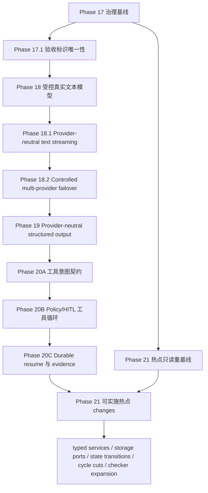

# Agent Harness Layer 架构演进长期计划

> 文档性质：living plan（持续更新的执行计划）
>
> 首次冻结：2026-07-27
>
> 当前状态：Phase 18 受控真实非流式文本运行时已同步、归档并由本地提交 `ff0c49b` 交付，当前无 active change。同一冻结实现身份上的 fresh Reviewer 1、Reviewer 2、Reviewer 3 均完成 Stage 1/2 PASS，0 findings；AC-081/083 的真实托管 completion 保持 `hosted-unverified`。Phase 18.1 仍是唯一下一项实现 change；Phase 18.2 多 provider fallback 已获用户授权补入计划，但尚未创建 OpenSpec change或实现
>
> 配套矩阵：[`architecture-evolution-change-matrix.md`](architecture-evolution-change-matrix.md)

本文是长期架构演进的执行与交接入口。它记录目标、依赖、进度、证据、风险、恢复方式和下一动作，但不把文档勾选、测试通过或 `openspec validate` 当作生产能力已经交付的证明。行为实现是否完成，仍以对应 OpenSpec 变更契约、代码、测试、fresh review 和归档状态共同判断。

## 1. Purpose

本计划把现有可运行的 P0 基线演进为可受控接入真实模型、可用既有事件通道输出 provider-neutral 增量文本、可扩展结构化输出和工具循环、且关键模块边界可以持续收窄的 Agent Harness Layer。演进遵循以下目标：

1. 不做大爆炸重构；先冻结原则和安全约束，再按窄 OpenSpec change 演进。
2. 任何真实 provider 副作用发生前，都已经形成不可由请求扩大权限的冻结路由计划，并完成预算、策略和审计前置判断。
3. 保留 fake/local profile 的离线可测试性；真实 provider 失败不得静默伪装成 fake 成功。
4. 让架构规则中可机械判断的部分进入 checker、contract test 或 CI，文档只解释意图、边界和例外审批方式。
5. 把 handoff 作为一级交付物。上下文压缩、换 Agent、换 session 或换 worktree 后，接手者能从当前磁盘事实恢复，而不是依赖聊天摘要。

## 2. Handoff Snapshot

### 2.1 当前快照

| 项目 | 当前事实 |
|---|---|
| 快照日期 | 2026-07-29 |
| 分支 | `develop` |
| 当前 HEAD | `ff0c49b22f706ebe9f5cfc1c05c76d3861f9405a`（`feat: 交付 Phase 18 受控真实模型运行时`） |
| 基线工作树 | `ff0c49b` 提交后 `git status --short --branch` 仅输出 `## develop`，Phase 18 实现、测试、主规格与归档材料已进入同一提交；`.agents/.needs-review` 不存在，按 stop gate 为 clean |
| 当前 Git 事务 | worktree 只包含本轮用户授权的 Product Spec、API Contract、DEV-PLAN、living plan、change matrix 与 changelog 的 Phase 18.2 规划补丁，尚未 commit；不 push、发布或部署。用户曾单独授权隔离 MiMo smoke，真实成功尚未建立 |
| OpenSpec | 当前无 active change；`controlled-real-model-runtime` 的 32/32 tasks、三组 delta specs 与完整 artifacts 已归档到 `openspec/changes/archive/2026-07-29-controlled-real-model-runtime/`，对应主规格已同步 |
| 已完成历史 | Phase 1-18 已归档；归档事实以 Git、`openspec list --json` 和归档目录为准 |
| 当前阶段 | Phase 18 已提交；本轮只把跨 deployment/provider fallback 固定为 P1 Phase 18.2 产品/API/开发计划，Phase 18.1 仍等待用户授权创建 change |
| 后两项预定生产行为 change | 先 `controlled-model-streaming`，其验证、review、同步并归档后，再另行授权 `controlled-multi-provider-failover`；Phase 19 必须从 Phase 18.2 归档 HEAD 开始 |
| 当前阻塞 | 无 Phase 18 阻塞。真实 provider 成功仍未建立：一次明确零调用，另一次按 unknown 处理并停止重试；该 hosted-unverified 状态不改变 Phase 18 已归档/提交事实。Phase 18.1 仍需用户另行授权，Phase 18.2 还依赖 Phase 18.1 归档 |
| 明确未做 | 未把 live smoke 写成 PASS；未 push、发布或部署；未创建 Phase 18.1/18.2 OpenSpec change，也未实现 streaming、跨 provider fallback、structured output、tool loop 或 Phase 21 重构 |

`DEV-PLAN.md` 顶部已在本轮按当前 Git/OpenSpec 事实同步到 Phase 17，并保留 Phase 1-16 的历史阶段内容。后续 Agent 仍须按恢复顺序重新核对当前磁盘、Git 与 OpenSpec，不能把任一文档状态块当作无需验证的运行时事实。

### 2.2 新 session 的最小恢复顺序

接手 Agent 必须按以下顺序恢复上下文；只读完成前不得创建 change 或修改实现：

1. 完整读取本文件和配套 change matrix。
2. 读取 `Product-Spec.md`，至少核对 REQ-004、REQ-012、REQ-014、REQ-022、REQ-024、REQ-025、REQ-026、非功能需求和当前 P0 完成定义；再读取 `DEV-PLAN.md` 的当前状态、阶段依赖、相关历史 Phase 和风险，并用后续 Git/OpenSpec 检查验证其时效性。
3. 执行 `git branch --show-current`、`git rev-parse HEAD`、`git status --short`，把结果与本快照比较；有漂移时先记录到“Surprises & Discoveries”。
4. 执行 `openspec list --json`。若存在 active change，完整读取其 `proposal.md`、`specs/**/*.md`、`design.md`、`tasks.md`、元数据和关联侧车文档，再对照矩阵确认依赖与文件所有权。
5. 读取当前磁盘上的相关源文件和测试；仓库存在 `.codegraph/` 时先用 CodeGraph 重建 symbol/call-path 事实，不用本计划中的旧行号代替当前源码。
6. 在本文件的 Progress、Decision Log、Surprises 与 Handoff Snapshot 中记录本 session 的起点，再开始获授权的工作。

如果以上任一步出现无法解释的差异，默认停在只读调查状态；不得为了让计划“看起来一致”而覆盖用户或其他 worktree 的改动。

## 3. 冻结基线

### 3.1 2026-07-27 基线证据

| 检查 | 结果 | 结论边界 |
|---|---|---|
| `git branch --show-current` | `develop` | 只证明核对时所在分支 |
| `git rev-parse HEAD` | `7bbbaa2407280f0e73813431510f955fb8f649fe` | 本计划的初始比较基线，不冻结未来 HEAD |
| `git status --short` | 无输出 | 只证明开始写文档前工作树 clean；并行文档写入后预期会变脏 |
| `openspec list --json` | `changes: []` | 核对时没有 active change，不代表未来 session 仍为空 |

### 3.2 当前实现事实

以下事实已在 2026-07-28 Phase 18 实现候选中重新校准；最终结论仍以本轮全量验证与 fresh review 为准：

- `packages/agent-harness/src/agent_harness/runtime/services.py::build_agent_execution_services` 始终注册显式 fake provider；只在 typed settings 存在 `openai-compatible` deployment 时注册 lazy `ControlledOpenAIClientFactory`/adapter blueprint，startup 不构造 SDK client。
- `packages/agent-harness/src/agent_harness/config/schemas.py::ModelSettings` 已能表达 deployment、credential、endpoint policy 与 model catalog；真实 route 通过 ref/version/digest 关联，secret value 排除序列化。
- `packages/agent-harness/src/agent_harness/config/settings.py::load_settings` 的实际合并顺序是 profile YAML → agent YAML → `.env` → secret file → direct process env → explicit overrides；`.env` 只消费 `AGENT_HARNESS_*`，`_FILE` 只允许来自进程环境。
- `ModelRequest.provider` 现在是可选相等断言，不能选择 provider；router 按 deployment → frozen Agent policy → request 求交集，真实 root 从完整 `budget-tree-v2` snapshot 恢复 canonical path/catalog/classifier/attempt policy。
- `AgentModelPolicy` 已增加 `deployment_id` 与 `allowed_models`，default/fallback 必须是其子集；scaffold 与五个模板 Agent 都显式使用 `fake_default`，默认离线不因未引用的真实 deployment 存在而升级路由。
- `PydanticAIModelProvider` 已使用 async `Agent.run()`、单一 total deadline、有界 retry 与 process-local Bulkhead；私有 transport 在 socket 前复核 origin/path/headers，并将不能证明完成状态的 timeout/cancel/响应归为 unknown。
- `ModelProvider` / `ModelRouter.execute` / `ModelInvocationService.complete` 当前只有一次性完整 response seam；模型生产路径只发布 request-started 与最终 usage evidence。虽然事件枚举已有 `model.output.delta` / `model.output.completed`，RUN-006 与 CLI 只读取已持久化事件，不能生产或恢复 provider stream。
- 当前 model usage operation 的 event-capacity binding 只覆盖固定 started/final prerequisite；streaming 若逐 SDK token 入 event 会突破副作用前有界预约不变量。Phase 18.1 必须先冻结最大 delta/coalescing、稳定 identity、跨 chunk 安全与 partial settlement。
- Phase 17.1 开始前，`Product-Spec.md` 与 `docs/acceptance-matrix.md` 各有两个语义不同的 `AC-070`，导致 policy 映射覆盖和 matrix validator 重号失败。当前 live 规格已保留 dependency lock `AC-070`，把 API docs 迁移为 `AC-089`，并新增全局唯一性门禁；历史归档保持不变。
- composition 仍存在字符串键 service locator，具体 `SQLAlchemyStorage` 依赖扩散，运行状态分支逐渐变厚，并已发现两个跨域语义强连通分量。这些是 Phase 21 的调查入口，不是尚未复核就可直接重构的结论。

## 4. 范围与非目标

### 4.1 长期范围

- Phase 17：治理基线与可执行架构约束。
- Phase 18：受控真实文本模型 runtime。
- Phase 18.1：provider-neutral 普通文本增量流，复用 CanonicalEvent / RUN-006 / CLI transport。
- Phase 18.2：受控跨 deployment/provider fallback，以有序 route chain、safe not-started 切换、逐候选预算/evidence 与恢复围栏扩展 Phase 18/18.1。
- Phase 19：provider-neutral structured output；不包含 structured streaming。
- Phase 20：经 `ToolRegistry`、`PolicyEngine` 与 HITL 的工具型模型循环。
- Phase 21：typed services、storage ports、显式状态转换和跨域 cycle 等热点 seam。
- 每个行为变化先形成窄 OpenSpec change；共享接口、共享验收或共享文件存在时，按关联 change 处理。

### 4.2 本轮非目标

本轮是在 Phase 18 已由 `ff0c49b` 提交后，按用户明确授权补齐 Phase 18.2 `controlled-multi-provider-failover` 的产品与开发计划。此前只有 D-027 的“后置独立 change”决策，没有需求 identity、API 边界、验收、所有权或排期。本轮只修改规划类文档，不做以下事项：

- 不创建或实现 `controlled-model-streaming`、`controlled-multi-provider-failover` 或其他 active change，不把计划描述成 streaming/failover 已可用。
- 不夹带 structured output、tool loop、动态 provider discovery、健康权重、负载均衡、热重载控制面、Vault/KMS、依赖升级或无契约依据的大重构。
- 不改写任何 `openspec/changes/archive/` 历史事实，也不修改当前主规格；Phase 18.2 的 delta 只在未来获授权 change 中产生。
- 不改写 `DEV-PLAN.md` 的 Phase 1-16 历史交付与证据；仅为避免历史快照冒充当前状态而补充明确的时间限定。
- 不执行 commit、push、发布、部署或新的真实 provider 调用；Phase 18.1 创建、Phase 18.2 后续 change 与任何双 provider live smoke 都需要用户另行明确授权。

### 4.3 Phase 18 的硬性非目标

首个实现 change `controlled-real-model-runtime` 只交付受控真实文本生成。以下能力必须留在后续 change，不得以“顺手复用 SDK”为由夹带：

- structured output 或业务 schema 解析；
- model-driven tool call、tool loop、HITL resume；
- token/event streaming；该项不是无序后置，而是明确交给紧随其后的 Phase 18.1 `controlled-model-streaming`；
- 多 provider 自动故障切换；该能力已明确交给 Phase 18.2 `controlled-multi-provider-failover`，动态发现、健康权重、热重载控制面与大规模运维仍继续后置；
- Vault/KMS/完整 `SecretProvider` 平台；
- 业务 agent 直接接触 provider SDK 对象。

## 5. 冻结原则与配置边界

完整工程原则以 `docs/engineering-principles.md`、`docs/engineering-principles.zh-CN.md` 和 `CONTRIBUTING.md`、`CONTRIBUTING.zh-CN.md` 为维护入口。本计划只冻结与阶段执行直接相关的约束：

1. **请求只能缩权。** deployment policy 与 agent policy 先求交集；请求只能在交集中选择，不能添加 provider、model、capability、endpoint 或 credential。
2. **先冻结 route plan，再发生授权副作用。** route plan 至少包含 deployment identity、provider、model、capabilities、endpoint policy、price catalog identity 和超时/重试策略；随后才做预算预约、授权成功审计和 provider 调用。校验失败仍可记录去敏拒绝审计。
3. **secret 与普通配置分层。** 提交的 YAML 只允许非敏感默认、allowlist、credential reference 和安全策略；本地开发可从被忽略的 `.env` 注入秘密，服务部署使用 direct process env 或受控 `/run/secrets` 文件，三者都必须汇入同一 typed settings 与脱敏边界。
4. **`.env` 只是本地便利层。** 它必须保持 gitignored，只消费 `AGENT_HARNESS_*`，不等于 secret manager，也不允许触发 `_FILE` 读取。
5. **direct / file 冲突 fail closed。** 同一 secret 的 direct env 与对应 `_FILE` 同时存在时，在读取 provider、构造 client 或应用 overrides 前失败。
6. **endpoint 是安全边界。** `base_url` 通常不是秘密，但必须经过 HTTPS、host allowlist、credential-forwarding guard 校验；loopback 仅在显式 local policy 下例外，不能因字符串看起来像 localhost 就自动放行。
7. **timeout 必须分层。** connect、read、total timeout 分开表达；SDK/client 层负责实际 I/O 边界，线程池等待超时不能被宣传为已取消网络副作用。
8. **重试必须可解释。** 只重试被契约明确分类为安全的前置失败；调用结果未知时进入可追踪的 unknown/needs-review 路径，不能为了“提高成功率”盲目重复计费副作用。
9. **离线基线永久保留。** fake provider 是显式 profile/测试选择，不是真实 provider 失败时的静默 fallback。
10. **公开 DTO 不泄漏 SDK。** provider 原始 result、client、exception body、secret 或连接对象不得穿过 adapter、event、trace、audit、eval 或 checkpoint 边界。

## 6. 阶段 DAG



默认按图中的拓扑顺序执行。Phase 21 的只读 inventory 可以和前序实现的认知调查并行，但任何 Phase 21 写入都必须同时满足：前置行为 seam 已稳定、矩阵重新确认文件无冲突、没有共享验收、没有共享接口变更。仅仅“改的是不同函数”不构成并行证明。

## 7. 阶段计划与完成标准

### 7.1 Phase 17：治理基线与可执行架构约束

**目标**

- 把架构原则、贡献路径、长期计划、change 关系、session 更新和 handoff 规则放到仓库内。
- 将可机械判断的规则分配给后续 change 的 checker、contract test 或 CI；未实现 checker 的规则必须明确标为文档约束。
- 建立事实优先级：当前磁盘与 Git/OpenSpec 高于聊天摘要和陈旧状态块。

**交付与边界**

- 本文件与 `architecture-evolution-change-matrix.md`。
- `docs/engineering-principles.md`、`docs/engineering-principles.zh-CN.md`。
- `CONTRIBUTING.md`、`CONTRIBUTING.zh-CN.md`。
- 机械规则不单独抢占首个实现 change；由触及该边界的后续窄 change 同步补 checker/contract/CI，并在 tasks 中列出。

**退出门禁**

- 四类治理文档互相引用一致，没有把计划状态写成代码完成状态。
- 本计划与矩阵通过 Markdown 路径、结构和 `git diff --check` 自检。
- 未来第一条行为变更仍是 `controlled-real-model-runtime`。
- 对文档范围完成独立静态审查；如审查后有实质 diff，重新审查受影响内容。

**独立治理修复**

Phase 17.1 开始前的重复 `AC-070` 已由独立窄 change `acceptance-criteria-identity-uniqueness` 处理并归档，没有塞进真实模型 change，也没有改写历史归档材料。该治理修复不改变“首个生产行为实现 change 是 `controlled-real-model-runtime`”的决策；Phase 18 仍须获得用户明确授权后才能创建和实现。

**Codex 执行时间估计**

- 文档落盘、交叉核对与修订：4-8 小时；不含等待 reviewer 配额或用户裁决的时间。

### 7.2 Phase 18：`controlled-real-model-runtime`

**目标**

在保持 fake/local 离线路径的同时，让一个显式配置、显式授权的真实文本模型 deployment 通过 provider-neutral runtime 完成调用、预算结算、审计和错误收敛。

**配置契约至少包含**

- 稳定 `deployment_id` 与 `provider_kind`；
- deployment 级 allowed/default/fallback models；
- endpoint/base URL policy，包括 HTTPS、host allowlist、credential forwarding 和显式 loopback 例外；
- endpoint policy 绑定的可选 completion classifier identity；默认/官方 endpoint 未绑定时 response retry 集合为空；
- `credential_ref`，以及 direct env / `_FILE` 的受控解析；
- connect/read/total timeout；
- 有界 retry/backoff 和不可重试/结果未知分类；
- concurrency limit / bulkhead；
- 受信 model catalog reference/version/digest、request-shape、输入上界与 price source；deployment 只引用，不自证 envelope/价格；
- capability flags，首 change 只允许 text completion。

**路由与执行顺序**

1. 从 profile、agent descriptor 与 typed settings 解析 deployment。
2. 计算 deployment allowlist 与 agent allowlist 的交集。
3. 用请求进行缩权选择；任何扩大或未知值在零 provider 副作用时失败。
4. 通过受信 endpoint/model catalogs 冻结 `ModelRoutePlan`，包含 endpoint、credential ref identity、model catalog ref/version/digest、request-shape、输入上界/价格、completion classifier identity、capabilities、timeout/retry 与 model，并完成 prompt/output/strategy/price/公式等动态 hard eligibility；失败时 reservation/client/network 均为零。
5. 用 bound execution identity 执行 exact `PolicyCheck(action=model.invoke, resource=agent:<agent_id>:model)` 并由既有 `AuditService` 写 `policy.decision`。Deny 或等待既有 `policy_approval` checkpoint/ApprovalRecord 时 reservation/permit/client/mark/network 均为零；获批 continuation 必须验证全绑定、单次 lease并重新检查 hard route/catalog/current owner balance。
6. Policy 允许或有效审批 continuation 通过后，建立共享预算/settlement reservation，再取得 deployment Bulkhead permit；此时仍未构造真实 client、未写 durable mark、未联网。Policy audit 只证明原始 decision，不证明 provider 已开始。
7. 从 composition 注入的 lazy factory 获取或构造绑定 frozen route 的 client lease；构造不得联网，失败按 not-started 回滚 reservation/permit，mark/network delta 均为零。
8. Client lease 成功后提交 durable `side_effect_started`，最后 adapter send；重试复用同一 reservation/permit/client lease/mark。只有 endpoint policy/version 绑定受信 completion classifier 且 exact signal 为 not-started 时才允许 429/5xx response retry，否则 unknown/no-retry。
9. 归一化 text、usage、cost、latency、attempt 和错误 evidence，完成结算；原始 SDK 对象不外泄。

**关键兼容要求**

- 现有 fake tests、eval 和 local smoke 不需要真实 credential。
- 真实 provider 配置无效时 application startup fail closed；不能到第一次 run 才隐式猜配置。
- 真实 provider 失败不能自动切 fake。配置的 fallback 只能来自冻结 allowlist，并重新走预算/策略判断。
- provider smoke 必须显式 opt-in；缺本会话授权、opt-in、隔离 credential 或受信 endpoint 时记录 `hosted-unverified` 并保持零调用；仅在已授权且本地条件完整后发生外部网络/provider 阻断时记录 `external-blocked`。两者都不能伪造 PASS，默认离线 CI 以 skipped evidence 记录 hosted-unverified。
- 如果 total timeout 到达但 SDK 调用无法确认取消，状态必须表达副作用未知，并禁止自动重试。

**预计核心文件面**

- `packages/agent-harness/src/agent_harness/config/{schemas.py,settings.py,secret_files.py}`
- `packages/agent-harness/src/agent_harness/models/{providers.py,router.py,invocation.py}`
- `packages/agent-harness/src/agent_harness/adapters/models/pydantic_ai.py`
- `packages/agent-harness/src/agent_harness/runtime/services.py`
- `packages/agent-harness/src/agent_harness/registry/{descriptor.py,_loader.py,registry.py}`
- `packages/agent-harness/src/agent_harness/{scaffold_templates.py,_scaffold_support.py}` 与 `tests/contracts/test_agent_scaffold_validation_atomicity_contracts.py`
- `templates/service-app/configs/profiles/**`、`templates/service-app/agents/**/config.yaml`、`.env.example`
- 对应 contract/integration/smoke tests 与维护文档

**退出门禁**

- OpenSpec proposal/spec/design/tasks 严格校验通过，并经 fresh code-reviewer Stage 1/2 PASS 后才开始实现。
- 先有失败的配置、越权、endpoint、timeout/retry、预算和 adapter regression，再实现。
- `make quality`、相关 contract/integration tests、`make smoke-local` 通过；如果触及 service composition，再跑 `make smoke-service`。
- 至少一个真实 provider opt-in smoke 在四项前置齐全且另行授权时有去敏证据；任一前置缺失时唯一保持 hosted-unverified/CI skipped，条件齐全后发生外部阻断才记 external-blocked，均不据此宣称真实端到端已验证。
- 代码审查确认首 change 没有夹带 structured output、tool loop、streaming 或多 provider 运维。

**Codex 执行时间估计**

- 契约、实现、离线验证、修复与文档：20-32 小时。
- 真实 provider smoke：额外 1-3 小时墙钟时间，受 credential、网络、配额和 provider 服务状态影响；等待不计入 Codex 主动执行时间。

### 7.3 Phase 18.1：`controlled-model-streaming`

**目标**

在 Phase 18 已冻结的 deployment、route、budget、cancel 与 provider 生命周期上，增加 provider-neutral 普通文本增量 producer；所有客户端仍从 committed CanonicalEvent 读取，不新增 provider cursor、SDK resume token 或第二套 stream endpoint。

**冻结契约至少包含**

- 异步、可取消的 provider-neutral text stream protocol，以及 Pydantic AI / fake adapter 的 append-only fragment 与 final result 归一化；
- provider 副作用前固定的 stream operation kind、最大 delta 数、单片 envelope、chunk/coalescing 与 event-capacity reservation；
- 稳定 operation/attempt/chunk identity，以及 `started → delta* → output completed → usage updated → run terminal` 的 durable 顺序；
- `model.output.completed` 的最终长度、checksum 或 artifact reference，使 committed prefix 可验证；
- 跨 chunk 有状态的脱敏与输出安全；完整结果才能判断时，不得先公开 speculative delta；
- SSE/CLI reader 断线只停止读取；显式 run cancel/deadline 才传播 provider cancel；调用结果未知时保留 prefix/reservation、禁止 retry/fallback、零成本结算、假 completed 与提前 terminal；
- provider iterator、event commit 与 capacity consumption 的有界背压，以及 SQLite/PostgreSQL crash recovery；
- SSE 已有事件首 frame、provider 首 delta、首个 committed delta 和客户端收到 delta 的独立时延证据。

**非目标**

- structured streaming、reasoning 暴露、tool-call streaming、tool loop；
- WS、AG-UI / Vercel AI adapter、retention、provider failover、多订阅控制面；
- 让慢 SSE subscriber 直接拥有或取消 provider 生命周期。

**预计核心文件面**

- `models/{providers.py,router.py,invocation.py,_invocation_settlement.py,usage_events.py}`；
- `adapters/models/{pydantic_ai.py,fake.py}`；
- `events/{capacity.py,bus.py}`、`storage/{event_capacity_repositories.py,usage_evidence_repositories.py,evidence_repositories.py}`；
- local/PostgreSQL event sinks、runtime/service composition、`API-Contract.md` 与 model/capacity/recovery/SSE/CLI tests；
- 若现有 outbox 无法表达 stream progress，需先在 design 中证明 migration、并发、恢复和旧 binary 行为，不能暗中扩大 schema。

**退出门禁**

- Phase 17.1 与 Phase 18 均已验证、fresh review、同步并归档；`controlled-model-streaming` 的中文 proposal/spec/design/tasks 与先行 API/event contract 通过 strict + fresh Stage 1/2 review。
- AC-085 至 AC-088 先有 local/真实 PostgreSQL red contracts，再实现；未修复 AC identity 唯一性前不得写入假 acceptance mapping。
- 正常、跨 chunk secret、容量耗尽、storage 慢、显式取消/deadline、unknown、reader 断线/重连、crash recovery 与终态 fencing 全部有证据。
- 默认 fake/local/CI 不触网；真实 streaming smoke 也继承 Phase 18 的四前置状态机：缺本会话授权、opt-in、隔离 credential 或受信 endpoint 任一项时保持零调用并记录 hosted-unverified/CI skipped；仅在前置完整且已授权后发生网络、配额或 provider 故障时记录 external-blocked。
- fresh 实现审查确认没有夹带任何非目标；实质修订后重新从 Stage 1 审查。

**Codex 执行时间估计**

- 契约、实现、SQLite/PostgreSQL recovery、离线验证和 review/fix：20-30 小时。
- 若需要新 migration，冻结 design 后重新估算，当前保守区间 24-36 小时；真实 provider streaming smoke 另 1-3 小时墙钟，不含外部等待。

### 7.4 Phase 18.2：`controlled-multi-provider-failover`

**目标**

把 Phase 18 的同 deployment/provider 多模型候选扩展为有序 `(deployment_id, model_id)` route chain。每个候选独立绑定 provider kind、endpoint、credential、catalog、capability、timeout/retry、Bulkhead 和预算；只有前一候选可证明 `not_started` 时才推进，任何 `started|unknown`、response identity、usage、文本或 delta 都停止 failover。

**冻结契约至少包含**

- Agent policy 的 route refs schema、deployment∩Agent∩request 交集与不可变候选顺序；request 只能删减，不能新增或重排 provider/endpoint/credential/model。
- 全链 chain identity、候选 ordinal、每个候选的 endpoint/catalog/credential identity 与执行上界；reload 只影响新 root run。
- Composition root 的窄 provider factory/adapter registry 与 lazy client lease，候选之间不共享 secret、client、permit、Bulkhead、catalog 或 SDK 对象。
- 封闭、版本化的 safe failover classifier；异常字符串、body、缺失/冲突 header、timeout/cancel 和 unknown 不能授权切换。
- 逐候选 reservation 的耐久 release/transfer 与下一 reservation 原子建立；unknown 保留原 reservation，恢复不重放已开始 provider。
- Route-chain/attempt/usage/cost/latency/failover-reason evidence，以及 streaming 首 delta 后禁止 failover 的共同围栏。

**非目标**

- 动态 discovery、健康权重、负载均衡、成本套利、热重载控制面、多区域运维和跨 provider 账单对账。
- Structured output/tool-call failover；分别由 Phase 19/20 的契约决定。
- Fake 作为真实 provider 失败后的静默尾项。

**退出门禁**

- Phase 18.1 已验证、fresh review、同步并归档；Phase 18.2 proposal/spec/design/tasks 与先行 API/config/evidence contract 通过 strict 和 fresh Stage 1/2 review。
- AC-090 至 AC-095 从公共 seam 建立红灯；两 provider doubles、SQLite/PostgreSQL recovery、预算竞争、streaming 首 delta 围栏和默认离线回归全部转绿。
- `make quality`、聚焦 contract/integration、`make test`、`make eval`、`make smoke-local`、触及 service composition 时的 `make smoke-service`、build/license/strict/diff checks 与 fresh 实现 `1+2` review 完整。
- 双真实 deployment smoke 只在用户另行授权、opt-in、两个隔离 credential refs 和受信 endpoints 齐全时运行；否则保持 hosted-unverified/external-blocked，不伪造 PASS。

**Codex 执行时间估计**

- 24-40 小时；若新增 provider-specific dependency 或 migration，design 冻结后重新估算。双真实 deployment smoke 另需 2-4 小时墙钟。

### 7.5 Phase 19：provider-neutral structured output

**目标**

在 Phase 18.2 已稳定的 deployment/route-chain/provider/invocation/result seam 上，增加 provider-neutral 的输出 schema、验证、失败分类和 evidence；业务 schema 不依赖 Pydantic AI result 类型。

**范围**

- 用稳定 schema reference / version 表达期望输出。
- 区分文本、结构化成功、schema invalid、provider capability unsupported 和结果未知。
- 把 provider-native structured output 适配到统一 DTO；必要的修复尝试有严格次数和成本边界。
- 保持 text-only 调用兼容，不能为了结构化输出重写 Phase 18 的安全路由顺序。

**非目标**

- 不执行工具；不把 tool call 当结构化业务输出。
- 不引入 streaming 增量 schema 拼装。

**退出门禁**

- change 只依赖 Phase 18.2 已归档的公开 seam；Phase 18.1 仅交付普通文本流、Phase 18.2 只交付普通文本 route-chain failover，不代表 structured streaming/failover 已存在。
- 多个 adapter 替身 contract tests 证明公共 DTO 不泄漏 SDK 类型。
- schema mismatch、repair exhaustion、预算不足和 unsupported capability 均在可追踪状态结束。

**Codex 执行时间估计**

- 16-28 小时。

### 7.6 Phase 20：受策略控制的工具型模型循环

Phase 20 不做成一个巨型 change，默认拆为三个串行 change：

1. **工具意图契约**：模型只能产生 provider-neutral tool intent；参数先做 schema 和来源校验，不执行工具。
2. **Policy/HITL 工具循环**：tool intent 必须经 `ToolRegistry` allowlist、`PolicyEngine`、审计和 HITL；危险动作在批准前无工具副作用。
3. **Durable resume 与 evidence**：冻结 loop/turn/tool-call identity，覆盖 checkpoint、resume、exact replay、未知执行、最大 turn/cost/token 边界和 terminal fencing。

**硬性顺序**

`model output → tool intent DTO → ToolRegistry resolve → policy/audit → optional approval/checkpoint → tool execution → result sanitization/truncation → context assembly → next model turn`

任何 adapter 都不能直接调用工具；任何恢复路径都不能跳过 registry/policy/HITL。工具结果按不可信输入重新进入 context assembly。

**退出门禁**

- 三个 change 各自 strict validation 和独立 review；因为共享 loop DTO、事件和验收，还需在实现前后做关联 change 联合审查。
- approval 前零工具副作用；exact replay 不重复执行工具或模型调用；unknown 不能自动伪装为可重试。
- turn、token、cost、工具输出大小和 wall-clock 均有显式上界。
- local fake/tool stub、contract、integration、checkpoint/resume 和 service smoke 证据完整。

**Codex 执行时间估计**

- 三个 change 合计 28-45 小时；真实 provider + 真实外部 tool 的可选 smoke 另计外部等待。

### 7.7 Phase 21：架构热点 seam

**目标**

在前序行为稳定后，用可回归验证的小 change 收窄结构热点，不把“更好看”当成验收：

- 用 typed execution services 替代字符串键 service locator，明确 executor 可见能力。
- 把核心用例对具体 `SQLAlchemyStorage` 的依赖收敛到最小 storage ports / UoW seam。
- 把变厚的 run state 分支收敛为显式、可穷举、可审计的状态转换。
- 对最新 CodeGraph 和源码确认的跨域语义 SCC 逐个切断；每次只切一个稳定 seam。
- 把已经稳定且可机械判断的层依赖、public/internal seam、vendor/ORM/config 规则按规则族逐步接入 checker、contract test 或 CI。

**执行约束**

- 先做只读重基线，记录 symbol、call path、测试覆盖和文件集；历史图只作线索。
- 结构 change 必须有行为等价 contract，不能借重构修改公开语义。
- typed services、storage ports、state transitions 默认串行，因为它们很可能共享 composition/runtime 文件。
- 两个 cycle cut 只有在最新证据证明无共享接口、验收、文件和顺序依赖时才可分 worktree 并行。

**退出门禁**

- 每个 change 的 blast radius、public seam、回滚点和等价性测试在 proposal/design 中明确。
- 机械 checker 能验证的新规则进入 `scripts/`、contract test 或 CI；规则尚不能可靠机械判断时保留为 review checklist，不写脆弱文本扫描冒充约束。
- 全量质量、contract/integration 与受影响 smoke 通过，fresh review 对架构收益和行为等价均 PASS。

**Codex 执行时间估计**

- 只读重基线 2-4 小时；首批五项窄 change 合计 50-90 小时。若最新依赖图与当前发现差异较大，先更新本计划再重新估算。

## 8. Progress

勾选只表示对应计划动作有证据完成，不表示其后的生产能力自动完成。每条完成项必须带日期；跨 session 更新时保留历史，不把旧项重写成新结论。

### Phase 17

- [x] 2026-07-27：用户通过 `/goal` 明确授权 Phase 17.1；在 `develop@4922784d0057`、clean worktree、无 active change 的基线上开始单 owner 串行治理。
- [x] 2026-07-27：完成 live/历史 `AC-070` inventory 与 Git 引入顺序核对；保留先出现的 dependency lock `AC-070`，将后出现的 API docs identity 迁移到未占用的 `AC-089`，归档材料保持不可变。
- [x] 2026-07-27：创建 `acceptance-criteria-identity-uniqueness`，完成中文 proposal/spec/design/tasks，并通过 `openspec validate acceptance-criteria-identity-uniqueness --type change --strict`。
- [x] 2026-07-27：首轮 fresh artifact review 完成；行为契约本身覆盖完整，但因 living plan、change matrix 与 `DEV-PLAN.md` 的授权、active change、strict 状态和唯一下一动作冲突，Stage 1 以 1 HIGH FAIL；未进入实现。
- [x] 2026-07-27：修复首轮状态真相冲突并重新 strict validation；第二轮 fresh artifact review 确认该 HIGH 已闭合，但发现 `test_dev_plan_reports_archived_uv_change` 的陈旧全局 active 状态断言未纳入 tasks，Stage 1 以 1 MEDIUM FAIL；未进入实现。
- [x] 2026-07-27：把 dependency 状态合同的 red-first 修订纳入 proposal/design/tasks/所有权并重新 strict validation；第三轮 fresh artifact review 确认任务闭环，但发现文档仍把已完成的修订和 strict 写成下一动作，Stage 1 以 1 MEDIUM FAIL；未进入实现。
- [x] 2026-07-27：将 Phase 16 的“无 active change”限定为当时归档快照，并把当前状态统一为修订与 strict 已完成。
- [x] 2026-07-27：第四轮 fresh artifact review 确认前三轮 findings 均闭合，但发现 change matrix 的 Phase 17 历史行仍保留“final review 后 amend”的陈旧待办，Stage 1 以 1 MEDIUM FAIL；未进入实现。
- [x] 2026-07-27：把 Phase 17 矩阵行改为已落入 `4922784d` 的历史终态，删除陈旧待办。
- [x] 2026-07-27：第五轮 fresh artifact review 完成，Stage 1/2 与 Spec/Standards 双轴 PASS，0 HIGH / 0 MEDIUM / 0 LOW；允许进入 TDD 红灯。
- [x] 2026-07-27：用户明确要求先提交文档再继续开发；提交范围仅含当前 Phase 17.1 状态文档与 OpenSpec artifacts，不 push。
- [x] 2026-07-27：用户授权后的范围/权限状态补丁使第五轮 verdict 失效；后续审查继续发现并修复 commit 权限冲突、Phase 17 旧范围、实现状态虚报和两处 DEV-PLAN 陈旧状态，未据旧 verdict 提交。
- [x] 2026-07-27：用户明确裁决状态类 artifact review finding 不再阻断开发；以 `owner-waived` 进入 TDD，不把该裁决写成 reviewer PASS，也未提交文档候选。
- [x] 2026-07-27：完成 tasks 1.1-1.3 红灯；同 REQ/跨 REQ 重号、`AC-089` producer/test/live 迁移共 5 项按预期红，陈旧 uv change 状态合同先红后收窄为只约束自身归档。
- [x] 2026-07-27：在分组前增加 Product Spec live AC 全局计数；保留 dependency lock `AC-070`，把 API docs 迁移为 `AC-089`，同步矩阵、required policy、changelog，并证明 archive 零 diff。
- [x] 2026-07-27：聚焦合同 PASS；`make quality` PASS；`make test` 为 `1352 passed, 223 skipped`。随后仅修订不合规注释并把 `AC-065/066` 原文移回矩阵已声明的 `REQ-022`，按用户要求不重跑全量，受影响 Ruff 与 validator 合同 PASS。
- [x] 2026-07-27：fresh 实现 review 对冻结代码与契约给出 Stage 1/2 PASS，0 HIGH、0 MEDIUM；唯一 LOW 为三处陈旧状态措辞，按用户授权只修状态文档，不重跑测试、不重开 review。
- [x] 2026-07-27：用户明确授权按正式门禁重生实现冻结 evidence；identity `8789075d…42d15` 下 18 个 CI producer gate 全部 PASS，`test-aggregate` 为 `1352 passed, 223 skipped`，direct validator 为 `98/98`，strict validation 与 `git diff --check` PASS。
- [x] 2026-07-27：随后只勾选 tasks 并同步 ready-to-archive 状态；owner 纠正“只改状态没必要再跑证据”，已停止第二轮刷新。被取消的刷新不作为证据，ready-to-archive 结论复用前述冻结结果。
- [x] 2026-07-28：用户明确选择同步并归档；将 delta 智能合并到 `dual-ci-acceptance-evidence` 主规格，逐段比较无差异后执行归档，目标为 `openspec/changes/archive/2026-07-28-acceptance-criteria-identity-uniqueness/`。
- [x] 2026-07-27：核对分支、HEAD、初始工作树和 OpenSpec active list。
- [x] 2026-07-27：读取当前 Product Spec、DEV-PLAN 相关范围及模型/config/runtime 关键源码。
- [x] 2026-07-27：创建长期计划与 change matrix，并写入 handoff 规则。
- [x] 2026-07-27：核对工程原则与贡献指南四份文件的最终路径、互链和语义一致性。
- [x] 2026-07-27：完成 Phase 17 文档 fresh 独立静态审查；首轮 3 MEDIUM + 1 LOW 已修订，冻结后 Stage 1/2 PASS。
- [x] 2026-07-27：完成无对话 fresh handoff 复原测试；修复陈旧 Phase 13 风险状态和 fake fallback/change identity 歧义后 PASS。
- [x] 2026-07-27：在主控独占范围内按当前 Git/OpenSpec 事实同步 `DEV-PLAN.md` 顶部状态与 Phase 17-21 索引，不改写 Phase 1-16 历史证据。
- [x] 按用户 `owner-waived` 的 artifact 状态门禁裁决，用 TDD 修复重复 `AC-070` 的规格/验收 identity；不把 waiver 记成 reviewer PASS。

### Phase 18

- [x] 2026-07-28：用户通过 `/goal` 明确授权 Phase 18；在 `develop@2502fe7b7d10`、clean worktree、无 active change 的基线上开始单 owner 串行恢复与契约起草。
- [x] 2026-07-28：创建 active change `controlled-real-model-runtime`，完成中文 proposal/spec/design/tasks 并通过 strict validation；这只证明契约可解析，不代表契约 review 或实现完成。
- [x] 2026-07-28：修复上一轮状态真相、live smoke 状态与 retry status 的 3 项 MEDIUM并重新 strict；随后 fresh Reviewer 1 发现 reservation/provider cap、provider identity、Phase 18.1 smoke 状态和 handoff 真相 1 HIGH / 3 MEDIUM，未进入 Stage 2。
- [x] 2026-07-28：补齐输入上界、output cap 强制、token/cost 公式、唯一 provider identity 和后继 smoke 状态，并同步当前 handoff；修订候选重新 strict validation PASS。
- [x] 2026-07-28：下一轮 fresh Reviewer 1 发现锁定 OpenAI SDK 仍检查 ambient identity/header env，且动态预算拒绝早于 client 构造与 startup 预构造 client 相冲突；Stage 1 以 2 HIGH FAIL，未进入 Stage 2。
- [x] 2026-07-28：改为不修改进程环境的私有 lazy client factory + 出站 header/origin allowlist transport；动态 hard eligibility 失败固定 reservation/client/network 三类计数为零，合法 route 在 reservation/permit 后才获取 client lease；修订候选重新 strict validation PASS。
- [x] 2026-07-28：下一轮 fresh Reviewer 1 发现跨 artifacts 未完整固定 client lease → 当时拟引入的独立授权记录顺序、`completion_observed=false` 缺少可信生产来源，且 change matrix 漏列 CLI/CI/lifecycle ownership；Stage 1 以 2 HIGH / 1 MEDIUM FAIL，未进入 Stage 2。
- [x] 2026-07-28：补入 endpoint policy 绑定的 `trusted_response_header_not_started/v1`、原始单值 header 判定与默认 endpoint 禁止 response retry；同步逐边界顺序、snapshot/evidence identity、冻结测试节点及 CLI/CI/lifecycle 所有权，修订候选重新 strict validation PASS。
- [x] 2026-07-28：下一轮 fresh Reviewer 1 确认行为契约已闭合，但发现矩阵/proposal 未精确列出 shared-budget、settlement helper、公共 exports 与独立 live-smoke 脚本；Stage 1 以 1 MEDIUM FAIL，未进入 Stage 2。
- [x] 2026-07-28：补齐 `runtime/shared_budget.py`、`models/_invocation_settlement.py`、config/model exports 与 `scripts/smoke_live_model.py` 的独占所有权，并明确现有 API/worker/eval caller 继续复用 `RuntimeComponents.close()`；若红灯要求修改入口或 repository，必须先扩充契约并重新 review。修订候选重新 strict validation PASS。
- [x] 2026-07-28：下一轮 fresh Reviewer 1 确认其余契约与所有权闭合，但 `adapters/models/fake.py` 未精确纳入 async provider 迁移范围；Stage 1 以 1 MEDIUM FAIL，未进入 Stage 2。
- [x] 2026-07-28：在 proposal/design/tasks/change matrix 与长期所有权规则中逐字补入 `adapters/models/fake.py`；修订候选重新 strict validation PASS。
- [x] 2026-07-28：下一轮 fresh Reviewer 1 发现 `openai` 尚未进入公共 banned vendor 集合，且 `contracts/boundaries.py`、`scripts/import_boundary_check.py` 与 checker regression 未纳入冻结所有权；Stage 1 以 1 HIGH FAIL，未进入 Stage 2。
- [x] 2026-07-28：把 vendor boundary 声明、通用 import checker 与 `test_vendor_boundary_doctor_contracts.py` 纳入 proposal/design/tasks/change matrix 和长期所有权，并要求先建立 `openai` 越界导入红灯；修订候选重新 strict validation PASS。
- [x] 2026-07-28：下一轮 fresh Reviewer 1 发现现有 boundary 按任意 `adapters`/`integrations` 路径片段放行，模板 app 或业务 Agent 可用误导性同名子目录绕过；Stage 1 以 1 HIGH FAIL，未进入 Stage 2。
- [x] 2026-07-28：把允许范围冻结为仓库相对前缀 `packages/agent-harness/src/agent_harness/adapters/`，明确当前没有额外 integration root，并在 spec/design/tasks 中要求模板 Agent `adapters` 与 template app `integrations` 伪造路径负向回归；修订候选重新 strict validation PASS。
- [x] 2026-07-28：下一轮 fresh Reviewer 1 发现生产 adapter 直接构造 `AsyncOpenAI`，但 `openai` 只作为传递依赖存在，且直接 dependency、lock 关系、license policy 与 build/license 验证未冻结；Stage 1 以 1 MEDIUM FAIL，未进入 Stage 2。
- [x] 2026-07-28：选择把当前 lock 已有 `openai==2.44.0` 提升为核心 `openai>=2.44.0,<3` 直接依赖，不改变 207 项 package identity；纳入 core pyproject、uv.lock、Apache-2.0 third-party policy、dependency/license contracts、`uv lock --check`、build 与 license gate。修订候选重新 strict validation PASS。
- [x] 2026-07-28：下一轮 fresh Reviewer 1 发现 ready-to-archive 验证未显式运行独立 `make eval`，且 durable mark 前取消的确定性回滚、`model.invocation_cancelled` 与 source link 未完整进入 OpenSpec；Stage 1 以 2 MEDIUM FAIL，未进入 Stage 2，Reviewer 2/3 未派发。
- [x] 补齐上述两项契约并重新 strict validation PASS，随后从新的 fresh Reviewer 1 重启全员通过的 `1+2` 门禁。
- [x] 2026-07-28：新一轮 Reviewer 1 Stage 1/2 PASS 后才并行派 Reviewer 2/3；Reviewer 3 Stage 1/2 PASS，但 Reviewer 2 因本 change 新增的 `API-Contract.md` 正文以 `Phase 18/18.1` 限定长期语义而以 1 MEDIUM Stage 2 FAIL，因此三人全员门禁未通过，未进入红灯或实现。
- [x] 将上述四处开发阶段标签改为稳定的受控真实非流式文本能力、`MOD-002` seam 与受控增量文本流契约措辞，并重新 strict validation PASS。
- [x] 2026-07-28：下一轮 fresh Reviewer 1 确认 API Contract 新增行已清除开发阶段叙事，但发现 `typed-config` 两处与 `agent-registry-model-context` 一处拟同步 requirement 仍用 `Phase 18` 限定稳定 strategy/classifier/provider identity；Stage 1 PASS、Stage 2 以 1 MEDIUM FAIL，Reviewer 2/3 未派发。
- [x] 将三处 delta requirement 改为受控真实非流式文本能力或 `MOD-002` seam 措辞，并重新 strict validation PASS。
- [x] 2026-07-28：下一轮 fresh Reviewer 1 在 Stage 1 PASS 后发现拟同步 budget snapshot requirement 仍写 `P0 delegation targets`；该优先级标签不是稳定协议/领域标识，Stage 2 以 1 MEDIUM FAIL，Reviewer 2/3 未派发。
- [x] 将 `P0 delegation targets` 改为稳定的单层 delegation targets 能力措辞；三份 delta 的 `P0/P1/Phase N` 扫描为空，重新 strict validation PASS。
- [x] 2026-07-28：下一轮 fresh Reviewer 1 发现每个 Agent config 新增必填 `deployment_id`/`allowed_models` 后，现有 `scaffold_templates.py` 仍生成旧字段，且 `_scaffold_support.py`、正式 Registry/离线运行回归及文件所有权未进入契约；Stage 1 以 1 MEDIUM FAIL，Reviewer 2/3 未派发。
- [x] 纳入 scaffold 生产生成器、验证支持与聚焦 contract，冻结 `fake_default`/`fake-scaffold`、正式 Registry 和离线 runtime 行为，并重新 strict validation PASS。
- [x] 2026-07-28：下一轮 fresh Reviewer 1 发现 `API-Contract.md` 的 `examples.basic` descriptor 仍使用 `fake_local`，与 canonical `fake_default` 冲突；同时 `DEV-PLAN.md` Phase 18 章节状态仍停在更早 `openai` 直接依赖审查轮次。Stage 1 以 2 MEDIUM FAIL，Reviewer 2/3 未派发。
- [x] 统一 API descriptor 为 `fake_default`，同步 DEV-PLAN Phase 18 章节状态，并重新 strict validation PASS。
- [x] 2026-07-28：尝试为上述冻结候选创建新的 fresh Reviewer 1，首次派发及三次 10 秒间隔重试均返回 `agent thread limit reached`；按容量门禁停止，不复用旧 reviewer、不派 Reviewer 2/3、不进入红灯或实现。
- [x] 2026-07-28：同一容量阻塞连续三个目标轮次复现；每轮均在首次失败后只做三次 10 秒间隔重试。按目标门禁将本目标标记为阻塞，保留当前契约候选，不把用户关于审查全票规则的纠正写入进化信号。
- [x] 2026-07-28：在新 session 重新核对 `develop@2502fe7b7d10`、唯一 active change、空进化队列、完整上游/契约原文与 CodeGraph 当前源码；上一 session 的容量阻塞仅保留为历史状态，本 session 从重冻结与 fresh Reviewer 1 重新开始。
- [x] 2026-07-28：fresh Reviewer 1 Stage 1 以 2 HIGH / 1 MEDIUM FAIL：执行顺序漏掉 reservation 前的 soft policy/fallback/approval、受信 endpoint policy/default catalog 来源未定义、`budget-tree-v2` 共用 storage validator 未纳入所有权；Stage 2 未执行，Reviewer 2/3 未派发，未进入红灯或实现。
- [x] 2026-07-28：按上游 REQ-012/BGT-001 修正 hard eligibility → soft policy/fallback/approval → reservation 顺序并新增零副作用红灯；新增 typed endpoint policy mapping、版本化只读 default catalog 与 unknown/mismatch fail-closed 节点；把 `_shared_budget_repository_records.py` 和共用 validator contract 纳入串行所有权。
- [x] 2026-07-28：第二轮 fresh Reviewer 1 Stage 1 以 2 HIGH / 2 MEDIUM FAIL：deployment 仍能自证模型输入上界/价格；approval 只有顺序文字而没有复用既有耐久 continuation 的正向合同；当时拟引入的独立授权记录无权威定义；change matrix 未逐文件列出全部冻结红灯。Stage 2 未执行，Reviewer 2/3 未派发。
- [x] 2026-07-28：新增受信 typed model catalog、canonical digest、cost-disabled null 语义与 `config/model_catalog.py` owner；把 exact PolicyCheck、`policy.decision` audit、既有 checkpoint/ApprovalRecord/resolution lease/ApprovalGrant/approved continuation 的完整绑定、hard balance 重检、单次调用与 replay fail-closed 写入 API/OpenSpec；删除执行链中的独立 provider authorization evidence，并逐项列明冻结测试文件。
- [x] 2026-07-28：第三轮 fresh Reviewer 1 Stage 1 以 1 HIGH / 2 MEDIUM FAIL：契约误写不存在的 `approval.requested`、client factory 场景标题仍暗示独立授权步骤、change matrix 当前下一动作停在第一轮。Stage 2 未执行，Reviewer 2/3 未派发。
- [x] 2026-07-28：将审批证据统一为现有 `approval.required|resolved`，把场景标题改为“不伪造 provider started”，同步矩阵下一动作；用户将本会话范围收窄为契约全员 review 后创建一次本地提交，TDD 红灯与生产实现移交新会话。
- [x] 2026-07-28：第四轮 fresh Reviewer 1 确认全部行为契约映射 PASS，但因 proposal/tasks/DEV/living plan/matrix 仍有旧“本轮不 commit”文字，与用户新授权的一次审后 scoped 契约提交冲突，Stage 1 以 1 HIGH FAIL；Stage 2 未执行，Reviewer 2/3 未派发。
- [x] 2026-07-28：统一授权边界：仅在契约严格 `1+2` 全员 Stage 1/2 PASS 后创建一次 scoped 本地契约提交；不授权红灯、生产实现、其他 commit、push、sync/archive、部署或真实 provider。
- [x] 2026-07-28：第五轮 fresh Reviewer 1 按用户裁决忽略不影响实现的旧提交状态措辞，只以 1 HIGH 指出 API Contract 把 route ref/version 概括为必填，却未为 cost-disabled 的 `price_source_ref/version=null` 声明例外；Stage 2 未执行，Reviewer 2/3 未派发。
- [x] 2026-07-28：统一 API/OpenSpec/design/tasks：cost enabled 时价格与非空 price-source identity 成组存在；cost disabled 时两项价格、price-source identity、静态/动态 cost bounds 与 cost reservation 成组为 null，token 维度继续执行。
- [x] 2026-07-28：第六轮 fresh Reviewer 1 确认第五轮 cost-disabled finding 已闭合，但以 1 HIGH 指出 async provider 协议迁移必然影响的 16 个既有同步 provider doubles / 直接 adapter callers 未进入精确测试文件所有权；Stage 2 未执行，Reviewer 2/3 未派发。
- [x] 2026-07-28：把 16 个既有测试逐文件纳入 proposal/design/tasks/change matrix 的单一 owner，固定 red-first 的 coroutine/await 迁移与原断言不得弱化；发现第 17 个必须修改文件时必须先补契约并重审。
- [x] 2026-07-28：第七轮 fresh Reviewer 1 发现现有同步 `ModelRouter.route()` 直接调用将迁为 async 的 `execute()`，且 `tests/contracts/test_agent_registry_router_model_contracts.py` 同步消费 route 返回值；这是已冻结 16 个文件之外的第 17 个确定性 caller，Stage 1 以 1 HIGH FAIL，Reviewer 2/3 未派发。
- [x] 2026-07-28：明确 `ModelRouter.route()` 一并成为只做 plan 后 `await execute()` 的 async wrapper，不允许同步桥接；把该 route caller 测试纳入第 17 个精确 owner 文件，发现第 18 个必须先补契约并重审。
- [x] 2026-07-28：新的 Reviewer 1 与随后单独完成的 Reviewer 2 均在冻结哈希上 Stage 1/2 PASS；Reviewer 3 因容量未能与 Reviewer 2 并行启动，首次派发及三次 10 秒重试均返回 `agent thread limit reached`，因此未提交。
- [x] 2026-07-28：用户重启且确认文件未改后，主 Agent 核对 branch/HEAD/worktree/OpenSpec 与 10 个哈希无漂移并直接派 fresh Reviewer 3；Reviewer 3 Stage 1 以 1 HIGH 发现 `tests/contracts/test_model_usage_provider_adapter_contracts.py` 依赖将删除的 `run_sync/_run_sync_with_timeout` seam，却未在 17 文件清单中，Stage 2 未执行。
- [x] 2026-07-28：用同步 adapter seam 静态扫描建立 red-capable ownership 回路，确认当前三份 Pydantic AI 同步 seam 测试中只有该文件漏列；补为第 18 个 owner，并冻结 async `Agent.run()`/deadline 迁移不得弱化 timeout secret 脱敏、成功 usage 持久化与 missing-usage 断言。实质 diff 后旧 reviewer verdict 失效。
- [x] 2026-07-28：契约后续严格 `1+2` review 全员 Stage 1/2 PASS，并以 `5d7c018` 独立冻结；本轮用户确认可直接 `openspec apply`，不重复契约审查。
- [x] 2026-07-28：新实现 session 完整读取长期计划、矩阵、Product Spec、DEV-PLAN、API Contract、工程原则、贡献规范与全部 change artifacts；校准 `develop@5d7c018`、clean worktree、唯一 active change、32 项待办和 strict 退出 0，先纠正滞后状态再写实现。
- [x] 2026-07-28：建立首组 config 公共 seam 红灯；`uv run pytest -q tests/contracts/test_controlled_real_model_config_contracts.py` 退出 2，因 `agent_harness.config.model_catalog` 尚不存在而在收集阶段失败，证明 typed model catalog/endpoint resolver 尚未交付。
- [x] 2026-07-28：完成 typed deployment/credential/endpoint/model catalog 与 direct/`_FILE` 冲突、ambient provider env 忽略和 secret 脱敏实现；同一 config 合同由收集红灯转为 6 项通过，后续补充的可执行配置片段合同同样通过。
- [x] 2026-07-28：建立 scaffold 公共 seam 红灯，正式 Registry/运行时因 fake catalog 路由缺失失败；补齐 `fake_default`/`fake-scaffold` 显式缩权与 `_scaffold_support.py` 验证后同一节点转绿。
- [x] 2026-07-28：建立 v2 恢复红灯；`test_controlled_real_model_budget_snapshot_contracts.py` 以缺 `canonical_base_url` 和 `plan_from_snapshot` 失败。随后完整冻结 canonical path、endpoint/catalog/classifier/attempt policy，并证明 reload 后旧 run 只从旧快照恢复。
- [x] 2026-07-28：建立可信 classifier transport 红灯；精确单值、重复、逗号合并、缺失和响应已有业务 evidence 五组均因 transport 尚无 classifier seam 失败。实现私有原始 header 分类、Retry-After/backoff/deadline 后同一五组转绿。
- [x] 2026-07-28：完成 async provider、immutable route、既有 Policy/HITL、共享预算/usage settlement、lazy Pydantic AI client、受控出站 transport、composition/lifecycle、默认离线与 CI live-smoke producer 的最小纵向闭环；新增完整 orchestrator 合同证明 v2 snapshot、policy audit、预算预约、evidence 和旧 path 恢复处于同一路径。
- [x] 2026-07-28：复核授权 live smoke 时发现原候选直接调用 router/adapter；已改为临时隔离的完整 `RunOrchestrator → policy audit → shared budget → invocation/evidence → provider` 路径。当前未授权，实际 `make smoke-live-model` 仍只允许零调用 `hosted-unverified`。
- [x] 2026-07-28：首次全量测试暴露 CI 新 producer 断言、durable mark 异常窗口、Python 3.14 `Literal` 缓存身份和 provider 失败兼容消息 5 项红灯；逐项修复后同节点转绿，完整 `make test` 为 `1394 passed, 224 skipped`、退出 0。
- [x] 2026-07-28：Phase 18 聚焦合同与关键回归为 `124 passed, 1 skipped`；`uv lock --check`、`make quality`、`make eval`、`make smoke-local`、`make build`、`make license-check`、live-smoke hosted-unverified、strict 与 diff 检查均退出 0。`make smoke-service` 已运行，但本机 Docker 凭据助手卡住，隔离配置重试仍在 image-build 失败，随后 daemon 只读查询无响应；按外部阻塞记录，不复用旧 service artifact。
- [x] 2026-07-28：AC-077/078/079/080/082/084 已按精确 production/test producer 证据勾选；AC-081/083 因未建立真实 provider completion 保持 `hosted-unverified`，没有用 double 或 skip 伪造外部 PASS。最终 fresh review 后 OpenSpec tasks 为 32/32。
- [x] 2026-07-28：首轮 fresh 实现 reviewer 在 Stage 1 以 HIGH 发现受控真实路径没有消费 Agent/deployment fallback，现有真实 fixtures 均为空 fallback；Stage 2 未执行，旧冻结 evidence/verdict 失效。
- [x] 2026-07-28：先增加 5 个受控 fallback 公共 seam 合同，原实现稳定复现 `5 failed`：默认 route 不切换、cost 阈值字段缺失、v2 target hard budget 不参与选择、无候选仍 `call`、损坏 fallback 公式被忽略。实现 Agent/deployment/request 交集、候选目录/价格/attempt bound 重算、hard/soft/approval 边界与安全 decision 后扩展为 `10 passed`；Phase 18 聚焦集、共享预算回归和 `make quality` 已再次退出 0。
- [x] 2026-07-28：Docker daemon 恢复后，`make smoke-service` 先后暴露 `postgres-budget-race` 与 `postgres-budget-topology`。前者先以公共 repository seam 复现 late `BudgetReservationRejected` 泄漏红灯并映射为稳定 `DelegationBudgetExceeded`；两个 service producer 的自定义 snapshot 标签则由静态合同锁定并改为仓储认可的 `budget-tree-v1:` 身份。聚焦回归 14 项通过，完整 `make smoke-service` 退出 0并输出 `workspace-outside=ok wheel-only=ok secret-cleanup=ok`。
- [x] 2026-07-28：用户选择 Phase 18 保持单 deployment/provider、跨 provider 后置，并提供 MiMo endpoint/primary/fallback/海外价格。live smoke wiring 的 fallback 空列表与显式 primary、非默认 secret root、授权控制键污染 typed settings、terminal failure 丢失已观察 provider evidence 四项均先形成红灯再修复。零网络 typed preflight 以 `$0.00001` hard limit 从 `mimo-v2.5-pro` 选择 `mimo-v2.5`，cost-aware 离线完整 orchestrator 同样 PASS。
- [x] 2026-07-28：授权真实入口第一次因控制键污染返回 `hosted-unverified` 且明确零调用；修复后的第二次在 terminal budget fencing 返回 fail，但旧异常分支无条件写 `provider_called=false`，无法证明是否已发 provider 请求。按证据边界把该次副作用记为 unknown，不记 PASS、不继续重试；修复后的 evidence 合同已转绿，真实成功仍需用户再次授权。
- [x] 修复 Pyright 指出的已收窄 Optional 冗余判断；首轮全量测试以静态合同仍匹配旧表达式复现 `1 failed, 1410 passed, 224 skipped`，把断言限定到同一 observed-response 分支并同时禁止 `provider_called=false` 后，目标合同、quality 与第二轮全量均转绿。
- [x] 重新运行当前 diff 的 Phase 18 聚焦集（`55 passed, 1 skipped`）、quality、全量 test（`1411 passed, 224 skipped`）、eval 11/11、local/service smoke、build、license、207 包 lock、strict 与 diff check，均退出 0；默认 live smoke 保持零调用 `hosted-unverified`。
- [x] 按 producer 依赖补齐实现冻结树的 CI evidence：先后纠正 install/build/integration、`ci-contract`、静态子 gate、unit-contract 的 hosted 隔离语义、release dry-run、local trace 与 license/service-log 顺序，最终 `acceptance-matrix: ok 107/107`。其后只同步状态和说明，按 D-028 不重跑全部 producer，也不把旧 artifact identity 冒充为当前 dirty diff 的新 identity。
- [x] 用户裁决：生产代码、测试断言、配置契约、CI/checker 逻辑等实质变更继续使受影响证据与 review 失效；纯状态记录、注释、docstring 或说明性文档只做 strict/diff/相关静态合同，复用最近一次冻结行为证据，不再为 dirty-diff 字节变化重跑十分钟级门禁。
- [x] 首轮最终 fresh review 发现 HTTP response attempt 状态、API 5.29 attempts/charge、total deadline 与 `.env` 动态冲突 2 HIGH/2 MEDIUM；按公共 seam 建立 12 个红灯并修复。后续 fresh review 指出的 retry durable settlement、completed/failed-without-usage 与 approval 当前余额测试真实性缺口也已补齐，受影响测试文件与相邻合同均转绿。
- [x] 修订后的 fresh reviewer 对完整冻结候选 Stage 1/2 PASS、0 findings；首次最终 `make test` 随后如实暴露 CFG-001 field path 与旧 partial-usage 断言 6 项兼容回归（`6 failed, 1412 passed, 224 skipped`），未把该轮写成 PASS。修复后 32 项受影响回归与 35 项相邻 Phase 18 合同通过，新的 fresh reviewer Stage 1/2 PASS、0 findings。
- [x] 真正冻结树的 `make quality`、`make test`（`1418 passed, 224 skipped in 640.41s`）与 `make smoke-service`（`workspace-outside=ok wheel-only=ok secret-cleanup=ok`）均退出 0；按 D-028，后续纯状态同步不重跑长门禁。
- [x] 同步 AC/tasks/living plan/matrix 为 `ready-to-archive`；不自动 sync/archive 或提交。
- [x] 用户复核发现上述状态把“单个 reviewer 的 Stage 1/2”误写成实现 `1+2` 全票；最终实质修订后实际只有 Reviewer 1 有效 PASS，因此撤回 `ready-to-archive`，任务回到 31/32，补派 Reviewer 2/3 前保持 `review-pending`。
- [x] 补派的 Reviewer 2 Stage 1 以 2 HIGH FAIL，Reviewer 3 Stage 1 以 3 HIGH/1 MEDIUM FAIL，均按门禁未进入 Stage 2：共同发现 service profile 可自行放行明文 loopback、ApprovalGrant 未绑定 durable approval/lease；Reviewer 3 另发现 transport 安全分类会被锁定 OpenAI/Pydantic AI 组合链包装为普通连接错误。任一 FAIL 使旧 reviewer verdict 全部失效。
- [x] 三个 HIGH 均先从公开 seam 复现红灯再修复：service loopback 原本不抛错；伪造 approval/lease、bound service 与 bool 旁路原本可到达 provider；真实 SDK 429 原本变成 `ModelAPIError: Connection error`。修复后配置合同 12 项、审批/伪造合同 16 项、完整受影响集合 56 项与 `make quality` 均退出 0；API Contract 状态漂移同时纠正。当前等待新的 Reviewer 1，不把修订前全量证据冒充当前冻结结论。
- [x] 新 Reviewer 1 又发现公开 Router 仍接受 `approved`、锁定 SDK `ReadTimeout` 丢失 unknown、任务 5.4 缺 invocation/router/provider 生命周期链和状态漂移。Router 签名先稳定红灯；真实 SDK read-timeout 先复现 `ModelAPIError: Request timed out`；lifecycle 先复现 `ModelInvocationService` 无 `aclose()`。修复后 durable approval 只在 invocation 内升级明确 soft gate、含糊 `RequestError` 保持 unknown 且 durable reservation/terminal fencing 成立、组合根通过 provider-neutral `aclose()` 关闭 client，并移除 executor map 中的 SDK factory。四个受影响合同文件 `44 passed`，quality、文档合同、strict 与 diff check 均退出 0；旧长门禁与旧 review 不复用。
- [x] 2026-07-28：重派 Reviewer 1 确认上述 Router/read-timeout/核心 lifecycle 已关闭，但 Stage 1 以 1 HIGH/1 MEDIUM FAIL：CLI 在一次 `asyncio.run(_run())` 创建/使用 async client 后，又在两个新 event loop 中关闭 execution services/storage，可能以 `Event loop is closed` 改写成功；另有 30/32、两次 MiMo 授权历史和最新窄证据的状态漂移。Stage 2 按门禁未执行，最终长门禁未运行。
- [x] CLI 生命周期先以公共命令源码合同稳定复现 `asyncio.run(` 计数 3 的红灯，再把执行抽为 `_execute()`，由唯一 `_run()` 顶层协程的 `finally` 在同一 event loop 中依次关闭 model services 与 storage；CLI/lifecycle 精确合同 2 项转绿。状态真相已统一为 30/32、一次零调用、一次 side-effect unknown；受影响合同 45 项、聚焦冻结合同 25 项、quality、OpenSpec strict 与 diff check 均退出 0，当前等待新的 Reviewer 1。
- [x] 2026-07-28：CLI 修订后的 fresh Reviewer 1 Stage 1 以 1 HIGH/2 MEDIUM FAIL：factory 只有完整构造后才登记 lease，SDK/provider/model/Agent 中途异常会泄漏 HTTP/SDK 资源；connect-before-send 缺锁定 SDK 测试；OpenSpec design 与主验收矩阵精确 producer 漂移。Stage 2 未执行，最终长门禁未运行。
- [x] factory 失败路径先在公开 `acquire()/aclose()` seam 复现两个 transport close 计数为 0 的红灯，再按构造进度把临时所有权封闭到 transport→HTTP client→AsyncOpenAI→完整 lease；四个构造阶段失败现在均关闭恰好一次、无 registry 残留、零 HTTP、零 secret 泄漏。ConnectError/ConnectTimeout 锁定 SDK 合同直接证明 not_started 有界重试；OpenSpec design 与主矩阵逐节点统一。受影响/文档映射 54 项、quality、strict 与 diff check 均退出 0，当前等待新的 Reviewer 1。
- [x] 2026-07-28：factory 修订后的 fresh Reviewer 1 Stage 1 以 1 HIGH FAIL：取消发生在 durable mark commit 已生效但 await 尚未返回的窗口时，`send_started=False` 会把它误判为 pre-mark 取消，按零用量释放 reservation；Stage 2 未执行，最终长门禁未运行。
- [x] 先用真实 storage 的公共 invocation seam 复现错误码为 `model.invocation_cancelled` 的红灯；首次把全部 `mark_in_progress` 都升级 unknown 会破坏真正 pre-mark 取消合同，因此改为由 settlement 层只在事务/commit await 内抛出 typed `DurableMarkStateUnknown`。两侧精确合同现同时通过：普通 pre-mark 取消回滚，事务内取消保留 reservation、ledger/claim needs_review、terminal fence 且 provider 不重放；AC-082 producer 已同步。
- [x] 2026-07-28：上述修订后的 fresh Reviewer 1 Stage 1/2 PASS、0 findings；按约定随后运行最终长门禁。`make test` 退出 2，仅 `test_approved_continuation_rechecks_current_parent_balance` 失败，其余 `1436 passed, 224 skipped`；失败发生在生产 durable approval/lease 校验处，证明旧测试手工构造的 grant 已不可达预算重检，而不是生产安全回归。
- [x] 仅修正该测试夹具：经 repository 公共 UoW 创建 waiting approval、领取 active resolution lease，再消费竞争预算；同一精确节点由红转绿，shared-budget 与 durable approval 相邻合同 `15 passed`。未放宽生产校验，按 D-028 不重跑 12 分 50 秒全量；测试实质修订使上一 Reviewer 1 verdict 失效，严格 `1+2` 从新的 Reviewer 1 重启。
- [x] 2026-07-28：新的 fresh Reviewer 1 对完整当前内容独立完成 Stage 1/2，结论 PASS、0 findings；确认授权夹具保持 soft waiting 零占额、真实 active lease、等待期竞争消费、approved hard balance 重检与零 provider 副作用，并放行剩余长门禁及并行 Reviewer 2/3。
- [x] Reviewer 1 放行后的 `uv lock --check`、`make eval`、`make smoke-local`、`make build`、`make license-check` 均退出 0：207 packages、11/11 approved eval、显式 fake 离线 1.779 秒、wheel/sdist/checksum 与 license policy 均通过。`make smoke-service` 首轮在 `shared-budget-crash-windows-not_started` 入口瞬态退出 2；daemon 与依赖健康且失败尚未进入 crash marker/claim 断言，热缓存后完整重跑退出 0并覆盖 not_started/started/result_committed 与后续恢复场景。两轮结果均保留，不抹去首轮失败。
- [x] 并行最终审查派发时 Reviewer 2 成功启动；Reviewer 3 首次派发及三次 10 秒间隔重试均返回 `agent thread limit reached`，按容量门禁停止，不复用旧 Reviewer 3。Reviewer 2 随后 Stage 1 以 1 HIGH FAIL：transport 会转发 SDK 已合并的 `Idempotency-Key`，而 ambient 测试使用无效 JSON，没有覆盖 openai 2.44.0 的换行 `Header: value` 解析；Stage 2 未执行。
- [x] 使用锁定 SDK 真实 `OPENAI_CUSTOM_HEADERS` 格式先复现 `ambient-fixed` 幂等头实际出站的红灯；当前 non-stream attempt seam 不产生 stable identity，故只删除 SDK/env 同名头，不引入投机身份。精确节点转绿，config/composition/offline 三组 29 项通过；typed Authorization、organization/project/custom/idempotency 隔离同时成立。生产与测试实质修订使此前 Reviewer 1 verdict 和剩余长门禁的当前性失效，审查链从 fresh Reviewer 1 重启。
- [x] ambient header 修复后的 `make quality` 首次只因新增测试格式退出 2；机械格式化同一文件、不改断言后重跑为 661 files、Ruff、Pyright 0、import boundary 全绿。`make smoke-local` 显式 fake 离线退出 0、1.795 秒；strict、双语文档合同与 diff check 均退出 0。按 D-028 不重跑未受该 header allowlist 影响的全量、eval、service、build 或 license 门禁。
- [x] ambient header 修复后的 fresh Reviewer 1 Stage 1 以 1 HIGH / 1 MEDIUM FAIL，Stage 2 未执行：`load_secret_file_env()` direct helper 的冲突异常 frame 仍保留 `raw_value/previous`，live smoke 对 429/5xx/read-timeout/unknown 等 provider 异常只保存 error code，导致 `provider_called=false`、`attempt_count=0` 的错误机器证据。
- [x] secret helper 先以冲突发生在其他 secret 前后两组 traceback frame 红灯证明原值可见，再在规范化循环结束后清除临时值；同节点 2 项及完整 safe-failure/offline/retry 相关 28 项通过。provider 失败继续封闭 raw exception，只新增校验后的安全 `provider_called/attempt_count/latency_ms`；公共 invocation 与 live-smoke `run()` 对重试后 429、retry exhausted、read-timeout/unknown 的动态合同均转绿。实质修订后旧 review 全部失效。
- [x] 五组受影响 config/composition/retry/offline 合同退出 0；`make quality` 先后如实暴露三个未格式化文件、一个 import order 和 public test seam/类型注解问题，机械格式化并将 smoke executor 命名为公开 `LiveSmokeExecutor` 后最终为 661 files、Ruff、Pyright 0、import boundary 全绿。双语/验收矩阵合同 `13 passed, 1 skipped`，fake `make smoke-local` 3.317 秒，change strict 与 `git diff --check` 均退出 0。按 D-028 不重跑未受影响的全量、eval、service、build、license，也不把旧全量写成 PASS。
- [x] 最新 fresh Reviewer 1 Stage 1 以 1 HIGH / 2 MEDIUM / 1 LOW FAIL，Stage 2 未执行：失败 settlement replay 只为 `model.provider_failed` 构造零值摘要并把其他稳定 provider error 改成 replay error；最后一次 429/503/connect 仍抛原始 provider failure；真实 provider 成功仍未建立；living plan/矩阵时间与下一动作漂移。
- [x] 先在公共 invocation/settlement seam 建立 6 个红灯，再让 durable failure 保存并恢复稳定 `error_code/provider_called/attempt_count/latency_ms`，相同 `usage_call_id` 不重放 provider；可重试 429/503/connect 达到 attempt 上限统一为 `model.provider_retry_exhausted`。同 6 项转绿，相邻 recovery/provider/invocation/invalid-result 27 项通过，六个聚焦合同文件整体退出 0。
- [x] 最新修订后的 `make quality` 首轮因 Pyright 发现 durable failure mapping 的 unknown 类型退出 2；窄化为 `dict[str, object]`/`list[object]` 后最终 661 files、Ruff、Pyright 0、import boundary 全绿。并行负载下首次 `make smoke-local` 因 fake 6.543 秒超过 5 秒退出 2，隔离重跑为 3.070 秒、退出 0；两次结果都保留。双语/验收矩阵合同 `13 passed, 1 skipped`，change strict 与 diff check 在状态同步后重跑。
- [x] 2026-07-28：上述修订后的 fresh Reviewer 1 静态 Stage 1 以 2 HIGH / 1 MEDIUM FAIL，Stage 2 未执行：bulkhead saturation 未纳入 durable failure replay 且矛盾 summary 会泄漏普通校验异常；`ModelRoutePlan` 的 decision/retry/bulkhead 仍可变；真实 MiMo completion 仍未建立。Reviewer 2/3 按门禁未启动。
- [x] 先从公共 route/invocation seam 建立 4 个红灯：decision 浅冻结、真实 queue saturation 第二次重放变 replay error、两种 `provider_called/attempt_count` 矛盾摘要分别泄漏 `ValueError` 或被接受。修复后同 4 项转绿；`ModelDecision`、`ModelRetryPolicy`、`ModelBulkheadPolicy` 深冻结，bulkhead 进入单一稳定失败集合，矛盾摘要统一 `UsageInvocationReplayError`，provider 零重放。
- [x] 7 个受影响 routing/retry/recovery/provider/invocation/invalid-result/offline 合同文件共 78 项退出 0。`make quality` 首轮因新增测试格式退出 2，格式化后第二轮因 5 处 typed policy 构造 Pyright 错误退出 2；显式构造 typed DTO 后最终 661 files、Ruff、Pyright 0、import boundary 全绿。状态文档、OpenSpec 与 AC 映射随后同步，长全量不按 D-028 重跑。
- [x] 2026-07-28：再次启动的 fresh Reviewer 1 确认 bulkhead durable replay 与 route plan 深冻结两个 HIGH 已修复，但以 1 HIGH 阻断 Stage 1、Stage 2 未执行：`_replayed_response()` 在稳定 error identity 前读取 response，使持久化冲突记录可返回伪造成功；畸形 response 还会泄漏 Pydantic `ValidationError`，failure 多余字段也未 fail closed。Reviewer 2/3 按门禁未启动。
- [x] 扩展同一公共 invocation 重放节点覆盖缺失 failure、稳定 error + 合法 response、畸形 response + 缺 failure、failure 多余字段、非法 latency 与 call/attempt 矛盾；RED 为 `3 failed, 3 passed`，GREEN 为 `6 passed`。生产重放改为稳定 error identity 先分流、failure exact 四字段、Pydantic 校验异常统一 replay error；provider 调用数保持 1。相邻重放 13 项、7 个受影响合同文件 82 项及 `make quality` 均退出 0；状态文档、OpenSpec 与 AC 映射随后同步，长全量继续按 D-028 不重跑。
- [x] 2026-07-28：上述修订后的 fresh Reviewer 1 Stage 1 以 1 HIGH FAIL，Stage 2 未执行：`_resume_existing_settlement()` 会在验证稳定 failure/response 前发布 final 并标记 `published`，`recover_pending()` 只解析 evidence/outcome，损坏结果可先发布，缺失/畸形字段则泄漏 `KeyError`/Pydantic 错误。Reviewer 2/3 按门禁未启动。
- [x] 公开 `complete()`/`recover_pending()` seam 先稳定复现 `10 failed, 2 passed`：合法稳定失败两入口可恢复，其余 conflict、missing/malformed evidence、missing/malformed outcome 均违反统一 replay error 或零发布/零状态推进断言。生产引入单一 `_validated_settlement_result()`，在 final event、telemetry 与 `mark_published` 前完整校验 evidence/outcome/failure/response；同组 GREEN `12 passed`，恢复+重试相邻合同通过，7 个受影响合同文件 `94 passed`，`make quality` 为 661 files、Ruff/Pyright/import boundary 全绿。长全量按 D-028 不重跑。
- [x] 2026-07-28：新的 fresh Reviewer 1 确认发布前 settlement HIGH 已关闭，但 Stage 1 以 1 HIGH 发现受控真实 deployment 已加载而调用方漏传 Agent policy 时，公开 `plan()`/`route()` 会落入 `_plan_legacy_fake()`；Stage 2 未执行，Reviewer 2/3 未启动。
- [x] 两个公开 Router 入口先稳定复现 RED `2 failed`，再在受控真实配置存在且 policy 缺失时统一抛出 `model.route_not_allowed`；同节点 GREEN `2 passed`，routing/offline/registry 相邻合同 `29 passed`，`make quality` 为 661 files、Ruff/Pyright/import boundary 全绿。没有受控真实配置的显式 fake legacy 回归保持通过；长全量按 D-028 不重跑。
- [x] 2026-07-28：Router 修订后的 fresh Reviewer 1 Stage 1 PASS，确认 settlement 发布边界、缺 Agent policy 的 fail-closed 路由及 AC-077 至 AC-084 行为真相闭合；Stage 2 因四个生产 façade 与三个大合同文件同时容纳多个独立变化轴，以 2 MEDIUM FAIL，Reviewer 2/3 未启动。
- [x] 按 D-039 只抽离私有 current/snapshot planner、client factory、execution/evidence、settlement validation/publication seam，并把 retry/settlement/replay/deadline/order 合同按回归族拆分；首轮聚焦回归如实暴露 mixin MRO 选择抽象实现和 monkeypatch 仍指向旧 owner 两项纯移动错误。修复后同一 8 文件共 `80 passed`、`make quality` 为 676 files且 Ruff/Pyright/import boundary 全绿；节点 producer、strict、双语/验收矩阵合同与 diff check 同步退出 0，公共 façade、DTO、错误、调用顺序和 hosted-unverified 边界不变。实质修订使旧 verdict 失效，严格 `1+2` 从新的 Reviewer 1 重启。
- [x] 2026-07-28：新的 fresh Reviewer 1 确认 Stage 1 PASS；Stage 2 以 2 MEDIUM 指出 `runtime/shared_budget.py` 同时承担快照/身份/恢复投影，以及 `test_model_usage_recovery_contracts.py` 混合耐久失败、审批隔离、发布恢复、确认丢失/容量和 unknown terminal 五类回归。Reviewer 2/3 未启动。
- [x] 以公开 façade 必须只有单一委派语句的结构合同先得到 `1 failed`，再抽离 `_shared_budget_{common,snapshot,identity,recovery}.py`，保留公开类、签名、unbound 恢复投影和旧 `_registry` 测试夹具兼容；同一结构节点转为 3 项全绿。原 749 行恢复合同拆为 324 行耐久失败文件、四个独立回归文件和共享 durable run support，18 项原节点全绿；shared-budget/Phase 18 受影响 55 项、`make quality`（685 files）、`make build`、wheel/sdist 新模块枚举与 wheel 直读导入均退出 0。实质修订后严格 `1+2` 从新的 Reviewer 1 重启。
- [x] Docker 外部应用授权恢复后，以当前 shared-budget 拆分候选重跑 `make smoke-service`；PostgreSQL/Redis/API/worker、崩溃恢复与 doctor 场景完整退出 0，根脚本输出 `workspace-outside=ok wheel-only=ok secret-cleanup=ok`，未触发真实 provider。
- [x] 2026-07-28：shared-budget/恢复合同拆分后的 fresh Reviewer 1 冻结身份一致，但 Stage 1 以 1 HIGH 发现稳定 failure 四字段只做内部校验，未与已解析 evidence 的 `provider_called/attempts/latency_ms` 交叉校验；Stage 2 未执行，Reviewer 2/3 未启动。
- [x] 在原公开 `complete()` 与 `recover_pending()` 发布前校验节点加入三类交叉矛盾，旧实现稳定得到 `6 failed, 10 passed`；单一 settlement validator 要求 failure 与 evidence 的调用标志、attempt 数和 latency 逐值相等后，同节点 `16 passed`，恢复/重放/结算相邻合同 `42 passed`。`make quality`（685 files）与 `make build` 均退出 0；实质修订后从新的 fresh Reviewer 1 重启。
- [x] 2026-07-28：职责拆分后的 fresh Reviewer 1 Stage 1 以 2 HIGH / 1 MEDIUM FAIL，按门禁未进入 Stage 2：派发的 `git diff --binary` 摘要未覆盖 28 个 untracked 候选；现存 build artifact 属于旧输入且缺少 9 个新私有模块；主验收矩阵 AC-080 至 AC-082 只列 façade、未展开真实 owner。Reviewer 2/3 未启动。
- [x] 冻结身份改为 tracked binary diff 与排序后的 untracked path/content digest 的组合摘要；`make build` 重建 wheel/sdist 后逐一确认 9 个模块都在，两类产物的 façade 直读导入通过。矩阵增加 Phase 18 私有 owner 精确展开。另从结构 seam 建立 MRO RED `1 failed`，把 evidence 作为 publication 的唯一线性基类并删除 `...`/`NotImplementedError` 同名占位后 GREEN `1 passed`；同一 8 文件行为回归继续退出 0。首次 `make quality` 如实因一个移动后未使用 `Any` import 退出 2，删除后重跑为 676 files、Ruff/Pyright/import boundary 全绿。
- [x] 2026-07-28：修复候选完成轻量门禁后派新的 fresh Reviewer 1；首次派发及随后 3 次 10 秒间隔重试均返回 `agent thread limit reached`。按容量门禁停止，不复用旧 reviewer、不派 Reviewer 2/3、不写 `.agents/.needs-review=clean`，下一会话从组合摘要复核后重派 Reviewer 1。
- [x] 2026-07-28：容量恢复后的 fresh Reviewer 1 确认 failure/evidence 的 `provider_called/attempt_count/latency_ms` 交叉校验已闭合，但 Stage 1 以 1 HIGH 指出 validator 只检查 attempts 为列表及其长度，仍会接受同数量的缺字段、ordinal/charge 矛盾和畸形 budget charge；Stage 2 未执行，Reviewer 2/3 未启动。
- [x] 在公开 `complete()`/`recover_pending()` 节点加入缺字段、ordinal、attempt charge、budget schema/status 五类损坏，先得到 `10 failed`；再补 strict boolean 两入口 `2 failed`。生产复用 `ModelAttemptEvidence`，新增私有 typed charge DTO，并校验封闭字段、连续 ordinal、side-effect/usage/cost/charge 组合、未决列表、route reservation 上界及顶层 usage/cost 对账；同 12 项转绿，四个受影响合同文件共 56 项、`make quality`（686 files）与 `make build` 均退出 0。实质修订后严格 `1+2` 从新的 Reviewer 1 重启。
- [x] 2026-07-28：新的 fresh Reviewer 1 Stage 1 以 2 HIGH / 1 MEDIUM FAIL，Stage 2 未执行：成功 settlement 没有调用嵌套校验；嵌套证据出现时 route/reservation 可缺失或伪造；验证表仍写 685 files。先在成功 `complete()`/`recover_pending()` 公共节点得到 `14 failed`，证明损坏记录越过 validator 后才在发布冲突；再引入 exact typed route DTO，并把 route/attempt/charge 校验提升到所有 outcome 的统一发布前入口。扩展 provider/model identity 后同文件 18 个损坏节点和 1 个合法 published 重放节点全绿，完整文件 30 项、settlement/recovery 受影响集合 50 项及 `make quality`（686 files）退出 0。实质修订后严格 `1+2` 从新的 Reviewer 1 重启。
- [x] 2026-07-28：下一轮 fresh Reviewer 1 Stage 1 以 2 HIGH / 1 MEDIUM FAIL，Stage 2 未执行：completed 缺失/冲突 response 仍可先发布；final route 只自洽而未绑定 durable started route，classifier 为空也可声明 response retry；living plan 顶部仍是上一轮。新增 response shape、provider/model、endpoint/catalog/deployment/credential/origin identity 与 classifier/retry 共 11 类 complete/recover 损坏，先得到 `22 failed`；生产统一解析 started/final evidence，封闭 outcome/error/failure/response 组合，要求 final route 逐字段匹配 started route并校验 classifier/retry。相同 22 项转绿，完整 replay 文件收集 52 项、usage/recovery 五文件收集 96 项的执行与 `make quality`（686 files）通过。实质修订后严格 `1+2` 从新的 Reviewer 1 重启。
- [x] 2026-07-28：下一轮 fresh Reviewer 1 Stage 1 以 1 HIGH FAIL，Stage 2 未执行：受控真实结果若把 route/attempts/budget charge 三项同时删除或置 null，会在 route/started-anchor 前误走 legacy 兼容。新增同时缺失、显式 null、provider-called 但零 attempts 的 complete/recover 场景先得到 `6 failed`；生产从可信 started route 或真实 final 调用事实识别受控记录，强制三项成组且 provider-called 至少一个 attempt。首次五文件受影响执行如实暴露 bulkhead 的 started 计划调用与 final 零调用不应逐值绑定；收窄为只绑定 route 并保留 final attempt 事实后，6 项和 bulkhead 精确节点转绿，完整 replay 收集 58 项、五文件收集 102 项的执行及 `make quality`（686 files）通过。实质修订后严格 `1+2` 从新的 Reviewer 1 重启。
- [x] 2026-07-28：旧 Reviewer 3 对修复前模块给出的 SDK 异常传播、审批伪造与 service HTTP 三项 HIGH 已由当前代码及 11 个聚焦断言证明闭合，不能充当当前 verdict；当前 Reviewer 2 另发现 percent-encoded 父级 dot-segment 可越过 startup normalizer，Stage 1 以 1 HIGH FAIL、Stage 2 未执行。`load_settings()` 公共 seam 的 4 个编码变体先得到 `4 failed`，随后拒绝编码 dot/slash/backslash 结构字符、`%25` 二次编码入口及原始 dot segment，同节点 `4 passed`，配置/组合根/retry 三文件 `37 passed`、`make quality`（686 files）均退出 0。实质修订后严格 `1+2` 从新的 Reviewer 1 重启。
- [x] 2026-07-28：编码 dot-segment 修订后的 fresh Reviewer 1、Reviewer 2、Reviewer 3 在冻结 tracked `c39614ad...`、38 个 untracked、manifest `74afe7b0...` 上分别完成 Stage 1/2 PASS，均为 0 findings；严格 `1+2` 全票闭合。状态同步为 32/32、`ready-to-archive`，AC-081/083 继续 hosted-unverified，不自动 sync/archive。
- [x] 2026-07-29：用户明确选择“先同步主规格再归档”。按 requirement title 将 3 个 MODIFIED 与 12 个 ADDED requirement 同步到 `agent-registry-model-context`、`model-usage-evidence`、`typed-config` 主规格；同步后 `openspec validate --all --strict` 为 33/33，delta/main block compare 为 missing 0、drift 0，随后归档到 `openspec/changes/archive/2026-07-29-controlled-real-model-runtime/`。该生命周期/说明文档收口不重跑十分钟级行为门禁，AC-081/083 继续 hosted-unverified。

### Phase 18.1

- [ ] Phase 18 归档后获得用户授权创建 `controlled-model-streaming`。
- [ ] 先更新 API/event contract，冻结有界 delta/capacity、跨 chunk 安全、取消/unknown、部分 usage 与 committed-only replay。
- [ ] 建立 local/PostgreSQL red contracts，再实现 provider-neutral stream producer 与 fake/live smoke。
- [ ] 完成实现审查、主规格同步与归档裁决；未归档前不启动 Phase 18.2 production change。

### Phase 18.2

- [x] 2026-07-29：用户确认把跨 provider fallback 正式补为 Phase 18.2；Product Spec、API Contract、DEV-PLAN、living plan 与 change matrix 已固定 P1 顺序、route-chain identity、safe not-started 切换、逐候选预算/evidence、streaming 首 delta 围栏、非目标与 AC-090 至 AC-095。该项只证明计划已写，不代表 OpenSpec 或实现完成。
- [ ] Phase 18.1 验证、fresh review、同步并归档后，另行获得用户授权创建 `controlled-multi-provider-failover`。
- [ ] 先冻结中文 proposal/spec/design/tasks、API/config/evidence delta、provider factory/route chain/预算 transfer/recovery 所有权，并通过 strict + fresh 契约 Stage 1/2 review。
- [ ] 从公共 seam 建立 AC-090 至 AC-095 red contracts，再实现、验证、fresh `1+2` review、同步与归档；未归档前不启动 Phase 19 production change。

### Phase 19

- [ ] Phase 18.2 归档后重新冻结 structured output 范围。
- [ ] 创建、审查、实现并归档 provider-neutral structured output change。

### Phase 20

- [ ] 完成三项关联 change 的联合契约与所有权矩阵。
- [ ] 按工具意图 → Policy/HITL loop → durable resume 顺序实现和归档。

### Phase 21

- [ ] 用当前 CodeGraph/源码/测试做热点重基线。
- [ ] 为每个 seam 单独证明收益、行为等价、依赖和回滚点。
- [ ] 仅对证明确实独立的 change 启用 worktree 并行。

## 9. Surprises & Discoveries

| 日期 | 发现 | 对计划的影响 |
|---|---|---|
| 2026-07-27 | `DEV-PLAN.md` 顶部状态最初落后于 Git/OpenSpec 已归档事实，本轮已在主控独占范围内同步 | handoff 仍强制先查当前 Git/OpenSpec；文档同步不能替代新 session 的事实复核 |
| 2026-07-27 | runtime composition 在 schema/provider seam 已存在时仍硬编码 fake 并拒绝其他 provider | Phase 18 必须从 composition、配置和路由一起收口，不能只“注册一个 adapter” |
| 2026-07-27 | `ModelRequest.provider` 默认 fake，router 又信任请求 provider | 在注册真实 provider 前先实现 deployment/agent 两级 allowlist 与请求缩权，否则新增能力会扩大越权面 |
| 2026-07-27 | Pydantic AI adapter 的线程池 timeout 不能取消已开始的 I/O | Phase 18 必须定义 SDK/client I/O timeout 与 unknown side-effect 语义，不能只改超时数值 |
| 2026-07-27 | 当前 loader 已有明确六层优先级和 direct/file fail-closed 语义 | 新配置必须扩展同一 typed boundary，不能在 provider composition 旁路读取环境变量 |
| 2026-07-27 | RUN-006 / CLI 已能恢复 committed CanonicalEvent，但 model provider/router/invocation 只有完整 completion，事件枚举中的 `model.output.delta` 没有真实 producer | 不重做 SSE；新增 Phase 18.1 只建设 provider-neutral producer、durable ordering/capacity/settlement，并复用现有 reader |
| 2026-07-27 | 当前 model usage operation 只预约固定 started/final events；SDK delta 数不定，逐 token 入 event 会破坏副作用前容量预约 | Phase 18.1 必须在调用前冻结最大 chunk/coalescing 与 stream operation capacity，必要 migration 先在 design 证明 |
| 2026-07-27 | EventBus 的逐 payload 脱敏不能证明跨 chunk secret 安全，公开 delta 一旦提交无法撤回 | 增量公开需要有状态输出安全；只能完整判断的结果不得提前公开 speculative delta |
| 2026-07-27 | Product Spec 与验收矩阵各自重复使用 `AC-070`；以 ID 为键的 policy 映射只能承载一套语义，validator 又会拒绝矩阵重复行 | 规格 identity 已不唯一，当前验收证据可能被覆盖或无法通过唯一性校验；必须独立窄 change 盘点引用并迁移，不能顺手重编号 |
| 2026-07-27 | Git 历史证明 dependency lock `AC-070` 于 `fa5ad90c` 先出现，API docs 同号验收于 `3aedac83` 后加入；当前 `requirement_groups` 又用 `set` 吞掉跨 REQ 重号 | 保留先出现的 dependency identity；只迁移后加入的 API docs identity，并新增 Product Spec 全局唯一性失败合同，避免依赖矩阵重复行才偶然发现问题 |
| 2026-07-27 | service locator、具体 storage 扩散、状态分支和语义 SCC 同时存在 | 不在真实模型 change 中顺手重构；延后到 Phase 21，以当前依赖图逐项切 seam |
| 2026-07-28 | 新 session 的 CodeGraph 当前源码仍显示 `build_agent_execution_services()` 拒绝非 `fake` provider，router/invocation blast radius 跨 runtime 与大量合同测试 | Phase 18 仍是未实现状态且必须单 owner 串行；先完成契约全票审查，再从公共 seam 建红灯，不能把现有 adapter 当成 composition 已接通 |
| 2026-07-28 | 当前 shared-budget repository validator 只从旧 provider/default/fallback 推导 route，不认识 deployment、allowed models 或 v2 schema | Phase 18 必须显式拥有 `storage/_shared_budget_repository_records.py` 与共用 SQLite/PostgreSQL validator contract，不能只改 runtime snapshot producer |
| 2026-07-28 | 当前 `BoundModelInvocationService.complete_approved()`、`policy_approval` checkpoint、ApprovalRecord/resolution lease/ApprovalGrant continuation 已存在，但没有生产模型调用路径接入；另无权威 model/input-bound/price catalog | Phase 18 复用既有 Policy/HITL 状态机并只增加模型协调 seam，不新增审批 bool/事件/状态机；新增独立 typed model catalog，deployment 只引用且恢复冻结 identity |
| 2026-07-28 | Git HEAD 已是冻结契约提交 `5d7c018`，但 living plan、矩阵和 DEV 顶部仍停在契约 review 前；OpenSpec CLI 则显示唯一 active change artifacts 完整且 32 项实现待办 | 以 Git/OpenSpec/用户确认纠正文档状态；本轮从公共 seam 红灯开始，不重复已完成契约 review，也不把 strict 当实现证据 |
| 2026-07-28 | 首版 v2 snapshot 只保存 model catalog 摘要，未保存 canonical path、endpoint/classifier、timeout/retry/Bulkhead 与静态 attempt 上界；invocation 仍从 current settings 规划真实 route | 增加完整 v2 私有 route payload、共用 repository validator 与 `plan_from_snapshot` 公共 seam；恢复只消费 snapshot，current settings 只按冻结 credential ref 提供当前 secret 并重验 origin |
| 2026-07-28 | 首版真实 HTTP retry 只接受测试 double 手工抛出的 `completion_observed=false`，私有 transport 未从受信原始 header 生产该事实 | classifier 必须在 socket 边界解释 exact 单值 header；重复、合并、缺失、畸形或 response id/usage/partial evidence 一律 unknown，不得自动重试 |
| 2026-07-28 | 首版授权 live smoke 直接执行 router/adapter，绕过正常 PolicyEngine、共享预算账本与耐久 usage evidence | 即使是 smoke，真实 provider 调用也必须走完整 orchestrator/invocation 纵向路径；无授权仍在加载配置前返回 hosted-unverified，保持零凭据读取与零网络 |
| 2026-07-28 | 首次全量测试发现 durable mark 内异常被新通用错误映射错误收口为 `model.provider_failed`，会破坏旧 not-started 可重放与 started 围栏恢复语义 | mark 内异常保持原样向上抛出并释放 client lease，恢复流程只按持久化 side-effect state 裁决；单独回归和全量测试都已转绿 |
| 2026-07-28 | `make smoke-service` 的默认 Docker credential helper 长时间无响应；空 Docker config 与预拉基础镜像后仍在 image-build 失败，随后 Docker daemon 对只读容器查询也无响应 | 这是本机 Docker 外部阻塞，不能改成代码 PASS；终止本轮临时进程并保留离线/构建证据，后续在健康 Docker daemon 上重跑同一命令 |
| 2026-07-28 | 首轮实现 reviewer 发现真实 controlled router 只选择 request/default，fallback 仅存在于旧 fake 路径；全部新增真实 fixtures 又把 fallback 固定为空，使全量绿灯无法覆盖 Task 2.3 | fallback 必须成为受控 route 的一级公共行为：冻结两层 fallback 交集、按候选目录重算、比较 target hard budget，损坏快照 fail closed；旧证据与 reviewer verdict 均失效并从红灯/Stage 1 重启 |
| 2026-07-28 | 用户确认 ChatGPT/Codex 的外部应用数据访问后重跑 service smoke，产物构建成功进入 `docker compose build`，但 Docker socket `/_ping` 5 秒超时且 compose 持续无输出 | 权限弹窗已排除但 daemon 仍外部失去响应；只终止本轮随机 project 进程，继续标记 external-blocked，不把中断退出 130归因于产品代码 |
| 2026-07-28 | Docker daemon 后续恢复；真实 service smoke 立即暴露 race/topology 探针仍使用仓储拒绝的自定义 snapshot identity，且并发 loser 的 late reservation rejection 泄漏存储异常 | 旧 external-blocked 结论被当前事实取代；producer 必须使用正式冻结 identity，delegation 公共 seam 必须稳定映射预算拒绝。修复后完整 service smoke 退出 0 |
| 2026-07-28 | live-smoke 授权控制键会被宽泛 `AGENT_HARNESS_*` 解析误送 typed settings；terminal fencing 异常分支又可能把已观察 response 误报为零调用 | 只对两个明确的 smoke 控制键做非配置排除；异常后若已有 provider-neutral response，必须保留 model/attempt/usage/latency 并标记 `provider_called=true`，否则 side effect 只能记 unknown |
| 2026-07-28 | 收到 HTTP response 即证明请求已离开本进程；可信 `completion_observed=false` 只能授权 retry，不能把 attempt 改写为 `not_started` 或退款 | response attempt 固定为 `started`；任一已启用 actual 维度缺失时保留调用级 reservation、公开 `attempts[]/budget_charge` 为 unknown 并阻止 terminal |
| 2026-07-28 | 聚焦合同与静态审查通过后，最终全量仍发现 CFG-001 field path 被输入来源污染，以及旧单边 token 测试与新顶层聚合契约冲突 | 保留一次最终全量作为跨域兼容网；错误字段身份恢复 canonical settings path，部分 actual 只留 attempt evidence，不以旧断言逼生产代码回退 |
| 2026-07-28 | 移除 invocation 的公开 approval bool 后，公开 Router 仍可接受同义 `approved=True`；锁定 SDK 还会把 `ReadTimeout` 包装成普通 `ModelAPIError`，组合根则直接关闭并暴露具体 client factory | 审批能力必须只存在于 durable grant 校验后的私有 invocation 路径；transport 在 SDK 包装前保守分类含糊 I/O；资源关闭通过 provider-neutral 生命周期链下沉，业务 executor map 不再包含 SDK 对象 |
| 2026-07-28 | 核心已提供 provider-neutral `aclose()` 仍不足以保证 CLI 安全：在一个 `asyncio.run()` 中使用异步 HTTP client、再在新 loop 中关闭会触发 `Event loop is closed` | 组合根调用方必须让创建、使用与清理共享同一个顶层异步生命周期；CLI 只允许一次 `asyncio.run()`，清理放进该协程 `finally` |
| 2026-07-28 | factory 的 `_leases` 只能管理完整构造结果；若 SDK/provider/model/Agent 在登记前失败，后续 `factory.aclose()` 看不到已经创建的 transport/client | 构造过程本身也要有显式资源所有权状态；异常按当前唯一 owner 清理，完整 lease 登记成功才转移给 registry |
| 2026-07-28 | 一个 `mark_in_progress` 布尔值不能区分“进入 mark 前取消”和“事务/commit await 内取消”；把两者都保守升级 unknown 会破坏安全回滚语义 | settlement 层在事务取消窗口产生 typed internal signal；invocation 只对该 signal 使用 unknown，普通取消保持 not_started |
| 2026-07-28 | typed loader 顶层异常已脱敏，但直接调用 secret helper 时 Python traceback 会保留循环局部值；live smoke 又只从成功 response 推断 provider 调用，provider 异常必然误报零 attempt | helper 在冲突分支前主动清除 value-bearing locals；invocation 失败只向运维入口公开经校验的 side-effect/attempt/latency 摘要，smoke 不读取 raw SDK 异常或猜测调用事实 |
| 2026-07-28 | 耐久失败 settlement 只保存通用失败状态时，同一 usage call 的重放可能把已发生调用改写为零调用，甚至改变稳定错误类型；adapter 在最后一次可重试失败时也会漏掉 retry-exhausted 分类 | durable failure 必须保存封闭安全摘要并原样恢复，禁止 provider replay；所有受策略允许的可重试失败达到 attempt 上限统一为 `model.provider_retry_exhausted` |
| 2026-07-29 | 三组 Phase 18 delta specs 与主规格存在可定位的新增/修改边界，归档前尚未同步；直接移动 change 会让长期规格落后于已验收实现 | 先按 requirement title 做幂等合并并以 block compare 证明 missing/drift 均为 0，再移动完整 change；归档后以 `openspec list --json`、changes 根目录和引用链共同确认无 active 残留 |
| 2026-07-29 | D-027 只说明跨 deployment/provider failover “留给后续独立 change”，但 Product Spec、DEV-PLAN 和矩阵没有 requirement identity、验收、依赖、owner 或明确顺序 | 将其固定为 P1 Phase 18.2 `controlled-multi-provider-failover`，排在 Phase 18.1 后、Phase 19 前；本轮只补计划，不把后置意图冒充实现承诺 |
| 2026-07-28 | 外层 Pydantic `frozen=True` 不会递归冻结嵌套 dict/DTO；队列饱和虽在 client/mark/network 前失败，仍会形成需要幂等重放的稳定 settlement | route 的 decision/retry/bulkhead 使用独立 frozen typed DTO；所有可结算稳定失败共享单一集合与摘要校验，bulkhead 重放保持零调用事实 |
| 2026-07-28 | 耐久结果可以同时携带稳定 error code 与 response；若恢复代码先解析 response，失败身份会被覆盖为成功，畸形 response 还会把 Pydantic 校验细节越过公共 seam | 重放必须先按稳定 error identity 分流，失败只接受 exact 四字段 failure 且禁止 response 共存；所有冲突/畸形输入统一 `UsageInvocationReplayError` |
| 2026-07-28 | 即使 response/failure 的错误优先级正确，`result_persisted` 恢复若在完整 payload 校验前发布 final，仍会把损坏结果写入事件/telemetry并推进 outbox；后台恢复若另写解析逻辑还会绕过同一安全规则 | 公开重放与后台恢复必须共用一个发布前 settlement validator；任一 evidence/outcome/failure/response 校验失败均保持 `result_persisted`，零 final publication、零 `mark_published`、零 provider replay |
| 2026-07-28 | Router 的 legacy fake 兼容分支若只以 `agent_policy is None` 判定，会在已加载受控真实 deployment 时把调用方漏传 policy 变成静默 fake 成功 | legacy 兼容必须以“没有受控真实配置”为前提；受控真实配置存在时缺 policy 是路由越权边界，必须在 provider 前 fail closed |
| 2026-07-28 | 机械抽离 mixin 与测试夹具会改变 Python MRO 的实现选择和 monkeypatch 的实际所有者，即使 façade 签名与 DTO 完全未变也可能破坏行为 | review 驱动的职责拆分仍必须跑受影响公共 seam；本轮用同一 8 文件先捕获抽离错误再转绿，不能只以静态 diff 或公共 API 未变证明等价 |
| 2026-07-28 | `git diff` 不包含 untracked 文件；而 Python 本地测试会直接导入这些文件，旧 wheel 又可能继续成功构建但不代表当前候选 | review identity 必须组合 tracked binary diff 与排序 untracked path/content digest；职责拆分后重建并枚举 wheel/sdist 内容，再从产物直接导入 façade，不能以旧 artifact 或工作区 import 代替打包证据 |
| 2026-07-28 | shared-budget 的公开 runtime 虽只有一个调用方角色，内部却沿快照 schema、身份绑定和恢复投影三个独立变化轴增长；恢复合同也会因共享 `_usage_run` 夹具而被误聚成一个大文件 | 公开类只保留稳定签名和组合委派；私有模块按变化轴隔离。共享测试夹具进入非收集 support，各回归族保持独立收集文件、原测试名和原断言 |
| 2026-07-28 | 稳定 failure 摘要自身合法不代表与同记录的 evidence 一致；若两者漂移，final event 与重放异常会公开两套冲突的 provider 副作用事实 | 发布前 validator 必须把 failure 当作 evidence 的封闭投影，逐值核对 provider_called、attempt 数与 latency；任一冲突保持 result_persisted，零 final、零 published、零 provider replay |
| 2026-07-28 | failure 与 evidence 顶层摘要一致仍不足以证明嵌套证据可信；只校验 attempts 的容器与长度会接受同数量的缺字段、隐式 boolean、ordinal/charge 矛盾或畸形 budget charge | 发布前恢复必须复用 typed attempt 契约并对 charge、未决列表、reservation 与顶层 usage/cost 做封闭对账；任一嵌套损坏仍保持 result_persisted 和零发布/零重放 |

后续发现按时间追加。若发现推翻了阶段依赖、共享接口或安全假设，先更新 Decision Log 和 change matrix，再继续实现。

## 10. Decision Log

| ID | 日期 | 决策 | 理由 / 后果 |
|---|---|---|---|
| D-001 | 2026-07-27 | 采用 Phase 17-21 的窄 change 演进，不做大爆炸重构 | 限制 blast radius，使每次行为变化可独立验收和回滚 |
| D-002 | 2026-07-27 | 首个实现 change 固定为 `controlled-real-model-runtime` | 先建立真实文本模型最小闭环；structured output、tool loop、streaming 和多 provider 运维全部后置 |
| D-003 | 2026-07-27 | 配置顺序固定为 profile YAML → agent YAML → `.env` → secret file → direct env → explicit overrides | 延续当前 loader 事实；后来源覆盖前来源，direct 与对应 `_FILE` 冲突仍 fail closed |
| D-004 | 2026-07-27 | 提交的 YAML 不承载 secret，只承载非敏感默认、allowlist、policy 和 credential ref | 防止凭据进入 Git；本地可用被忽略的 `.env`，服务使用进程 env 或受控 `/run/secrets`，并统一进入 typed settings |
| D-005 | 2026-07-27 | `base_url` 按安全敏感配置治理 | 必须有 HTTPS/host allowlist/credential-forwarding guard；loopback 只接受显式策略 |
| D-006 | 2026-07-27 | 请求只能缩小 deployment 与 agent allowlist 的交集 | 修复未来真实 provider 注册后请求绕过 descriptor/frozen policy 的风险 |
| D-007 | 2026-07-27 | route plan 在预算预约、授权成功审计与 provider 副作用前冻结 | replay、价格、能力、endpoint 和 credential identity 才能保持一致；失败路径仍可记录去敏拒绝审计 |
| D-008 | 2026-07-27 | sub-agent 用于认知并行，worktree 用于文件/分支隔离 | 并行工具不同；首 change 因共享 config/model/router/composition/tests/docs 而串行 |
| D-009 | 2026-07-27 | handoff snapshot 是每个 session 的必交付物 | 防止上下文压缩把未完成门禁、文件所有权和下一命令丢失 |
| D-010 | 2026-07-27 | 文档、strict validation 和测试均不单独代表实现完成 | 必须同时有代码证据、验收证据、fresh review 与正确 OpenSpec 生命周期状态 |
| D-011 | 2026-07-27 | 重复 `AC-070` 通过独立 `acceptance-criteria-identity-uniqueness` change 处理 | identity 迁移影响 Spec、矩阵、policy/checker 和历史追溯；顺手改一个编号会制造新的证据错配，且不得污染真实模型 change |
| D-012 | 2026-07-27 | Phase 18 完成后的下一项 P0 行为 change 固定为 `controlled-model-streaming`；以本决策取代 D-002 中对 streaming 只作无序“后置”的部分 | 非流式入口先建立可控 route/provider/cancel/usage 基线；流式能力随后独立处理有界事件、跨 chunk 安全、部分计量与只重放 committed events，既不混入首 change，也不无限期后置；D-002 对 structured/tool/multi-provider 的后置判断继续有效 |
| D-013 | 2026-07-27 | Phase 17.1 保留 dependency lock 的 `AC-070`，把后加入的 API docs 验收迁移为 `AC-089` | Git 引入顺序提供可复核裁决；新增未占用 identity 比重排 `AC-071` 至 `AC-088` 更小、更可追溯，且不改写归档事实 |
| D-014 | 2026-07-28 | 用户已授权启动 Phase 18；以 `develop@2502fe7b7d10` 为本轮冻结基线，单一 owner 串行拥有 config、route、adapter、budget/evidence、composition、tests 与文档 | 这些表面共同决定“请求只缩权且 provider 副作用前已冻结授权与预算”的安全不变量；只读调查和 fresh review 可独立，写入不得拆成并行实现 |
| D-015 | 2026-07-28 | 新 session 不复用上一 session 的 reviewer 或容量结论；重新冻结当前磁盘事实后从 fresh Reviewer 1 重启，Reviewer 1 通过后再并行 Reviewer 2/3，三者必须全部 Stage 1/2 PASS | 保证审查独立、判定绑定当前哈希，并把旧容量阻塞与本轮实际容量状态分开；任一 reviewer FAIL 都回到修订与新的 Reviewer 1 |
| D-016 | 2026-07-28 | 真实 route 的 endpoint 信任由 typed `endpoint_policies` 与 `config/model_endpoints.py` 的版本化只读 provider-default catalog共同给出；deployment 自报 ref/version 不构成批准 | 将可配置 exact-origin/classifier policy 与 SDK/env 默认彻底分离；unknown/mismatch 在 storage/queue/client/DNS/HTTP 前 fail closed，policy identity 进入 route/snapshot/digest |
| D-017 | 2026-07-28 | 真实 route 的输入上界与价格只从 typed `model_catalogs` 和 `config/model_catalog.py` 解析；deployment 只引用 canonical ref/version，route/snapshot/operation/evidence 冻结 digest 与解析值 | 防止 deployment 通过内部一致的低报或高报值自证预算；cost-disabled 使用 null 而不是零价，reload 只影响新 root |
| D-018 | 2026-07-28 | 模型 soft policy/approval 复用既有 `PolicyEngine`、`policy.decision` audit、checkpoint/ApprovalRecord/resolution lease/ApprovalGrant/continuation；不新增模型授权证据、公开 approval bool 或第二套状态机 | 等待审批零模型副作用；获批 grant 全绑定、单次消费并重检 hard route/catalog/current balance，crash/replay 只恢复原 settlement |
| D-019 | 2026-07-28 | cost-enabled route 的价格与非空 price-source identity 成组冻结；cost-disabled route 的价格、price-source identity、静态/动态 cost bounds 与 cost reservation 成组为 null | 清除 API 对 ref/version 一概必填与 typed catalog null 语义的冲突；禁用成本不能伪装零价，也不能保留暗示价格有效的陈旧来源 |
| D-020 | 2026-07-28 | 公共 async provider 协议迁移精确拥有 16 个已识别的既有同步 provider double / 直接 adapter caller 测试文件；只能为 async/await 迁移并保持原断言而修改 | async seam 是横切协议变更，不能只列新增测试；若红灯证明还有未列文件，先更新契约所有权并重审，禁止实现期用“相关测试”扩面 |
| D-021 | 2026-07-28 | `ModelRouter.route()` 与 complete/execute 一并迁为 async wrapper，只做 plan 后 `await execute()`；第 17 个 route caller 测试纳入精确所有权 | 同步 route 无法安全包装 async execute，线程或嵌套 event loop 会制造第二执行模型；公开兼容入口统一 async 可保持单一副作用路径 |
| D-022 | 2026-07-28 | `tests/contracts/test_model_usage_provider_adapter_contracts.py` 作为第 18 个 async 迁移 owner，原 `run_sync/_run_sync_with_timeout` 测试替身迁为 async `run()` 与新 deadline seam | 该文件直接证明 timeout 错误脱敏、成功 usage 持久化与 missing-usage 语义；删除同步 adapter seam 时必须同步迁移测试而不能删弱断言 |
| D-023 | 2026-07-28 | 以 `develop@5d7c018` 为 Phase 18 实现冻结基线，复用用户确认已通过的契约 `1+2` verdict，直接按 `controlled-real-model-runtime` 串行 TDD | 防止 living plan 陈旧状态触发无价值的重复审查；实现仍必须经过独立 fresh Stage 1/2 review，且本轮只到 `ready-to-archive`，不 commit、sync/archive 或调用真实 provider |
| D-024 | 2026-07-28 | `budget-tree-v2` 保存恢复真实 route 所需的完整非敏感私有输入；router 从 snapshot 重算动态 hard bounds，client factory 只按冻结 credential ref 解析当前 secret 并重验 frozen origin | 同 origin 不同 path 的 reload 不能改写旧 run；secret 不持久化，credential 被撤销或不再允许旧 origin 时 fail closed，而不是用 current deployment 补齐或改路由 |
| D-025 | 2026-07-28 | 授权 live smoke 复用正式 orchestrator、PolicyEngine、共享预算、invocation/evidence 与 lifecycle；不保留 router/adapter 直调捷径 | “只是 smoke”不能成为绕过治理边界的例外；临时 SQLite/JSONL/artifact 目录在调用后销毁，机器输出仍只含去敏 route/usage/status 摘要 |
| D-026 | 2026-07-28 | 受控 fallback 候选顺序固定为 request 未显式选模时的 Agent fallback 顺序 ∩ deployment frozen fallback ∩ frozen allowed models；每个候选使用自己的 catalog/envelope/price/attempt bound 重算。显式 request model 不自动换模，approval 只绕过 soft threshold，不绕过 target hard limit | 保护 request 只缩权、冻结恢复和共享预算三项不变量；避免默认 route 超限后静默调用、真实失败切 fake，或用 reload 后列表/价格替换旧 run |
| D-027 | 2026-07-28 | Phase 18 的 fallback 先限定为同一 deployment/provider 内的有序多模型候选；跨 deployment/provider failover 留给后续独立 change。MiMo 隔离测试按用户指定以 `mimo-v2.5-pro` 为 primary、`mimo-v2.5` 为 fallback，并用官方海外 USD 现收现付的未缓存 input/output 单价做保守预算测试 | 本轮只验证已冻结的单 provider 变化轴，不把跨 provider 运维夹带进 Phase 18；Token Plan endpoint 与现收现付价格口径的差异仅用于本地预算演示，不宣称账单核对 |
| D-028 | 2026-07-28 | 证据失效按语义影响而不是任意 dirty-diff 字节变化判断：生产代码、测试断言、配置契约、CI/checker 逻辑的实质变更必须重跑受影响门禁并重新 review；纯状态、注释、docstring 与说明性文档可复用最近冻结行为证据，只补 strict/diff/相关静态合同 | 防止一次状态勾选触发多轮十分钟级测试，保留 TDD 与行为证据的可信度，同时让维护成本与实际风险匹配；reviewer 仍须核对文档与代码一致，不能借“文档变更”掩盖业务逻辑变化 |
| D-029 | 2026-07-28 | 公开 Router 只形成未审批 immutable plan；只有校验 durable grant 后的 `ModelInvocationService` 私有路径可把 `approval_kind=soft_budget` 升级为 call，hard gate 永不产生可升级标记。模型资源统一由 invocation → router → provider → client 的 `aclose()` 链管理 | 删除可伪造的 approval bool，同时保留原 intent/进一步缩权语义；组合根和业务 executor 不再接触 SDK factory，生命周期变化留在 provider adapter 内 |
| D-030 | 2026-07-28 | CLI 的运行与关闭只允许进入同一个 `asyncio.run()`；内部顶层协程以 `finally` 执行 execution-services → storage 的关闭顺序 | asyncio client/transport/lock 可能绑定创建它的 event loop；跨 loop 清理会泄漏资源或把已成功调用改写为失败，统一协程同时覆盖成功、异常与取消 |
| D-031 | 2026-07-28 | controlled client factory 的构造所有权按 transport → HTTP client → AsyncOpenAI → registered lease 单向转移；任一阶段异常只关闭当前唯一 owner | 完整 lease 登记前的异常同样必须释放 credential-bearing 异步资源；单一 owner 同时避免泄漏与重复关闭 |
| D-032 | 2026-07-28 | durable mark 的取消语义由 settlement 层 typed boundary 判定：事务外取消为 `model.invocation_cancelled`，事务/commit await 内取消为 `model.provider_side_effect_unknown` | 既不能把可能已提交的 mark 退款，也不能把确实尚未进入 mark 的取消一律升级 unknown；typed signal 比调用方猜布尔时序更精确 |
| D-033 | 2026-07-28 | `ModelProviderInvocationError` 保持 raw exception 封闭，只额外携带非负且相互一致的 `provider_called`、`attempt_count`、`latency_ms` 安全摘要；live smoke 必须消费该摘要而不是以成功 response 是否存在推断副作用 | 429/5xx、retry exhausted、timeout/unknown 都可能没有成功 response，但已经发生 provider 副作用；只保留稳定事实可兼顾运维证据真实性与 secret/SDK 信息隐藏 |
| D-034 | 2026-07-28 | provider 稳定失败的 durable settlement 保存并重放封闭 `error_code/provider_called/attempt_count/latency_ms`；缺失或畸形摘要 fail closed 为 replay error，完整摘要恢复原错误且绝不再次调用 provider | 相同 usage identity 必须有相同错误与副作用事实；既不能用零值伪造未调用，也不能为补证据重放可能计费的外部副作用 |
| D-035 | 2026-07-28 | `ModelRoutePlan` 的 decision/retry/bulkhead 使用各自 frozen typed DTO；可耐久稳定失败集合包含零调用的 `model.bulkhead_saturated`，failure summary 要求 `provider_called == (attempt_count > 0)` | 外层 frozen 不能保护嵌套可变值；零 provider 副作用同样需要跨重放保持稳定错误，矛盾摘要必须在公开恢复前统一 fail closed |
| D-036 | 2026-07-28 | 耐久重放先按 claim 的稳定 error identity 分流；稳定失败只接受 exact `error_code/provider_called/attempt_count/latency_ms` failure，任何 response 共存或 payload/schema 校验异常都统一为 replay error | 失败身份不能由可伪造 response 覆盖；封闭 schema 同时保护幂等、副作用事实、错误稳定性与内部校验细节不外泄 |
| D-037 | 2026-07-28 | `complete()` 的 `result_persisted|published` 重放与 `recover_pending()` 共用 `_validated_settlement_result()`；typed evidence、有限 outcome、稳定 failure/response 必须全部验证后，才能发布 final/telemetry 或标记 outbox `published` | 发布也是不可忽略的外部副作用；只校验“返回值”不足以保护事件、审计与恢复状态，单一 validator 可防止两条入口语义漂移 |
| D-038 | 2026-07-28 | 只要 Router 配置包含任一受控非 fake deployment，公开 `plan()`/`route()` 缺少 Agent policy 就统一 `model.route_not_allowed`；只有完全没有受控真实配置时才允许 legacy fake 兼容 | Agent policy 是 deployment∩Agent∩request 交集的必需输入；调用方漏传不能降级为 fake 成功、掩盖配置或授权错误，也不能触发 provider 副作用 |
| D-039 | 2026-07-28 | Phase 18 的 review 驱动职责拆分只允许抽离私有 planner、factory、execution、evidence、validation、publication seam，并按既有回归族拆分测试；公开 API/DTO/error、稳定测试节点与 route/provider 生命周期语义必须保持不变 | 关闭 Stage 2 的 SRP/高内聚问题，同时禁止借拆文件进入 Phase 21 架构重构；任何 MRO、fixture owner 或 producer 路径变化都要用受影响公共 seam 与 checker 重新证明 |
| D-040 | 2026-07-28 | dirty candidate 的 review identity 固定为 tracked `git diff --binary` 加排序 untracked path/content SHA-256 manifest 的组合 SHA-256；build 证据还必须枚举并直读导入新增产物模块 | 单独的 Git diff 哈希无法约束 untracked 内容，工作区测试也不能证明 wheel/sdist 可用；组合摘要与产物检查分别保护“审查同一内容”和“发布包包含同一实现”两个不变量 |
| D-041 | 2026-07-28 | `SharedBudgetRuntime` 保持公开 façade 与原签名，只把 root snapshot、operation/delegation identity、model/embedding recovery projection 分给私有 seam；恢复合同按 durable failure、approval outbox、publication、ack loss/capacity、unknown terminal fencing 分组 | 关闭 Reviewer 1 Stage 2 的两项 SRP 问题，同时保留 snapshot schema/digest、identity、公开测试节点与 unbound 投影兼容，不借拆分进入 Phase 21 |
| D-042 | 2026-07-28 | 稳定 failure 的 `provider_called/attempt_count/latency_ms` 必须逐值匹配同一 durable evidence 的调用标志、attempt 列表与 latency；缺失 attempts 的 legacy fake 记录按 provider_called 映射 0/1 次 | failure 只用于安全重放原错误，不能成为第二份副作用事实；交叉矛盾统一 `UsageInvocationReplayError`，且不得发布 final、推进 outbox 或重放 provider |
| D-043 | 2026-07-28 | durable failure 只要出现 `attempts` 或 `budget_charge` 就必须成组通过封闭 typed 校验，并按 5.29 对连续 ordinal、side-effect/usage/cost/charge、未决列表、reservation 与顶层 usage/cost 对账；fake/历史记录可同时省略两者 | 数量相等不能证明嵌套证据真实；用现有 attempt DTO 与私有 charge DTO 把恢复边界封闭，同时保留 legacy fake 兼容且不暴露 ledger 私有 impact |
| D-044 | 2026-07-28 | route/attempt/charge 是所有 settlement outcome 的共同发布前边界；任一嵌套字段出现时，完整 typed route、attempts 和 budget charge 必须成组验证，route 还要重算 identity、timeout/retry/bulkhead 及 token/cost/reservation 公式 | 只保护稳定失败会让损坏成功记录先发布；从持久化 JSON 恢复时不能把“字段存在”当成“冻结 route 可信”，也不能让缺失或缩小 reservation 改写成本事实 |
| D-045 | 2026-07-28 | durable settlement 恢复必须把 final evidence/route 绑定到 provider 副作用前保存的 started identity；completed、policy-required rejection、hard-budget rejection 与 stable failure 使用封闭且互斥的 response/failure/error 形状，classifier 为空时不得声明 response retry | 公开 route 不含复算完整 endpoint digest 的私有 URL/policy 输入，不能只验证 final 自洽；逐字段锚定 started route 可拒绝格式合法但被替换的 origin/digest/credential/deployment，同时在任何发布前拒绝缺失或冲突 response |
| D-046 | 2026-07-28 | legacy 嵌套省略只适用于无受控 started route 且未调用真实 provider 的 fake/硬拒绝历史记录；受控真实记录必须键存在且非 null 地提供 route/attempts/budget charge，provider-called 必须至少一个 attempt，但 bulkhead/policy-required 的 final 零调用不与 started 计划调用标志绑定 | 同时缺失或显式 null 不能绕过 typed route/attempt/charge；route 是冻结授权锚点，provider-called/attempts 是实际副作用事实，两者不能因复用 started evidence 而混成同一时态 |
| D-047 | 2026-07-28 | 受控 base URL path 不接受 percent-encoded dot/slash/backslash 结构字符或 `%25` 二次编码入口，并拒绝原始 `.`/`..` segment | startup、SDK、proxy 与上游可能在不同阶段解码；为保持 exact path 与 credential forwarding 前缀同一事实，结构字符不做宽松 canonicalization，而在 client/DNS/HTTP 前 fail closed |
| D-048 | 2026-07-29 | 用户明确授权 Phase 18 先同步主规格再归档；生命周期和说明文档收口复用已冻结的行为证据，不重跑十分钟级功能门禁，只执行 strict、delta/main 一致性、引用链与 diff 检查 | 同步/归档不改变生产行为；将验证强度对准受影响面，同时保留 reviewer PASS、真实 provider hosted-unverified 与未提交边界的真实性 |
| D-049 | 2026-07-29 | 以 P1 Phase 18.2 `controlled-multi-provider-failover` 落实 D-027 的后置项，强依赖 Phase 18.1 归档并排在 Phase 19 前；fallback 单位固定为有序 `(deployment_id, model_id)` route chain，只有当前候选可证明 not-started 时才推进 | 多 provider 同时改变 endpoint、credential、catalog、价格、Bulkhead、预算与恢复，不能继续塞进 model ID 列表；先完成 streaming 的 partial-result 围栏，再统一规定首 delta 前/后的 failover 边界，可避免重复生成和跨 provider 重复计费 |

Decision Log 只追加或用新决策显式 supersede 旧决策，不静默改写历史理由。

## 11. Risks

| 风险 | 触发信号 | 预防 / 缓解 | 阻断门禁 |
|---|---|---|---|
| secret 泄漏 | YAML、错误、trace、event、eval 或测试 fixture 出现原值 | typed secret、credential ref、受控 secret file、全链路脱敏 regression | 任一泄漏直接 FAIL |
| SSRF / 凭据转发 | 可由 agent/request 修改 base URL、host 或 scheme | deployment 冻结 endpoint；HTTPS/host allowlist；loopback 显式例外；host 变化时禁止转发 credential | endpoint 未冻结不得调用 provider |
| 请求扩大模型权限 | 请求 provider/model 不在 deployment∩agent | 请求只缩权；未知 provider/model 零副作用拒绝 | 越权 negative test 未通过不得注册真实 provider |
| timeout 后后台调用继续 | total timeout 只停止等待，网络仍在执行 | client I/O timeout、attempt identity、unknown side-effect 状态、禁止自动重试 | 无法表达 unknown 时不得宣称 timeout 安全 |
| retry 重复计费 | 响应丢失后再次发起生成 | 有界分类重试；结果未知进入 needs-review；预算/evidence 记录 attempt | 模糊失败默认不重试 |
| 跨 provider 重复生成或凭据错发 | unknown/已观察结果后继续候选，或候选共享 client/credential/endpoint policy | 全链副作用前冻结；逐候选隔离 factory/client/permit/secret/catalog；只有受信 not-started 才切换，unknown/response/usage/text/delta 立即停止 | AC-090 至 AC-095 的隔离、预算、recovery 与 streaming 围栏未通过时不得启用多 provider chain |
| 预算与 route 漂移 | reload、fallback 或请求改写价格/model | route plan 冻结 catalog/version/model/capabilities；先 reservation 后 provider | plan identity 漂移 fail closed |
| fake 掩盖真实失败 | 真实配置错误后返回 fake 文本 | fake 只允许显式选择；真实失败保持失败/unknown | 禁止 silent fallback |
| 外部 smoke 不稳定 | 缺授权、opt-in、隔离 credential、受信 endpoint，或在前置完整后发生网络、配额、provider 故障 | 默认 CI 离线；任一本地前置缺失时保持零调用并记录 hosted-unverified/CI skipped；仅在已授权且前置完整后发生外部故障时记录 external-blocked | hosted-unverified 与 external-blocked 均不得记 PASS，且缺本地前置不得误记 external-blocked |
| 配置兼容破坏 | 新字段使现有 local/service profile 启动失败 | 新能力显式 opt-in；默认 fake profile 保持可解析；覆盖 precedence 回归 | local/service 既有 smoke 必过 |
| scope creep | Phase 18 出现 streaming/schema/tools，或 Phase 18.1 出现 structured/reasoning/tool-call stream 与运维控制面 | 各 proposal 非目标与文件 ownership 审查；按 DAG 拆新 change | review 发现夹带即 Stage 1 FAIL |
| 无界 delta / event capacity 耗尽 | SDK token 数直接决定 event 数，或 provider 开始后才发现 seq/容量不足 | Phase 18.1 在副作用前冻结最大 chunk/coalescing、operation reservation、envelope 与超限行为；local/PostgreSQL recovery 逐值验证 | 无受信上限和预约不得启动 provider stream |
| 跨 chunk 泄密或不可撤回内容 | secret/guardrail 模式被切在两个 chunk，逐 payload 脱敏均未命中 | 有状态跨 chunk 安全；完整结果才能判断时延迟公开；delta 可见性由契约冻结 | 不能证明增量公开安全时不得发布 public delta |
| reader 断线触发重复生成 | SSE disconnect 被误当 provider cancel/retry，或 Last-Event-ID 传给 SDK | reader 与 durable run 生命周期分离；只按 committed seq 续读；已观察 delta 后禁止 retry/fallback | 任何 reconnect provider 调用计数非零即 FAIL |
| partial usage/cost 被伪造 | cancel/timeout 后按字符估算为可信 usage、释放 reservation 或发布 terminal | 只接受 provider 可验证部分值；其余 unknown/needs-review，保留 reservation 与 terminal fencing | unknown 未表达时不得称流式取消安全 |
| 验收 identity 覆盖 | 同一 AC ID 对应两个行为，policy/checker 只保留一套映射 | 独立 change 原子盘点并迁移 live truth sources；为 Spec 与矩阵增加唯一性回归；历史材料保留迁移追溯 | 重复 ID 未解释前不得称 acceptance mapping 完整 |
| 并行写冲突 | 多 change 共享 config/router/tests/docs | 先更新矩阵和 owner；首 change 串行；集成文件由主控独占 | 无独立性证明不得开 worktree |
| 结构重构破坏行为 | 大面积签名变化但缺等价 contract | Phase 21 一 change 一 seam，先加 characterization/contract tests | 无回滚点或 blast radius 不清不得实现 |
| handoff 丢失 | 新 session 只拿到聊天摘要 | session 起止更新 Progress、发现、决策、矩阵和 Snapshot | Snapshot 过期时先更新，不直接开工 |

## 12. Validation / Evidence

### 12.1 证据层级

1. **基线证据**：branch、HEAD、工作树、active changes、当前源码 symbol/call path。
2. **契约证据**：OpenSpec strict validation 与 fresh code-reviewer 的 Stage 1/2 结论；两者互不替代。
3. **实现证据**：先红后绿的 regression、scoped tests、quality、integration、smoke 及去敏输出。
4. **外部证据**：真实 provider smoke 缺授权、opt-in、隔离 credential 或受信 endpoint 任一前置时只记录 hosted-unverified/CI skipped 且零调用；四项齐全并已授权后发生网络/provider 阻断才记录 external-blocked。
5. **生命周期证据**：主规格同步、归档、`openspec list --json`、侧车文档与 Git diff/commit scope。

### 12.2 每个实现 change 的验证选择

实际命令必须写入对应 `tasks.md` 并在 Handoff Snapshot 记录退出码。具体组合以 `CONTRIBUTING.zh-CN.md` 的最小充分验证矩阵和 change-specific tests 为准，不在本计划维护第二套固定门禁。每个 OpenSpec 实现 change 至少记录以下基线与聚焦契约入口：

```bash
git branch --show-current
git rev-parse HEAD
git status --short
openspec list --json
openspec validate <change> --type change --strict
uv run pytest <scoped-test-paths>
```

`make quality`、`make test`、`make eval`、`make smoke-local`、`make smoke-service`、`make build` 和 `make license-check` 按受影响 seam 选取；若 OpenSpec contract 或 Phase 门禁要求更强证据，则采用更强要求。非流式与流式真实 provider smoke 的命令、输出 schema、去敏策略和 external-blocked 语义必须分别由 `controlled-real-model-runtime` 与 `controlled-model-streaming` change 明确定义，不能在本计划里先假装已有入口。

### 12.3 文档与矩阵自检

```bash
git diff --check -- Product-Spec.md Product-Spec-CHANGELOG.md API-Contract.md DEV-PLAN.md docs/plans/architecture-evolution-plan.md docs/plans/architecture-evolution-change-matrix.md
test -f docs/plans/architecture-evolution-plan.md
test -f docs/plans/architecture-evolution-change-matrix.md
```

另外检查一级标题是否包含 Purpose、冻结基线、范围与非目标、阶段 DAG、Progress、Surprises & Discoveries、Decision Log、Risks、Validation / Evidence、Recovery / Idempotence、文件所有权、下一动作和 Handoff Snapshot。

### 12.4 Phase 17 冻结证据

| 检查 | 结果 | 结论边界 |
|---|---|---|
| 中英文工程原则、贡献指南、README/architecture README fresh 独立审查 | PASS；首轮 3 MEDIUM + 1 LOW 修订后 Stage 1/2 PASS | 证明文档事实、分层、worktree 准入、权威入口和双语语义一致；不证明 checker 已实现 |
| 相对链接与锚点复核 | 134 个相对文件链接、18 个相对锚点均有效 | 只证明本轮审查范围内导航可达 |
| `uv run --group release pytest -q tests/contracts/test_documentation_bilingual_contracts.py` | PASS；`1 passed` | 只证明当前双语文档合同 |
| Phase 17 初始候选的 `git diff --check` 与新文件空白检查 | PASS | 只证明当时冻结的 Phase 17 文档候选无空白诊断；Phase 18.1 同提交修订必须重新验证和 fresh review，不能复用该结果 |
| 无对话 fresh handoff 复原测试 | PASS；首轮发现的陈旧状态和两处歧义修复后重验通过 | 证明 AC-075 所列仓库事实源足以恢复当前边界、owner 和唯一下一动作 |
| `uv run python scripts/acceptance_matrix.py` | FAIL；`duplicate matrix mapping: AC-070` | 预存验收标识冲突仍真实存在；由 Phase 17.1 独立治理，不把本轮写成全量验收 PASS |
| 编译、全量测试、eval、local/service smoke | NOT RUN | 本轮只改需求、计划和维护文档；不以未运行门禁证明生产行为 |

### 12.5 Phase 18 实现候选冻结证据

| 检查 | 结果 | 结论边界 |
|---|---|---|
| Phase 18 首轮聚焦合同（历史） | PASS；`55 passed, 1 skipped in 8.45s`，退出 0 | 该证据早于后续 reviewer 实质修订，只说明当时的 config、route/fallback、policy/approval、retry/budget/snapshot、composition/offline 与 live gate；不能替代 fresh 行记录的当前 55 项冻结合同 |
| 首轮 review 后受控 fallback 红→绿 | RED `5 failed`；GREEN 扩展为 `10 passed`，均为同一公共 router/v2 snapshot seam | 覆盖 token/cost threshold、两层 fallback 交集、request 精确缩权、候选 catalog/price/capability 损坏、target hard budget、无候选 policy-required 与 approval 不提升 hard limit；旧 full-suite identity 待重跑 |
| 稳定错误与发布前完整校验红→绿 | 第一节点 RED `3 failed, 3 passed` → GREEN `6 passed`，证明 error identity 优先与 exact 四字段 failure；Reviewer 后续发布边界节点 RED `10 failed, 2 passed` → GREEN `12 passed`，证明公开重放与后台恢复在 final/telemetry/`published` 前共用 evidence/outcome/failure/response 校验。恢复+重试相邻合同、7 个受影响合同文件 `94 passed`，均退出 0 | 证明冲突/缺失/畸形 payload 统一 replay error，校验失败零 final、零状态推进且相同 usage/provider 不重放；合法稳定失败仍补投一次。按 D-028 不替代未受影响的长全量 |
| 受控 Router 缺 policy 红→绿 | RED `2 failed`：公开 `plan()` 与 `route()` 都未拒绝；GREEN `2 passed`，routing/offline/registry 相邻合同 `29 passed`，均退出 0 | 证明受控真实配置存在时漏传 Agent policy 在 provider 前 fail closed，同时没有受控真实配置的显式 fake legacy 路径保持离线兼容 |
| review 驱动私有职责/合同拆分 | 首轮 8 文件聚焦回归因 mixin MRO 与 monkeypatch owner 漂移失败；修复后同一 8 文件 `80 passed`、退出 0。公开 Router/invocation/Pydantic AI façade 保留，节点 producer 已同步 | 证明拆分后的公共行为等价并捕获纯移动错误；只覆盖 retry/settlement/replay/deadline/order/policy/composition/routing/recovery 受影响面，不替代长全量 |
| MRO 线性 owner 红→绿 | 结构合同先以 `1 failed` 证明 execution 同时继承 evidence/settlement 且 publication 保留同名占位；改为 publication 单一继承 evidence、execution 单一继承 settlement并删除占位后 `1 passed`，同一 8 文件行为回归退出 0 | 证明真实实现不再依赖基类排列顺序命中；这是 review 指出的机械架构不变量，不替代公共行为合同 |
| shared-budget façade 与恢复合同分组 | façade 结构节点 RED `1 failed`，拆分后该文件 3 项 GREEN；五组恢复合同 18 项、shared-budget/Phase 18 受影响 55 项均退出 0 | 证明公开 runtime 只委派且快照 schema/digest、identity、恢复投影和原测试断言保持；不替代未受影响的长全量 |
| failure/evidence 交叉一致性红→绿 | 公开 `complete()`/`recover_pending()` 参数化节点在三类调用事实冲突上 RED `6 failed, 10 passed`；逐值校验后 GREEN `16 passed`，恢复/重放/结算相邻 `42 passed` | 证明矛盾 provider_called/attempt_count/latency 在 final/published/provider replay 前 fail closed；正常稳定失败仍按原错误恢复 |
| 当前 wheel/sdist | `make build` 退出 0；wheel 与 sdist 均逐一包含 `_invocation_{execution,evidence}`、`_router_{contracts,current,snapshot}`、`_settlement_{contracts,validation,publication}`、`_pydantic_ai_client`，从 wheel 直读导入三个公开 façade 退出 0 | 证明职责拆分模块进入当前发布包并可被 façade 解析；旧 `.artifacts/ci/build` 仍只作为旧输入历史，不冒充当前证据 |
| `make test` | 早期冻结树 GREEN：`1418 passed, 224 skipped in 640.41s`。最新最终轮退出 2：唯一旧授权夹具失败，`1436 passed, 224 skipped in 770.16s`；夹具改为真实 waiting approval + active lease 后，精确节点与相邻合同 `15 passed` | 最新全量失败已被同一公开行为回路定位并修复；按 D-028 与用户的成本裁决不重复整套，只复用未受影响的 1436 项并以受影响精确回归补证。该组合证据必须如实交给 reviewer，不得写成一次全量 PASS |
| `uv lock --check` / `make quality` | PASS；207 packages；最新 `make quality` 为 686 files、Ruff/Pyright/import boundary 全绿，均退出 0 | 证明 lock 可解析与静态边界；不替代行为或 review |
| `make eval` / `make smoke-local` | eval 历史冻结证据 PASS、11/11；最新并行负载下 fake smoke 6.543 秒超过 5 秒、退出 2，隔离重跑 3.070 秒、退出 0 | 默认 profile 使用 fake 且无需真实 provider；同时保留负载干扰失败与隔离 PASS，不把两轮合并伪装为单轮全绿 |
| `make build` / `make license-check` | PASS；wheel/sdist 与 SHA256SUMS 生成；OpenAI 及其新增 runtime closure policy 收口，均退出 0 | 证明构建与当前 license policy；不代表发布 |
| `make smoke-live-model` / `make ci-smoke-live-model` | 当前真实成功 NOT ESTABLISHED；首次授权入口零调用 hosted-unverified，第二次 terminal fencing fail 且旧脚本的 `provider_called=false` 不可信 | 该次按 side-effect unknown 处理，不伪造 PASS；证据真实性、fallback wiring、授权控制键与 `--secret-root` 已红→绿，尚未再次调用 provider |
| `make smoke-service` | 历史首轮冷启动在 `shared-budget-crash-windows-not_started` 入口退出 2，热缓存重跑 PASS；最新 shared-budget 拆分候选完整退出 0，`workspace-outside=ok wheel-only=ok secret-cleanup=ok` | 最新轮实际通过 PostgreSQL/Redis/API/worker、not_started/started/result_committed 与后续恢复/审批场景，证明当前 Docker 与 service 组合路径可用；不触发真实 provider |
| `openspec validate controlled-real-model-runtime --type change --strict` / `git diff --check` | PASS，均退出 0 | 证明契约可解析与补丁无空白错误；fresh 实现审查另行 Stage 1/2 PASS |
| fresh 实现审查 | Reviewer 1/2/3 在同一冻结身份上分别 Stage 1/2 PASS，均为 0 findings；严格 `1+2` 全票通过。真实 completion 仍未建立，AC-081/083 保持 hosted-unverified | 该 verdict 支撑冻结实现进入归档；后续用户另行授权的主规格同步与生命周期状态更新不改生产行为，也不授权 commit、push、发布、部署或再次真实 provider 调用 |
| 主规格同步与归档 | 同步前/后 strict 退出 0；三规格 block compare 均为 missing 0、drift 0；change 完整移动到 `openspec/changes/archive/2026-07-29-controlled-real-model-runtime/` | 证明长期主规格已吸收本次 delta 且归档材料完整；不把生命周期操作写成真实 provider PASS，也不替代已有行为测试与 review |
| CI evidence / `make ci-acceptance-validate` | 实现冻结树历史 PASS：`acceptance-matrix: ok 107/107`；最新拆分候选退出 2，首个诊断为 `REQ-001 evidence commit/diff identity does not match current input`。独立矩阵/双语/identity 合同 `24 passed, 1 skipped` | 最新失败是全体旧 CI artifact 未绑定当前 dirty diff，而非本轮 producer 路径缺失；按 D-028 与用户成本裁决不重跑整套历史 producer，不把旧 artifact 冒充当前 PASS，也不阻断受影响合同与 review 的真实结论 |

### 12.6 Phase 18.2 规划证据

| 检查 | 结果 | 结论边界 |
|---|---|---|
| Git/OpenSpec 基线 | `develop@ff0c49b`；规划开始前 worktree clean；`openspec list --json` 为 `changes: []` | 证明 Phase 18 已提交且当前没有 active change；不授权创建 Phase 18.1/18.2 change |
| Product/API/DEV/living plan/matrix 对齐 | P1 SCOPE-033、TASK-015、FLOW-008、REQ-027、AC-090 至 AC-095 与 Phase 18.2 的依赖、owner、非目标和估时已写入 | 只证明计划可执行且身份唯一；生产代码、测试、CI producer、OpenSpec artifacts 与真实双 provider smoke 均未建立 |
| 本轮文档/规划校验 | `git diff --check` 退出 0；acceptance identity contract `5 passed`；双语文档 contract `1 passed`；`openspec validate --all --strict` 为 `32 passed, 0 failed`；阶段顺序、AC-090 至 AC-095 identity、唯一下一动作和 `openspec list --json` 空列表静态核对通过 | 只运行与说明文档、引用、identity、矩阵语义和空白相关的轻量门禁；未重跑 Phase 18 行为套件，也不把文档校验写成 failover PASS |

## 13. Recovery / Idempotence

### 13.1 文档和 change 操作

- 重跑基线命令是只读且幂等的；结果变化时追加发现，不把旧证据改造成新证据。
- OpenSpec change 创建前先确认同名目录不存在；存在时先读全，不覆盖。
- strict validation、review 和 tests 可安全重跑；每次记录所对应的精确 Git tree。review 后有实质 diff，旧 verdict 自动失效。
- sync/archive 只有用户明确授权才执行；归档前盘点 change 根目录的矩阵、总结与其他侧车文档。

### 13.2 Phase 18 运行恢复

- 新配置字段优先做向后兼容的显式 opt-in；现有 fake profile 保持可重复启动。
- route plan、budget reservation、attempt identity 和 evidence identity 必须支持 exact replay；重放不得重新选择 deployment、model、endpoint 或价格版本。
- provider 调用结果明确未发生时才能按契约重试；是否发生未知时进入 unknown/needs-review，不自动二次调用。
- 回滚到 fake 必须是运维者显式配置选择，不能由运行时吞错完成。回滚不删除已有 usage/audit/evidence。
- Phase 18 默认不需要数据库破坏性迁移；如果 change 设计发现必须持久化新 identity，先单独给出 forward/backward migration、并发与恢复证明，再决定是否拆 change。

### 13.3 Phase 18.1 流式恢复

- `Last-Event-ID` / `after_seq` 只从 event store 续读 committed prefix；不得保存或接受 provider cursor、SDK resume token，也不得在 reconnect 时再次调用 provider。
- SSE/CLI reader 断线不改变 durable run/provider 状态；显式 run cancel/deadline 才尝试取消 provider。若远端停止不可证明，保留已提交 delta、event/budget reservation 与 interrupted/unknown evidence。
- 正常恢复只补齐同一稳定 operation/attempt/chunk identity 对应的既有 outbox/event；已观察任一 delta 后不得新建 attempt、fallback model 或重新开始生成。
- output completed、usage settlement 和 run terminal 只有在 final result/usage 可信且前置 delta/outbox 已收口时发布；unknown 阻止 terminal。若现有 schema 无法证明该状态，先设计 migration，不以进程内游标补洞。
- Backpressure 只能等待、按冻结规则合并或显式终止；任何 crash/reclaim 都不得丢片、乱序、越过容量预约或从 raw provider stream 重建历史。

### 13.4 Phase 18.2 多 provider 恢复

- Route chain、候选 ordinal、各 deployment 的 endpoint/catalog/credential identity 与 reservation transition 必须在首次 provider 副作用前耐久冻结；reload 后恢复不得采用新候选、重排或替换 route。
- 只有当前候选已耐久证明 not-started 并安全释放/转移 reservation 时，恢复才能进入下一 ordinal；started/unknown/response/usage/text/delta 一律停在当前候选并围栏 terminal。
- 恢复只补投同一 chain/attempt/settlement evidence，不重放已开始 provider；SQLite/PostgreSQL 必须逐值一致。若现有 schema 无法表达 chain/transition，先在 design 中证明 forward/backward migration、并发和旧 binary 行为。
- 回滚 Phase 18.2 必须恢复为运维者显式选择的单 deployment/provider policy；不能删除既有 chain evidence、把真实失败改成 fake 成功，或释放 unknown reservation。

### 13.5 Worktree 恢复

- worktree 只操作矩阵声明的独占文件；发现共享文件需求时停止写入并回主控更新矩阵。
- 不删除、不 reset、不覆盖其他 Agent 或用户的未提交改动。
- 合并顺序按 DAG；后置 change 在前置 change 新 HEAD 上重新验证，不复用旧 worktree 的 review verdict。

## 14. 文件所有权

### 14.1 本轮所有权

| 文件 | Owner | 规则 |
|---|---|---|
| `docs/plans/architecture-evolution-plan.md`、`docs/plans/architecture-evolution-change-matrix.md` | 长期计划执行者起草，主控整合 | 起草时独占；主控负责与 Product Spec、DEV-PLAN 和审查结论同步 |
| `docs/engineering-principles.md`、`docs/engineering-principles.zh-CN.md` | 工程原则执行者起草，主控整合 | 起草时独占；独立审查后的修订由主控串行合并 |
| `CONTRIBUTING.md`、`CONTRIBUTING.zh-CN.md` | 贡献规范执行者起草，主控整合 | 起草时独占；独立审查后的修订由主控串行合并 |
| `Product-Spec.md`、`Product-Spec-CHANGELOG.md`、`DEV-PLAN.md`、README/architecture README、`AGENTS.md` | 主控 | 需求、阶段状态、导航和最终 handoff 的唯一集成 owner |

### 14.2 后续所有权规则

- 具体 owner 以 change matrix 的当前版本为准；active change 的 `design.md` / `tasks.md` 必须复制其独占范围。
- `config/{__init__,schemas,settings,secret_files,model_endpoints,model_catalog}.py`、`models/{__init__,providers,router,_router_contracts,_router_current,_router_snapshot,invocation,_invocation_execution,_invocation_evidence,_invocation_settlement,_settlement_contracts,_settlement_validation,_settlement_evidence_validation,_settlement_publication,usage,usage_events}.py`、`adapters/models/{fake,pydantic_ai,_pydantic_ai_client}.py`、`policy/engine.py`、`audit/service.py`、`approvals/{service,_continuation}.py`、`runtime/{services,shared_budget,executor,continuation,_run_continuation}.py`、`storage/_shared_budget_repository_records.py`、`contracts/boundaries.py`、registry 配置、`scaffold_templates.py`、`_scaffold_support.py`、scaffold validation contracts、CLI/template lifecycle、`packages/agent-harness/pyproject.toml`、`uv.lock`、`compliance/third-party.toml`、`scripts/{smoke_live_model.py,import_boundary_check.py}`、vendor/dependency/license/policy-approval contracts、CI/evidence gate、组合测试和相关文档在 Phase 18 视为同一共享面，默认由单一 change 串行拥有。
- `models/providers.py`、router/invocation/settlement、Pydantic AI/fake adapter、event capacity/outbox/recovery、SQLite/PostgreSQL sink/tests、runtime composition、`API-Contract.md` 和相关文档在 Phase 18.1 视为同一流式安全面，默认单一 worktree、单一 owner；不能把 provider stream 与容量/结算拆成并行实现。
- Phase 18.2 的 typed route refs、registry、router chain、provider factory/client lifecycle、shared-budget settlement/recovery、SQLite/PostgreSQL repositories、live smoke/CI/tests、`API-Contract.md` 与相关文档共同决定 safe not-started failover，默认单一 worktree、单一 owner；不能拆成“配置多 provider”和“运行时切换”两个并行 change。
- `Makefile`、CI workflow、共享 checker、公共 export 和 `DEV-PLAN.md` 属于集成文件，只能由主控或矩阵指定的唯一 owner 修改。
- 文件不同但公共 DTO、验收或迁移相同，仍视为关联 change，不能用“没改同一文件”主张独立。

## 15. Session 更新协议

### 15.1 每次 session 开始

1. 按 Handoff Snapshot 的最小恢复顺序完成只读核对。
2. 给本计划追加一条带日期的 Progress 起点；发现漂移则先更新 Surprises。
3. 对照矩阵确认依赖、共享 seam、验收和 owner；写入前确认 worktree/分支。
4. 若要创建或修改 OpenSpec change，先确认用户授权和是否需要关联 change 联合审查。

### 15.2 每次 session 结束

1. 更新 Progress，区分“已写”“已验证”“已 review”“已归档”，不合并状态。
2. 追加新发现和决策；更新风险状态与 change matrix。
3. 记录执行过的命令、退出码、外部阻塞和对应 Git tree；不把旧 evidence 复用到新 diff。
4. 用 Git/OpenSpec 当前结果重写 Handoff Snapshot 的 branch、HEAD、active change、当前步骤、blocker 和下一条具体动作。
5. 运行 owned-file `git diff --check`，再报告未提交文件；不 commit、不 push，除非用户另行明确授权。

## 16. 下一动作

Phase 18 已由本地提交 `ff0c49b` 交付；对应 change 为 32/32 tasks，已同步主规格并归档到 `openspec/changes/archive/2026-07-29-controlled-real-model-runtime/`，当前无 active change。真实 completion 继续标为未建立：一次 MiMo 零调用、一次 side-effect unknown；AC-081/083 保持 hosted-unverified。Phase 18.2 已形成 P1 产品/API/开发计划，但强依赖 Phase 18.1 归档，当前没有实施授权。

当前唯一下一动作仍是等待用户明确授权创建 Phase 18.1 `controlled-model-streaming`；不自动创建 Phase 18.2、commit、push、发布、部署或再次调用真实 provider。本轮 Phase 18.2 文档补丁尚未提交，只证明未来 change 的边界和顺序已明确，不证明跨 provider fallback 已实现。
