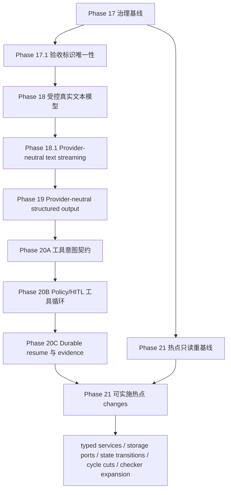

# Agent Harness Layer 架构演进长期计划

> 文档性质：living plan（持续更新的执行计划）
>
> 首次冻结：2026-07-27
>
> 当前状态：Phase 17.1 已由 `2e91771` 提交并归档；Phase 18 重启后 Reviewer 3 发现同步 Pydantic AI adapter seam 的既有 provider-adapter contract 未纳入 async 迁移，当前已补为第 18 个精确测试 owner；本次实质 diff 使旧 verdict 失效，随后从新的 Reviewer 1 重启全员通过的 `1+2` 门禁
>
> 配套矩阵：[`architecture-evolution-change-matrix.md`](architecture-evolution-change-matrix.md)

本文是长期架构演进的执行与交接入口。它记录目标、依赖、进度、证据、风险、恢复方式和下一动作，但不把文档勾选、测试通过或 `openspec validate` 当作生产能力已经交付的证明。行为实现是否完成，仍以对应 OpenSpec 变更契约、代码、测试、fresh review 和归档状态共同判断。

## 1. Purpose

本计划把现有可运行的 P0 基线演进为可受控接入真实模型、可用既有事件通道输出 provider-neutral 增量文本、可扩展结构化输出和工具循环、且关键模块边界可以持续收窄的 Agent Harness Layer。演进遵循以下目标：

1. 不做大爆炸重构；先冻结原则和安全约束，再按窄 OpenSpec change 演进。
2. 任何真实 provider 副作用发生前，都已经形成不可由请求扩大权限的冻结路由计划，并完成预算、策略和审计前置判断。
3. 保留 fake/local profile 的离线可测试性；真实 provider 失败不得静默伪装成 fake 成功。
4. 让架构规则中可机械判断的部分进入 checker、contract test 或 CI，文档只解释意图、边界和例外审批方式。
5. 把 handoff 作为一级交付物。上下文压缩、换 Agent、换 session 或换 worktree 后，接手者能从当前磁盘事实恢复，而不是依赖聊天摘要。

## 2. Handoff Snapshot

### 2.1 当前快照

| 项目 | 当前事实 |
|---|---|
| 快照日期 | 2026-07-28 |
| 分支 | `develop` |
| 冻结基线 HEAD | `2502fe7b7d10b1c461664213671de0c8ef757eb6`（`chore(agent-pack): 同步验证证据复用规则`） |
| 基线工作树 | 2026-07-28 Phase 18 启动前 `git status --short` 无输出 |
| 当前 Git 事务 | Phase 17.1 已由 `2e91771` 原子提交；用户已通过 `/goal` 授权 Phase 18，当前重冻结既有聚焦 OpenSpec 契约与状态真相，未修改生产代码、测试或配置 |
| OpenSpec | `acceptance-criteria-identity-uniqueness` 的 tasks `9/9`，已同步 `dual-ci-acceptance-evidence` 主规格并归档到 `openspec/changes/archive/2026-07-28-acceptance-criteria-identity-uniqueness/`；当前 active change 为 `controlled-real-model-runtime`，中文 artifacts 已形成冻结候选并通过 strict validation，契约 review 尚未通过 |
| 已完成历史 | Phase 1-16 已归档；归档事实以 Git、`openspec list --json` 和归档目录为准 |
| 当前阶段 | Phase 18 契约冻结阶段；重启后的 Reviewer 3 发现 `test_model_usage_provider_adapter_contracts.py` 仍依赖将删除的 `run_sync/_run_sync_with_timeout` seam，当前已补为第 18 个精确测试 owner并冻结原脱敏/usage 断言；红灯测试与生产实现尚未开始 |
| 前两项预定生产行为 change | 先 `controlled-real-model-runtime`，其完成并归档后再 `controlled-model-streaming`；两者都必须在 Phase 17.1 完成并归档后分别获得授权 |
| 当前阻塞 | 契约 `1+2` review 尚未通过；旧 Reviewer 1/2 曾对上一哈希 PASS，但重启后的 Reviewer 3 以 1 HIGH 发现第 18 个 async 测试所有权缺口。当前修订是实质 diff，旧 verdict 全部失效；必须重冻结并从新的 Reviewer 1 开始，Reviewer 1 PASS 后才可并行 Reviewer 2/3，三者必须全部 Stage 1/2 PASS |
| 明确未做 | Phase 18 fresh 契约 review 尚未 PASS，尚未建立红灯合同或生产实现；未接入真实模型；尚未执行已条件授权的 scoped 本地契约提交，也未执行其他 commit、真实 provider 调用、push、发布、部署、sync 或 archive；RUN-006 仍只是 committed CanonicalEvent reader |

`DEV-PLAN.md` 顶部已在本轮按当前 Git/OpenSpec 事实同步到 Phase 17，并保留 Phase 1-16 的历史阶段内容。后续 Agent 仍须按恢复顺序重新核对当前磁盘、Git 与 OpenSpec，不能把任一文档状态块当作无需验证的运行时事实。

### 2.2 新 session 的最小恢复顺序

接手 Agent 必须按以下顺序恢复上下文；只读完成前不得创建 change 或修改实现：

1. 完整读取本文件和配套 change matrix。
2. 读取 `Product-Spec.md`，至少核对 REQ-004、REQ-012、REQ-014、REQ-022、REQ-024、REQ-025、REQ-026、非功能需求和当前 P0 完成定义；再读取 `DEV-PLAN.md` 的当前状态、阶段依赖、相关历史 Phase 和风险，并用后续 Git/OpenSpec 检查验证其时效性。
3. 执行 `git branch --show-current`、`git rev-parse HEAD`、`git status --short`，把结果与本快照比较；有漂移时先记录到“Surprises & Discoveries”。
4. 执行 `openspec list --json`。若存在 active change，完整读取其 `proposal.md`、`specs/**/*.md`、`design.md`、`tasks.md`、元数据和关联侧车文档，再对照矩阵确认依赖与文件所有权。
5. 读取当前磁盘上的相关源文件和测试；仓库存在 `.codegraph/` 时先用 CodeGraph 重建 symbol/call-path 事实，不用本计划中的旧行号代替当前源码。
6. 在本文件的 Progress、Decision Log、Surprises 与 Handoff Snapshot 中记录本 session 的起点，再开始获授权的工作。

如果以上任一步出现无法解释的差异，默认停在只读调查状态；不得为了让计划“看起来一致”而覆盖用户或其他 worktree 的改动。

## 3. 冻结基线

### 3.1 2026-07-27 基线证据

| 检查 | 结果 | 结论边界 |
|---|---|---|
| `git branch --show-current` | `develop` | 只证明核对时所在分支 |
| `git rev-parse HEAD` | `7bbbaa2407280f0e73813431510f955fb8f649fe` | 本计划的初始比较基线，不冻结未来 HEAD |
| `git status --short` | 无输出 | 只证明开始写文档前工作树 clean；并行文档写入后预期会变脏 |
| `openspec list --json` | `changes: []` | 核对时没有 active change，不代表未来 session 仍为空 |

### 3.2 当前实现事实

以下事实来自 2026-07-27 当前磁盘源码，后续 change 起草前必须重新验证：

- `packages/agent-harness/src/agent_harness/runtime/services.py::build_agent_execution_services` 对非 `fake` 配置直接抛错，并把 `ModelRouterConfig.default_provider` 与 provider 映射硬编码为 fake。
- `packages/agent-harness/src/agent_harness/config/schemas.py::ModelSettings` 目前只有 `provider`、`requires_api_key`、`default_model`、`timeout_seconds`，不足以表达受控真实 deployment。
- `packages/agent-harness/src/agent_harness/config/settings.py::load_settings` 的实际合并顺序是 profile YAML → agent YAML → `.env` → secret file → direct process env → explicit overrides；`.env` 只消费 `AGENT_HARNESS_*`，`_FILE` 只允许来自进程环境。
- `packages/agent-harness/src/agent_harness/models/providers.py::ModelRequest` 把 `provider` 默认成 `fake`；`ModelRouter.plan` 又优先采用请求中的 provider。未来注册真实 provider 后，如果不先收紧，这会允许请求绕过 deployment 和 agent 已冻结策略。
- `packages/agent-harness/src/agent_harness/registry/descriptor.py::AgentModelPolicy` 目前只有单一 `provider`、`default_model` 和 `fallback_models`，尚未表达 deployment 与 agent 两级 allowlist 的交集。
- `packages/agent-harness/src/agent_harness/adapters/models/pydantic_ai.py::PydanticAIModelProvider` 只接收 instructions/factory，把 `result.output` 转为字符串；线程池外层 timeout 只能停止等待，不能取消已经开始的网络调用。
- `ModelProvider` / `ModelRouter.execute` / `ModelInvocationService.complete` 当前只有一次性完整 response seam；模型生产路径只发布 request-started 与最终 usage evidence。虽然事件枚举已有 `model.output.delta` / `model.output.completed`，RUN-006 与 CLI 只读取已持久化事件，不能生产或恢复 provider stream。
- 当前 model usage operation 的 event-capacity binding 只覆盖固定 started/final prerequisite；streaming 若逐 SDK token 入 event 会突破副作用前有界预约不变量。Phase 18.1 必须先冻结最大 delta/coalescing、稳定 identity、跨 chunk 安全与 partial settlement。
- Phase 17.1 开始前，`Product-Spec.md` 与 `docs/acceptance-matrix.md` 各有两个语义不同的 `AC-070`，导致 policy 映射覆盖和 matrix validator 重号失败。当前 live 规格已保留 dependency lock `AC-070`，把 API docs 迁移为 `AC-089`，并新增全局唯一性门禁；历史归档保持不变。
- composition 仍存在字符串键 service locator，具体 `SQLAlchemyStorage` 依赖扩散，运行状态分支逐渐变厚，并已发现两个跨域语义强连通分量。这些是 Phase 21 的调查入口，不是尚未复核就可直接重构的结论。

## 4. 范围与非目标

### 4.1 长期范围

- Phase 17：治理基线与可执行架构约束。
- Phase 18：受控真实文本模型 runtime。
- Phase 18.1：provider-neutral 普通文本增量流，复用 CanonicalEvent / RUN-006 / CLI transport。
- Phase 19：provider-neutral structured output；不包含 structured streaming。
- Phase 20：经 `ToolRegistry`、`PolicyEngine` 与 HITL 的工具型模型循环。
- Phase 21：typed services、storage ports、显式状态转换和跨域 cycle 等热点 seam。
- 每个行为变化先形成窄 OpenSpec change；共享接口、共享验收或共享文件存在时，按关联 change 处理。

### 4.2 本轮非目标

本轮是已获授权的 Phase 18 `controlled-real-model-runtime` 契约收口，Phase 17.1 已完成 scoped local commit。当前只完成变更契约全票 1+2 审查，并在全员 PASS 后创建一次 scoped 本地契约提交；TDD 与受控真实非流式文本模型 runtime 实现移交新会话。本轮不做以下事项：

- 不创建或实现 `controlled-model-streaming` 或其他 Phase 18.1+ change，不把非流式基线描述成 streaming 已可用。
- 不夹带 structured output、tool loop、多 provider 运维控制面、Vault/KMS、依赖升级或无契约依据的大重构。
- 不同步或归档 OpenSpec 主规格，不改写 `openspec/changes/archive/` 的历史事实。
- 不改写 `DEV-PLAN.md` 的 Phase 1-16 历史交付与证据；仅为避免历史快照冒充当前状态而补充明确的时间限定。
- 除上述已条件授权的一次 scoped 本地契约提交外，不执行其他 commit、push、发布、部署或真实 provider 调用；后续实现提交、sync 或 archive 都需要用户另行明确授权。

### 4.3 Phase 18 的硬性非目标

首个实现 change `controlled-real-model-runtime` 只交付受控真实文本生成。以下能力必须留在后续 change，不得以“顺手复用 SDK”为由夹带：

- structured output 或业务 schema 解析；
- model-driven tool call、tool loop、HITL resume；
- token/event streaming；该项不是无序后置，而是明确交给紧随其后的 Phase 18.1 `controlled-model-streaming`；
- 多 provider 自动故障切换、动态发现、热重载控制面或大规模运维；
- Vault/KMS/完整 `SecretProvider` 平台；
- 业务 agent 直接接触 provider SDK 对象。

## 5. 冻结原则与配置边界

完整工程原则以 `docs/engineering-principles.md`、`docs/engineering-principles.zh-CN.md` 和 `CONTRIBUTING.md`、`CONTRIBUTING.zh-CN.md` 为维护入口。本计划只冻结与阶段执行直接相关的约束：

1. **请求只能缩权。** deployment policy 与 agent policy 先求交集；请求只能在交集中选择，不能添加 provider、model、capability、endpoint 或 credential。
2. **先冻结 route plan，再发生授权副作用。** route plan 至少包含 deployment identity、provider、model、capabilities、endpoint policy、price catalog identity 和超时/重试策略；随后才做预算预约、授权成功审计和 provider 调用。校验失败仍可记录去敏拒绝审计。
3. **secret 与普通配置分层。** 提交的 YAML 只允许非敏感默认、allowlist、credential reference 和安全策略；本地开发可从被忽略的 `.env` 注入秘密，服务部署使用 direct process env 或受控 `/run/secrets` 文件，三者都必须汇入同一 typed settings 与脱敏边界。
4. **`.env` 只是本地便利层。** 它必须保持 gitignored，只消费 `AGENT_HARNESS_*`，不等于 secret manager，也不允许触发 `_FILE` 读取。
5. **direct / file 冲突 fail closed。** 同一 secret 的 direct env 与对应 `_FILE` 同时存在时，在读取 provider、构造 client 或应用 overrides 前失败。
6. **endpoint 是安全边界。** `base_url` 通常不是秘密，但必须经过 HTTPS、host allowlist、credential-forwarding guard 校验；loopback 仅在显式 local policy 下例外，不能因字符串看起来像 localhost 就自动放行。
7. **timeout 必须分层。** connect、read、total timeout 分开表达；SDK/client 层负责实际 I/O 边界，线程池等待超时不能被宣传为已取消网络副作用。
8. **重试必须可解释。** 只重试被契约明确分类为安全的前置失败；调用结果未知时进入可追踪的 unknown/needs-review 路径，不能为了“提高成功率”盲目重复计费副作用。
9. **离线基线永久保留。** fake provider 是显式 profile/测试选择，不是真实 provider 失败时的静默 fallback。
10. **公开 DTO 不泄漏 SDK。** provider 原始 result、client、exception body、secret 或连接对象不得穿过 adapter、event、trace、audit、eval 或 checkpoint 边界。

## 6. 阶段 DAG



默认按图中的拓扑顺序执行。Phase 21 的只读 inventory 可以和前序实现的认知调查并行，但任何 Phase 21 写入都必须同时满足：前置行为 seam 已稳定、矩阵重新确认文件无冲突、没有共享验收、没有共享接口变更。仅仅“改的是不同函数”不构成并行证明。

## 7. 阶段计划与完成标准

### 7.1 Phase 17：治理基线与可执行架构约束

**目标**

- 把架构原则、贡献路径、长期计划、change 关系、session 更新和 handoff 规则放到仓库内。
- 将可机械判断的规则分配给后续 change 的 checker、contract test 或 CI；未实现 checker 的规则必须明确标为文档约束。
- 建立事实优先级：当前磁盘与 Git/OpenSpec 高于聊天摘要和陈旧状态块。

**交付与边界**

- 本文件与 `architecture-evolution-change-matrix.md`。
- `docs/engineering-principles.md`、`docs/engineering-principles.zh-CN.md`。
- `CONTRIBUTING.md`、`CONTRIBUTING.zh-CN.md`。
- 机械规则不单独抢占首个实现 change；由触及该边界的后续窄 change 同步补 checker/contract/CI，并在 tasks 中列出。

**退出门禁**

- 四类治理文档互相引用一致，没有把计划状态写成代码完成状态。
- 本计划与矩阵通过 Markdown 路径、结构和 `git diff --check` 自检。
- 未来第一条行为变更仍是 `controlled-real-model-runtime`。
- 对文档范围完成独立静态审查；如审查后有实质 diff，重新审查受影响内容。

**独立治理修复**

Phase 17.1 开始前的重复 `AC-070` 已由独立窄 change `acceptance-criteria-identity-uniqueness` 处理并归档，没有塞进真实模型 change，也没有改写历史归档材料。该治理修复不改变“首个生产行为实现 change 是 `controlled-real-model-runtime`”的决策；Phase 18 仍须获得用户明确授权后才能创建和实现。

**Codex 执行时间估计**

- 文档落盘、交叉核对与修订：4-8 小时；不含等待 reviewer 配额或用户裁决的时间。

### 7.2 Phase 18：`controlled-real-model-runtime`

**目标**

在保持 fake/local 离线路径的同时，让一个显式配置、显式授权的真实文本模型 deployment 通过 provider-neutral runtime 完成调用、预算结算、审计和错误收敛。

**配置契约至少包含**

- 稳定 `deployment_id` 与 `provider_kind`；
- deployment 级 allowed/default/fallback models；
- endpoint/base URL policy，包括 HTTPS、host allowlist、credential forwarding 和显式 loopback 例外；
- endpoint policy 绑定的可选 completion classifier identity；默认/官方 endpoint 未绑定时 response retry 集合为空；
- `credential_ref`，以及 direct env / `_FILE` 的受控解析；
- connect/read/total timeout；
- 有界 retry/backoff 和不可重试/结果未知分类；
- concurrency limit / bulkhead；
- 受信 model catalog reference/version/digest、request-shape、输入上界与 price source；deployment 只引用，不自证 envelope/价格；
- capability flags，首 change 只允许 text completion。

**路由与执行顺序**

1. 从 profile、agent descriptor 与 typed settings 解析 deployment。
2. 计算 deployment allowlist 与 agent allowlist 的交集。
3. 用请求进行缩权选择；任何扩大或未知值在零 provider 副作用时失败。
4. 通过受信 endpoint/model catalogs 冻结 `ModelRoutePlan`，包含 endpoint、credential ref identity、model catalog ref/version/digest、request-shape、输入上界/价格、completion classifier identity、capabilities、timeout/retry 与 model，并完成 prompt/output/strategy/price/公式等动态 hard eligibility；失败时 reservation/client/network 均为零。
5. 用 bound execution identity 执行 exact `PolicyCheck(action=model.invoke, resource=agent:<agent_id>:model)` 并由既有 `AuditService` 写 `policy.decision`。Deny 或等待既有 `policy_approval` checkpoint/ApprovalRecord 时 reservation/permit/client/mark/network 均为零；获批 continuation 必须验证全绑定、单次 lease并重新检查 hard route/catalog/current owner balance。
6. Policy 允许或有效审批 continuation 通过后，建立共享预算/settlement reservation，再取得 deployment Bulkhead permit；此时仍未构造真实 client、未写 durable mark、未联网。Policy audit 只证明原始 decision，不证明 provider 已开始。
7. 从 composition 注入的 lazy factory 获取或构造绑定 frozen route 的 client lease；构造不得联网，失败按 not-started 回滚 reservation/permit，mark/network delta 均为零。
8. Client lease 成功后提交 durable `side_effect_started`，最后 adapter send；重试复用同一 reservation/permit/client lease/mark。只有 endpoint policy/version 绑定受信 completion classifier 且 exact signal 为 not-started 时才允许 429/5xx response retry，否则 unknown/no-retry。
9. 归一化 text、usage、cost、latency、attempt 和错误 evidence，完成结算；原始 SDK 对象不外泄。

**关键兼容要求**

- 现有 fake tests、eval 和 local smoke 不需要真实 credential。
- 真实 provider 配置无效时 application startup fail closed；不能到第一次 run 才隐式猜配置。
- 真实 provider 失败不能自动切 fake。配置的 fallback 只能来自冻结 allowlist，并重新走预算/策略判断。
- provider smoke 必须显式 opt-in；缺本会话授权、opt-in、隔离 credential 或受信 endpoint 时记录 `hosted-unverified` 并保持零调用；仅在已授权且本地条件完整后发生外部网络/provider 阻断时记录 `external-blocked`。两者都不能伪造 PASS，默认离线 CI 以 skipped evidence 记录 hosted-unverified。
- 如果 total timeout 到达但 SDK 调用无法确认取消，状态必须表达副作用未知，并禁止自动重试。

**预计核心文件面**

- `packages/agent-harness/src/agent_harness/config/{schemas.py,settings.py,secret_files.py}`
- `packages/agent-harness/src/agent_harness/models/{providers.py,router.py,invocation.py}`
- `packages/agent-harness/src/agent_harness/adapters/models/pydantic_ai.py`
- `packages/agent-harness/src/agent_harness/runtime/services.py`
- `packages/agent-harness/src/agent_harness/registry/{descriptor.py,_loader.py,registry.py}`
- `packages/agent-harness/src/agent_harness/{scaffold_templates.py,_scaffold_support.py}` 与 `tests/contracts/test_agent_scaffold_validation_atomicity_contracts.py`
- `templates/service-app/configs/profiles/**`、`templates/service-app/agents/**/config.yaml`、`.env.example`
- 对应 contract/integration/smoke tests 与维护文档

**退出门禁**

- OpenSpec proposal/spec/design/tasks 严格校验通过，并经 fresh code-reviewer Stage 1/2 PASS 后才开始实现。
- 先有失败的配置、越权、endpoint、timeout/retry、预算和 adapter regression，再实现。
- `make quality`、相关 contract/integration tests、`make smoke-local` 通过；如果触及 service composition，再跑 `make smoke-service`。
- 至少一个真实 provider opt-in smoke 在四项前置齐全且另行授权时有去敏证据；任一前置缺失时唯一保持 hosted-unverified/CI skipped，条件齐全后发生外部阻断才记 external-blocked，均不据此宣称真实端到端已验证。
- 代码审查确认首 change 没有夹带 structured output、tool loop、streaming 或多 provider 运维。

**Codex 执行时间估计**

- 契约、实现、离线验证、修复与文档：20-32 小时。
- 真实 provider smoke：额外 1-3 小时墙钟时间，受 credential、网络、配额和 provider 服务状态影响；等待不计入 Codex 主动执行时间。

### 7.3 Phase 18.1：`controlled-model-streaming`

**目标**

在 Phase 18 已冻结的 deployment、route、budget、cancel 与 provider 生命周期上，增加 provider-neutral 普通文本增量 producer；所有客户端仍从 committed CanonicalEvent 读取，不新增 provider cursor、SDK resume token 或第二套 stream endpoint。

**冻结契约至少包含**

- 异步、可取消的 provider-neutral text stream protocol，以及 Pydantic AI / fake adapter 的 append-only fragment 与 final result 归一化；
- provider 副作用前固定的 stream operation kind、最大 delta 数、单片 envelope、chunk/coalescing 与 event-capacity reservation；
- 稳定 operation/attempt/chunk identity，以及 `started → delta* → output completed → usage updated → run terminal` 的 durable 顺序；
- `model.output.completed` 的最终长度、checksum 或 artifact reference，使 committed prefix 可验证；
- 跨 chunk 有状态的脱敏与输出安全；完整结果才能判断时，不得先公开 speculative delta；
- SSE/CLI reader 断线只停止读取；显式 run cancel/deadline 才传播 provider cancel；调用结果未知时保留 prefix/reservation、禁止 retry/fallback、零成本结算、假 completed 与提前 terminal；
- provider iterator、event commit 与 capacity consumption 的有界背压，以及 SQLite/PostgreSQL crash recovery；
- SSE 已有事件首 frame、provider 首 delta、首个 committed delta 和客户端收到 delta 的独立时延证据。

**非目标**

- structured streaming、reasoning 暴露、tool-call streaming、tool loop；
- WS、AG-UI / Vercel AI adapter、retention、provider failover、多订阅控制面；
- 让慢 SSE subscriber 直接拥有或取消 provider 生命周期。

**预计核心文件面**

- `models/{providers.py,router.py,invocation.py,_invocation_settlement.py,usage_events.py}`；
- `adapters/models/{pydantic_ai.py,fake.py}`；
- `events/{capacity.py,bus.py}`、`storage/{event_capacity_repositories.py,usage_evidence_repositories.py,evidence_repositories.py}`；
- local/PostgreSQL event sinks、runtime/service composition、`API-Contract.md` 与 model/capacity/recovery/SSE/CLI tests；
- 若现有 outbox 无法表达 stream progress，需先在 design 中证明 migration、并发、恢复和旧 binary 行为，不能暗中扩大 schema。

**退出门禁**

- Phase 17.1 与 Phase 18 均已验证、fresh review、同步并归档；`controlled-model-streaming` 的中文 proposal/spec/design/tasks 与先行 API/event contract 通过 strict + fresh Stage 1/2 review。
- AC-085 至 AC-088 先有 local/真实 PostgreSQL red contracts，再实现；未修复 AC identity 唯一性前不得写入假 acceptance mapping。
- 正常、跨 chunk secret、容量耗尽、storage 慢、显式取消/deadline、unknown、reader 断线/重连、crash recovery 与终态 fencing 全部有证据。
- 默认 fake/local/CI 不触网；真实 streaming smoke 也继承 Phase 18 的四前置状态机：缺本会话授权、opt-in、隔离 credential 或受信 endpoint 任一项时保持零调用并记录 hosted-unverified/CI skipped；仅在前置完整且已授权后发生网络、配额或 provider 故障时记录 external-blocked。
- fresh 实现审查确认没有夹带任何非目标；实质修订后重新从 Stage 1 审查。

**Codex 执行时间估计**

- 契约、实现、SQLite/PostgreSQL recovery、离线验证和 review/fix：20-30 小时。
- 若需要新 migration，冻结 design 后重新估算，当前保守区间 24-36 小时；真实 provider streaming smoke 另 1-3 小时墙钟，不含外部等待。

### 7.4 Phase 19：provider-neutral structured output

**目标**

在 Phase 18.1 已稳定的 deployment/route/provider/invocation/result seam 上，增加 provider-neutral 的输出 schema、验证、失败分类和 evidence；业务 schema 不依赖 Pydantic AI result 类型。

**范围**

- 用稳定 schema reference / version 表达期望输出。
- 区分文本、结构化成功、schema invalid、provider capability unsupported 和结果未知。
- 把 provider-native structured output 适配到统一 DTO；必要的修复尝试有严格次数和成本边界。
- 保持 text-only 调用兼容，不能为了结构化输出重写 Phase 18 的安全路由顺序。

**非目标**

- 不执行工具；不把 tool call 当结构化业务输出。
- 不引入 streaming 增量 schema 拼装。

**退出门禁**

- change 只依赖 Phase 18.1 已归档的公开 seam；Phase 18.1 仅交付普通文本流，不代表 structured streaming 已存在。
- 多个 adapter 替身 contract tests 证明公共 DTO 不泄漏 SDK 类型。
- schema mismatch、repair exhaustion、预算不足和 unsupported capability 均在可追踪状态结束。

**Codex 执行时间估计**

- 16-28 小时。

### 7.5 Phase 20：受策略控制的工具型模型循环

Phase 20 不做成一个巨型 change，默认拆为三个串行 change：

1. **工具意图契约**：模型只能产生 provider-neutral tool intent；参数先做 schema 和来源校验，不执行工具。
2. **Policy/HITL 工具循环**：tool intent 必须经 `ToolRegistry` allowlist、`PolicyEngine`、审计和 HITL；危险动作在批准前无工具副作用。
3. **Durable resume 与 evidence**：冻结 loop/turn/tool-call identity，覆盖 checkpoint、resume、exact replay、未知执行、最大 turn/cost/token 边界和 terminal fencing。

**硬性顺序**

`model output → tool intent DTO → ToolRegistry resolve → policy/audit → optional approval/checkpoint → tool execution → result sanitization/truncation → context assembly → next model turn`

任何 adapter 都不能直接调用工具；任何恢复路径都不能跳过 registry/policy/HITL。工具结果按不可信输入重新进入 context assembly。

**退出门禁**

- 三个 change 各自 strict validation 和独立 review；因为共享 loop DTO、事件和验收，还需在实现前后做关联 change 联合审查。
- approval 前零工具副作用；exact replay 不重复执行工具或模型调用；unknown 不能自动伪装为可重试。
- turn、token、cost、工具输出大小和 wall-clock 均有显式上界。
- local fake/tool stub、contract、integration、checkpoint/resume 和 service smoke 证据完整。

**Codex 执行时间估计**

- 三个 change 合计 28-45 小时；真实 provider + 真实外部 tool 的可选 smoke 另计外部等待。

### 7.6 Phase 21：架构热点 seam

**目标**

在前序行为稳定后，用可回归验证的小 change 收窄结构热点，不把“更好看”当成验收：

- 用 typed execution services 替代字符串键 service locator，明确 executor 可见能力。
- 把核心用例对具体 `SQLAlchemyStorage` 的依赖收敛到最小 storage ports / UoW seam。
- 把变厚的 run state 分支收敛为显式、可穷举、可审计的状态转换。
- 对最新 CodeGraph 和源码确认的跨域语义 SCC 逐个切断；每次只切一个稳定 seam。
- 把已经稳定且可机械判断的层依赖、public/internal seam、vendor/ORM/config 规则按规则族逐步接入 checker、contract test 或 CI。

**执行约束**

- 先做只读重基线，记录 symbol、call path、测试覆盖和文件集；历史图只作线索。
- 结构 change 必须有行为等价 contract，不能借重构修改公开语义。
- typed services、storage ports、state transitions 默认串行，因为它们很可能共享 composition/runtime 文件。
- 两个 cycle cut 只有在最新证据证明无共享接口、验收、文件和顺序依赖时才可分 worktree 并行。

**退出门禁**

- 每个 change 的 blast radius、public seam、回滚点和等价性测试在 proposal/design 中明确。
- 机械 checker 能验证的新规则进入 `scripts/`、contract test 或 CI；规则尚不能可靠机械判断时保留为 review checklist，不写脆弱文本扫描冒充约束。
- 全量质量、contract/integration 与受影响 smoke 通过，fresh review 对架构收益和行为等价均 PASS。

**Codex 执行时间估计**

- 只读重基线 2-4 小时；首批五项窄 change 合计 50-90 小时。若最新依赖图与当前发现差异较大，先更新本计划再重新估算。

## 8. Progress

勾选只表示对应计划动作有证据完成，不表示其后的生产能力自动完成。每条完成项必须带日期；跨 session 更新时保留历史，不把旧项重写成新结论。

### Phase 17

- [x] 2026-07-27：用户通过 `/goal` 明确授权 Phase 17.1；在 `develop@4922784d0057`、clean worktree、无 active change 的基线上开始单 owner 串行治理。
- [x] 2026-07-27：完成 live/历史 `AC-070` inventory 与 Git 引入顺序核对；保留先出现的 dependency lock `AC-070`，将后出现的 API docs identity 迁移到未占用的 `AC-089`，归档材料保持不可变。
- [x] 2026-07-27：创建 `acceptance-criteria-identity-uniqueness`，完成中文 proposal/spec/design/tasks，并通过 `openspec validate acceptance-criteria-identity-uniqueness --type change --strict`。
- [x] 2026-07-27：首轮 fresh artifact review 完成；行为契约本身覆盖完整，但因 living plan、change matrix 与 `DEV-PLAN.md` 的授权、active change、strict 状态和唯一下一动作冲突，Stage 1 以 1 HIGH FAIL；未进入实现。
- [x] 2026-07-27：修复首轮状态真相冲突并重新 strict validation；第二轮 fresh artifact review 确认该 HIGH 已闭合，但发现 `test_dev_plan_reports_archived_uv_change` 的陈旧全局 active 状态断言未纳入 tasks，Stage 1 以 1 MEDIUM FAIL；未进入实现。
- [x] 2026-07-27：把 dependency 状态合同的 red-first 修订纳入 proposal/design/tasks/所有权并重新 strict validation；第三轮 fresh artifact review 确认任务闭环，但发现文档仍把已完成的修订和 strict 写成下一动作，Stage 1 以 1 MEDIUM FAIL；未进入实现。
- [x] 2026-07-27：将 Phase 16 的“无 active change”限定为当时归档快照，并把当前状态统一为修订与 strict 已完成。
- [x] 2026-07-27：第四轮 fresh artifact review 确认前三轮 findings 均闭合，但发现 change matrix 的 Phase 17 历史行仍保留“final review 后 amend”的陈旧待办，Stage 1 以 1 MEDIUM FAIL；未进入实现。
- [x] 2026-07-27：把 Phase 17 矩阵行改为已落入 `4922784d` 的历史终态，删除陈旧待办。
- [x] 2026-07-27：第五轮 fresh artifact review 完成，Stage 1/2 与 Spec/Standards 双轴 PASS，0 HIGH / 0 MEDIUM / 0 LOW；允许进入 TDD 红灯。
- [x] 2026-07-27：用户明确要求先提交文档再继续开发；提交范围仅含当前 Phase 17.1 状态文档与 OpenSpec artifacts，不 push。
- [x] 2026-07-27：用户授权后的范围/权限状态补丁使第五轮 verdict 失效；后续审查继续发现并修复 commit 权限冲突、Phase 17 旧范围、实现状态虚报和两处 DEV-PLAN 陈旧状态，未据旧 verdict 提交。
- [x] 2026-07-27：用户明确裁决状态类 artifact review finding 不再阻断开发；以 `owner-waived` 进入 TDD，不把该裁决写成 reviewer PASS，也未提交文档候选。
- [x] 2026-07-27：完成 tasks 1.1-1.3 红灯；同 REQ/跨 REQ 重号、`AC-089` producer/test/live 迁移共 5 项按预期红，陈旧 uv change 状态合同先红后收窄为只约束自身归档。
- [x] 2026-07-27：在分组前增加 Product Spec live AC 全局计数；保留 dependency lock `AC-070`，把 API docs 迁移为 `AC-089`，同步矩阵、required policy、changelog，并证明 archive 零 diff。
- [x] 2026-07-27：聚焦合同 PASS；`make quality` PASS；`make test` 为 `1352 passed, 223 skipped`。随后仅修订不合规注释并把 `AC-065/066` 原文移回矩阵已声明的 `REQ-022`，按用户要求不重跑全量，受影响 Ruff 与 validator 合同 PASS。
- [x] 2026-07-27：fresh 实现 review 对冻结代码与契约给出 Stage 1/2 PASS，0 HIGH、0 MEDIUM；唯一 LOW 为三处陈旧状态措辞，按用户授权只修状态文档，不重跑测试、不重开 review。
- [x] 2026-07-27：用户明确授权按正式门禁重生实现冻结 evidence；identity `8789075d…42d15` 下 18 个 CI producer gate 全部 PASS，`test-aggregate` 为 `1352 passed, 223 skipped`，direct validator 为 `98/98`，strict validation 与 `git diff --check` PASS。
- [x] 2026-07-27：随后只勾选 tasks 并同步 ready-to-archive 状态；owner 纠正“只改状态没必要再跑证据”，已停止第二轮刷新。被取消的刷新不作为证据，ready-to-archive 结论复用前述冻结结果。
- [x] 2026-07-28：用户明确选择同步并归档；将 delta 智能合并到 `dual-ci-acceptance-evidence` 主规格，逐段比较无差异后执行归档，目标为 `openspec/changes/archive/2026-07-28-acceptance-criteria-identity-uniqueness/`。
- [x] 2026-07-27：核对分支、HEAD、初始工作树和 OpenSpec active list。
- [x] 2026-07-27：读取当前 Product Spec、DEV-PLAN 相关范围及模型/config/runtime 关键源码。
- [x] 2026-07-27：创建长期计划与 change matrix，并写入 handoff 规则。
- [x] 2026-07-27：核对工程原则与贡献指南四份文件的最终路径、互链和语义一致性。
- [x] 2026-07-27：完成 Phase 17 文档 fresh 独立静态审查；首轮 3 MEDIUM + 1 LOW 已修订，冻结后 Stage 1/2 PASS。
- [x] 2026-07-27：完成无对话 fresh handoff 复原测试；修复陈旧 Phase 13 风险状态和 fake fallback/change identity 歧义后 PASS。
- [x] 2026-07-27：在主控独占范围内按当前 Git/OpenSpec 事实同步 `DEV-PLAN.md` 顶部状态与 Phase 17-21 索引，不改写 Phase 1-16 历史证据。
- [x] 按用户 `owner-waived` 的 artifact 状态门禁裁决，用 TDD 修复重复 `AC-070` 的规格/验收 identity；不把 waiver 记成 reviewer PASS。

### Phase 18

- [x] 2026-07-28：用户通过 `/goal` 明确授权 Phase 18；在 `develop@2502fe7b7d10`、clean worktree、无 active change 的基线上开始单 owner 串行恢复与契约起草。
- [x] 2026-07-28：创建 active change `controlled-real-model-runtime`，完成中文 proposal/spec/design/tasks 并通过 strict validation；这只证明契约可解析，不代表契约 review 或实现完成。
- [x] 2026-07-28：修复上一轮状态真相、live smoke 状态与 retry status 的 3 项 MEDIUM并重新 strict；随后 fresh Reviewer 1 发现 reservation/provider cap、provider identity、Phase 18.1 smoke 状态和 handoff 真相 1 HIGH / 3 MEDIUM，未进入 Stage 2。
- [x] 2026-07-28：补齐输入上界、output cap 强制、token/cost 公式、唯一 provider identity 和后继 smoke 状态，并同步当前 handoff；修订候选重新 strict validation PASS。
- [x] 2026-07-28：下一轮 fresh Reviewer 1 发现锁定 OpenAI SDK 仍检查 ambient identity/header env，且动态预算拒绝早于 client 构造与 startup 预构造 client 相冲突；Stage 1 以 2 HIGH FAIL，未进入 Stage 2。
- [x] 2026-07-28：改为不修改进程环境的私有 lazy client factory + 出站 header/origin allowlist transport；动态 hard eligibility 失败固定 reservation/client/network 三类计数为零，合法 route 在 reservation/permit 后才获取 client lease；修订候选重新 strict validation PASS。
- [x] 2026-07-28：下一轮 fresh Reviewer 1 发现跨 artifacts 未完整固定 client lease → 当时拟引入的独立授权记录顺序、`completion_observed=false` 缺少可信生产来源，且 change matrix 漏列 CLI/CI/lifecycle ownership；Stage 1 以 2 HIGH / 1 MEDIUM FAIL，未进入 Stage 2。
- [x] 2026-07-28：补入 endpoint policy 绑定的 `trusted_response_header_not_started/v1`、原始单值 header 判定与默认 endpoint 禁止 response retry；同步逐边界顺序、snapshot/evidence identity、冻结测试节点及 CLI/CI/lifecycle 所有权，修订候选重新 strict validation PASS。
- [x] 2026-07-28：下一轮 fresh Reviewer 1 确认行为契约已闭合，但发现矩阵/proposal 未精确列出 shared-budget、settlement helper、公共 exports 与独立 live-smoke 脚本；Stage 1 以 1 MEDIUM FAIL，未进入 Stage 2。
- [x] 2026-07-28：补齐 `runtime/shared_budget.py`、`models/_invocation_settlement.py`、config/model exports 与 `scripts/smoke_live_model.py` 的独占所有权，并明确现有 API/worker/eval caller 继续复用 `RuntimeComponents.close()`；若红灯要求修改入口或 repository，必须先扩充契约并重新 review。修订候选重新 strict validation PASS。
- [x] 2026-07-28：下一轮 fresh Reviewer 1 确认其余契约与所有权闭合，但 `adapters/models/fake.py` 未精确纳入 async provider 迁移范围；Stage 1 以 1 MEDIUM FAIL，未进入 Stage 2。
- [x] 2026-07-28：在 proposal/design/tasks/change matrix 与长期所有权规则中逐字补入 `adapters/models/fake.py`；修订候选重新 strict validation PASS。
- [x] 2026-07-28：下一轮 fresh Reviewer 1 发现 `openai` 尚未进入公共 banned vendor 集合，且 `contracts/boundaries.py`、`scripts/import_boundary_check.py` 与 checker regression 未纳入冻结所有权；Stage 1 以 1 HIGH FAIL，未进入 Stage 2。
- [x] 2026-07-28：把 vendor boundary 声明、通用 import checker 与 `test_vendor_boundary_doctor_contracts.py` 纳入 proposal/design/tasks/change matrix 和长期所有权，并要求先建立 `openai` 越界导入红灯；修订候选重新 strict validation PASS。
- [x] 2026-07-28：下一轮 fresh Reviewer 1 发现现有 boundary 按任意 `adapters`/`integrations` 路径片段放行，模板 app 或业务 Agent 可用误导性同名子目录绕过；Stage 1 以 1 HIGH FAIL，未进入 Stage 2。
- [x] 2026-07-28：把允许范围冻结为仓库相对前缀 `packages/agent-harness/src/agent_harness/adapters/`，明确当前没有额外 integration root，并在 spec/design/tasks 中要求模板 Agent `adapters` 与 template app `integrations` 伪造路径负向回归；修订候选重新 strict validation PASS。
- [x] 2026-07-28：下一轮 fresh Reviewer 1 发现生产 adapter 直接构造 `AsyncOpenAI`，但 `openai` 只作为传递依赖存在，且直接 dependency、lock 关系、license policy 与 build/license 验证未冻结；Stage 1 以 1 MEDIUM FAIL，未进入 Stage 2。
- [x] 2026-07-28：选择把当前 lock 已有 `openai==2.44.0` 提升为核心 `openai>=2.44.0,<3` 直接依赖，不改变 207 项 package identity；纳入 core pyproject、uv.lock、Apache-2.0 third-party policy、dependency/license contracts、`uv lock --check`、build 与 license gate。修订候选重新 strict validation PASS。
- [x] 2026-07-28：下一轮 fresh Reviewer 1 发现 ready-to-archive 验证未显式运行独立 `make eval`，且 durable mark 前取消的确定性回滚、`model.invocation_cancelled` 与 source link 未完整进入 OpenSpec；Stage 1 以 2 MEDIUM FAIL，未进入 Stage 2，Reviewer 2/3 未派发。
- [x] 补齐上述两项契约并重新 strict validation PASS，随后从新的 fresh Reviewer 1 重启全员通过的 `1+2` 门禁。
- [x] 2026-07-28：新一轮 Reviewer 1 Stage 1/2 PASS 后才并行派 Reviewer 2/3；Reviewer 3 Stage 1/2 PASS，但 Reviewer 2 因本 change 新增的 `API-Contract.md` 正文以 `Phase 18/18.1` 限定长期语义而以 1 MEDIUM Stage 2 FAIL，因此三人全员门禁未通过，未进入红灯或实现。
- [x] 将上述四处开发阶段标签改为稳定的受控真实非流式文本能力、`MOD-002` seam 与受控增量文本流契约措辞，并重新 strict validation PASS。
- [x] 2026-07-28：下一轮 fresh Reviewer 1 确认 API Contract 新增行已清除开发阶段叙事，但发现 `typed-config` 两处与 `agent-registry-model-context` 一处拟同步 requirement 仍用 `Phase 18` 限定稳定 strategy/classifier/provider identity；Stage 1 PASS、Stage 2 以 1 MEDIUM FAIL，Reviewer 2/3 未派发。
- [x] 将三处 delta requirement 改为受控真实非流式文本能力或 `MOD-002` seam 措辞，并重新 strict validation PASS。
- [x] 2026-07-28：下一轮 fresh Reviewer 1 在 Stage 1 PASS 后发现拟同步 budget snapshot requirement 仍写 `P0 delegation targets`；该优先级标签不是稳定协议/领域标识，Stage 2 以 1 MEDIUM FAIL，Reviewer 2/3 未派发。
- [x] 将 `P0 delegation targets` 改为稳定的单层 delegation targets 能力措辞；三份 delta 的 `P0/P1/Phase N` 扫描为空，重新 strict validation PASS。
- [x] 2026-07-28：下一轮 fresh Reviewer 1 发现每个 Agent config 新增必填 `deployment_id`/`allowed_models` 后，现有 `scaffold_templates.py` 仍生成旧字段，且 `_scaffold_support.py`、正式 Registry/离线运行回归及文件所有权未进入契约；Stage 1 以 1 MEDIUM FAIL，Reviewer 2/3 未派发。
- [x] 纳入 scaffold 生产生成器、验证支持与聚焦 contract，冻结 `fake_default`/`fake-scaffold`、正式 Registry 和离线 runtime 行为，并重新 strict validation PASS。
- [x] 2026-07-28：下一轮 fresh Reviewer 1 发现 `API-Contract.md` 的 `examples.basic` descriptor 仍使用 `fake_local`，与 canonical `fake_default` 冲突；同时 `DEV-PLAN.md` Phase 18 章节状态仍停在更早 `openai` 直接依赖审查轮次。Stage 1 以 2 MEDIUM FAIL，Reviewer 2/3 未派发。
- [x] 统一 API descriptor 为 `fake_default`，同步 DEV-PLAN Phase 18 章节状态，并重新 strict validation PASS。
- [x] 2026-07-28：尝试为上述冻结候选创建新的 fresh Reviewer 1，首次派发及三次 10 秒间隔重试均返回 `agent thread limit reached`；按容量门禁停止，不复用旧 reviewer、不派 Reviewer 2/3、不进入红灯或实现。
- [x] 2026-07-28：同一容量阻塞连续三个目标轮次复现；每轮均在首次失败后只做三次 10 秒间隔重试。按目标门禁将本目标标记为阻塞，保留当前契约候选，不把用户关于审查全票规则的纠正写入进化信号。
- [x] 2026-07-28：在新 session 重新核对 `develop@2502fe7b7d10`、唯一 active change、空进化队列、完整上游/契约原文与 CodeGraph 当前源码；上一 session 的容量阻塞仅保留为历史状态，本 session 从重冻结与 fresh Reviewer 1 重新开始。
- [x] 2026-07-28：fresh Reviewer 1 Stage 1 以 2 HIGH / 1 MEDIUM FAIL：执行顺序漏掉 reservation 前的 soft policy/fallback/approval、受信 endpoint policy/default catalog 来源未定义、`budget-tree-v2` 共用 storage validator 未纳入所有权；Stage 2 未执行，Reviewer 2/3 未派发，未进入红灯或实现。
- [x] 2026-07-28：按上游 REQ-012/BGT-001 修正 hard eligibility → soft policy/fallback/approval → reservation 顺序并新增零副作用红灯；新增 typed endpoint policy mapping、版本化只读 default catalog 与 unknown/mismatch fail-closed 节点；把 `_shared_budget_repository_records.py` 和共用 validator contract 纳入串行所有权。
- [x] 2026-07-28：第二轮 fresh Reviewer 1 Stage 1 以 2 HIGH / 2 MEDIUM FAIL：deployment 仍能自证模型输入上界/价格；approval 只有顺序文字而没有复用既有耐久 continuation 的正向合同；当时拟引入的独立授权记录无权威定义；change matrix 未逐文件列出全部冻结红灯。Stage 2 未执行，Reviewer 2/3 未派发。
- [x] 2026-07-28：新增受信 typed model catalog、canonical digest、cost-disabled null 语义与 `config/model_catalog.py` owner；把 exact PolicyCheck、`policy.decision` audit、既有 checkpoint/ApprovalRecord/resolution lease/ApprovalGrant/approved continuation 的完整绑定、hard balance 重检、单次调用与 replay fail-closed 写入 API/OpenSpec；删除执行链中的独立 provider authorization evidence，并逐项列明冻结测试文件。
- [x] 2026-07-28：第三轮 fresh Reviewer 1 Stage 1 以 1 HIGH / 2 MEDIUM FAIL：契约误写不存在的 `approval.requested`、client factory 场景标题仍暗示独立授权步骤、change matrix 当前下一动作停在第一轮。Stage 2 未执行，Reviewer 2/3 未派发。
- [x] 2026-07-28：将审批证据统一为现有 `approval.required|resolved`，把场景标题改为“不伪造 provider started”，同步矩阵下一动作；用户将本会话范围收窄为契约全员 review 后创建一次本地提交，TDD 红灯与生产实现移交新会话。
- [x] 2026-07-28：第四轮 fresh Reviewer 1 确认全部行为契约映射 PASS，但因 proposal/tasks/DEV/living plan/matrix 仍有旧“本轮不 commit”文字，与用户新授权的一次审后 scoped 契约提交冲突，Stage 1 以 1 HIGH FAIL；Stage 2 未执行，Reviewer 2/3 未派发。
- [x] 2026-07-28：统一授权边界：仅在契约严格 `1+2` 全员 Stage 1/2 PASS 后创建一次 scoped 本地契约提交；不授权红灯、生产实现、其他 commit、push、sync/archive、部署或真实 provider。
- [x] 2026-07-28：第五轮 fresh Reviewer 1 按用户裁决忽略不影响实现的旧提交状态措辞，只以 1 HIGH 指出 API Contract 把 route ref/version 概括为必填，却未为 cost-disabled 的 `price_source_ref/version=null` 声明例外；Stage 2 未执行，Reviewer 2/3 未派发。
- [x] 2026-07-28：统一 API/OpenSpec/design/tasks：cost enabled 时价格与非空 price-source identity 成组存在；cost disabled 时两项价格、price-source identity、静态/动态 cost bounds 与 cost reservation 成组为 null，token 维度继续执行。
- [x] 2026-07-28：第六轮 fresh Reviewer 1 确认第五轮 cost-disabled finding 已闭合，但以 1 HIGH 指出 async provider 协议迁移必然影响的 16 个既有同步 provider doubles / 直接 adapter callers 未进入精确测试文件所有权；Stage 2 未执行，Reviewer 2/3 未派发。
- [x] 2026-07-28：把 16 个既有测试逐文件纳入 proposal/design/tasks/change matrix 的单一 owner，固定 red-first 的 coroutine/await 迁移与原断言不得弱化；发现第 17 个必须修改文件时必须先补契约并重审。
- [x] 2026-07-28：第七轮 fresh Reviewer 1 发现现有同步 `ModelRouter.route()` 直接调用将迁为 async 的 `execute()`，且 `tests/contracts/test_agent_registry_router_model_contracts.py` 同步消费 route 返回值；这是已冻结 16 个文件之外的第 17 个确定性 caller，Stage 1 以 1 HIGH FAIL，Reviewer 2/3 未派发。
- [x] 2026-07-28：明确 `ModelRouter.route()` 一并成为只做 plan 后 `await execute()` 的 async wrapper，不允许同步桥接；把该 route caller 测试纳入第 17 个精确 owner 文件，发现第 18 个必须先补契约并重审。
- [x] 2026-07-28：新的 Reviewer 1 与随后单独完成的 Reviewer 2 均在冻结哈希上 Stage 1/2 PASS；Reviewer 3 因容量未能与 Reviewer 2 并行启动，首次派发及三次 10 秒重试均返回 `agent thread limit reached`，因此未提交。
- [x] 2026-07-28：用户重启且确认文件未改后，主 Agent 核对 branch/HEAD/worktree/OpenSpec 与 10 个哈希无漂移并直接派 fresh Reviewer 3；Reviewer 3 Stage 1 以 1 HIGH 发现 `tests/contracts/test_model_usage_provider_adapter_contracts.py` 依赖将删除的 `run_sync/_run_sync_with_timeout` seam，却未在 17 文件清单中，Stage 2 未执行。
- [x] 2026-07-28：用同步 adapter seam 静态扫描建立 red-capable ownership 回路，确认当前三份 Pydantic AI 同步 seam 测试中只有该文件漏列；补为第 18 个 owner，并冻结 async `Agent.run()`/deadline 迁移不得弱化 timeout secret 脱敏、成功 usage 持久化与 missing-usage 断言。实质 diff 后旧 reviewer verdict 失效。
- [ ] 运行 strict/diff、冻结当前哈希并派 fresh Reviewer 1。
- [ ] 从 fresh Reviewer 1 重启 `1+2` 契约审查；Reviewer 1、随后并行的 Reviewer 2 与 3 必须全部 Stage 1/2 PASS。
- [ ] 先建立失败 regression，再实现受控真实文本模型。
- [ ] 完成离线门禁、可选真实 provider smoke、实现审查、主规格同步与归档裁决。

### Phase 18.1

- [ ] Phase 18 归档后获得用户授权创建 `controlled-model-streaming`。
- [ ] 先更新 API/event contract，冻结有界 delta/capacity、跨 chunk 安全、取消/unknown、部分 usage 与 committed-only replay。
- [ ] 建立 local/PostgreSQL red contracts，再实现 provider-neutral stream producer 与 fake/live smoke。
- [ ] 完成实现审查、主规格同步与归档裁决；未归档前不启动 Phase 19 production change。

### Phase 19

- [ ] Phase 18.1 归档后重新冻结 structured output 范围。
- [ ] 创建、审查、实现并归档 provider-neutral structured output change。

### Phase 20

- [ ] 完成三项关联 change 的联合契约与所有权矩阵。
- [ ] 按工具意图 → Policy/HITL loop → durable resume 顺序实现和归档。

### Phase 21

- [ ] 用当前 CodeGraph/源码/测试做热点重基线。
- [ ] 为每个 seam 单独证明收益、行为等价、依赖和回滚点。
- [ ] 仅对证明确实独立的 change 启用 worktree 并行。

## 9. Surprises & Discoveries

| 日期 | 发现 | 对计划的影响 |
|---|---|---|
| 2026-07-27 | `DEV-PLAN.md` 顶部状态最初落后于 Git/OpenSpec 已归档事实，本轮已在主控独占范围内同步 | handoff 仍强制先查当前 Git/OpenSpec；文档同步不能替代新 session 的事实复核 |
| 2026-07-27 | runtime composition 在 schema/provider seam 已存在时仍硬编码 fake 并拒绝其他 provider | Phase 18 必须从 composition、配置和路由一起收口，不能只“注册一个 adapter” |
| 2026-07-27 | `ModelRequest.provider` 默认 fake，router 又信任请求 provider | 在注册真实 provider 前先实现 deployment/agent 两级 allowlist 与请求缩权，否则新增能力会扩大越权面 |
| 2026-07-27 | Pydantic AI adapter 的线程池 timeout 不能取消已开始的 I/O | Phase 18 必须定义 SDK/client I/O timeout 与 unknown side-effect 语义，不能只改超时数值 |
| 2026-07-27 | 当前 loader 已有明确六层优先级和 direct/file fail-closed 语义 | 新配置必须扩展同一 typed boundary，不能在 provider composition 旁路读取环境变量 |
| 2026-07-27 | RUN-006 / CLI 已能恢复 committed CanonicalEvent，但 model provider/router/invocation 只有完整 completion，事件枚举中的 `model.output.delta` 没有真实 producer | 不重做 SSE；新增 Phase 18.1 只建设 provider-neutral producer、durable ordering/capacity/settlement，并复用现有 reader |
| 2026-07-27 | 当前 model usage operation 只预约固定 started/final events；SDK delta 数不定，逐 token 入 event 会破坏副作用前容量预约 | Phase 18.1 必须在调用前冻结最大 chunk/coalescing 与 stream operation capacity，必要 migration 先在 design 证明 |
| 2026-07-27 | EventBus 的逐 payload 脱敏不能证明跨 chunk secret 安全，公开 delta 一旦提交无法撤回 | 增量公开需要有状态输出安全；只能完整判断的结果不得提前公开 speculative delta |
| 2026-07-27 | Product Spec 与验收矩阵各自重复使用 `AC-070`；以 ID 为键的 policy 映射只能承载一套语义，validator 又会拒绝矩阵重复行 | 规格 identity 已不唯一，当前验收证据可能被覆盖或无法通过唯一性校验；必须独立窄 change 盘点引用并迁移，不能顺手重编号 |
| 2026-07-27 | Git 历史证明 dependency lock `AC-070` 于 `fa5ad90c` 先出现，API docs 同号验收于 `3aedac83` 后加入；当前 `requirement_groups` 又用 `set` 吞掉跨 REQ 重号 | 保留先出现的 dependency identity；只迁移后加入的 API docs identity，并新增 Product Spec 全局唯一性失败合同，避免依赖矩阵重复行才偶然发现问题 |
| 2026-07-27 | service locator、具体 storage 扩散、状态分支和语义 SCC 同时存在 | 不在真实模型 change 中顺手重构；延后到 Phase 21，以当前依赖图逐项切 seam |
| 2026-07-28 | 新 session 的 CodeGraph 当前源码仍显示 `build_agent_execution_services()` 拒绝非 `fake` provider，router/invocation blast radius 跨 runtime 与大量合同测试 | Phase 18 仍是未实现状态且必须单 owner 串行；先完成契约全票审查，再从公共 seam 建红灯，不能把现有 adapter 当成 composition 已接通 |
| 2026-07-28 | 当前 shared-budget repository validator 只从旧 provider/default/fallback 推导 route，不认识 deployment、allowed models 或 v2 schema | Phase 18 必须显式拥有 `storage/_shared_budget_repository_records.py` 与共用 SQLite/PostgreSQL validator contract，不能只改 runtime snapshot producer |
| 2026-07-28 | 当前 `BoundModelInvocationService.complete_approved()`、`policy_approval` checkpoint、ApprovalRecord/resolution lease/ApprovalGrant continuation 已存在，但没有生产模型调用路径接入；另无权威 model/input-bound/price catalog | Phase 18 复用既有 Policy/HITL 状态机并只增加模型协调 seam，不新增审批 bool/事件/状态机；新增独立 typed model catalog，deployment 只引用且恢复冻结 identity |

后续发现按时间追加。若发现推翻了阶段依赖、共享接口或安全假设，先更新 Decision Log 和 change matrix，再继续实现。

## 10. Decision Log

| ID | 日期 | 决策 | 理由 / 后果 |
|---|---|---|---|
| D-001 | 2026-07-27 | 采用 Phase 17-21 的窄 change 演进，不做大爆炸重构 | 限制 blast radius，使每次行为变化可独立验收和回滚 |
| D-002 | 2026-07-27 | 首个实现 change 固定为 `controlled-real-model-runtime` | 先建立真实文本模型最小闭环；structured output、tool loop、streaming 和多 provider 运维全部后置 |
| D-003 | 2026-07-27 | 配置顺序固定为 profile YAML → agent YAML → `.env` → secret file → direct env → explicit overrides | 延续当前 loader 事实；后来源覆盖前来源，direct 与对应 `_FILE` 冲突仍 fail closed |
| D-004 | 2026-07-27 | 提交的 YAML 不承载 secret，只承载非敏感默认、allowlist、policy 和 credential ref | 防止凭据进入 Git；本地可用被忽略的 `.env`，服务使用进程 env 或受控 `/run/secrets`，并统一进入 typed settings |
| D-005 | 2026-07-27 | `base_url` 按安全敏感配置治理 | 必须有 HTTPS/host allowlist/credential-forwarding guard；loopback 只接受显式策略 |
| D-006 | 2026-07-27 | 请求只能缩小 deployment 与 agent allowlist 的交集 | 修复未来真实 provider 注册后请求绕过 descriptor/frozen policy 的风险 |
| D-007 | 2026-07-27 | route plan 在预算预约、授权成功审计与 provider 副作用前冻结 | replay、价格、能力、endpoint 和 credential identity 才能保持一致；失败路径仍可记录去敏拒绝审计 |
| D-008 | 2026-07-27 | sub-agent 用于认知并行，worktree 用于文件/分支隔离 | 并行工具不同；首 change 因共享 config/model/router/composition/tests/docs 而串行 |
| D-009 | 2026-07-27 | handoff snapshot 是每个 session 的必交付物 | 防止上下文压缩把未完成门禁、文件所有权和下一命令丢失 |
| D-010 | 2026-07-27 | 文档、strict validation 和测试均不单独代表实现完成 | 必须同时有代码证据、验收证据、fresh review 与正确 OpenSpec 生命周期状态 |
| D-011 | 2026-07-27 | 重复 `AC-070` 通过独立 `acceptance-criteria-identity-uniqueness` change 处理 | identity 迁移影响 Spec、矩阵、policy/checker 和历史追溯；顺手改一个编号会制造新的证据错配，且不得污染真实模型 change |
| D-012 | 2026-07-27 | Phase 18 完成后的下一项 P0 行为 change 固定为 `controlled-model-streaming`；以本决策取代 D-002 中对 streaming 只作无序“后置”的部分 | 非流式入口先建立可控 route/provider/cancel/usage 基线；流式能力随后独立处理有界事件、跨 chunk 安全、部分计量与只重放 committed events，既不混入首 change，也不无限期后置；D-002 对 structured/tool/multi-provider 的后置判断继续有效 |
| D-013 | 2026-07-27 | Phase 17.1 保留 dependency lock 的 `AC-070`，把后加入的 API docs 验收迁移为 `AC-089` | Git 引入顺序提供可复核裁决；新增未占用 identity 比重排 `AC-071` 至 `AC-088` 更小、更可追溯，且不改写归档事实 |
| D-014 | 2026-07-28 | 用户已授权启动 Phase 18；以 `develop@2502fe7b7d10` 为本轮冻结基线，单一 owner 串行拥有 config、route、adapter、budget/evidence、composition、tests 与文档 | 这些表面共同决定“请求只缩权且 provider 副作用前已冻结授权与预算”的安全不变量；只读调查和 fresh review 可独立，写入不得拆成并行实现 |
| D-015 | 2026-07-28 | 新 session 不复用上一 session 的 reviewer 或容量结论；重新冻结当前磁盘事实后从 fresh Reviewer 1 重启，Reviewer 1 通过后再并行 Reviewer 2/3，三者必须全部 Stage 1/2 PASS | 保证审查独立、判定绑定当前哈希，并把旧容量阻塞与本轮实际容量状态分开；任一 reviewer FAIL 都回到修订与新的 Reviewer 1 |
| D-016 | 2026-07-28 | 真实 route 的 endpoint 信任由 typed `endpoint_policies` 与 `config/model_endpoints.py` 的版本化只读 provider-default catalog共同给出；deployment 自报 ref/version 不构成批准 | 将可配置 exact-origin/classifier policy 与 SDK/env 默认彻底分离；unknown/mismatch 在 storage/queue/client/DNS/HTTP 前 fail closed，policy identity 进入 route/snapshot/digest |
| D-017 | 2026-07-28 | 真实 route 的输入上界与价格只从 typed `model_catalogs` 和 `config/model_catalog.py` 解析；deployment 只引用 canonical ref/version，route/snapshot/operation/evidence 冻结 digest 与解析值 | 防止 deployment 通过内部一致的低报或高报值自证预算；cost-disabled 使用 null 而不是零价，reload 只影响新 root |
| D-018 | 2026-07-28 | 模型 soft policy/approval 复用既有 `PolicyEngine`、`policy.decision` audit、checkpoint/ApprovalRecord/resolution lease/ApprovalGrant/continuation；不新增模型授权证据、公开 approval bool 或第二套状态机 | 等待审批零模型副作用；获批 grant 全绑定、单次消费并重检 hard route/catalog/current balance，crash/replay 只恢复原 settlement |
| D-019 | 2026-07-28 | cost-enabled route 的价格与非空 price-source identity 成组冻结；cost-disabled route 的价格、price-source identity、静态/动态 cost bounds 与 cost reservation 成组为 null | 清除 API 对 ref/version 一概必填与 typed catalog null 语义的冲突；禁用成本不能伪装零价，也不能保留暗示价格有效的陈旧来源 |
| D-020 | 2026-07-28 | 公共 async provider 协议迁移精确拥有 16 个已识别的既有同步 provider double / 直接 adapter caller 测试文件；只能为 async/await 迁移并保持原断言而修改 | async seam 是横切协议变更，不能只列新增测试；若红灯证明还有未列文件，先更新契约所有权并重审，禁止实现期用“相关测试”扩面 |
| D-021 | 2026-07-28 | `ModelRouter.route()` 与 complete/execute 一并迁为 async wrapper，只做 plan 后 `await execute()`；第 17 个 route caller 测试纳入精确所有权 | 同步 route 无法安全包装 async execute，线程或嵌套 event loop 会制造第二执行模型；公开兼容入口统一 async 可保持单一副作用路径 |
| D-022 | 2026-07-28 | `tests/contracts/test_model_usage_provider_adapter_contracts.py` 作为第 18 个 async 迁移 owner，原 `run_sync/_run_sync_with_timeout` 测试替身迁为 async `run()` 与新 deadline seam | 该文件直接证明 timeout 错误脱敏、成功 usage 持久化与 missing-usage 语义；删除同步 adapter seam 时必须同步迁移测试而不能删弱断言 |

Decision Log 只追加或用新决策显式 supersede 旧决策，不静默改写历史理由。

## 11. Risks

| 风险 | 触发信号 | 预防 / 缓解 | 阻断门禁 |
|---|---|---|---|
| secret 泄漏 | YAML、错误、trace、event、eval 或测试 fixture 出现原值 | typed secret、credential ref、受控 secret file、全链路脱敏 regression | 任一泄漏直接 FAIL |
| SSRF / 凭据转发 | 可由 agent/request 修改 base URL、host 或 scheme | deployment 冻结 endpoint；HTTPS/host allowlist；loopback 显式例外；host 变化时禁止转发 credential | endpoint 未冻结不得调用 provider |
| 请求扩大模型权限 | 请求 provider/model 不在 deployment∩agent | 请求只缩权；未知 provider/model 零副作用拒绝 | 越权 negative test 未通过不得注册真实 provider |
| timeout 后后台调用继续 | total timeout 只停止等待，网络仍在执行 | client I/O timeout、attempt identity、unknown side-effect 状态、禁止自动重试 | 无法表达 unknown 时不得宣称 timeout 安全 |
| retry 重复计费 | 响应丢失后再次发起生成 | 有界分类重试；结果未知进入 needs-review；预算/evidence 记录 attempt | 模糊失败默认不重试 |
| 预算与 route 漂移 | reload、fallback 或请求改写价格/model | route plan 冻结 catalog/version/model/capabilities；先 reservation 后 provider | plan identity 漂移 fail closed |
| fake 掩盖真实失败 | 真实配置错误后返回 fake 文本 | fake 只允许显式选择；真实失败保持失败/unknown | 禁止 silent fallback |
| 外部 smoke 不稳定 | 缺授权、opt-in、隔离 credential、受信 endpoint，或在前置完整后发生网络、配额、provider 故障 | 默认 CI 离线；任一本地前置缺失时保持零调用并记录 hosted-unverified/CI skipped；仅在已授权且前置完整后发生外部故障时记录 external-blocked | hosted-unverified 与 external-blocked 均不得记 PASS，且缺本地前置不得误记 external-blocked |
| 配置兼容破坏 | 新字段使现有 local/service profile 启动失败 | 新能力显式 opt-in；默认 fake profile 保持可解析；覆盖 precedence 回归 | local/service 既有 smoke 必过 |
| scope creep | Phase 18 出现 streaming/schema/tools，或 Phase 18.1 出现 structured/reasoning/tool-call stream 与运维控制面 | 各 proposal 非目标与文件 ownership 审查；按 DAG 拆新 change | review 发现夹带即 Stage 1 FAIL |
| 无界 delta / event capacity 耗尽 | SDK token 数直接决定 event 数，或 provider 开始后才发现 seq/容量不足 | Phase 18.1 在副作用前冻结最大 chunk/coalescing、operation reservation、envelope 与超限行为；local/PostgreSQL recovery 逐值验证 | 无受信上限和预约不得启动 provider stream |
| 跨 chunk 泄密或不可撤回内容 | secret/guardrail 模式被切在两个 chunk，逐 payload 脱敏均未命中 | 有状态跨 chunk 安全；完整结果才能判断时延迟公开；delta 可见性由契约冻结 | 不能证明增量公开安全时不得发布 public delta |
| reader 断线触发重复生成 | SSE disconnect 被误当 provider cancel/retry，或 Last-Event-ID 传给 SDK | reader 与 durable run 生命周期分离；只按 committed seq 续读；已观察 delta 后禁止 retry/fallback | 任何 reconnect provider 调用计数非零即 FAIL |
| partial usage/cost 被伪造 | cancel/timeout 后按字符估算为可信 usage、释放 reservation 或发布 terminal | 只接受 provider 可验证部分值；其余 unknown/needs-review，保留 reservation 与 terminal fencing | unknown 未表达时不得称流式取消安全 |
| 验收 identity 覆盖 | 同一 AC ID 对应两个行为，policy/checker 只保留一套映射 | 独立 change 原子盘点并迁移 live truth sources；为 Spec 与矩阵增加唯一性回归；历史材料保留迁移追溯 | 重复 ID 未解释前不得称 acceptance mapping 完整 |
| 并行写冲突 | 多 change 共享 config/router/tests/docs | 先更新矩阵和 owner；首 change 串行；集成文件由主控独占 | 无独立性证明不得开 worktree |
| 结构重构破坏行为 | 大面积签名变化但缺等价 contract | Phase 21 一 change 一 seam，先加 characterization/contract tests | 无回滚点或 blast radius 不清不得实现 |
| handoff 丢失 | 新 session 只拿到聊天摘要 | session 起止更新 Progress、发现、决策、矩阵和 Snapshot | Snapshot 过期时先更新，不直接开工 |

## 12. Validation / Evidence

### 12.1 证据层级

1. **基线证据**：branch、HEAD、工作树、active changes、当前源码 symbol/call path。
2. **契约证据**：OpenSpec strict validation 与 fresh code-reviewer 的 Stage 1/2 结论；两者互不替代。
3. **实现证据**：先红后绿的 regression、scoped tests、quality、integration、smoke 及去敏输出。
4. **外部证据**：真实 provider smoke 缺授权、opt-in、隔离 credential 或受信 endpoint 任一前置时只记录 hosted-unverified/CI skipped 且零调用；四项齐全并已授权后发生网络/provider 阻断才记录 external-blocked。
5. **生命周期证据**：主规格同步、归档、`openspec list --json`、侧车文档与 Git diff/commit scope。

### 12.2 每个实现 change 的验证选择

实际命令必须写入对应 `tasks.md` 并在 Handoff Snapshot 记录退出码。具体组合以 `CONTRIBUTING.zh-CN.md` 的最小充分验证矩阵和 change-specific tests 为准，不在本计划维护第二套固定门禁。每个 OpenSpec 实现 change 至少记录以下基线与聚焦契约入口：

```bash
git branch --show-current
git rev-parse HEAD
git status --short
openspec list --json
openspec validate <change> --type change --strict
uv run pytest <scoped-test-paths>
```

`make quality`、`make test`、`make eval`、`make smoke-local`、`make smoke-service`、`make build` 和 `make license-check` 按受影响 seam 选取；若 OpenSpec contract 或 Phase 门禁要求更强证据，则采用更强要求。非流式与流式真实 provider smoke 的命令、输出 schema、去敏策略和 external-blocked 语义必须分别由 `controlled-real-model-runtime` 与 `controlled-model-streaming` change 明确定义，不能在本计划里先假装已有入口。

### 12.3 文档与矩阵自检

```bash
git diff --check -- Product-Spec.md Product-Spec-CHANGELOG.md API-Contract.md DEV-PLAN.md docs/plans/architecture-evolution-plan.md docs/plans/architecture-evolution-change-matrix.md
test -f docs/plans/architecture-evolution-plan.md
test -f docs/plans/architecture-evolution-change-matrix.md
```

另外检查一级标题是否包含 Purpose、冻结基线、范围与非目标、阶段 DAG、Progress、Surprises & Discoveries、Decision Log、Risks、Validation / Evidence、Recovery / Idempotence、文件所有权、下一动作和 Handoff Snapshot。

### 12.4 Phase 17 冻结证据

| 检查 | 结果 | 结论边界 |
|---|---|---|
| 中英文工程原则、贡献指南、README/architecture README fresh 独立审查 | PASS；首轮 3 MEDIUM + 1 LOW 修订后 Stage 1/2 PASS | 证明文档事实、分层、worktree 准入、权威入口和双语语义一致；不证明 checker 已实现 |
| 相对链接与锚点复核 | 134 个相对文件链接、18 个相对锚点均有效 | 只证明本轮审查范围内导航可达 |
| `uv run --group release pytest -q tests/contracts/test_documentation_bilingual_contracts.py` | PASS；`1 passed` | 只证明当前双语文档合同 |
| Phase 17 初始候选的 `git diff --check` 与新文件空白检查 | PASS | 只证明当时冻结的 Phase 17 文档候选无空白诊断；Phase 18.1 同提交修订必须重新验证和 fresh review，不能复用该结果 |
| 无对话 fresh handoff 复原测试 | PASS；首轮发现的陈旧状态和两处歧义修复后重验通过 | 证明 AC-075 所列仓库事实源足以恢复当前边界、owner 和唯一下一动作 |
| `uv run python scripts/acceptance_matrix.py` | FAIL；`duplicate matrix mapping: AC-070` | 预存验收标识冲突仍真实存在；由 Phase 17.1 独立治理，不把本轮写成全量验收 PASS |
| 编译、全量测试、eval、local/service smoke | NOT RUN | 本轮只改需求、计划和维护文档；不以未运行门禁证明生产行为 |

## 13. Recovery / Idempotence

### 13.1 文档和 change 操作

- 重跑基线命令是只读且幂等的；结果变化时追加发现，不把旧证据改造成新证据。
- OpenSpec change 创建前先确认同名目录不存在；存在时先读全，不覆盖。
- strict validation、review 和 tests 可安全重跑；每次记录所对应的精确 Git tree。review 后有实质 diff，旧 verdict 自动失效。
- sync/archive 只有用户明确授权才执行；归档前盘点 change 根目录的矩阵、总结与其他侧车文档。

### 13.2 Phase 18 运行恢复

- 新配置字段优先做向后兼容的显式 opt-in；现有 fake profile 保持可重复启动。
- route plan、budget reservation、attempt identity 和 evidence identity 必须支持 exact replay；重放不得重新选择 deployment、model、endpoint 或价格版本。
- provider 调用结果明确未发生时才能按契约重试；是否发生未知时进入 unknown/needs-review，不自动二次调用。
- 回滚到 fake 必须是运维者显式配置选择，不能由运行时吞错完成。回滚不删除已有 usage/audit/evidence。
- Phase 18 默认不需要数据库破坏性迁移；如果 change 设计发现必须持久化新 identity，先单独给出 forward/backward migration、并发与恢复证明，再决定是否拆 change。

### 13.3 Phase 18.1 流式恢复

- `Last-Event-ID` / `after_seq` 只从 event store 续读 committed prefix；不得保存或接受 provider cursor、SDK resume token，也不得在 reconnect 时再次调用 provider。
- SSE/CLI reader 断线不改变 durable run/provider 状态；显式 run cancel/deadline 才尝试取消 provider。若远端停止不可证明，保留已提交 delta、event/budget reservation 与 interrupted/unknown evidence。
- 正常恢复只补齐同一稳定 operation/attempt/chunk identity 对应的既有 outbox/event；已观察任一 delta 后不得新建 attempt、fallback model 或重新开始生成。
- output completed、usage settlement 和 run terminal 只有在 final result/usage 可信且前置 delta/outbox 已收口时发布；unknown 阻止 terminal。若现有 schema 无法证明该状态，先设计 migration，不以进程内游标补洞。
- Backpressure 只能等待、按冻结规则合并或显式终止；任何 crash/reclaim 都不得丢片、乱序、越过容量预约或从 raw provider stream 重建历史。

### 13.4 Worktree 恢复

- worktree 只操作矩阵声明的独占文件；发现共享文件需求时停止写入并回主控更新矩阵。
- 不删除、不 reset、不覆盖其他 Agent 或用户的未提交改动。
- 合并顺序按 DAG；后置 change 在前置 change 新 HEAD 上重新验证，不复用旧 worktree 的 review verdict。

## 14. 文件所有权

### 14.1 本轮所有权

| 文件 | Owner | 规则 |
|---|---|---|
| `docs/plans/architecture-evolution-plan.md`、`docs/plans/architecture-evolution-change-matrix.md` | 长期计划执行者起草，主控整合 | 起草时独占；主控负责与 Product Spec、DEV-PLAN 和审查结论同步 |
| `docs/engineering-principles.md`、`docs/engineering-principles.zh-CN.md` | 工程原则执行者起草，主控整合 | 起草时独占；独立审查后的修订由主控串行合并 |
| `CONTRIBUTING.md`、`CONTRIBUTING.zh-CN.md` | 贡献规范执行者起草，主控整合 | 起草时独占；独立审查后的修订由主控串行合并 |
| `Product-Spec.md`、`Product-Spec-CHANGELOG.md`、`DEV-PLAN.md`、README/architecture README、`AGENTS.md` | 主控 | 需求、阶段状态、导航和最终 handoff 的唯一集成 owner |

### 14.2 后续所有权规则

- 具体 owner 以 change matrix 的当前版本为准；active change 的 `design.md` / `tasks.md` 必须复制其独占范围。
- `config/{__init__,schemas,settings,secret_files,model_endpoints,model_catalog}.py`、`models/{__init__,providers,router,invocation,_invocation_settlement,usage,usage_events}.py`、`adapters/models/{fake,pydantic_ai}.py`、`policy/engine.py`、`audit/service.py`、`approvals/{service,_continuation}.py`、`runtime/{services,shared_budget,executor,continuation,_run_continuation}.py`、`storage/_shared_budget_repository_records.py`、`contracts/boundaries.py`、registry 配置、`scaffold_templates.py`、`_scaffold_support.py`、scaffold validation contracts、CLI/template lifecycle、`packages/agent-harness/pyproject.toml`、`uv.lock`、`compliance/third-party.toml`、`scripts/{smoke_live_model.py,import_boundary_check.py}`、vendor/dependency/license/policy-approval contracts、CI/evidence gate、组合测试和相关文档在 Phase 18 视为同一共享面，默认由单一 change 串行拥有。
- `models/providers.py`、router/invocation/settlement、Pydantic AI/fake adapter、event capacity/outbox/recovery、SQLite/PostgreSQL sink/tests、runtime composition、`API-Contract.md` 和相关文档在 Phase 18.1 视为同一流式安全面，默认单一 worktree、单一 owner；不能把 provider stream 与容量/结算拆成并行实现。
- `Makefile`、CI workflow、共享 checker、公共 export 和 `DEV-PLAN.md` 属于集成文件，只能由主控或矩阵指定的唯一 owner 修改。
- 文件不同但公共 DTO、验收或迁移相同，仍视为关联 change，不能用“没改同一文件”主张独立。

## 15. Session 更新协议

### 15.1 每次 session 开始

1. 按 Handoff Snapshot 的最小恢复顺序完成只读核对。
2. 给本计划追加一条带日期的 Progress 起点；发现漂移则先更新 Surprises。
3. 对照矩阵确认依赖、共享 seam、验收和 owner；写入前确认 worktree/分支。
4. 若要创建或修改 OpenSpec change，先确认用户授权和是否需要关联 change 联合审查。

### 15.2 每次 session 结束

1. 更新 Progress，区分“已写”“已验证”“已 review”“已归档”，不合并状态。
2. 追加新发现和决策；更新风险状态与 change matrix。
3. 记录执行过的命令、退出码、外部阻塞和对应 Git tree；不把旧 evidence 复用到新 diff。
4. 用 Git/OpenSpec 当前结果重写 Handoff Snapshot 的 branch、HEAD、active change、当前步骤、blocker 和下一条具体动作。
5. 运行 owned-file `git diff --check`，再报告未提交文件；不 commit、不 push，除非用户另行明确授权。

## 16. 下一动作

Phase 17.1 已由 `2e91771` 提交并归档，用户已授权 Phase 18 契约收口。active change `controlled-real-model-runtime` 的第 18 个 async 测试所有权缺口已修订：`test_model_usage_provider_adapter_contracts.py` 明确迁移同步 Pydantic AI seam，同时保留 timeout secret 脱敏、usage 持久化与 missing-usage 断言。当前唯一下一动作是运行 red-capable ownership 回路、strict/diff，冻结新哈希并派新的 fresh Reviewer 1；只有它 Stage 1/2 PASS，才并行派 Reviewer 2 与 3，三位 reviewer 必须全部 Stage 1/2 PASS。全员通过后本会话只创建一次 scoped 契约提交；不建立红灯测试、不修改生产实现，后两项移交新会话。

本轮授权只额外包含契约严格 `1+2` 全员 Stage 1/2 PASS 后的一次 scoped 本地契约提交；不包含红灯测试、生产实现、其他 commit、push、发布、部署、真实 provider 调用、OpenSpec sync 或 archive。新会话继续 Phase 18 实现并最终只收口到 `ready-to-archive`，后续生命周期动作由用户另行裁决。
